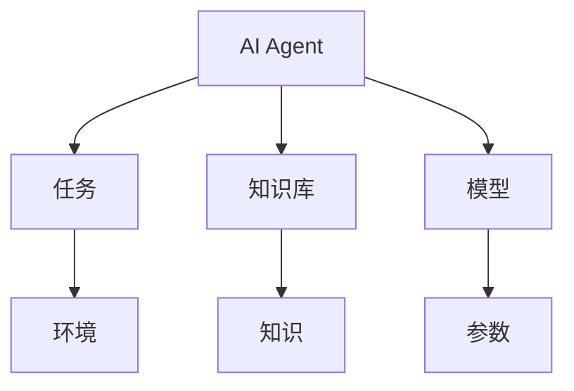
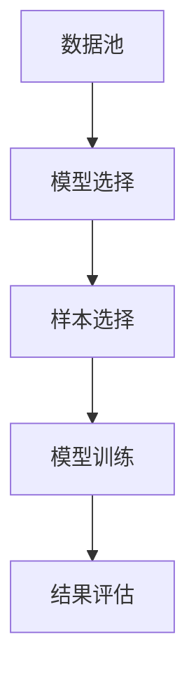
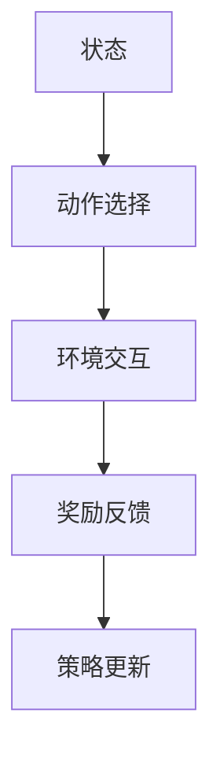
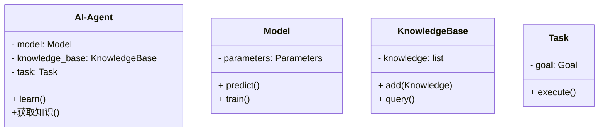
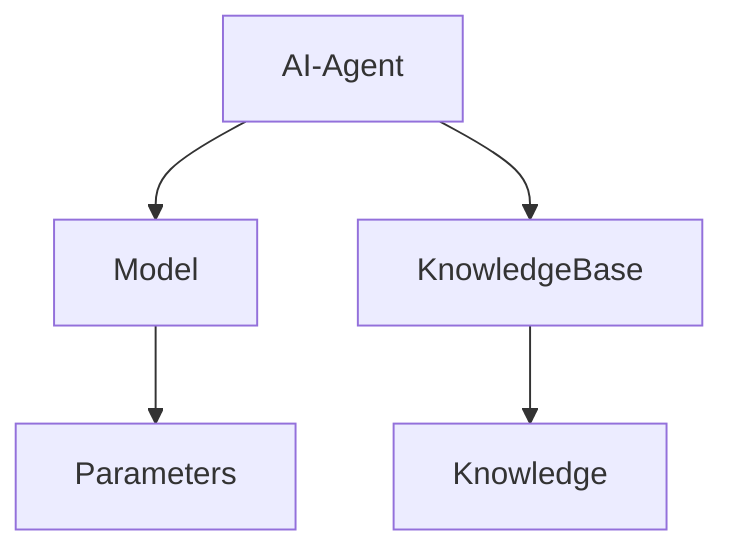

                 


# AI Agent中的主动学习与知识获取

> 关键词：AI Agent，主动学习，知识获取，机器学习，自然语言处理

> 摘要：本文探讨了AI Agent中的主动学习与知识获取的核心概念、算法原理、系统设计以及实际应用。通过背景介绍、核心概念分析、算法实现、系统架构设计和项目实战等多维度的详细论述，深入剖析了AI Agent在主动学习与知识获取中的技术细节和应用实践，为读者提供了全面而深入的技术解读。

---

## 第一部分：AI Agent中的主动学习与知识获取背景介绍

### 第1章：AI Agent与主动学习概述

#### 1.1 AI Agent的基本概念

##### 1.1.1 AI Agent的定义
AI Agent（智能体）是指在计算机系统中，能够感知环境、自主决策并执行任务的实体。它可以是一个软件程序，也可以是一个机器人或其他智能系统。

##### 1.1.2 AI Agent的核心特点
- **自主性**：能够在没有外部干预的情况下独立运行。
- **反应性**：能够实时感知环境并做出响应。
- **目标导向**：具备明确的目标，并通过行动实现目标。
- **学习能力**：能够通过经验或数据不断优化自身的性能。

##### 1.1.3 AI Agent的应用场景
- 智能助手（如Siri、Alexa）
- 智能客服系统
- 自动驾驶汽车
- 智能推荐系统

#### 1.2 主动学习的基本概念

##### 1.2.1 主动学习的定义
主动学习是一种机器学习方法，其中模型能够主动选择最有益于其学习的数据样本进行训练，以提高模型的性能。

##### 1.2.2 主动学习的特点
- **主动性**：模型主动选择数据。
- **高效性**：通过选择性学习减少所需的数据量。
- **适应性**：能够根据反馈调整学习策略。

##### 1.2.3 主动学习与被动学习的区别
| 特性          | 主动学习                          | 被动学习                          |
|---------------|-----------------------------------|-----------------------------------|
| 数据选择      | 模型主动选择最有益数据            | 数据由人工或系统被动提供            |
| 数据量        | 通常需要较少数据                 | 通常需要大量数据                 |
| 学习效率      | 高效                             | 较低                             |

#### 1.3 知识获取的基本概念

##### 1.3.1 知识获取的定义
知识获取是指通过多种途径（如数据、文本、交互等）获取信息，并将其转化为结构化的知识表示的过程。

##### 1.3.2 知识获取的核心要素
- **数据源**：包括文本、图像、语音等多种形式。
- **知识表示**：如知识图谱、语义网络等。
- **推理能力**：通过逻辑推理提取隐含知识。

##### 1.3.3 知识获取的挑战与方法
- **挑战**：数据噪声、语义理解、知识关联性。
- **方法**：基于规则的抽取、统计学习、深度学习。

#### 1.4 本章小结
本章介绍了AI Agent的基本概念、主动学习的特点以及知识获取的核心要素，为后续内容奠定了基础。

---

### 第2章：AI Agent中的主动学习与知识获取的背景与问题

#### 2.1 问题背景

##### 2.1.1 当前AI Agent发展的现状
AI Agent正在从简单的任务执行向复杂的情境理解与决策方向发展，尤其是在自然语言处理和自主决策领域。

##### 2.1.2 主动学习在AI Agent中的必要性
通过主动学习，AI Agent能够更高效地优化自身的模型参数，减少对大量数据的依赖。

##### 2.1.3 知识获取在AI Agent中的重要性
知识获取是AI Agent实现智能决策的关键，能够帮助其更好地理解任务背景和用户需求。

#### 2.2 问题描述

##### 2.2.1 AI Agent在知识获取中的挑战
- **数据稀疏性**：某些领域数据不足。
- **语义复杂性**：知识的表达和推理需要处理复杂的语义关系。

##### 2.2.2 主动学习在知识获取中的作用
主动学习能够帮助AI Agent更高效地获取高质量的知识。

##### 2.2.3 当前技术的局限性与改进方向
- **局限性**：知识图谱构建的难度较高，主动学习算法的可解释性不足。
- **改进方向**：结合多模态数据、提升算法的可解释性。

#### 2.3 问题解决

##### 2.3.1 主动学习在知识获取中的解决方案
- **不确定性采样**：选择不确定性高的样本进行学习。
- **强化学习**：通过奖励机制优化知识获取策略。

##### 2.3.2 知识图谱构建与更新
- **构建**：通过规则和深度学习模型提取知识。
- **更新**：实时更新知识图谱以反映最新信息。

##### 2.3.3 多模态数据融合与处理
- **融合**：结合文本、图像、语音等多种数据源。
- **处理**：使用深度学习模型（如Transformer）进行跨模态理解。

#### 2.4 边界与外延

##### 2.4.1 主动学习的边界
主动学习的核心是选择性学习，其边界在于如何选择最有益的样本。

##### 2.4.2 知识获取的边界
知识获取的边界在于如何将获取的知识转化为可计算的形式。

##### 2.4.3 AI Agent的边界与外延
AI Agent的边界在于其任务执行能力，外延则包括其与外部环境的交互能力。

#### 2.5 概念结构与核心要素组成

##### 2.5.1 AI Agent的概念结构
- **感知层**：通过传感器或数据接口感知环境。
- **决策层**：基于感知信息做出决策。
- **执行层**：执行决策并反馈结果。

##### 2.5.2 主动学习的核心要素
- **样本选择策略**：选择最具代表性的样本。
- **模型优化算法**：优化模型参数。

##### 2.5.3 知识获取的核心要素
- **数据源**：多模态数据输入。
- **知识表示**：结构化的知识表示。
- **推理引擎**：逻辑推理能力。

#### 2.6 本章小结
本章分析了AI Agent中的主动学习与知识获取的背景、问题及解决方案，明确了其核心概念与技术边界。

---

### 第3章：AI Agent中的主动学习与知识获取的核心概念与联系

#### 3.1 主动学习与知识获取的核心概念

##### 3.1.1 主动学习的原理
主动学习通过迭代选择最有益的样本，逐步优化模型性能。其流程包括初始模型训练、样本选择、模型更新和结果评估。

##### 3.1.2 知识获取的原理
知识获取通过多种数据源提取信息，并将其转化为结构化的知识表示。其流程包括数据采集、特征提取、知识建模和知识推理。

#### 3.2 概念属性特征对比

| 特性          | 主动学习                          | 知识获取                          |
|---------------|-----------------------------------|-----------------------------------|
| 核心目标      | 提高模型性能                      | 获取结构化知识                    |
| 输入数据      | 标签数据                         | 多模态数据                       |
| 输出结果      | 模型参数                         | 知识图谱                         |

#### 3.3 ER实体关系图架构



---

### 第4章：算法原理讲解

#### 4.1 主动学习算法

##### 4.1.1 不确定性采样



##### 4.1.2 强化学习



#### 4.2 知识获取算法

##### 4.2.1 基于规则的抽取

```python
def extractKnowledge(text):
    # 基于规则的抽取逻辑
    pass
```

##### 4.2.2 统计学习模型

```python
from sklearn import svm
model = svm.SVC()
model.fit(X, y)
```

##### 4.2.3 深度学习模型

```python
import torch
model = torch.nn.Sequential(...)
optimizer = torch.optim.Adam(model.parameters(), lr=0.001)
criterion = torch.nn.CrossEntropyLoss()
```

#### 4.3 数学模型和公式

##### 4.3.1 主动学习的数学模型
$$ \text{不确定性} = \text{概率分布的熵} $$

##### 4.3.2 知识获取的数学模型
$$ \text{知识表示} = \sum_{i=1}^{n} w_i x_i $$

---

### 第5章：系统分析与架构设计方案

#### 5.1 问题场景介绍
AI Agent需要通过主动学习优化模型，并通过知识获取构建知识图谱以支持智能决策。

#### 5.2 项目介绍
本项目旨在开发一个具备主动学习和知识获取能力的AI Agent，用于智能问答系统。

#### 5.3 系统功能设计

##### 5.3.1 领域模型类图



#### 5.4 系统架构设计

##### 5.4.1 系统架构图



#### 5.5 系统接口设计

##### 5.5.1 接口描述
- `learn()`: 主动学习接口
- `获取知识()`: 知识获取接口

#### 5.6 系统交互序列图

```mermaid
graph TD
    A[AI-Agent] --> B[Model]: 调用主动学习
    B --> C[Parameters]: 更新模型参数
    A --> D[KnowledgeBase]: 调用知识获取
    D --> E[Knowledge]: 更新知识库
```

---

### 第6章：项目实战

#### 6.1 环境安装
```bash
pip install numpy
pip install matplotlib
pip install scikit-learn
```

#### 6.2 系统核心实现源代码

##### 6.2.1 主动学习实现

```python
import numpy as np
from sklearn import svm

def active_learning(X, y, n_iterations=10):
    model = svm.SVC()
    selected_samples = []
    selected_labels = []
    for _ in range(n_iterations):
        model.fit(selected_samples, selected_labels)
        uncertainty = model.predict_proba(X)[:, 1]
        next_sample = np.argmax(uncertainty)
        selected_samples.append(X[next_sample])
        selected_labels.append(y[next_sample])
    return selected_samples, selected_labels
```

##### 6.2.2 知识获取实现

```python
import spacy

nlp = spacy.load("en_core_web_sm")

def extract_entities(text):
    doc = nlp(text)
    entities = [ent.text for ent in doc.ents]
    return entities
```

#### 6.3 代码应用解读与分析
- **主动学习**：通过不确定性采样选择最有价值的样本，逐步优化模型。
- **知识获取**：利用自然语言处理模型抽取实体信息，构建知识图谱。

#### 6.4 实际案例分析
- **案例**：智能客服系统中的主动学习与知识获取。
- **分析**：通过主动学习优化问答模型，通过知识获取构建产品知识库。

#### 6.5 项目小结
本项目展示了如何将主动学习与知识获取应用于实际场景，为后续研究提供了参考。

---

## 第七部分：总结与展望

### 7.1 最佳实践 tips
- **数据质量**：确保数据的多样性和代表性。
- **模型选择**：根据任务需求选择合适的算法。
- **可解释性**：提升模型的可解释性以增强信任。

### 7.2 小结
本文从背景、核心概念、算法原理、系统设计和项目实战等多个维度，详细探讨了AI Agent中的主动学习与知识获取技术，为读者提供了全面的技术解读。

### 7.3 注意事项
- **数据隐私**：注意保护用户数据隐私。
- **算法优化**：持续优化算法以提升性能。

### 7.4 拓展阅读
- **推荐书籍**：《机器学习实战》、《深度学习入门》
- **推荐阅读**：研究论文《主动学习在自然语言处理中的应用》

---

作者：AI天才研究院/AI Genius Institute & 禅与计算机程序设计艺术 /Zen And The Art of Computer Programming

