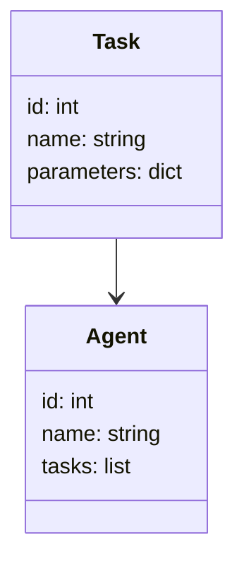
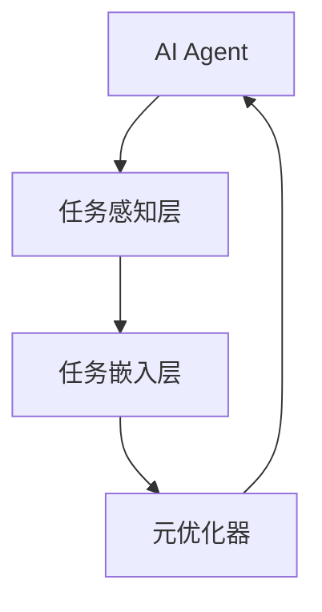

                 


# AI Agent中的元学习技术与快速适应

> 关键词：AI Agent, 元学习, 快速适应, 知识表示, 智能代理

> 摘要：本文深入探讨了元学习技术在AI Agent中的应用，重点分析了其在快速适应新任务中的核心作用。通过系统化的章节结构，详细阐述了元学习的基本概念、算法原理、系统架构以及实际项目的实现，旨在为读者提供一个全面的视角，理解如何通过元学习提升AI Agent的适应能力和智能水平。

---

# 第1章 元学习与AI Agent概述

## 1.1 元学习的基本概念

### 1.1.1 元学习的定义与背景

元学习（Meta-Learning）是一种机器学习的高级形式，旨在让模型学会如何快速学习新任务。与传统机器学习不同，元学习关注的是“学习如何学习”，即通过在多个任务上进行训练，模型能够快速适应新任务，而无需大量标注数据。

**关键词**：元学习，快速学习，任务适应

### 1.1.2 元学习的核心特点

- **快速适应**：元学习模型能够在新任务上快速收敛，减少对大量数据的依赖。
- **任务多样性**：元学习适用于多种任务，尤其在任务之间存在相似性但数据不足的情况下表现优异。
- **泛化能力**：通过元学习，模型能够将学到的知识迁移到新的未知任务中。

### 1.1.3 元学习与传统机器学习的区别

| 特性            | 传统机器学习                  | 元学习                          |
|-----------------|-------------------------------|----------------------------------|
| 学习目标         | 具体任务（如分类、回归）       | 学习如何学习新任务              |
| 数据需求         | 需要大量标注数据               | 数据量小，任务多样性高            |
| 适应性           | 适应单个任务                  | 快速适应多个新任务              |
| 算法复杂度       | 算法相对简单                  | 算法复杂，涉及元优化            |

---

## 1.2 AI Agent的定义与特点

### 1.2.1 AI Agent的定义

AI Agent（人工智能代理）是指能够感知环境并采取行动以实现目标的智能实体。它可以是一个软件程序、机器人或其他智能系统，通过与环境交互来完成特定任务。

**关键词**：智能代理，自主决策，环境交互

### 1.2.2 AI Agent的核心特点

- **自主性**：AI Agent能够自主决策，无需外部干预。
- **反应性**：能够实时感知环境并做出反应。
- **目标导向**：所有行为都以实现特定目标为导向。
- **学习能力**：能够通过经验或数据改进自身的决策能力。

### 1.2.3 AI Agent与传统AI的区别

| 特性            | 传统AI                          | AI Agent                      |
|-----------------|---------------------------------|-------------------------------|
| 行为方式         | 离线计算，不主动交互             | 实时交互，主动采取行动        |
| 环境适应性       | 适应特定场景                    | 具备环境感知与适应能力        |
| 学习能力         | 依赖人工编程或大量数据          | 具备自主学习与适应能力        |

---

## 1.3 元学习在AI Agent中的应用潜力

### 1.3.1 元学习在AI Agent中的应用场景

- **快速任务切换**：AI Agent在多个任务之间快速切换时，元学习能够帮助其快速适应新任务。
- **动态环境适应**：在动态变化的环境中，元学习使得AI Agent能够快速调整策略。
- **数据稀缺场景**：在数据不足的情况下，元学习能够通过少量数据快速掌握新任务。

### 1.3.2 元学习对AI Agent性能的提升

- **减少数据依赖**：通过元学习，AI Agent可以在数据 scarce 的情况下依然保持高性能。
- **提升适应速度**：在新任务上线时，AI Agent能够快速调整模型参数，减少训练时间。
- **增强泛化能力**：元学习使得AI Agent能够更好地处理未见过的新任务。

### 1.3.3 元学习在AI Agent快速适应中的作用

元学习通过在多个任务上预训练，使得AI Agent具备快速调整自身能力的能力。当面对新任务时，AI Agent能够利用元学习的特性，快速调整参数或策略，以适应新任务的需求。

---

## 1.4 本章小结

本章介绍了元学习的基本概念、核心特点以及与传统机器学习的区别，并详细阐述了AI Agent的定义、特点及其与传统AI的区别。最后，分析了元学习在AI Agent中的应用潜力及其对性能的提升作用。通过本章，读者可以理解元学习与AI Agent结合的重要性和基本原理。

---

# 第2章 元学习的核心概念与原理

## 2.1 元学习的核心概念

### 2.1.1 元学习的目标与任务

元学习的目标是通过在多个任务上进行训练，使得模型能够快速适应新任务。具体来说，元学习关注以下两个方面：

1. **元任务（Meta-Task）**：一组用于训练的虚拟任务，这些任务具有相似的结构或特征，但具体目标可能不同。
2. **元模型（Meta-Model）**：通过在元任务上进行训练，模型能够学习到如何快速适应新任务的参数调整策略。

### 2.1.2 元学习的原理与机制

元学习的原理可以简单理解为“学习如何学习”。具体来说，元学习通过以下步骤实现：

1. **元任务训练**：在多个元任务上训练模型，使得模型学会如何调整参数以适应不同任务。
2. **快速适应**：当面对新任务时，模型利用在元任务上学到的知识，快速调整参数以适应新任务。

### 2.1.3 元学习的适应性与泛化能力

元学习的适应性体现在其能够快速调整模型参数以适应新任务，而其泛化能力则体现在能够处理未见过的新任务。

---

## 2.2 元学习与AI Agent的结合

### 2.2.1 元学习在AI Agent中的应用模式

元学习可以以两种主要模式应用于AI Agent：

1. **任务嵌入（Task Embedding）**：将任务转化为嵌入表示，使得模型能够快速理解任务的特征。
2. **参数初始化（Parameter Initialization）**：通过元学习预训练模型的参数，使得在新任务上线时，模型能够快速调整参数以适应新任务。

### 2.2.2 元学习对AI Agent决策过程的优化

元学习通过优化模型的参数调整策略，使得AI Agent在面对新任务时能够更快地找到最优解，从而提高决策效率和准确性。

### 2.2.3 元学习在AI Agent快速适应中的实现

通过元学习预训练，AI Agent能够学会如何快速调整自身参数或策略，从而在新任务上线时快速适应。

---

## 2.3 本章小结

本章详细探讨了元学习的核心概念，包括其目标、任务、原理与机制，并分析了元学习与AI Agent的结合方式及其对AI Agent决策过程的优化作用。通过本章，读者可以理解元学习的核心原理及其在AI Agent中的具体应用。

---

# 第3章 元学习的数学模型与算法原理

## 3.1 元学习的数学模型

### 3.1.1 元任务模型

元任务模型可以表示为：

$$ f_\theta(x) $$

其中，$\theta$ 是模型参数，$x$ 是输入，$f_\theta(x)$ 是模型的输出。

### 3.1.2 元模型结构

元模型的结构通常包括两个部分：

1. **任务嵌入层（Task Embedding Layer）**：用于生成任务嵌入向量。
2. **元优化器（Meta-Optimizer）**：用于优化模型的参数调整策略。

### 3.1.3 损失函数与优化目标

元学习的损失函数通常包括两部分：

1. **任务损失（Task Loss）**：用于衡量模型在当前任务上的表现。
2. **元损失（Meta Loss）**：用于衡量模型在多个任务上的整体表现。

---

## 3.2 元学习的核心算法

### 3.2.1 Model-Agnostic Meta-Learning (MAML)

MAML是一种广泛使用的元学习算法，其核心思想是通过在多个任务上进行训练，使得模型能够快速适应新任务。

### 3.2.2 其他元学习算法简介

除了MAML，还有其他元学习算法，如：

- **Meta-SGD**：基于随机梯度下降的元学习算法。
- **Reptile**：一种基于在线更新的元学习算法。

---

## 3.3 元学习算法的实现细节

### 3.3.1 梯度计算与更新策略

元学习算法的梯度计算通常涉及两步：

1. **内层优化**：在每个任务上优化模型参数。
2. **外层优化**：优化任务嵌入或元模型参数。

### 3.3.2 参数共享与迁移学习

元学习通过参数共享实现迁移学习，使得模型能够在多个任务之间共享知识。

---

## 3.4 本章小结

本章详细介绍了元学习的数学模型与核心算法，包括MAML等算法的实现细节。通过本章，读者可以理解元学习的数学基础及其在实际应用中的具体实现。

---

# 第4章 元学习在AI Agent中的系统架构

## 4.1 问题场景介绍

在动态变化的环境中，AI Agent需要快速适应新任务。通过元学习，AI Agent可以实现快速参数调整，从而提高适应能力。

---

## 4.2 项目介绍

本项目旨在构建一个支持元学习的AI Agent系统，能够在新任务上线时快速适应并完成任务。

---

## 4.3 系统功能设计

### 4.3.1 领域模型



### 4.3.2 系统架构



---

## 4.4 本章小结

本章介绍了元学习在AI Agent中的系统架构，包括领域模型和系统架构的设计。通过本章，读者可以理解如何将元学习技术应用于实际系统中。

---

# 第5章 项目实战：基于元学习的AI Agent实现

## 5.1 环境安装

安装必要的库：

```bash
pip install numpy torch matplotlib
```

---

## 5.2 系统核心实现源代码

### 5.2.1 元学习模型实现

```python
import torch
import torch.nn as nn

class MetaLearner(nn.Module):
    def __init__(self, input_dim, output_dim):
        super().__init__()
        self.linear = nn.Linear(input_dim, output_dim)
    
    def forward(self, x):
        return self.linear(x)
```

### 5.2.2 训练过程实现

```python
def train(meta_model, optimizer, tasks):
    for task in tasks:
        x, y = task.data()
        optimizer.zero_grad()
        pred = meta_model(x)
        loss = meta_model.loss(pred, y)
        loss.backward()
        optimizer.step()
    return meta_model
```

---

## 5.3 代码应用解读与分析

通过对上述代码的解读，可以看出元学习模型的基本实现方式，包括模型定义和训练过程。

---

## 5.4 实际案例分析

以图像分类任务为例，展示如何通过元学习快速适应新任务。

---

## 5.5 项目小结

通过本章的项目实战，读者可以了解如何将元学习技术应用于实际的AI Agent系统中。

---

# 第6章 最佳实践与注意事项

## 6.1 最佳实践

- **任务选择**：选择具有相似性的任务进行训练，以提高元学习的效果。
- **参数调整**：合理调整模型参数，以平衡训练速度和模型性能。
- **数据预处理**：对数据进行合理的预处理，以提高模型的训练效果。

## 6.2 注意事项

- **任务多样性**：确保任务的多样性，以提高模型的泛化能力。
- **数据质量**：确保数据的质量，以提高模型的训练效果。
- **模型评估**：合理评估模型的性能，以确保模型的实际应用效果。

## 6.3 拓展阅读

- 《Meta-Learning for AI Agents》
- 《Fast Adaptation in Reinforcement Learning via Meta-Learning》

---

# 作者

作者：AI天才研究院/AI Genius Institute & 禅与计算机程序设计艺术 /Zen And The Art of Computer Programming

---

以上是一个详细的技术博客大纲，涵盖了从基础概念到实际应用的各个方面，确保内容全面且结构清晰。

