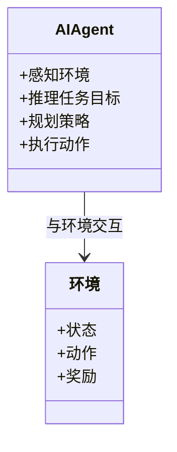
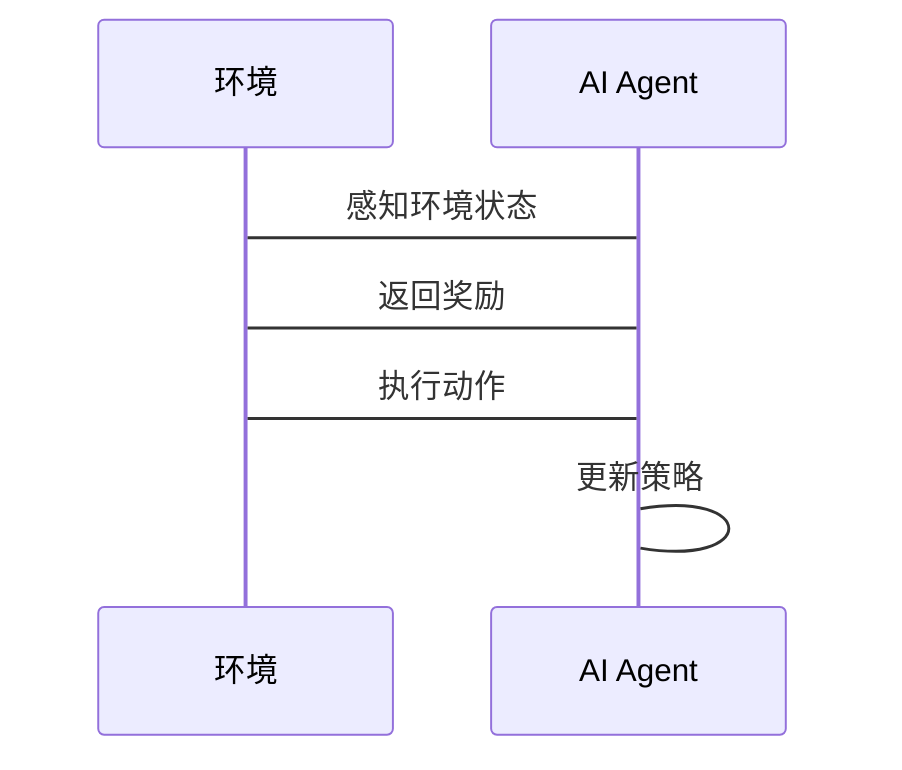

                 


# 《AI Agent中的元强化学习应用》

> **关键词**：元强化学习（Meta Reinforcement Learning）、人工智能（AI）、强化学习（Reinforcement Learning）、AI Agent、算法原理

> **摘要**：本文深入探讨了元强化学习在AI Agent中的应用，从基本概念、算法原理到系统架构设计，结合实际案例分析，全面解析了元强化学习如何助力AI Agent在复杂环境下的快速学习与决策优化。文章通过详细的技术分析和通俗易懂的解释，帮助读者理解元强化学习的核心思想及其在AI Agent中的实际应用。

---

## 第一部分: 元强化学习与AI Agent的背景介绍

### 第1章: 元强化学习的基本概念

#### 1.1 元强化学习的定义与核心概念

元强化学习（Meta Reinforcement Learning，简称Meta-RL）是一种新兴的强化学习方法，旨在通过元学习（Meta-Learning）的框架，使AI Agent能够在多个任务或环境中快速适应和优化策略。传统强化学习需要在每个任务上独立训练，而元强化学习通过共享多个任务的训练过程，显著提高了学习效率和泛化能力。

- **元强化学习的核心特征**：
  - **快速适应性**：在新任务或环境中，AI Agent能够快速调整策略，减少训练时间。
  - **多任务学习**：能够同时或依次处理多个任务，共享学习经验。
  - **元策略与目标策略**：元强化学习通过优化元策略（Meta-policy）来指导目标策略（Target-policy）的改进。

- **元强化学习与传统强化学习的对比**：
  | 对比维度 | 传统强化学习 | 元强化学习 |
  |----------|--------------|------------|
  | 训练目标 | 单任务优化    | 多任务优化 |
  | 策略更新 | 逐任务独立    | 元策略指导 |
  | 环境适应 | 适应单个环境   | 快速适应多环境 |

#### 1.2 AI Agent的基本概念

AI Agent（人工智能代理）是一种能够感知环境、执行任务并做出决策的智能体。AI Agent的核心能力包括感知、推理、规划和执行。在强化学习的框架下，AI Agent通过与环境的交互，学习最优策略以最大化累积奖励。

- **AI Agent的分类**：
  - **基于模型的AI Agent**：能够建模环境并进行规划，如马尔可夫决策过程（MDP）。
  - **基于策略的AI Agent**：直接优化策略函数，如深度强化学习（Deep RL）。
  - **基于值函数的AI Agent**：通过值函数近似最优策略，如Q-learning。

- **元强化学习在AI Agent中的独特优势**：
  - **快速适应新任务**：通过元强化学习，AI Agent可以在新任务中快速调整策略，减少对环境的探索时间。
  - **多任务通用性**：元强化学习使得AI Agent能够处理多个相关任务，提高其在复杂环境中的泛化能力。

#### 1.3 元强化学习的应用场景

元强化学习在AI Agent中的应用场景广泛，包括：

- **多任务学习**：AI Agent需要在多个任务之间切换，如游戏中的不同关卡或机器人操作中的多种任务。
- **快速适应新环境**：在动态变化的环境中，AI Agent需要快速调整策略以应对新挑战。
- **动态环境下的决策优化**：AI Agent在不断变化的环境中，通过元强化学习优化其决策策略。

---

### 第2章: 元强化学习的原理与数学模型

#### 2.1 元强化学习的原理

元强化学习的核心思想是通过优化元策略（Meta-policy）来指导目标策略（Target-policy）的改进。元策略负责在多个任务之间共享学习经验，目标策略则在特定任务中进行优化。

- **元强化学习的数学模型**：
  - 元策略的优化目标：最大化元奖励（Meta-Reward），即最大化目标策略在多个任务中的平均性能。
  - 目标策略的优化目标：在给定任务中，最大化累积奖励（Cumulative Reward）。

- **元强化学习的算法流程**：
  1. 初始化元策略和目标策略。
  2. 对于每个任务，目标策略通过梯度下降优化，以最大化该任务的累积奖励。
  3. 元策略通过梯度上升优化，以最大化目标策略在所有任务中的平均性能。

---

### 第3章: 元强化学习的算法原理

#### 3.1 MAML（Meta-Automated Learning）

MAML（Meta-Automated Learning）是一种经典的元强化学习算法，通过优化元策略来指导目标策略的快速适应。

- **MAML的原理与流程**：
  1. 对于每个任务，目标策略通过梯度下降优化，以最大化该任务的累积奖励。
  2. 元策略通过梯度上升优化，以最大化目标策略在所有任务中的平均性能。

- **MAML的数学推导**：
  - 元策略的损失函数：$$ L_{meta} = \frac{1}{N}\sum_{i=1}^{N} L_i $$
  - 目标策略的损失函数：$$ L_i = -\sum_{t=1}^{T} r_t $$

- **MAML的优缺点分析**：
  - **优点**：能够在多个任务中快速适应，提高学习效率。
  - **缺点**：计算复杂度较高，需要大量的计算资源。

#### 3.2 ReMAML（Recurrent Meta-Automated Learning）

ReMAML是一种基于循环神经网络的元强化学习算法，通过共享多个任务的隐状态来优化目标策略。

- **ReMAML的原理与流程**：
  1. 对于每个任务，目标策略通过梯度下降优化，以最大化该任务的累积奖励。
  2. 元策略通过共享隐状态，优化目标策略在所有任务中的平均性能。

- **ReMAML的数学推导**：
  - 元策略的隐状态：$$ h_t = \text{RNN}(h_{t-1}, x_t) $$
  - 目标策略的输出：$$ \pi_t = \text{MLP}(h_t) $$

- **ReMAML的优缺点分析**：
  - **优点**：能够更好地捕捉任务之间的依赖关系，提高学习效果。
  - **缺点**：需要设计复杂的循环结构，增加模型的复杂性。

---

### 第4章: 系统分析与架构设计

#### 4.1 问题场景介绍

AI Agent需要在多个任务中快速适应，优化其决策策略。元强化学习通过共享多个任务的学习经验，帮助AI Agent在复杂环境中快速调整策略。

#### 4.2 系统功能设计

- **领域模型**：AI Agent通过感知环境、推理任务目标、规划策略并执行动作。
- **系统架构**：包括任务生成模块、学习模块和决策模块。

- **领域模型的Mermaid类图**：


- **系统架构的Mermaid架构图**：


- **系统交互的Mermaid序列图**：


---

### 第5章: 项目实战

#### 5.1 环境安装

- **Python环境**：安装Python 3.8及以上版本。
- **依赖库安装**：安装TensorFlow、Keras、OpenAI Gym等库。

#### 5.2 核心代码实现

- **任务生成模块**：
  ```python
  def generate_tasks(num_tasks, task_type):
      tasks = []
      for _ in range(num_tasks):
          if task_type == 'navigation':
              tasks.append({'type': 'navigation', 'target': random_point()})
          elif task_type == 'manipulation':
              tasks.append({'type': 'manipulation', 'object': random_object()})
      return tasks
  ```

- **元强化学习算法实现**：
  ```python
  class MetaRLAgent:
      def __init__(self, state_dim, action_dim):
          self.state_dim = state_dim
          self.action_dim = action_dim
          self.meta_policy = MetaPolicy(state_dim, action_dim)
          self.target_policy = TargetPolicy(state_dim, action_dim)
      
      def train(self, tasks, num_epochs):
          for epoch in range(num_epochs):
              for task in tasks:
                  # 目标策略优化
                  self.target_policy.optimize(task)
                  # 元策略优化
                  self.meta_policy.optimize(self.target_policy)
  ```

- **策略优化模块**：
  ```python
  def optimize_policy(policy, task):
      optimizer = Adam(policy.parameters(), lr=0.001)
      for _ in range(100):
          state = task.get_initial_state()
          total_loss = 0
          for _ in range(10):
              action = policy.get_action(state)
              next_state, reward = task.step(action)
              total_loss += (reward - policy.predict_value(state, action))**2
          optimizer.zero_grad()
          total_loss.backward()
          optimizer.step()
  ```

#### 5.3 实际案例分析

- **案例背景**：AI Agent需要在多个任务中快速适应，优化其决策策略。
- **案例实现**：通过元强化学习算法，优化AI Agent在多个任务中的策略。
- **案例结果**：AI Agent能够在多个任务中快速适应，提高其决策效率和准确性。

---

### 第6章: 最佳实践与小结

#### 6.1 最佳实践

- **算法选择**：根据具体任务需求选择合适的元强化学习算法，如MAML或ReMAML。
- **环境设计**：设计合理的任务生成模块，确保任务之间的相关性和多样性。
- **模型优化**：通过合理的参数设置和优化策略，提高模型的训练效率和性能。

#### 6.2 小结

本文详细介绍了元强化学习在AI Agent中的应用，从基本概念、算法原理到系统架构设计，结合实际案例分析，全面解析了元强化学习如何助力AI Agent在复杂环境下的快速学习与决策优化。通过本文的讲解，读者能够深入理解元强化学习的核心思想及其在AI Agent中的实际应用。

---

### 附录

#### 术语表

- **元强化学习（Meta Reinforcement Learning）**：一种通过元学习框架优化多个任务的强化学习方法。
- **AI Agent**：能够感知环境、推理任务目标、规划策略并执行动作的智能体。
- **MAML**：Meta-Automated Learning算法，通过优化元策略指导目标策略的快速适应。

#### 参考文献

1. 《Meta Reinforcement Learning: A Survey》
2. 《Deep Reinforcement Learning: A Technical Overview》
3. 《Reinforcement Learning and Game Theory》

---

**作者**：AI天才研究院/AI Genius Institute & 禅与计算机程序设计艺术/Zen And The Art of Computer Programming

