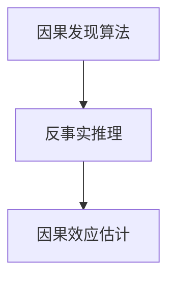
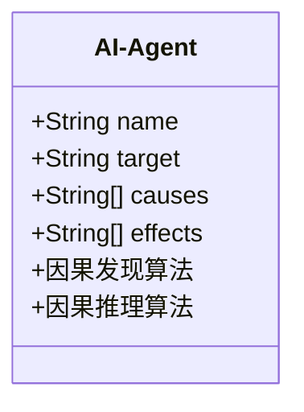
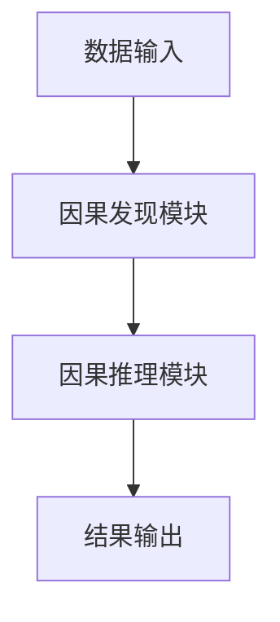
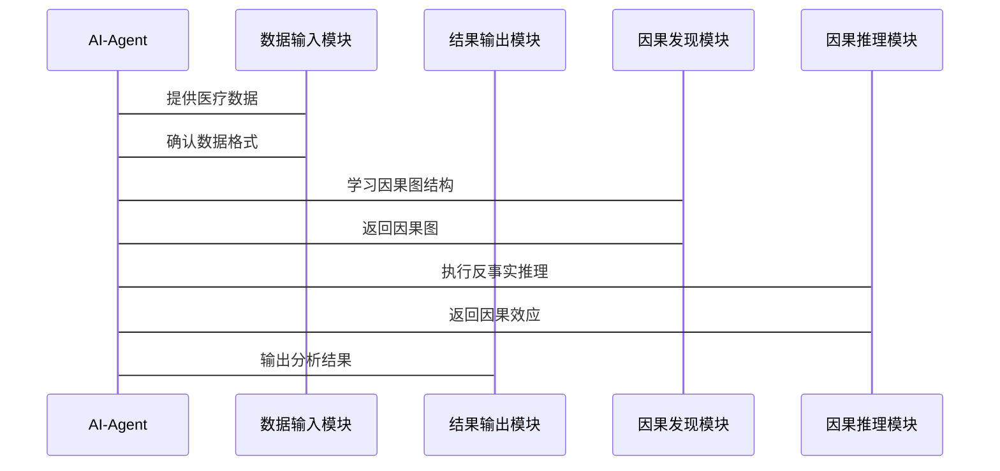

                 


# AI Agent中的因果发现与推理技术

> 关键词：AI Agent，因果发现，因果推理，因果图，反事实推理

> 摘要：本文详细探讨了AI Agent中的因果发现与推理技术，涵盖从基础概念到高级算法的各个方面。通过分析因果图、反事实推理等方法，结合实际案例，展示了如何在AI Agent中实现因果发现与推理，提升其智能决策能力。

---

## 第一章: AI Agent与因果关系概述

### 1.1 AI Agent的基本概念

#### 1.1.1 AI Agent的定义与分类
AI Agent（人工智能代理）是指在环境中能够感知并自主行动以实现目标的智能实体。根据智能水平，AI Agent可以分为简单行为体和复杂智能体。简单行为体如规则驱动的聊天机器人，而复杂智能体则具备学习、推理和自适应能力，如自动驾驶系统。

#### 1.1.2 因果关系在AI Agent中的重要性
因果关系是AI Agent理解世界和做出决策的核心。传统的统计学习方法仅能识别相关性，而因果推理则帮助AI Agent识别变量间的因果关系，从而做出更合理的决策。例如，在医疗AI Agent中，因果推理能帮助识别药物效果的因果效应，避免单纯相关性分析带来的误导。

#### 1.1.3 问题背景与应用领域
AI Agent在医疗、金融、自动驾驶等领域广泛应用，但传统方法在处理复杂因果关系时存在局限性。因果发现与推理技术的引入，使AI Agent能够处理干预、反事实等复杂场景，提升其智能水平。

### 1.2 因果发现与推理的基本概念

#### 1.2.1 因果关系的定义
因果关系是指一个变量的变化导致另一个变量变化的现象。例如，降雨导致地面湿滑。

#### 1.2.2 因果图与因果模型
因果图是用有向图表示变量间的因果关系。节点代表变量，边代表因果影响。例如，因果图可以表示疾病、症状和治疗方案之间的关系。

#### 1.2.3 因果推理的基本原理
因果推理通过分析因果图中的路径和结构，推断变量间的因果关系。例如，通过识别因果图中的因果效应，AI Agent可以推断出不同干预措施的效果。

---

## 第二章: 因果发现的理论基础

### 2.1 因果图与因果关系

#### 2.1.1 因果图的构建
因果图通过变量间的因果关系构建，通常采用结构学习算法。例如，使用PC算法从数据中学习因果图结构。

#### 2.1.2 因果关系的类型与特征
因果关系可以是直接的（A→B）或间接的（A→C→B）。特征包括可干预性、可分解性和传递性。

#### 2.1.3 因果关系的数学表示
因果关系可以用概率分布和图模型表示。例如，因果图中的节点概率P(A,B,C)可以分解为P(A)P(B|A)P(C|B)。

#### 2.1.4 因果图示例（Mermaid）


### 2.2 因果发现的基本原理

#### 2.2.1 数据驱动的因果发现
基于数据的统计方法，如独立性测试和关联性分析，发现变量间的因果关系。

#### 2.2.2 假设驱动的因果发现
基于领域知识构建因果图，验证假设。

#### 2.2.3 统计推断与因果发现
结合统计学方法，从数据中发现因果关系。例如，使用Granger因果测试分析时间序列数据中的因果关系。

### 2.3 本章小结
本章介绍了因果图的构建方法和因果关系的数学表示，为后续因果发现算法奠定基础。

---

## 第三章: 因果推理的算法与方法

### 3.1 基于因果图的推理方法

#### 3.1.1 马尔可夫边界
马尔可夫边界是指在因果图中，一个变量的条件独立于其非后代节点。例如，在因果图A→B→C中，A与C在B的条件下独立。

#### 3.1.2 干预推理
干预推理是通过改变某个变量的值，推断其对其他变量的影响。例如，通过改变药物剂量，推断其对患者康复的影响。

#### 3.1.3 反事实推理
反事实推理是通过假设某个变量在不同情况下可能的取值，推断其对结果的影响。例如，推断如果患者未服药，康复概率会如何变化。

### 3.2 基于潜在结果的推理框架

#### 3.2.1 潜在结果模型
潜在结果模型将每个单元在每个处理下的潜在结果建模。例如，患者在服药和不服药两种情况下可能的康复结果。

#### 3.2.2 因果效应的估计
因果效应是处理组和对照组之间平均治疗效果的差异。例如，治疗组的康复概率比对照组高10%。

#### 3.2.3 算法实现与案例分析
使用反事实推理算法，推断因果效应。例如，通过倾向评分匹配法，估计药物对康复的因果效应。

### 3.3 本章小结
本章介绍了反事实推理和潜在结果框架，展示了如何通过算法推断因果效应。

---

## 第四章: 因果发现与推理的算法实现

### 4.1 因果发现算法

#### 4.1.1 基于评分的因果发现算法
基于评分的算法通过评估不同因果图的得分，选择最优图结构。例如，BIC评分用于评估因果图的复杂度与数据拟合度。

#### 4.1.2 基于搜索的因果发现算法
基于搜索的算法通过遍历所有可能的因果图结构，选择最佳结构。例如，PC算法通过条件独立测试，学习因果图的结构。

#### 4.1.3 约束-based因果发现算法
约束-based算法通过发现数据中的统计独立性，推断因果关系。例如，使用独立性测试发现变量间的独立约束。

### 4.2 因果推理算法

#### 4.2.1 反事实推理算法
反事实推理算法通过模拟不同假设下的结果，推断因果效应。例如，使用潜在结果模型估计反事实情况下的结果。

#### 4.2.2 潜在结果框架算法
潜在结果框架算法通过建模潜在结果，估计因果效应。例如，使用倾向评分匹配法，估计因果效应。

#### 4.2.3 算法流程图（Mermaid）


### 4.3 算法实现的数学模型

#### 4.3.1 因果图的数学表示
因果图的数学表示可以用概率分布和图模型表示。例如，因果图中的节点概率P(A,B,C)可以分解为P(A)P(B|A)P(C|B)。

#### 4.3.2 因果效应的计算公式
因果效应是处理组和对照组之间平均治疗效果的差异。例如，平均因果效应(ATE)的计算公式为：
$$ATE = E[Y^{treat}] - E[Y^{control}]$$

### 4.4 本章小结
本章详细介绍了因果发现和推理的算法实现，包括基于评分、搜索和约束的算法，以及反事实推理和潜在结果框架的实现方法。

---

## 第五章: 系统架构与设计

### 5.1 系统分析与需求分析

#### 5.1.1 问题场景介绍
系统设计一个AI Agent，用于医疗领域，帮助医生推断不同治疗方案的因果效应。

#### 5.1.2 系统功能需求
系统需要实现因果发现和推理功能，支持反事实推理和潜在结果框架的分析。

#### 5.1.3 系统性能需求
系统需要高效处理大规模数据，支持实时推理和结果输出。

### 5.2 系统架构设计

#### 5.2.1 领域模型设计（Mermaid类图）


#### 5.2.2 系统架构图（Mermaid）


### 5.3 系统接口设计

#### 5.3.1 输入接口
接收医疗数据，包括患者特征和治疗方案。

#### 5.3.2 输出接口
输出因果效应分析结果，包括处理组和对照组的平均治疗效果。

### 5.4 系统交互设计（Mermaid序列图）


### 5.5 本章小结
本章设计了一个AI Agent的系统架构，展示了如何在系统中实现因果发现和推理功能。

---

## 第六章: 项目实战

### 6.1 项目介绍

#### 6.1.1 项目背景
本项目旨在开发一个医疗AI Agent，帮助医生推断不同治疗方案的因果效应。

#### 6.1.2 项目目标
实现因果发现和推理功能，支持反事实推理和潜在结果框架的分析。

### 6.2 环境安装

#### 6.2.1 安装Python
安装Python 3.x及以上版本。

#### 6.2.2 安装依赖库
安装必要的Python库，如`numpy`, `pandas`, `networkx`, `dowhy`。

### 6.3 核心实现

#### 6.3.1 数据预处理
读取医疗数据，清洗和标准化处理。

#### 6.3.2 因果发现模块
使用`dowhy`库学习因果图结构。

#### 6.3.3 因果推理模块
基于因果图，执行反事实推理，计算因果效应。

### 6.4 代码实现

#### 6.4.1 数据输入
```python
import pandas as pd
data = pd.read_csv('medical_data.csv')
```

#### 6.4.2 因果发现
```python
from dowhy import CausalModel
model = CausalModel(
    observed_vars=["treatment", "recovery"],
    causal_model="treatment -> recovery"
)
model.view_model()
```

#### 6.4.3 因果推理
```python
from dowhy import CausalInference
inference = CausalInference(
    treatment='treatment',
    outcome='recovery',
    data=data
)
result = inference.estimates['ate']
print(result)
```

### 6.5 案例分析与结果解读

#### 6.5.1 案例分析
分析不同治疗方案对患者康复的影响。

#### 6.5.2 结果解读
输出因果效应结果，帮助医生制定治疗方案。

### 6.6 本章小结
本章通过实际案例展示了如何在AI Agent中实现因果发现与推理技术。

---

## 第七章: 扩展与展望

### 7.1 当前技术的挑战

#### 7.1.1 数据质量问题
因果发现对数据的质量和完整性要求较高，数据缺失或偏差会影响结果。

#### 7.1.2 算法复杂度
因果发现算法的复杂度较高，处理大规模数据时需要优化算法效率。

### 7.2 未来研究方向

#### 7.2.1 新型因果发现算法
研究更高效的因果发现算法，如基于深度学习的方法。

#### 7.2.2 多模态因果推理
探索多模态数据下的因果推理方法，如结合文本、图像等多种数据源。

### 7.3 最佳实践 tips

#### 7.3.1 数据准备
确保数据的完整性和准确性，进行必要的清洗和预处理。

#### 7.3.2 算法选择
根据具体问题选择合适的因果发现和推理算法，优化算法参数。

#### 7.3.3 结果验证
通过交叉验证和对比实验，验证因果效应的准确性。

### 7.4 本章小结
本章总结了当前技术的挑战，展望了未来的研究方向，并给出了最佳实践建议。

---

## 作者：AI天才研究院/AI Genius Institute & 禅与计算机程序设计艺术 /Zen And The Art of Computer Programming

---

**本文详细探讨了AI Agent中的因果发现与推理技术，从理论基础到算法实现，再到系统设计和项目实战，为读者提供了全面的指导。通过结合实际案例，展示了因果发现与推理技术在AI Agent中的应用，帮助读者提升智能决策能力。**

