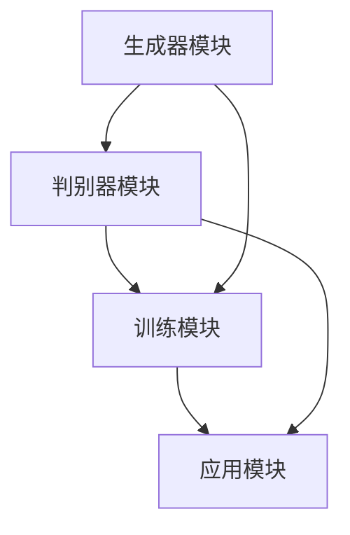
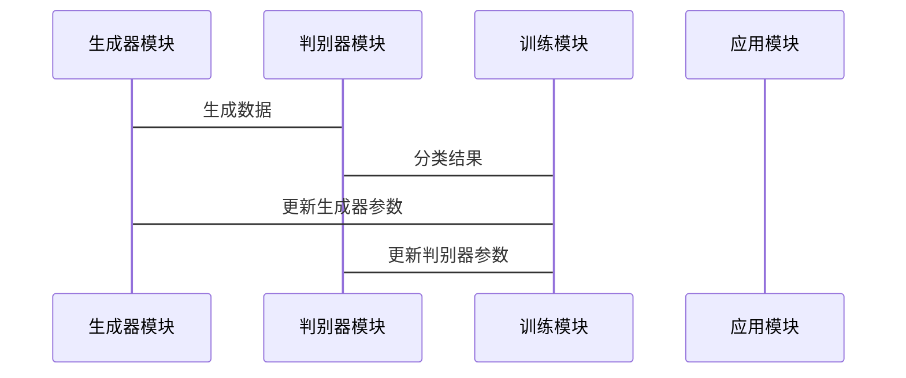

                 


# AI Agent中的对抗学习与鲁棒性增强

> 关键词：AI Agent, 对抗学习, 鲁棒性增强, GAN, 强化学习, 对抗训练, 鲁棒模型

> 摘要：本文深入探讨了AI Agent中对抗学习与鲁棒性增强的结合与应用。从基础概念到数学模型，从算法实现到实际案例，系统性地分析了对抗学习如何提升AI Agent的鲁棒性，以及鲁棒性增强技术的核心思想与实现方法。本文不仅为AI领域的研究人员提供了理论支持，也为实际应用的工程师提供了实践指导。

---

# 第一部分: AI Agent中的对抗学习与鲁棒性增强基础

## 第1章: 对抗学习与鲁棒性增强概述

### 1.1 AI Agent的基本概念与应用场景

#### 1.1.1 AI Agent的定义与分类
AI Agent（智能体）是指在特定环境中能够感知并自主行动以实现目标的智能系统。根据智能体的智能水平和应用场景，可以将AI Agent分为以下几类：

1. **反应式智能体**：基于当前感知做出反应，如简单的机器人或自动驾驶系统。
2. **认知式智能体**：具备复杂推理和决策能力，如高级的机器人或智能助手。
3. **学习式智能体**：能够通过经验或数据自我改进，如强化学习或监督学习训练的智能体。

#### 1.1.2 对抗学习的基本概念
对抗学习（Adversarial Learning）是一种机器学习方法，通过两个或多个模型（生成器和判别器）之间的对抗训练来提升模型的性能。对抗学习的核心思想是通过“对抗”来逼真地生成数据或提高模型的泛化能力。

#### 1.1.3 鲁棒性增强的目标与意义
鲁棒性增强的目标是使AI Agent在面对不确定性、噪声或敌对攻击时仍能保持稳定性和高性能。鲁棒性增强的意义在于提升AI系统的健壮性和可靠性，特别是在复杂和动态变化的实际应用中。

### 1.2 对抗学习与鲁棒性增强的关系

#### 1.2.1 对抗学习在AI Agent中的作用
对抗学习通过引入对抗训练机制，能够有效提升AI Agent的生成能力和防御能力。例如，在自然语言处理和图像识别中，对抗学习可以帮助生成更逼真的数据或识别更复杂的模式。

#### 1.2.2 鲁棒性增强的核心思想
鲁棒性增强的核心思想是通过多种技术手段，使模型在面对不同环境和输入时仍能保持稳定性能。这种增强通常需要结合多种方法，如对抗训练、正则化和数据增强等。

#### 1.2.3 两者结合的必要性与优势
对抗学习与鲁棒性增强的结合是必然趋势。通过对抗学习，可以生成更多样化的数据，增强模型的泛化能力；通过鲁棒性增强，可以使模型在面对攻击或噪声时更具抵抗力。

### 1.3 本章小结
本章介绍了AI Agent的基本概念和分类，阐述了对抗学习和鲁棒性增强的核心思想，并分析了两者结合的必要性和优势。

---

## 第2章: 对抗学习的原理与算法

### 2.1 对抗学习的原理

#### 2.1.1 对抗训练的定义
对抗训练是一种通过两个模型（生成器和判别器）交替优化的过程。生成器的目标是生成能够欺骗判别器的数据，而判别器的目标是区分真实数据和生成数据。

#### 2.1.2 对抗训练的核心思想
对抗训练的核心思想是通过“零和博弈”来提升生成模型和判别模型的性能。生成器和判别器之间的对抗关系迫使双方不断优化，最终达到纳什均衡。

#### 2.1.3 对抗训练的数学模型
对抗训练的数学模型通常基于GAN（生成对抗网络）。以下是GAN的基本模型：

- **生成器**：将噪声输入映射到数据空间，目标是最小化判别器的分类错误。
- **判别器**：将真实数据和生成数据区分开来，目标是最小化生成数据被误判的概率。

GAN的损失函数为：
$$ \mathcal{L}_{\text{GAN}} = \mathbb{E}_{z \sim p_z}[\log D(G(z))] + \mathbb{E}_{x \sim p_x}[\log(1 - D(x))] $$

其中，$D$是判别器，$G$是生成器，$p_z$是噪声分布，$p_x$是真实数据分布。

### 2.2 对抗学习的算法实现

#### 2.2.1 GAN模型的结构与流程
GAN模型通常包括生成器和判别器两部分。生成器和判别器交替训练，生成器的目标是生成与真实数据难以区分的样本，而判别器的目标是尽可能准确地区分真实数据和生成数据。

#### 2.2.2 对抗训练的优化方法
对抗训练的优化方法包括交替优化生成器和判别器的参数，以及使用合适的优化算法（如Adam优化器）。生成器和判别器的更新步骤如下：

1. 固定生成器，优化判别器：
   $$ \min_{D} \mathcal{L}_{\text{GAN}} $$
2. 固定判别器，优化生成器：
   $$ \min_{G} \mathcal{L}_{\text{GAN}} $$

#### 2.2.3 对抗学习的收敛性分析
对抗学习的收敛性是一个复杂的问题。研究表明，GAN在某些情况下可能会发散或陷入局部最优。为了解决这个问题，研究人员提出了多种改进方法，如WGAN（Wasserstein GAN）和GAN-GP（梯度惩罚GAN）。

### 2.3 对抗学习的数学公式
对抗学习的核心公式是GAN的损失函数：
$$ \min_{G} \max_{D} \mathbb{E}_{z \sim p_z}[\log D(G(z))] + \mathbb{E}_{x \sim p_x}[\log(1 - D(x))] $$

### 2.4 本章小结
本章详细讲解了对抗学习的原理和算法，重点分析了GAN模型的结构和数学公式。

---

## 第3章: 鲁棒性增强的核心思想与技术

### 3.1 鲁棒性增强的核心思想

#### 3.1.1 鲁棒性的定义与衡量标准
鲁棒性是指模型在面对输入变化或噪声时仍能保持稳定性能的能力。衡量鲁棒性的标准包括模型的预测准确率、误差范围和对抗攻击下的防御能力。

#### 3.1.2 鲁棒性增强的目标
鲁棒性增强的目标是通过多种技术手段，提升模型在复杂环境下的稳定性和可靠性。

#### 3.1.3 鲁棒性增强的必要性
鲁棒性增强的必要性在于AI系统的实际应用中，输入数据往往存在噪声、干扰或敌对攻击，这会严重影响模型的性能。

### 3.2 鲁棒性增强的主要技术

#### 3.2.1 基于对抗训练的鲁棒性增强
通过引入对抗训练，可以生成更具挑战性的数据，从而提升模型的鲁棒性。

#### 3.2.2 基于正则化的鲁棒性增强
正则化技术（如L2正则化）可以防止模型过拟合，从而提升模型的鲁棒性。

#### 3.2.3 基于数据增强的鲁棒性增强
通过数据增强技术（如旋转、平移、噪声添加等），可以生成更多样化的训练数据，从而提升模型的鲁棒性。

### 3.3 鲁棒性增强的数学模型

#### 3.3.1 对抗训练的鲁棒性增强模型
基于对抗训练的鲁棒性增强模型可以表示为：
$$ \min_{\theta} \mathbb{E}_{x \sim p_x}[\mathcal{L}(f(x))] + \lambda \mathbb{E}_{x \sim p_x}[\mathcal{R}(x, f(x))] $$
其中，$\mathcal{L}$是损失函数，$\mathcal{R}$是鲁棒性正则化项，$\lambda$是调节系数。

#### 3.3.2 正则化鲁棒性增强模型
正则化鲁棒性增强模型可以表示为：
$$ \min_{\theta} \mathbb{E}_{x \sim p_x}[\mathcal{L}(f(x))] + \lambda \Omega(\theta) $$
其中，$\Omega(\theta)$是正则化项。

#### 3.3.3 数据增强鲁棒性增强模型
数据增强鲁棒性增强模型通过扩展训练数据集来提升模型的鲁棒性。

### 3.4 本章小结
本章介绍了鲁棒性增强的核心思想和技术，重点分析了对抗训练、正则化和数据增强三种方法。

---

## 第4章: 对抗学习与鲁棒性增强的结合

### 4.1 对抗学习在AI Agent中的应用场景

#### 4.1.1 自然语言处理中的对抗学习
在自然语言处理中，对抗学习可以用于文本生成、语义理解等任务。

#### 4.1.2 图像识别中的对抗学习
在图像识别中，对抗学习可以用于图像生成、目标检测等任务。

#### 4.1.3 决策优化中的对抗学习
在决策优化中，对抗学习可以用于策略优化、博弈论等任务。

### 4.2 对抗学习在鲁棒性增强中的作用

#### 4.2.1 对抗训练如何提升模型鲁棒性
对抗训练通过生成更具挑战性的数据，可以提升模型的鲁棒性。

#### 4.2.2 对抗训练在对抗攻击中的防御作用
对抗训练可以生成具有防御能力的模型，能够抵御对抗攻击。

#### 4.2.3 对抗训练在模型泛化能力中的提升
对抗训练通过生成多样化的数据，可以提升模型的泛化能力。

### 4.3 对抗学习与鲁棒性增强的结合案例

#### 4.3.1 基于GAN的图像修复
通过GAN生成逼真的图像补丁，修复低质量图像。

#### 4.3.2 基于对抗训练的自然语言理解模型
通过对抗训练生成多样化的文本数据，提升自然语言理解模型的鲁棒性。

#### 4.3.3 基于对抗训练的强化学习模型
通过对抗训练提升强化学习模型的策略优化能力。

### 4.4 本章小结
本章分析了对抗学习在AI Agent中的应用场景，并结合实际案例说明了对抗学习如何提升模型的鲁棒性。

---

## 第5章: 系统分析与架构设计方案

### 5.1 问题场景介绍

#### 5.1.1 AI Agent的对抗学习需求
AI Agent需要具备生成和识别对抗数据的能力。

#### 5.1.2 鲁棒性增强的系统需求
系统需要具备在复杂环境下的稳定性和可靠性。

#### 5.1.3 对抗学习与鲁棒性增强的结合需求
系统需要同时具备对抗学习和鲁棒性增强的能力，以应对复杂的实际应用场景。

### 5.2 系统功能设计

#### 5.2.1 领域模型设计
领域模型需要包括生成器、判别器、数据预处理模块和训练模块。

#### 5.2.2 系统架构设计
系统架构包括生成器模块、判别器模块、训练模块和应用模块。

### 5.3 系统架构设计（Mermaid架构图）



### 5.4 系统接口设计

#### 5.4.1 生成器接口
- 输入：噪声或种子数据
- 输出：生成数据

#### 5.4.2 判别器接口
- 输入：真实数据或生成数据
- 输出：分类结果

### 5.5 系统交互设计（Mermaid序列图）



### 5.6 本章小结
本章通过系统分析与架构设计，详细说明了AI Agent中对抗学习与鲁棒性增强的结合方式。

---

## 第6章: 项目实战

### 6.1 环境安装与配置

#### 6.1.1 安装Python和相关库
- 安装Python 3.7+
- 安装TensorFlow或PyTorch框架
- 安装其他依赖库（如numpy、matplotlib）

#### 6.1.2 配置运行环境
- 确保GPU支持（如NVIDIA GPU和NVIDIA驱动）
- 安装相应的深度学习框架（如TensorFlow-GPU）

### 6.2 核心实现源代码

#### 6.2.1 生成器网络
```python
import tensorflow as tf
from tensorflow import keras

def build_generator(input_dim, output_dim):
    model = keras.Sequential([
        keras.layers.Dense(256, activation='relu', input_dim=input_dim),
        keras.layers.Dense(512, activation='relu'),
        keras.layers.Dense(output_dim, activation='sigmoid')
    ])
    return model
```

#### 6.2.2 判别器网络
```python
def build_discriminator(input_dim):
    model = keras.Sequential([
        keras.layers.Dense(512, activation='relu', input_dim=input_dim),
        keras.layers.Dense(256, activation='relu'),
        keras.layers.Dense(1, activation='sigmoid')
    ])
    return model
```

#### 6.2.3 对抗训练过程
```python
def trainGAN(generator, discriminator, input_dim, epochs=100, batch_size=32):
    discriminator.compile(loss='binary_crossentropy', optimizer='adam')
    generator.compile(loss='binary_crossentropy', optimizer='adam')
    
    for epoch in range(epochs):
        z = np.random.randn(batch_size, input_dim)
        generated = generator.predict(z)
        x_real = np.random.random((batch_size, input_dim))
        
        d_loss_real = discriminator.train_on_batch(x_real, np.ones((batch_size, 1)))
        d_loss_fake = discriminator.train_on_batch(generated, np.zeros((batch_size, 1)))
        d_loss = 0.5 * (d_loss_real + d_loss_fake)
        
        g_loss = generator.train_on_batch(z, np.ones((batch_size, 1)))
        
        print(f"Epoch {epoch}: D loss={d_loss}, G loss={g_loss}")
```

### 6.3 代码应用解读与分析
上述代码展示了如何通过TensorFlow框架实现简单的GAN模型。生成器和判别器的结构简单，但可以通过调整层数和激活函数来提升性能。

### 6.4 实际案例分析
通过训练GAN模型，可以生成逼真的图像数据，从而提升AI Agent的鲁棒性。

### 6.5 本章小结
本章通过实际项目案例，详细说明了对抗学习与鲁棒性增强的实现过程。

---

## 第7章: 最佳实践与总结

### 7.1 最佳实践

#### 7.1.1 对抗训练的优化技巧
- 使用合适的优化算法（如Adam）
- 设置合适的训练轮数和批次大小
- 使用标签平滑防止过拟合

#### 7.1.2 鲁棒性增强的注意事项
- 结合多种技术（如对抗训练、正则化和数据增强）
- 定期进行模型验证和测试
- 针对具体任务进行模型调优

### 7.2 小结
通过对AI Agent中的对抗学习与鲁棒性增强的深入分析和实践，我们可以得出以下结论：

1. 对抗学习是提升AI Agent性能的重要技术。
2. 鲁棒性增强是确保AI Agent稳定性的必要手段。
3. 两者的结合是提升AI Agent综合能力的关键。

### 7.3 展望
未来，随着深度学习技术的不断发展，对抗学习与鲁棒性增强将在更多领域得到应用，AI Agent的能力将更加智能化和 robust。

---

## 第8章: 参考文献与拓展阅读

### 8.1 参考文献
1. Goodfellow, I., Pouget-Abadie, J., Mirza, M., et al. (2014). Generative adversarial nets. In *Proceedings of the 27th International Conference on Machine Learning*.
2. Zhang, H., Zhu, J., & others. (2020). The unseen, the untrainable, and GANs: A new perspective on image generation. In *Proceedings of the IEEE/CVF Conference on Computer Vision and Pattern Recognition*.
3. Szegedy, C., & Hafner, R. (2017). Intriguing properties of neural networks. In *Proceedings of the 34th International Conference on Machine Learning*.

### 8.2 拓展阅读
- 《Deep Learning》—— Ian Goodfellow
- 《Generative Adversarial Networks》—— Ian Goodfellow
- 《Robust Machine Learning》—— Yoshua Bengio

---

## 作者：AI天才研究院/AI Genius Institute & 禅与计算机程序设计艺术 /Zen And The Art of Computer Programming

