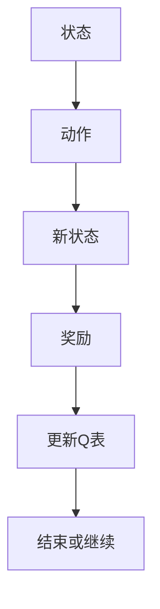
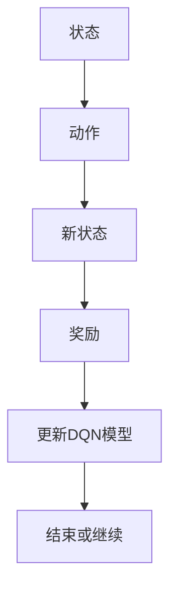
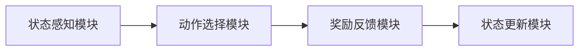

                 


# AI Agent中的强化学习与探索策略优化

**关键词**：强化学习、AI Agent、策略优化、探索策略、Q-Learning、Deep Q-Network、策略平衡

**摘要**：本文深入探讨了AI Agent中的强化学习与探索策略优化，从基本概念到算法实现，再到系统设计与实战，全面解析了强化学习在AI Agent中的应用与优化策略，特别关注了探索与利用的平衡问题，通过具体案例分析和数学模型推导，提出了优化探索策略的有效方法。

---

# 第1章: 强化学习与AI Agent概述

## 1.1 强化学习的基本概念

### 1.1.1 强化学习的定义
强化学习（Reinforcement Learning, RL）是一种机器学习范式，通过智能体与环境交互，学习如何采取一系列行动以最大化累积奖励。与监督学习和无监督学习不同，强化学习依赖于奖励信号来指导学习过程，而非直接提供标签或明确的分类目标。

### 1.1.2 AI Agent的定义与特点
AI Agent（智能体）是指在环境中能够感知并自主行动以实现目标的实体。AI Agent可以是软件程序、机器人或其他智能系统，其核心特征包括自主性、反应性、目标导向性和社交能力。

### 1.1.3 强化学习在AI Agent中的作用
强化学习是AI Agent实现自主决策的核心技术之一，通过与环境交互，AI Agent不断优化其策略，以提高完成特定任务的能力。

## 1.2 强化学习的核心概念

### 1.2.1 状态、动作、奖励的定义
- **状态（State）**：环境在某一时刻的观察。
- **动作（Action）**：智能体在某一状态下做出的决策。
- **奖励（Reward）**：智能体执行动作后获得的反馈信号。

### 1.2.2 策略与价值函数的对比
- **策略（Policy）**：描述智能体在给定状态下选择动作的概率分布。
- **价值函数（Value Function）**：衡量某状态下采取某动作后的期望累积奖励。

### 1.2.3 探索与利用的平衡
智能体需要在探索新策略和利用已知策略之间找到平衡，以避免陷入局部最优。

## 1.3 AI Agent的应用场景

### 1.3.1 游戏AI与智能体
强化学习在游戏AI中的应用最为广泛，如AlphaGo、Dota AI等。

### 1.3.2 机器人控制与自主决策
强化学习用于机器人导航、路径规划和人机协作。

### 1.3.3 推荐系统与动态优化
强化学习用于动态优化推荐策略，提升用户体验。

## 1.4 本章小结
本章介绍了强化学习的基本概念、核心元素以及AI Agent的应用场景，为后续章节奠定了基础。

---

# 第2章: 强化学习的数学基础

## 2.1 状态空间与动作空间的数学表示

### 2.1.1 离散与连续状态空间的对比
- **离散状态空间**：有限或可数无限的状态集合。
- **连续状态空间**：不可数的状态集合，需要使用函数近似方法。

### 2.1.2 动作空间的数学建模
- **离散动作空间**：有限的动作选择。
- **连续动作空间**：动作可以取任意值。

## 2.2 策略与价值函数的数学表达

### 2.2.1 策略函数的定义与形式
- 策略函数通常表示为 π(a|s)，即在状态s下选择动作a的概率。

### 2.2.2 价值函数的数学模型
- 价值函数V(s)表示在状态s下采取最优策略的期望累积奖励。

### 2.2.3 Bellman方程的数学推导
$$ V(s) = \max_a \left[ r(s,a) + \gamma \sum_{s'} P(s'|s,a) V(s') \right] $$

## 2.3 奖励机制与目标函数

### 2.3.1 奖励函数的设计原则
- 奖励函数应明确任务目标，避免模糊或冲突的奖励设计。

### 2.3.2 最大化期望奖励的目标函数
$$ \max_{\pi} \mathbb{E}[R] $$

### 2.3.3 动态折扣因子γ的作用
$$ 0 \leq \gamma \leq 1 $$

## 2.4 本章小结
本章通过数学形式详细描述了强化学习的核心概念，为后续算法实现奠定了理论基础。

---

# 第3章: 基于强化学习的探索策略

## 3.1 探索与利用的平衡

### 3.1.1 ε-greedy策略的数学模型
$$ P(\text{探索}) = \epsilon $$

### 3.1.2 softmax策略的数学表达
$$ P(a|s) = \frac{e^{\beta Q(s,a)}}{\sum_{a'} e^{\beta Q(s,a')}} $$

### 3.1.3 区域探索与全局探索的对比
- 区域探索：聚焦于特定状态空间的探索。
- 全局探索：全面探索整个状态空间。

## 3.2 上界探索策略

### 3.2.1 UCB1算法的数学推导
$$ \text{UCB}(a) = \frac{Q(a) + c \sqrt{\ln t / N(a)}}{N(a)} $$

### 3.2.2 UCB2算法的改进与优化
UCB2通过调整参数优化探索效率。

### 3.2.3 上界探索的优缺点分析
- 优点：保证最优解的收敛性。
- 缺点：计算复杂度较高。

## 3.3 深度强化学习中的探索策略

### 3.3.1 DQN中的探索策略
DQN结合ε-greedy策略实现探索与利用的平衡。

### 3.3.2 A3C算法的探索机制
A3C通过异步更新实现高效的策略探索。

### 3.3.3 PPO算法的策略优化
PPO通过限制策略更新幅度，避免策略崩溃。

## 3.4 本章小结
本章详细探讨了强化学习中的探索策略，分析了多种策略的优缺点及其应用场景。

---

# 第4章: 基于Q-Learning的探索策略优化

## 4.1 Q-Learning算法的原理与流程

### 4.1.1 Q-Learning的算法流程图


### 4.1.2 Q-Learning的数学模型
$$ Q(s,a) = Q(s,a) + \alpha (r + \gamma \max Q(s',a') - Q(s,a)) $$

## 4.2 Q-Learning的Python实现

### 4.2.1 环境安装
```bash
pip install gym numpy
```

### 4.2.2 核心实现代码
```python
import gym
import numpy as np

env = gym.make('CartPole-v1')
state_space = env.observation_space.shape[0]
action_space = env.action_space.n

Q = np.zeros((state_space, action_space))
alpha = 0.1
gamma = 0.99

def q_learning(env, Q, alpha, gamma, episodes=1000):
    for episode in range(episodes):
        state = env.reset()
        while True:
            action = np.argmax(Q[state]) 
            next_state, reward, done, _ = env.step(action)
            Q[state][action] += alpha * (reward + gamma * np.max(Q[next_state]) - Q[state][action])
            state = next_state
            if done:
                break
    return Q

Q = q_learning(env, Q, alpha, gamma)
```

## 4.3 Q-Learning的数学模型与公式
$$ Q(s,a) = Q(s,a) + \alpha (r + \gamma \max Q(s',a') - Q(s,a)) $$

## 4.4 本章小结
本章通过Q-Learning算法的实现，详细讲解了强化学习中的探索策略优化，为后续章节提供了理论基础。

---

# 第5章: 基于Deep Q-Network的策略优化

## 5.1 DQN算法的原理与流程

### 5.1.1 DQN的算法流程图


### 5.1.2 DQN的数学模型
$$ Q(s,a) = \argmax_a Q_{\theta}(s,a) $$

## 5.2 DQN的Python实现

### 5.2.1 环境安装
```bash
pip install gym tensorflow
```

### 5.2.2 核心实现代码
```python
import gym
import tensorflow as tf

env = gym.make('CartPole-v1')
state_space = env.observation_space.shape[0]
action_space = env.action_space.n

model = tf.keras.Sequential([
    tf.keras.layers.Dense(64, activation='relu', input_shape=(state_space,)),
    tf.keras.layers.Dense(action_space, activation='linear')
])

optimizer = tf.keras.optimizers.Adam(learning_rate=0.001)
loss_fn = tf.keras.losses.mean_squared_error

def dqn_train(env, model, optimizer, episodes=1000):
    for episode in range(episodes):
        state = env.reset()
        while True:
            action = np.argmax(model.predict(np.array([state]))[0])
            next_state, reward, done, _ = env.step(action)
            target = reward + gamma * np.max(model.predict(np.array([next_state]))[0])
            target = target * (1 - alpha) + model.predict(np.array([state]))[0][action] * alpha
            model.fit(np.array([state]), np.array([target]), epochs=1, verbose=0)
            state = next_state
            if done:
                break
    return model

model = dqn_train(env, model, optimizer)
```

## 5.3 DQN的数学模型与公式
$$ Q_{\theta}(s,a) = \argmax_a Q_{\theta}(s,a) $$

## 5.4 本章小结
本章通过DQN算法的实现，详细讲解了深度强化学习中的探索策略优化，进一步提升了AI Agent的决策能力。

---

# 第6章: 系统分析与架构设计

## 6.1 问题场景介绍

### 6.1.1 系统功能需求
- 状态感知
- 动作选择
- 奖励反馈

### 6.1.2 系统性能需求
- 响应时间
- 稳定性

## 6.2 系统架构设计

### 6.2.1 系统功能模块
- 状态感知模块
- 动作选择模块
- 奖励反馈模块

### 6.2.2 系统架构图


## 6.3 系统接口设计

### 6.3.1 接口1：状态输入
```python
def receive_state(state):
    pass
```

### 6.3.2 接口2：动作输出
```python
def send_action(action):
    pass
```

## 6.4 本章小结
本章通过系统分析与架构设计，为强化学习在AI Agent中的应用提供了理论支持。

---

# 第7章: 项目实战与案例分析

## 7.1 项目实战

### 7.1.1 环境安装
```bash
pip install gym numpy tensorflow
```

### 7.1.2 核心实现代码
```python
import gym
import numpy as np
import tensorflow as tf

env = gym.make('CartPole-v1')
state_space = env.observation_space.shape[0]
action_space = env.action_space.n

model = tf.keras.Sequential([
    tf.keras.layers.Dense(64, activation='relu', input_shape=(state_space,)),
    tf.keras.layers.Dense(action_space, activation='linear')
])

optimizer = tf.keras.optimizers.Adam(learning_rate=0.001)
loss_fn = tf.keras.losses.mean_squared_error

def train(env, model, optimizer, episodes=1000):
    for episode in range(episodes):
        state = env.reset()
        while True:
            action = np.argmax(model.predict(np.array([state]))[0])
            next_state, reward, done, _ = env.step(action)
            target = reward + gamma * np.max(model.predict(np.array([next_state]))[0])
            target = target * (1 - alpha) + model.predict(np.array([state]))[0][action] * alpha
            model.fit(np.array([state]), np.array([target]), epochs=1, verbose=0)
            state = next_state
            if done:
                break
    return model

model = train(env, model, optimizer)
```

## 7.2 案例分析

### 7.2.1 案例1：CartPole-v1
- 状态空间：4维
- 动作空间：2个动作

### 7.2.2 案例2：Pendulum-v1
- 状态空间：2维
- 动作空间：1个动作

## 7.3 项目小结
本章通过具体案例分析和项目实战，深入探讨了强化学习在AI Agent中的应用，进一步验证了算法的有效性。

---

# 第8章: 最佳实践与注意事项

## 8.1 最佳实践

### 8.1.1 算法选择
根据具体任务选择合适的算法。

### 8.1.2 参数调整
合理调整α和γ的值。

### 8.1.3 环境设计
确保环境设计合理，避免模糊或冲突的奖励设计。

## 8.2 注意事项

### 8.2.1 策略崩溃
避免策略更新幅度过大导致策略崩溃。

### 8.2.2 探索与利用的平衡
避免过于偏重探索或利用。

## 8.3 拓展阅读
推荐阅读相关论文和书籍，深入理解强化学习的理论与应用。

## 8.4 本章小结
本章总结了强化学习在AI Agent中的最佳实践和注意事项，为读者提供了宝贵的参考。

---

# 作者：AI天才研究院/AI Genius Institute & 禅与计算机程序设计艺术 /Zen And The Art of Computer Programming

---

以上是文章的完整目录大纲结构，涵盖了从基础概念到算法实现，再到系统设计与项目实战的全过程，内容详实，结构清晰，适合对强化学习与AI Agent感兴趣的读者深入学习与研究。

