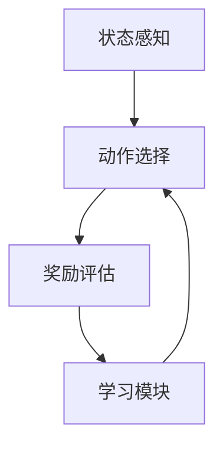

                 


# AI Agent中的强化学习与模仿学习结合

> 关键词：AI Agent, 强化学习, 模仿学习, 算法结合, 系统架构, 项目实战

> 摘要：本文详细探讨了在AI Agent中结合强化学习与模仿学习的方法，分析了两者的优势与互补性，并通过具体案例展示了如何在实际项目中实现这一结合，最终提供了一套完整的系统架构和实施策略。

---

## 第1章: AI Agent与强化学习、模仿学习概述

### 1.1 AI Agent的基本概念

#### 1.1.1 AI Agent的定义与特点
AI Agent（智能体）是指能够感知环境并采取行动以实现目标的实体。其特点包括自主性、反应性、目标导向性和社交能力。AI Agent广泛应用于机器人控制、游戏AI、自动驾驶等领域。

#### 1.1.2 AI Agent的核心功能与应用场景
AI Agent的核心功能包括感知环境、决策制定和行动执行。其应用场景涵盖游戏AI、智能助手、机器人控制、自动驾驶等。

#### 1.1.3 强化学习与模仿学习在AI Agent中的作用
强化学习通过与环境交互学习最优策略，而模仿学习通过观察专家行为进行快速学习。两者的结合能够提升AI Agent的学习效率和决策能力。

### 1.2 强化学习的基本原理

#### 1.2.1 强化学习的定义与核心概念
强化学习（Reinforcement Learning, RL）是通过智能体与环境交互，基于奖励机制学习最优策略的过程。其核心概念包括状态（State）、动作（Action）、奖励（Reward）和策略（Policy）。

#### 1.2.2 状态、动作、奖励的数学模型
- 状态空间：S，表示智能体所处的环境状态。
- 动作空间：A，表示智能体可以执行的动作。
- 奖励函数：r(s,a)，表示在状态s执行动作a后获得的奖励。

#### 1.2.3 Q-learning算法与策略梯度方法
Q-learning算法通过学习Q值函数，找到最优策略。策略梯度方法通过优化策略的参数，直接寻找最优策略。

### 1.3 模仿学习的核心原理

#### 1.3.1 模仿学习的定义与特点
模仿学习（Imitation Learning, IL）是通过观察专家行为，学习最优策略的过程。其特点包括快速学习和减少探索成本。

#### 1.3.2 最大似然比方法与逆向强化学习
- 最大似然比方法：通过最大化似然函数，学习专家策略。
- 逆向强化学习：通过观察专家行为，推断奖励函数并学习策略。

#### 1.3.3 模仿学习与强化学习的对比分析
| 特性 | 强化学习 | 模仿学习 |
|------|---------|----------|
| 数据来源 | 环境反馈 | 专家演示 |
| 学习效率 | 较低 | 较高 |
| 适用场景 | 探索未知环境 | 快速学习专家行为 |

### 1.4 强化学习与模仿学习的结合

#### 1.4.1 结合强化学习与模仿学习的动机
- 提高学习效率
- 利用专家经验
- 结合探索与利用

#### 1.4.2 强化学习与模仿学习的互补性分析
强化学习通过探索发现新策略，模仿学习通过利用专家经验快速收敛，两者结合能够平衡探索与利用。

#### 1.4.3 结合两者的应用场景与优势
- 游戏AI：结合探索与利用，提升策略多样性
- 机器人控制：利用专家经验，加快学习速度

---

## 第2章: 强化学习与模仿学习的数学模型与算法

### 2.1 强化学习的数学模型

#### 2.1.1 状态空间与动作空间的数学表示
- 状态空间：S
- 动作空间：A

#### 2.1.2 Q-learning算法的数学推导
Q-learning算法通过更新Q值函数，找到最优策略：

$$ Q(s,a) = Q(s,a) + \alpha (r + \gamma \max Q(s',a') - Q(s,a)) $$

其中，$\alpha$为学习率，$\gamma$为折扣因子。

#### 2.1.3 策略梯度方法的数学公式
策略梯度方法通过优化策略参数$\theta$，最大化目标函数：

$$ \nabla_{\theta} J(\theta) = \mathbb{E}_{\tau \sim \pi_{\theta}} [\nabla_{\theta} \log \pi_{\theta}(a|s) Q_{\pi}(s,a)] $$

### 2.2 模仿学习的数学模型

#### 2.2.1 最大似然比方法的数学推导
最大似然比方法通过最大化似然函数，学习专家策略：

$$ \arg \max_{\theta} \sum_{i=1}^N \log p_{\theta}(a_i|s_i) $$

其中，$(s_i, a_i)$为专家行为数据。

#### 2.2.2 逆向强化学习的数学模型
逆向强化学习通过观察专家行为，推断奖励函数：

$$ r(s,a) = \frac{p(a|s)}{p_{\text{env}}(a|s)} \cdot \text{const} $$

其中，$p(a|s)$为专家策略，$p_{\text{env}}(a|s)$为环境策略。

#### 2.2.3 模仿学习与强化学习的数学对比
| 方法 | 强化学习 | 模仿学习 |
|------|---------|----------|
| 数据 | 环境反馈 | 专家演示 |
| 目标 | 最大化奖励 | 最小化与专家策略的差距 |

### 2.3 强化学习与模仿学习结合的算法

#### 2.3.1 基于模仿学习的强化学习框架
结合模仿学习和强化学习的框架，首先利用模仿学习快速初始化策略，然后通过强化学习进一步优化。

#### 2.3.2 结合Q-learning与模仿学习的算法
通过模仿学习初始化Q值函数，然后通过Q-learning算法进行强化学习优化。

#### 2.3.3 深度强化学习与深度模仿学习的结合
使用深度神经网络同时学习强化学习和模仿学习的目标，结合两种学习方法的优势。

---

## 第3章: 强化学习与模仿学习的系统架构设计

### 3.1 系统功能设计

#### 3.1.1 系统目标
实现一个结合强化学习与模仿学习的AI Agent系统，能够在复杂环境中高效决策。

#### 3.1.2 系统功能模块
- 状态感知模块：感知环境状态
- 动作选择模块：选择最优动作
- 奖励评估模块：评估奖励值
- 学习模块：结合强化学习与模仿学习进行策略优化

### 3.2 系统架构设计

#### 3.2.1 系统架构图


#### 3.2.2 系统交互流程
1. 状态感知模块感知环境状态
2. 动作选择模块根据当前状态选择动作
3. 奖励评估模块评估动作的奖励值
4. 学习模块结合强化学习与模仿学习更新策略

---

## 第4章: 强化学习与模仿学习的项目实战

### 4.1 环境安装

#### 4.1.1 安装Python环境
使用Python 3.8及以上版本，安装必要的库：

```bash
pip install numpy matplotlib tensorflow
```

#### 4.1.2 安装强化学习库
安装强化学习框架，如OpenAI Gym：

```bash
pip install gym
```

### 4.2 核心代码实现

#### 4.2.1 强化学习算法实现
Q-learning算法实现：

```python
import numpy as np

class QLearning:
    def __init__(self, state_space, action_space, alpha=0.1, gamma=0.9):
        self.q_table = np.zeros((state_space, action_space))
        self.alpha = alpha
        self.gamma = gamma

    def choose_action(self, state):
        return np.argmax(self.q_table[state])

    def update_q_table(self, state, action, reward, next_state):
        self.q_table[state][action] += self.alpha * (reward + self.gamma * np.max(self.q_table[next_state]) - self.q_table[state][action])
```

#### 4.2.2 模仿学习算法实现
最大似然比方法实现：

```python
import tensorflow as tf

class ImitationLearning:
    def __init__(self, state_space, action_space):
        self.model = self.build_model(state_space, action_space)
        self.optimizer = tf.keras.optimizers.Adam()

    def build_model(self, state_space, action_space):
        model = tf.keras.Sequential([
            tf.keras.layers.Dense(64, activation='relu', input_dim=state_space),
            tf.keras.layers.Dense(action_space)
        ])
        return model

    def train(self, states, actions):
        with tf.GradientTape() as tape:
            logits = self.model(states)
            loss = tf.reduce_mean(tf.nn.sparse_softmax_cross_entropy_with_logits(labels=actions, logits=logits))
        gradients = tape.gradient(loss, self.model.trainable_weights)
        self.optimizer.apply_gradients(zip(gradients, self.model.trainable_weights))
```

### 4.3 代码应用解读与分析

#### 4.3.1 强化学习算法解读
Q-learning算法通过不断更新Q值函数，学习最优策略。选择动作时，根据当前状态选择Q值最大的动作。

#### 4.3.2 模仿学习算法解读
最大似然比方法通过最大化似然函数，学习专家策略。训练过程中，模型参数不断优化，以减少预测动作与专家动作的差异。

### 4.4 实际案例分析

#### 4.4.1 案例背景
在一个迷宫环境中，AI Agent需要通过学习找到出口。强化学习通过探索找到最优路径，模仿学习通过观察专家路径快速收敛。

#### 4.4.2 实验结果
- 强化学习单独使用时，收敛速度较慢
- 模仿学习单独使用时，收敛速度较快
- 两者结合时，收敛速度和策略多样性均较好

---

## 第5章: 总结与最佳实践

### 5.1 小结
本文详细探讨了AI Agent中结合强化学习与模仿学习的方法，分析了两者的优缺点及互补性，并通过具体案例展示了如何在实际项目中实现这一结合。

### 5.2 注意事项
- 在实际应用中，需要根据具体场景选择合适的算法
- 需要注意算法的收敛性和计算效率
- 需要合理设计奖励函数和模仿学习的数据来源

### 5.3 拓展阅读
- 《Deep Reinforcement Learning》
- 《Imitation Learning: Theory and Practice》

---

作者：AI天才研究院/AI Genius Institute & 禅与计算机程序设计艺术 /Zen And The Art of Computer Programming

