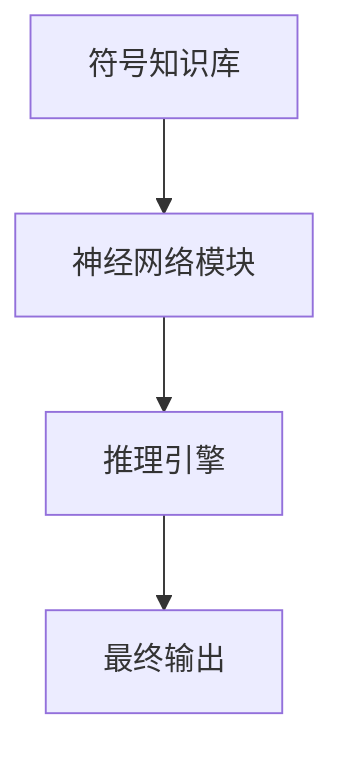
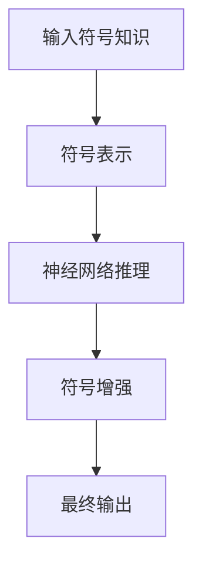
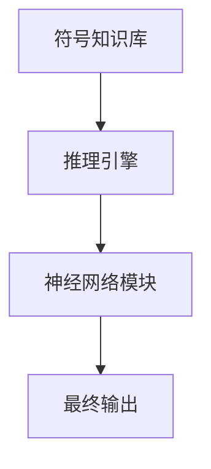

                 


# AI Agent中的神经符号融合技术

## 关键词：AI Agent, 神经符号融合, 神经网络, 符号推理, 融合算法

## 摘要：  
本文深入探讨了AI Agent中的神经符号融合技术，结合了神经网络和符号推理的优势，解决了传统AI技术在复杂场景中的局限性。通过分析神经符号融合的核心概念、算法原理、系统架构以及实际应用案例，本文为读者提供了全面的技术解读和实践指导。

---

# 第一部分: 背景介绍

## 第1章: 问题背景

### 1.1 AI Agent的发展历程  
AI Agent（智能体）是指在特定环境中能够感知并自主行动以实现目标的实体。AI Agent技术的发展经历了从基于规则的传统方法到现代深度学习的演变。早期的AI Agent依赖于专家规则和逻辑推理，但在复杂动态环境中表现有限。近年来，深度学习的兴起为AI Agent带来了新的可能性，但其黑箱特性使其难以解释和控制。

### 1.2 神经符号融合技术的提出背景  
神经符号融合（Neural-Symbolic Integration）技术的提出源于AI Agent在实际应用中的需求。传统神经网络擅长处理感知任务，但缺乏推理和解释能力；而符号推理方法虽然具备逻辑推理能力，但在处理复杂感知任务时表现不佳。神经符号融合技术旨在结合两者的优势，解决AI Agent在感知与推理之间的鸿沟问题。

### 1.3 当前AI Agent技术的局限性  
1. **感知与推理的割裂**：神经网络擅长感知任务，但难以进行逻辑推理；符号推理擅长逻辑推理，但难以处理感知任务。  
2. **黑箱特性**：深度学习模型难以解释，限制了其在需要可解释性场景中的应用。  
3. **动态环境适应性**：传统符号推理方法难以快速适应动态变化的环境。  

---

## 第2章: 问题描述

### 2.1 神经符号融合技术的核心问题  
神经符号融合技术的核心问题是如何将符号推理与神经网络有机结合起来，使其在AI Agent中协同工作。具体包括以下几点：  
1. **符号表示与神经网络的结合**：如何将符号知识表示为神经网络可以处理的形式。  
2. **推理与感知的协同**：如何在动态环境中实现感知与推理的无缝协同。  
3. **模型的可解释性**：如何在保持模型性能的同时，提高其可解释性。  

### 2.2 神经符号融合技术的目标与边界  
神经符号融合技术的目标是构建一种既能处理感知任务，又能进行逻辑推理的AI Agent。其边界包括：  
1. **技术边界**：仅关注符号推理与神经网络的结合，不涉及其他AI技术。  
2. **应用边界**：适用于需要感知与推理结合的场景，如自动驾驶、智能助手等。  
3. **研究边界**：主要研究技术实现，不涉及具体应用的商业模式。  

### 2.3 神经符号融合技术的概念结构  
神经符号融合技术的核心要素包括：  
1. **符号知识库**：用于存储和管理符号化知识。  
2. **神经网络模块**：用于处理感知任务。  
3. **推理引擎**：用于符号推理和神经网络结果的结合。  

---

# 第二部分: 核心概念与联系

## 第3章: 核心概念与联系

### 3.1 神经符号融合技术的核心原理  
神经符号融合技术通过将符号推理与神经网络相结合，实现感知与推理的协同。具体步骤包括：  
1. **符号表示**：将符号知识表示为神经网络可处理的形式。  
2. **神经推理**：利用神经网络进行感知任务的处理。  
3. **符号增强**：通过符号推理对神经网络的结果进行优化。  

### 3.2 神经符号融合技术的核心要素对比  
| **特性**       | **神经网络**                 | **符号推理**                 |  
|----------------|------------------------------|-----------------------------|  
| **处理任务**    | 感知任务（如图像识别、语音识别） | 推理任务（如逻辑推理、知识推理） |  
| **优点**        | 高效、强大，但缺乏解释性       | 可解释性强，但处理复杂感知任务能力有限 |  
| **应用场景**    | 图像识别、语音识别             | 自然语言处理、逻辑推理       |  

### 3.3 神经符号融合技术的实体关系图  


---

# 第三部分: 算法原理讲解

## 第4章: 神经符号融合算法的实现

### 4.1 神经符号融合算法的基本流程  
1. **符号表示**：将符号知识转换为神经网络可处理的形式。  
2. **神经推理**：利用神经网络对输入进行感知任务的处理。  
3. **符号增强**：通过符号推理对神经网络的结果进行优化。  

### 4.2 神经符号融合算法的流程图  


### 4.3 神经符号融合算法的数学模型  
假设符号知识表示为一个图结构，神经网络通过图神经网络（GNN）进行推理。符号增强通过逻辑规则对GNN的输出进行优化。数学模型如下：  

1. **符号表示**：  
   $$ G = (V, E) $$  
   其中，$V$ 表示节点集合，$E$ 表示边集合。  

2. **神经网络推理**：  
   $$ h_v = \text{GNN}(G) $$  
   其中，$h_v$ 表示节点$v$的隐藏状态。  

3. **符号增强**：  
   $$ h_v' = f(h_v, r) $$  
   其中，$r$ 表示逻辑规则。  

### 4.4 神经符号融合算法的实现代码  
```python
class NeuralSymbolicAgent:
    def __init__(self, symbol_repository, neural_network):
        self.symbol_repository = symbol_repository
        self.neural_network = neural_network

    def perceive(self, input):
        return self.neural_network(input)

    def reason(self, input):
        symbols = self.symbol_repository.retrieve(input)
        return self.reasoning_engine(symbols)

    def reasoning_engine(self, symbols):
        # 逻辑推理代码
        pass

    def act(self):
        # 根据感知和推理结果采取行动
        pass
```

---

# 第四部分: 系统分析与架构设计

## 第5章: 系统分析与架构设计

### 5.1 系统问题场景介绍  
AI Agent需要在动态复杂的环境中完成感知、推理和行动任务。神经符号融合技术通过结合符号推理和神经网络，解决传统AI Agent在复杂环境中的表现问题。

### 5.2 系统功能设计  
1. **符号知识库**：存储和管理符号化知识。  
2. **神经网络模块**：处理感知任务。  
3. **推理引擎**：结合符号推理和神经网络结果。  

### 5.3 系统架构图  


---

# 第五部分: 项目实战

## 第6章: 项目实战

### 6.1 项目环境安装  
1. 安装Python和相关库：  
   ```bash
   pip install numpy torch networkx
   ```

### 6.2 系统核心实现源代码  
```python
import torch
import networkx as nx

class NeuralSymbolicAgent:
    def __init__(self, symbol_repository, neural_network):
        self.symbol_repository = symbol_repository
        self.neural_network = neural_network

    def perceive(self, input):
        return self.neural_network(input)

    def reason(self, input):
        symbols = self.symbol_repository.retrieve(input)
        return self.reasoning_engine(symbols)

    def reasoning_engine(self, symbols):
        # 简单的逻辑推理示例
        if 'A' in symbols and 'B' in symbols:
            return 'C'
        else:
            return None

    def act(self):
        # 根据推理结果采取行动
        result = self.reason(self.perceive())
        if result:
            print(f"采取行动：{result}")
        else:
            print("无法采取行动")
```

### 6.3 代码应用解读与分析  
上述代码实现了一个简单的神经符号融合AI Agent。`perceive`方法利用神经网络进行感知任务，`reason`方法通过符号推理引擎进行逻辑推理，`act`方法根据推理结果采取行动。

### 6.4 实际案例分析  
以智能助手为例，假设用户输入“我需要一杯咖啡”，神经网络模块识别用户的意图，符号推理引擎根据符号知识库中的规则推理出需要的操作（如启动咖啡机），最终采取行动。

---

# 第六部分: 最佳实践

## 第7章: 最佳实践

### 7.1 神经符号融合技术的注意事项  
1. **数据质量**：符号知识库的质量直接影响推理结果。  
2. **模型调优**：神经网络和符号推理的结合需要仔细调优。  
3. **可解释性**：在需要解释性场景中，优先选择符号推理部分。  

### 7.2 神经符号融合技术的未来发展方向  
1. **更复杂的符号推理**：研究更复杂的逻辑推理规则。  
2. **多模态融合**：结合视觉、听觉等多种感知方式。  
3. **可解释性优化**：进一步提高模型的可解释性。  

---

# 结语  
神经符号融合技术为AI Agent提供了新的可能性，通过结合神经网络和符号推理的优势，解决了传统技术的局限性。未来，随着技术的不断发展，神经符号融合技术将在更多领域得到广泛应用。

---

# 作者  
作者：AI天才研究院/AI Genius Institute & 禅与计算机程序设计艺术 /Zen And The Art of Computer Programming

