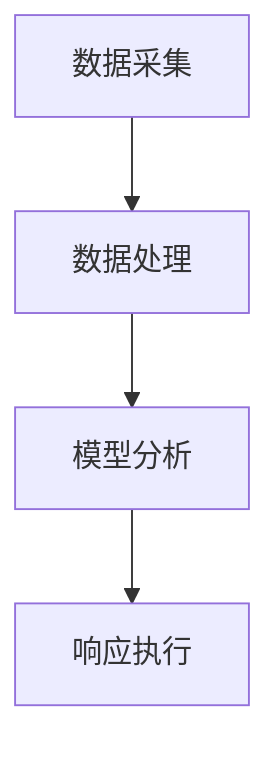

                 


# AI Agent在企业信息安全威胁检测与响应中的应用

---

## 关键词：AI Agent, 企业信息安全, 威胁检测, 威胁响应, 机器学习, 数据安全

---

## 摘要：  
本文探讨了AI Agent在企业信息安全威胁检测与响应中的应用，详细分析了AI Agent的核心原理、技术实现、系统架构设计以及实际应用场景。通过结合机器学习、关联规则挖掘等技术，本文展示了如何利用AI Agent提升企业信息安全能力，实现自动化、智能化的威胁检测与响应。

---

## 第一部分: 引言

### 1.1 问题背景

#### 1.1.1 企业信息安全面临的挑战  
随着企业数字化转型的加速，信息安全威胁日益复杂化和智能化。传统的基于规则的安全检测方法逐渐暴露出响应速度慢、误报率高等问题，难以应对高级持续性威胁（APT）和零日攻击。企业需要一种更高效、更智能的安全解决方案来应对这些挑战。

#### 1.1.2 AI Agent在信息安全中的作用  
AI Agent（人工智能代理）能够通过机器学习算法实时分析海量数据，发现异常行为，并快速响应威胁。AI Agent不仅能够提高威胁检测的准确性，还能够实现自动化响应，显著降低企业的安全风险。

#### 1.1.3 本书的研究目标与意义  
本文旨在探讨AI Agent在企业信息安全威胁检测与响应中的具体应用，分析其技术实现和系统架构设计，为企业提供一种高效的安全解决方案。通过结合理论与实践，本文将为企业安全团队提供有价值的参考。

---

## 第二部分: AI Agent基础

### 2.1 AI Agent的定义与特点

#### 2.1.1 AI Agent的定义  
AI Agent是一种能够感知环境、自主决策并执行任务的智能实体。在信息安全领域，AI Agent通常用于数据采集、分析、决策和响应执行。

#### 2.1.2 AI Agent的核心特点  
- **自主性**：能够自主执行任务，无需人工干预。  
- **反应性**：能够实时感知环境变化并做出响应。  
- **学习能力**：通过机器学习算法不断优化自身的检测和响应能力。  

#### 2.1.3 AI Agent与传统安全工具的区别  
AI Agent能够通过机器学习模型实时分析数据，发现异常行为，并根据上下文做出决策，而传统安全工具通常基于固定的规则进行匹配。

---

## 第三部分: 企业信息安全威胁检测

### 3.1 威胁检测的类型

#### 3.1.1 网络攻击检测  
AI Agent可以通过分析网络流量数据，检测异常流量、恶意代码等网络攻击行为。

#### 3.1.2 数据泄露检测  
AI Agent能够通过分析访问日志和行为模式，识别潜在的数据泄露行为。

#### 3.1.3 内部威胁检测  
AI Agent可以监控员工行为，识别潜在的内部威胁，如滥用权限、数据窃取等。

### 3.2 AI Agent在威胁检测中的应用

#### 3.2.1 异常行为分析  
AI Agent通过机器学习算法分析用户行为，识别异常行为模式，从而发现潜在的威胁。

#### 3.2.2 入侵检测系统  
AI Agent可以集成到入侵检测系统中，实时监控网络流量，识别潜在的攻击行为。

#### 3.2.3 威胁情报分析  
AI Agent可以分析威胁情报数据，识别新的威胁模式，并更新自身的检测模型。

---

## 第四部分: 威胁响应机制

### 4.1 威胁响应策略

#### 4.1.1 自动响应策略  
AI Agent可以根据检测到的威胁类型和严重性，自动执行响应操作，如隔离受感染的设备、阻止恶意流量等。

#### 4.1.2 协调响应机制  
在复杂的威胁场景下，AI Agent可以与其他安全系统协同工作，实现跨系统的威胁响应。

#### 4.1.3 响应策略的动态调整  
AI Agent可以根据实时威胁情况动态调整响应策略，确保最优的安全防护效果。

### 4.2 AI Agent的响应流程

#### 4.2.1 响应触发条件  
AI Agent根据检测到的威胁指标（如异常行为、攻击模式）触发响应流程。

#### 4.2.2 响应执行步骤  
AI Agent执行预定义的响应操作，如阻断恶意流量、隔离受感染设备等。

#### 4.2.3 响应结果反馈  
AI Agent将响应结果反馈给安全团队，供进一步分析和优化。

---

## 第五部分: 技术实现

### 5.1 特征提取与分类

#### 5.1.1 基于机器学习的特征提取  
AI Agent通过分析日志数据、网络流量等，提取与威胁相关的特征，如用户行为模式、流量特征等。

#### 5.1.2 分类算法的选择与优化  
常用的分类算法包括决策树、随机森林、支持向量机（SVM）等。AI Agent可以根据具体场景选择最优算法，并进行调优。

#### 5.1.3 特征工程的实现  
通过特征选择、降维等技术，优化特征集，提高分类模型的准确率。

### 5.2 关联规则挖掘

#### 5.2.1 关联规则的定义与作用  
关联规则挖掘用于发现数据中的频繁项集，帮助识别潜在的威胁模式。

#### 5.2.2 Apriori算法的实现  
Apriori算法是一种经典的关联规则挖掘算法，适用于处理高维数据集。

#### 5.2.3 关联规则在威胁检测中的应用  
通过关联规则挖掘，AI Agent可以发现异常的事件组合，识别潜在的威胁。

---

## 第六部分: 系统架构设计

### 6.1 系统模块划分

#### 6.1.1 数据采集模块  
负责采集网络流量、日志数据等信息。

#### 6.1.2 数据处理模块  
对采集的数据进行清洗、预处理和特征提取。

#### 6.1.3 模型分析模块  
基于机器学习模型进行威胁检测和关联规则挖掘。

#### 6.1.4 响应执行模块  
根据检测结果执行相应的响应操作。

### 6.2 系统架构图



---

## 第七部分: 项目实战

### 7.1 环境搭建

#### 7.1.1 安装Python和相关库  
安装Python、Scikit-learn、TensorFlow等机器学习库。

#### 7.1.2 数据集准备  
收集网络流量数据、日志数据等。

### 7.2 核心代码实现

#### 7.2.1 特征提取代码  
```python
import pandas as pd

# 加载数据集
data = pd.read_csv('network_traffic.csv')

# 特征提取
features = data[['src_ip', 'dest_ip', 'bytes', 'time']]
```

#### 7.2.2 分类模型实现  
```python
from sklearn.ensemble import RandomForestClassifier
from sklearn.model_selection import train_test_split

# 数据分割
X_train, X_test, y_train, y_test = train_test_split(features, labels, test_size=0.2)

# 训练模型
model = RandomForestClassifier().fit(X_train, y_train)

# 预测
y_pred = model.predict(X_test)
```

#### 7.2.3 关联规则挖掘代码  
```python
from mlxtend.frequent_itemsets import apriori

# 数据准备
transactions = data[['item1', 'item2', 'item3']].values

# 执行关联规则挖掘
frequent_items = apriori(transactions, min_support=0.2, use_colnames=True)
```

### 7.3 案例分析

#### 7.3.1 网络攻击检测案例  
通过AI Agent检测异常流量，识别潜在的DDoS攻击。

#### 7.3.2 数据泄露检测案例  
通过分析访问日志，发现异常访问行为，及时阻止数据泄露。

### 7.4 项目小结  
通过实际案例分析，展示了AI Agent在企业信息安全中的强大能力，能够有效提升威胁检测和响应的效率。

---

## 第八部分: 总结与展望

### 8.1 总结  
本文详细探讨了AI Agent在企业信息安全威胁检测与响应中的应用，分析了其技术实现和系统架构设计，并通过实际案例展示了其强大的能力。

### 8.2 未来展望  
未来，随着AI技术的不断发展，AI Agent在企业信息安全中的应用将更加广泛，威胁检测和响应的智能化水平也将进一步提升。

---

## 作者：AI天才研究院/AI Genius Institute & 禅与计算机程序设计艺术 /Zen And The Art of Computer Programming

