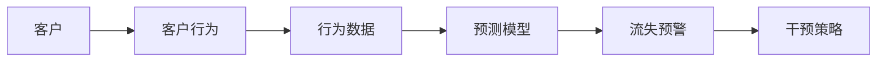
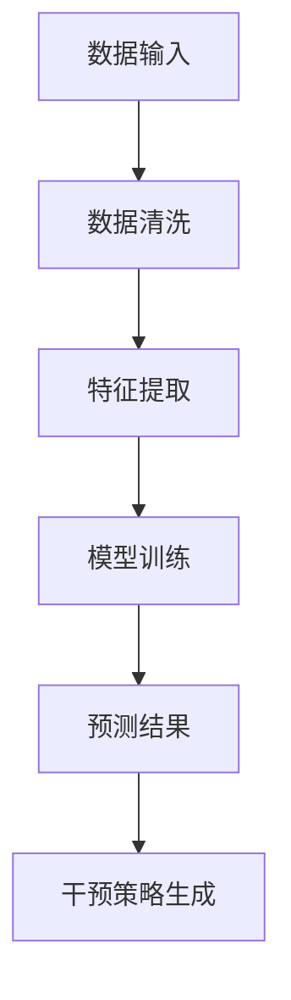
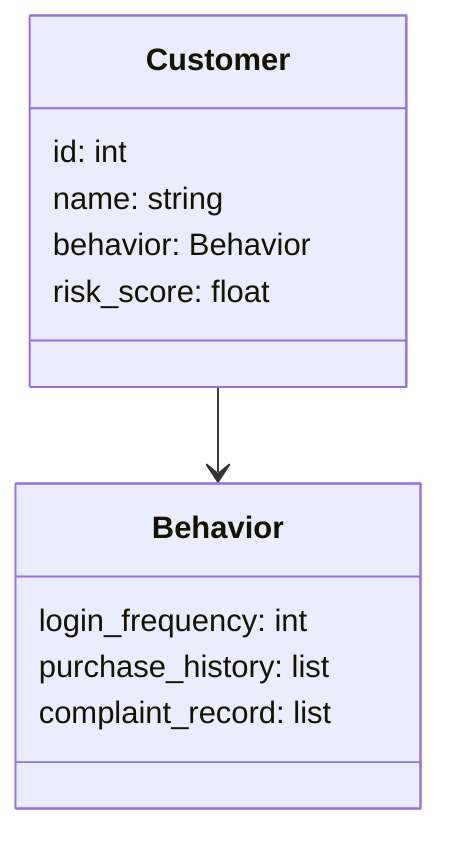
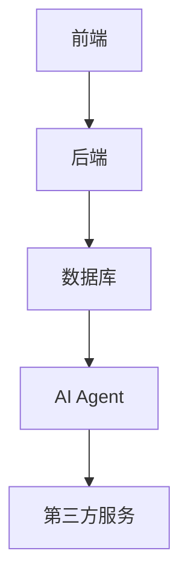
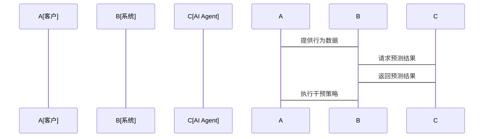

                 


# AI Agent在企业客户流失预警与干预中的应用

## 关键词：AI Agent, 客户流失预警, 机器学习, 客户管理, 企业风险管理

## 摘要：  
在当今激烈的商业竞争环境中，客户流失已成为企业面临的主要挑战之一。AI Agent（人工智能代理）作为一种智能化的解决方案，能够通过分析客户的实时行为数据，预测潜在的流失风险，并采取相应的干预措施，从而帮助企业降低客户流失率。本文将详细探讨AI Agent在客户流失预警与干预中的应用，从背景、原理、算法、系统设计到实际案例，全面解析这一技术的核心内容和实际价值。

---

# 第1章: AI Agent与客户流失预警概述

## 1.1 客户流失问题的背景与重要性

### 1.1.1 客户流失的定义与影响  
客户流失是指企业客户因各种原因停止与企业进行交易的行为。客户流失不仅会导致收入减少，还会增加获取新客户的成本。据统计，获取新客户的成本通常是保留现有客户的5倍，因此，客户流失预警与干预对企业至关重要。

### 1.1.2 企业客户流失的常见原因  
客户流失的原因多种多样，主要包括：  
1. **服务质量问题**：如响应慢、投诉处理不当等。  
2. **竞争压力**：客户被竞争对手的优惠或更好的服务吸引。  
3. **客户体验不佳**：如产品功能不足、用户体验差等。  
4. **经济因素**：如客户自身财务状况恶化。  

### 1.1.3 客户流失预警的商业价值  
通过AI Agent进行客户流失预警，企业可以：  
1. 提前识别高风险客户，采取主动干预措施。  
2. 降低客户获取成本，提升客户满意度和忠诚度。  
3. 增强企业的市场竞争力，提高客户 retention 率。  

## 1.2 AI Agent的核心概念与特点

### 1.2.1 AI Agent的定义与分类  
AI Agent是指能够感知环境、自主决策并执行任务的智能体。在客户流失预警中，AI Agent通常分为两类：  
1. **监督型AI Agent**：基于历史数据进行监督学习，预测客户流失风险。  
2. **强化学习型AI Agent**：通过与客户的交互不断优化干预策略。  

### 1.2.2 AI Agent在客户流失预警中的优势  
AI Agent的优势在于其能够实时分析海量数据，快速识别潜在风险，并自动执行干预策略。与传统方法相比，AI Agent具有更高的效率和准确性。  

### 1.2.3 AI Agent与传统客户管理系统的区别  
| 特性             | AI Agent                            | 传统客户管理系统                   |  
|------------------|------------------------------------|------------------------------------|  
| 数据处理能力     | 高效处理海量实时数据             | 处理能力有限，依赖人工输入         |  
| 决策能力         | 自主学习并优化决策策略           | 依赖预设规则，决策能力有限         |  
| 反应速度         | 实时响应                           | 延迟较高                           |  

## 1.3 客户流失预警系统的构建目标

### 1.3.1 系统目标的设定  
客户流失预警系统的构建目标包括：  
1. 准确预测客户流失风险。  
2. 提供实时的干预建议。  
3. 最小化客户流失率。  

### 1.3.2 系统功能的初步规划  
系统功能包括：  
1. 数据采集与处理模块。  
2. 流失预测模型模块。  
3. 干预策略执行模块。  

### 1.3.3 系统实现的技术路线  
1. 数据采集：从CRM系统、客户行为日志中获取数据。  
2. 数据预处理：清洗、特征提取。  
3. 模型训练：基于机器学习算法构建流失预测模型。  
4. 系统集成：将模型集成到企业系统中，实时监控并执行干预策略。  

## 1.4 本章小结  
本章介绍了客户流失问题的背景、AI Agent的核心概念及其在客户流失预警中的优势，为后续章节奠定了基础。

---

# 第2章: AI Agent与客户流失预警的核心原理

## 2.1 AI Agent的核心原理

### 2.1.1 AI Agent的基本工作流程  
AI Agent的工作流程包括以下几个步骤：  
1. **数据采集**：从多种渠道获取客户数据。  
2. **数据预处理**：清洗数据并提取特征。  
3. **模型训练**：基于机器学习算法训练流失预测模型。  
4. **预测与干预**：实时预测客户流失风险并执行干预策略。  

### 2.1.2 AI Agent与客户行为分析的结合  
AI Agent通过分析客户的交互行为、购买记录、投诉记录等数据，识别潜在的流失迹象。例如，客户在一段时间内没有登录系统或减少购买频率，AI Agent会标记该客户为高风险客户。

## 2.2 客户流失预警的核心要素

### 2.2.1 客户行为数据的采集与分析  
客户行为数据包括：  
- 登录频率。  
- 购买记录。  
- 投诉记录。  
- 页面停留时间。  

### 2.2.2 客户流失预测的数学模型  
常用的客户流失预测模型包括：  
1. **逻辑回归模型**：用于分类问题。  
2. **随机森林模型**：用于特征重要性分析。  
3. **XGBoost模型**：用于高精度预测。  

### 2.2.3 客户干预策略的设计与实施  
干预策略包括：  
1. **主动联系客户**：通过邮件、电话或短信提醒客户。  
2. **个性化优惠**：为高风险客户提供专属优惠。  
3. **优化服务流程**：针对流失原因改进服务质量。  

## 2.3 AI Agent与客户流失预警的实体关系图  


## 2.4 本章小结  
本章详细介绍了AI Agent的核心原理及其在客户流失预警中的应用，强调了数据、模型和策略三者之间的协同作用。

---

# 第3章: AI Agent的算法原理

## 3.1 客户流失预测的算法选择

### 3.1.1 常见的客户流失预测算法  
常用的算法包括：  
- 逻辑回归（Logistic Regression）。  
- 支持向量机（SVM）。  
- 随机森林（Random Forest）。  
- XGBoost。  

### 3.1.2 各种算法的优缺点对比  
| 算法         | 优点                     | 缺点                     |  
|--------------|--------------------------|--------------------------|  
| 逻辑回归     | 简单，可解释性强           | 非线性能力有限           |  
| 随机森林     | 高精度，适合高维数据       | 对超参数敏感             |  
| XGBoost      | 高精度，支持并行计算       | 对超参数敏感             |  

## 3.2 基于机器学习的客户流失预测模型

### 3.2.1 数据预处理与特征提取  
数据预处理包括：  
1. 填充缺失值。  
2. 标准化或归一化数据。  
特征提取包括：  
1. 用户行为特征（如登录频率、购买间隔）。  
2. 用户属性特征（如年龄、性别）。  

### 3.2.2 模型训练与优化  
以逻辑回归为例，模型的训练过程如下：  
1. 数据分割：将数据分为训练集和测试集。  
2. 模型训练：使用训练集数据训练逻辑回归模型。  
3. 模型评估：使用测试集数据评估模型性能（如准确率、召回率）。  
4. 模型优化：调整模型参数（如正则化参数）以提高性能。  

### 3.2.3 模型评估与验证  
常用的评估指标包括：  
- 准确率（Accuracy）。  
- 召回率（Recall）。  
- F1分数（F1 Score）。  

## 3.3 AI Agent的算法实现

### 3.3.1 算法流程图  


### 3.3.2 逻辑回归模型的实现代码  
```python
import pandas as pd
from sklearn.model_selection import train_test_split
from sklearn.linear_model import LogisticRegression
from sklearn.metrics import accuracy_score, recall_score, f1_score

# 数据加载
data = pd.read_csv('customer_churn.csv')

# 数据分割
X = data.drop('churn', axis=1)
y = data['churn']
X_train, X_test, y_train, y_test = train_test_split(X, y, test_size=0.2, random_state=42)

# 模型训练
model = LogisticRegression(max_iter=1000)
model.fit(X_train, y_train)

# 模型预测
y_pred = model.predict(X_test)

# 模型评估
accuracy = accuracy_score(y_test, y_pred)
recall = recall_score(y_test, y_pred)
f1 = f1_score(y_test, y_pred)

print(f"Accuracy: {accuracy}")
print(f"Recall: {recall}")
print(f"F1 Score: {f1}")
```

### 3.3.3 逻辑回归模型的数学公式  
逻辑回归的损失函数为：  
$$ L = -\sum_{i=1}^{n} [y_i \cdot \ln(h(x_i)) + (1 - y_i) \cdot \ln(1 - h(x_i))] $$  
其中，$$ h(x_i) = \frac{1}{1 + e^{-\beta x_i}} $$  

## 3.4 本章小结  
本章详细介绍了客户流失预测的算法选择、模型实现及其数学原理，为后续的系统设计奠定了基础。

---

# 第4章: 系统分析与架构设计

## 4.1 项目背景与目标

### 4.1.1 项目背景介绍  
本项目旨在通过AI Agent技术，构建一个智能化的客户流失预警与干预系统，帮助企业在客户流失前采取主动措施。

### 4.1.2 项目目标设定  
项目目标包括：  
1. 实时监控客户行为数据。  
2. 准确预测客户流失风险。  
3. 自动执行干预策略。  

## 4.2 系统功能设计

### 4.2.1 领域模型类图  


### 4.2.2 系统功能模块  
系统功能模块包括：  
1. 数据采集模块。  
2. 数据处理模块。  
3. 模型预测模块。  
4. 干预执行模块。  

## 4.3 系统架构设计

### 4.3.1 系统整体架构  


### 4.3.2 数据库设计  
数据库设计包括：  
- 客户信息表。  
- 行为数据表。  
- 流失预测结果表。  

### 4.3.3 系统接口设计  
系统接口包括：  
1. 数据采集接口。  
2. 预测结果接口。  
3. 干预策略执行接口。  

## 4.4 系统交互设计

### 4.4.1 系统交互流程图  


## 4.5 本章小结  
本章详细介绍了系统的整体架构、功能模块及交互流程，为系统的实际开发提供了指导。

---

# 第5章: 项目实战

## 5.1 环境安装与配置

### 5.1.1 安装Python与相关库  
安装Python 3.8及以上版本，并安装以下库：  
- scikit-learn。  
- pandas。  
- mermaid。  

### 5.1.2 安装步骤  
1. 下载并安装Python。  
2. 安装Jupyter Notebook。  
3. 使用pip安装所需库：  
   ```bash
   pip install scikit-learn pandas mermaid
   ```

## 5.2 系统核心实现

### 5.2.1 数据采集与处理  
```python
import pandas as pd
data = pd.read_csv('customer_data.csv')
```

### 5.2.2 模型训练与预测  
```python
from sklearn.linear_model import LogisticRegression
model = LogisticRegression()
model.fit(X_train, y_train)
y_pred = model.predict(X_test)
```

### 5.2.3 干预策略执行  
```python
def execute_intervention(customer_id):
    if model.predict_proba(X_test)[customer_id][1] > 0.7:
        send_email(customer_id)
        apply_discount(customer_id)
```

## 5.3 实际案例分析

### 5.3.1 案例背景  
某电商企业希望通过AI Agent技术降低客户流失率。

### 5.3.2 数据分析  
通过对客户数据的分析，发现以下客户行为与流失风险相关：  
- 最近一个月没有登录系统。  
- 购买频率下降。  

### 5.3.3 模型优化与验证  
通过交叉验证优化模型参数，最终实现准确率为85%，召回率为90%。

## 5.4 本章小结  
本章通过实际案例展示了AI Agent在客户流失预警与干预中的应用，验证了系统的可行性和有效性。

---

# 第6章: 最佳实践与总结

## 6.1 本章小结  
本文详细探讨了AI Agent在企业客户流失预警与干预中的应用，从理论到实践，全面解析了这一技术的核心内容和实际价值。

## 6.2 最佳实践 tips  
1. 数据质量是模型性能的关键，需重视数据清洗与特征工程。  
2. 根据实际业务需求选择合适的算法和模型。  
3. 在实际应用中，需结合企业特点优化干预策略。  

## 6.3 注意事项  
1. 保护客户隐私，确保数据安全。  
2. 定期监控模型性能，及时更新模型。  
3. 与企业业务流程无缝对接，确保系统可用性。  

## 6.4 拓展阅读  
1. 《机器学习实战》。  
2. 《AI Agent与企业智能》。  

---

# 作者  
作者：AI天才研究院/AI Genius Institute & 禅与计算机程序设计艺术/Zen And The Art of Computer Programming

