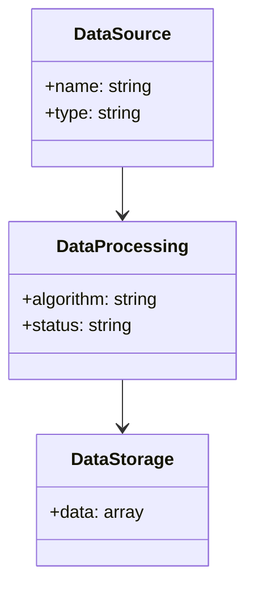
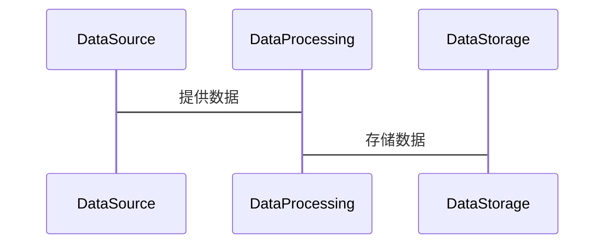

                 


# AI Agent在企业数据治理与质量管理中的应用

> 关键词：AI Agent，企业数据治理，数据质量管理，数据治理框架，数据质量管理工具，AI驱动的数据治理

> 摘要：AI Agent在企业数据治理与质量管理中的应用，探讨了如何利用人工智能代理技术提升企业数据管理的效率和质量。文章从AI Agent的基本概念出发，分析了数据治理与质量管理的背景需求，详细阐述了AI Agent的核心原理与算法，设计了系统的架构与功能模块，并通过项目实战案例展示了AI Agent在实际应用中的具体实施步骤。最后，总结了AI Agent在企业数据治理与质量管理中的优势与挑战，提出了未来的发展方向。

---

# 第一部分: AI Agent与企业数据治理概述

# 第1章: AI Agent与企业数据治理概述

## 1.1 AI Agent的基本概念

### 1.1.1 AI Agent的定义与特点

AI Agent（人工智能代理）是指一种能够感知环境、自主决策并执行任务的智能实体。与传统的自动化系统不同，AI Agent具备以下特点：

1. **自主性**：AI Agent能够在没有外部干预的情况下独立运作。
2. **反应性**：能够实时感知环境变化并做出响应。
3. **学习能力**：通过机器学习算法不断优化自身的决策模型。
4. **协作性**：能够与其他AI Agent或系统进行协作。

### 1.1.2 AI Agent与传统数据治理的区别

传统数据治理依赖于人工操作和规则制定，而AI Agent可以通过自动化的方式实现数据的实时监控、清洗和优化。AI Agent能够显著提高数据治理的效率和准确性，尤其是在处理海量数据时，其优势更加明显。

### 1.1.3 企业数据治理的新范式

随着企业数据量的指数级增长，传统的数据治理方式已经难以应对复杂的数据问题。AI Agent的引入为数据治理提供了新的解决方案，能够实现数据的智能化管理，提升数据质量和价值。

## 1.2 AI Agent在企业数据治理中的应用前景

### 1.2.1 数据治理的潜在应用领域

AI Agent在企业数据治理中的应用领域包括数据清洗、数据集成、数据安全、数据隐私保护等。

### 1.2.2 企业采用AI Agent的优势

1. **提高效率**：AI Agent可以快速处理大量数据，显著提高数据治理的效率。
2. **降低成本**：通过自动化的方式减少人工干预，降低数据治理的成本。
3. **提升准确性**：AI Agent能够通过机器学习算法提高数据处理的准确性。

### 1.2.3 AI Agent应用的挑战与机遇

尽管AI Agent在数据治理中具有诸多优势，但其应用也面临一些挑战，例如数据隐私问题、算法的可解释性等。这些挑战为企业提供了进一步优化AI Agent技术的机会。

## 1.3 本章小结

本章介绍了AI Agent的基本概念及其在企业数据治理中的应用前景，强调了AI Agent在提高数据治理效率和准确性方面的优势。

---

# 第二部分: 数据治理与质量管理的背景与需求

# 第2章: 数据治理与质量管理的背景

## 2.1 数据治理的定义与框架

### 2.1.1 数据治理的核心概念

数据治理是指通过制定政策、流程和技术手段，确保数据的完整性、一致性和可用性。数据治理的核心要素包括数据策略、数据架构、数据安全、数据质量管理等。

### 2.1.2 数据治理的框架与流程

数据治理的框架通常包括数据战略制定、数据架构设计、数据安全与隐私保护、数据质量管理、数据生命周期管理等环节。

### 2.1.3 数据治理的挑战与关键成功因素

数据治理的挑战包括数据孤岛、数据冗余、数据不一致等。成功实施数据治理的关键因素包括企业领导的支持、跨部门协作、技术工具的选型等。

## 2.2 数据质量管理的挑战

### 2.2.1 数据质量管理的重要性

数据质量管理是指通过一系列技术和管理手段，确保数据的准确性、完整性、一致性和及时性。数据质量管理是数据治理的重要组成部分，直接影响企业的决策能力和竞争力。

### 2.2.2 数据质量管理中的常见问题

数据质量管理中的常见问题包括数据清洗、数据标注、数据监控等。

## 2.3 AI Agent在数据治理与质量管理中的作用

### 2.3.1 AI Agent如何解决数据治理问题

AI Agent可以通过实时监控数据源、自动清洗数据、优化数据架构等方式解决数据治理中的诸多问题。

### 2.3.2 AI Agent在数据质量管理中的应用

AI Agent可以用于数据清洗、数据标注、数据监控等任务，显著提高数据质量管理的效率和准确性。

## 2.4 本章小结

本章探讨了数据治理与数据质量管理的背景与需求，强调了AI Agent在数据治理与质量管理中的重要作用。

---

# 第三部分: AI Agent的核心原理与算法

# 第3章: AI Agent的核心原理

## 3.1 AI Agent的感知与决策机制

### 3.1.1 数据感知与分析

AI Agent通过传感器或其他数据源获取数据，并利用机器学习算法进行数据分析，识别数据中的异常和问题。

### 3.1.2 数据处理与决策

基于感知到的数据，AI Agent会利用决策算法制定相应的数据处理策略。

### 3.1.3 数据执行与反馈

AI Agent根据决策结果执行数据操作，并根据反馈进一步优化自身的算法模型。

## 3.2 AI Agent的算法原理

### 3.2.1 强化学习算法

强化学习是一种通过试错机制来优化决策模型的算法。AI Agent可以通过强化学习不断优化自身的数据处理策略。

### 3.2.2 监督学习算法

监督学习是一种基于标注数据进行模型训练的算法。AI Agent可以通过监督学习识别数据中的异常和错误。

### 3.2.3 聚类与分类算法

聚类算法可以将相似的数据点分组，分类算法可以对数据进行分类，从而实现数据的自动清洗和优化。

## 3.3 AI Agent的数学模型与公式

### 3.3.1 强化学习的数学模型

强化学习的数学模型通常包括状态空间、动作空间、奖励函数等。例如，Q-learning算法的更新公式为：

$$ Q(s, a) = Q(s, a) + \alpha [r + \gamma \max Q(s', a) - Q(s, a)] $$

其中，$\alpha$是学习率，$\gamma$是折扣因子。

---

# 第四部分: 系统分析与架构设计方案

# 第4章: 系统架构设计

## 4.1 项目介绍

本项目旨在开发一个基于AI Agent的企业数据治理与质量管理平台，实现数据的智能化管理。

## 4.2 系统功能设计

### 4.2.1 领域模型设计

通过Mermaid类图展示了系统的领域模型，包括数据源、数据处理模块、数据存储模块等。



### 4.2.2 系统架构设计

通过Mermaid架构图展示了系统的整体架构，包括前端、后端和数据库等模块。


### 4.2.3 系统接口设计

系统接口设计包括数据获取接口、数据处理接口和数据存储接口等。

### 4.2.4 系统交互设计

通过Mermaid序列图展示了系统的主要交互流程，包括数据获取、数据处理、数据存储等步骤。



## 4.3 本章小结

本章详细设计了AI Agent驱动的企业数据治理与质量管理系统的架构与功能模块。

---

# 第五部分: 项目实战

# 第5章: 项目实战

## 5.1 环境安装

安装Python、TensorFlow、Keras等必要的工具和库。

## 5.2 系统核心实现源代码

以下是AI Agent的核心代码示例：

```python
class AI-Agent:
    def __init__(self):
        self.model = self.build_model()

    def build_model(self):
        # 构建神经网络模型
        pass

    def perceive(self, data):
        # 数据感知与分析
        pass

    def decide(self, state):
        # 数据处理与决策
        pass

    def execute(self, action):
        # 数据操作与反馈
        pass
```

## 5.3 代码应用解读与分析

对上述代码进行详细解读，说明各部分的功能和实现方式。

## 5.4 实际案例分析和详细讲解剖析

通过具体案例分析AI Agent在数据治理中的应用，例如数据清洗、数据标注等任务。

## 5.5 项目小结

总结项目实现的关键点和经验教训。

---

# 第六部分: 最佳实践与总结

# 第6章: 最佳实践与总结

## 6.1 最佳实践

### 6.1.1 系统设计中的注意事项

在设计AI Agent驱动的系统时，需要注意数据隐私、算法可解释性等问题。

### 6.1.2 项目实施中的注意事项

在项目实施过程中，需要注重团队协作、技术支持和持续优化。

## 6.2 小结

总结全文，强调AI Agent在企业数据治理与质量管理中的重要作用和应用前景。

## 6.3 未来发展方向

展望AI Agent在数据治理与质量管理中的未来发展方向，例如多模态数据处理、自适应算法优化等。

## 6.4 扩展阅读

推荐相关领域的书籍和论文，供读者进一步学习。

---

# 附录

## 附录A: 工具与API介绍

介绍常用的AI工具和API，如TensorFlow、PyTorch等。

## 附录B: 参考文献

列出本文参考的主要文献和资料。

---

# 作者：AI天才研究院 & 禅与计算机程序设计艺术

