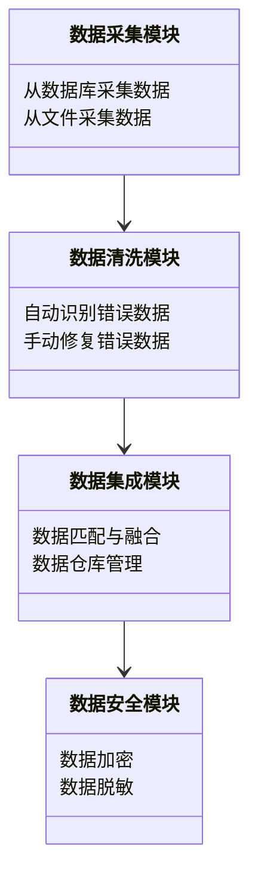
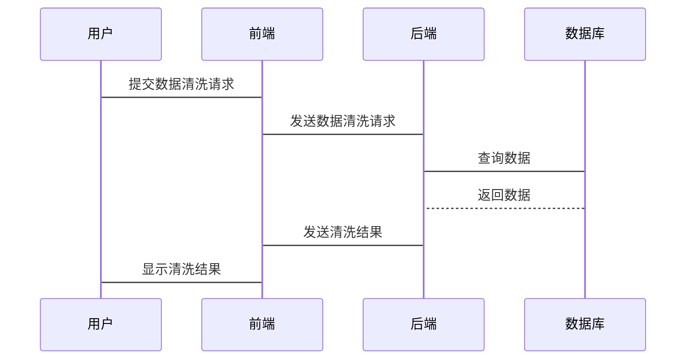

                 


# AI Agent在企业数据质量管理与治理中的全面应用

> **关键词：** 数据质量管理、AI Agent、企业数据治理、数据清洗、数据集成

> **摘要：**  
> 本文全面探讨AI Agent在企业数据质量管理与治理中的应用，从理论基础到实际案例，详细分析了AI Agent如何提升数据质量管理的效率和准确性。文章首先介绍了数据质量管理的核心概念与挑战，随后深入解析了AI Agent的基本原理及其在数据清洗、数据集成、数据安全等环节中的具体应用。通过算法原理、系统架构设计和项目实战的详细讲解，本文为读者提供了从理论到实践的完整指导。最后，文章总结了AI Agent在企业数据治理中的应用前景，并提出了相应的最佳实践建议。

---

## 第1章: 数据质量管理与治理的背景与挑战

### 1.1 数据质量管理的定义与重要性

数据质量管理（Data Quality Management，DQM）是确保数据的准确性、完整性、一致性、及时性和可追溯性的过程。在企业信息化建设中，数据质量管理是数据治理的核心任务之一。随着企业规模的扩大和业务复杂度的增加，数据质量问题变得越来越重要。高质量的数据是企业决策的基石，直接影响企业的运营效率和竞争力。

**核心概念：**  
- **准确性：** 数据反映真实情况的能力。  
- **完整性：** 数据是否包含所有必要信息。  
- **一致性：** 数据在不同系统中的格式和含义是否统一。  
- **及时性：** 数据是否反映了最新的业务状态。  
- **可追溯性：** 数据的来源和修改历史是否可查。

### 1.2 企业数据质量管理的挑战

企业在数据质量管理中面临的主要挑战包括：

1. **数据孤岛问题：** 数据分散在不同的系统中，难以统一管理和分析。  
2. **数据一致性与准确性问题：** 数据在不同系统中的格式和内容可能不一致，导致数据错误或混淆。  
3. **数据安全与隐私保护：** 数据在采集、存储和使用过程中可能面临泄露或被篡改的风险。  
4. **数据量与复杂度：** 随着大数据技术的应用，企业数据量急剧增加，数据类型也变得多样化，传统的数据管理方法难以应对。

### 1.3 AI Agent在数据质量管理中的应用前景

AI Agent（人工智能代理）是一种能够感知环境、自主决策并执行任务的智能体。AI Agent在数据质量管理中的应用前景广阔，尤其是在数据清洗、数据集成和数据安全等领域。通过AI Agent，企业可以实现数据质量管理的自动化和智能化，显著提高效率和准确性。

---

## 第2章: 数据质量管理的核心概念与框架

### 2.1 数据质量管理的理论基础

数据质量管理的理论基础主要包括数据生命周期模型和数据质量管理的维度与指标。

**数据生命周期模型：** 数据从生成、存储、处理到最终归档或销毁的整个过程。数据质量管理贯穿数据生命周期的每个阶段。

**数据质量管理的维度与指标：**  
- **准确性：** 数据是否真实反映业务事实。  
- **完整性：** 数据是否包含所有必要信息。  
- **一致性：** 数据在不同系统中的格式和含义是否统一。  
- **及时性：** 数据是否反映了最新的业务状态。  
- **安全性：** 数据是否受到适当的安全保护。

### 2.2 数据治理的框架与体系

数据治理的框架与体系包括数据治理的目标与范围、组织结构与责任分配、政策与标准。

**数据治理的目标与范围：** 数据治理的目标是确保数据的准确、完整、一致和安全。其范围包括数据的采集、存储、处理、分析和应用。

**数据治理的组织结构与责任分配：** 数据治理需要明确责任分工，通常包括数据治理委员会、数据管理员、技术部门和业务部门。

**数据治理的政策与标准：** 数据治理需要制定统一的政策和标准，确保数据管理的规范性和一致性。

### 2.3 数据质量管理与数据治理的关系

数据质量管理是数据治理的重要组成部分，数据治理为数据质量管理提供政策、组织和资源支持。数据质量管理则是数据治理的具体实施手段。

---

## 第3章: AI Agent在数据质量管理中的核心原理

### 3.1 AI Agent的基本原理

AI Agent的基本原理包括感知、决策和执行三个阶段。AI Agent通过感知环境获取信息，基于预设的规则或机器学习模型做出决策，并通过执行模块完成任务。

### 3.2 数据质量管理中的AI Agent模型

在数据质量管理中，AI Agent可以用于数据清洗、数据集成和数据安全等多个环节。

**数据清洗模型：** AI Agent通过机器学习算法自动识别和修复数据中的错误和异常值。

**数据集成模型：** AI Agent通过数据匹配和融合技术，将分散在不同系统中的数据集成到统一的数据仓库中。

**数据安全模型：** AI Agent通过数据加密和访问控制技术，确保数据的安全性和隐私性。

### 3.3 AI Agent在数据质量管理中的应用案例

**数据清洗案例：** 某银行通过AI Agent自动识别客户信息中的重复和错误数据，提高了数据清洗的效率和准确性。

**数据集成案例：** 某企业通过AI Agent将分散在不同部门的销售数据集成到统一的分析平台，提高了数据分析的效率。

**数据安全案例：** 某医疗机构通过AI Agent对患者数据进行脱敏处理，确保数据的安全性和隐私性。

---

## 第4章: 数据质量管理的算法原理与实现

### 4.1 数据清洗算法

**数据清洗的基本步骤：** 数据清洗包括数据清洗规则的制定、异常值识别和数据修复。

**基于规则的数据清洗算法：** 通过预设的规则（如正则表达式）识别和修复数据中的错误。

**基于机器学习的数据清洗算法：** 使用监督学习模型识别数据中的异常值，并自动修复。

### 4.2 数据集成算法

**数据集成的基本概念：** 数据集成是将分散在不同系统中的数据整合到统一的数据仓库中。

**数据清洗与数据集成的区别与联系：** 数据清洗关注数据的质量，数据集成关注数据的整合。

**数据集成的主流算法：** 包括基于规则的匹配算法和基于机器学习的匹配算法。

### 4.3 数据安全与隐私保护算法

**数据脱敏的基本原理：** 通过数据匿名化技术（如替换、加密和泛化）保护敏感数据。

**数据加密与解密算法：** 使用对称加密和非对称加密技术保护数据的安全性。

**数据访问控制算法：** 基于角色的访问控制（RBAC）模型，确保只有授权用户可以访问敏感数据。

---

## 第5章: 数据质量管理的系统分析与架构设计

### 5.1 问题场景介绍

某企业面临数据孤岛、数据不一致和数据安全等问题，希望通过AI Agent实现数据质量管理的自动化和智能化。

### 5.2 系统功能设计

**领域模型设计：** 使用Mermaid类图展示系统的主要功能模块，包括数据采集、数据清洗、数据集成和数据安全。



### 5.3 系统架构设计

**系统架构设计：** 使用Mermaid架构图展示系统的整体架构，包括前端、后端和数据库。

```mermaid
archi
    位置 right
    节点 前端 {
        类型 browser
        组件 前端界面
    }
    节点 后端 {
        类型 server
        组件 数据清洗模块
        组件 数据集成模块
        组件 数据安全模块
    }
    节点 数据库 {
        类型 database
        组件 数据仓库
    }
    前端 --> 后端
    后端 --> 数据库
```

### 5.4 系统接口设计

**系统接口设计：** 使用Mermaid序列图展示系统的主要接口和交互流程。



---

## 第6章: 数据质量管理的项目实战

### 6.1 环境配置

**环境配置：** 需要安装Python、Jupyter Notebook和相关数据处理库（如pandas、numpy、scikit-learn）。

### 6.2 系统核心实现源代码

**数据清洗代码：**

```python
import pandas as pd
from sklearn.model_selection import train_test_split
from sklearn.linear_model import LinearRegression

# 数据清洗
def data_cleaning(data):
    # 处理缺失值
    data = data.dropna()
    # 处理异常值
    for column in data.columns:
        if data[ column ].dtype == 'float64':
            q_low = data[ column ].quantile(0.05)
            q_high = data[ column ].quantile(0.95)
            data[ column ] = data[ column ].where(data[ column ].between(q_low, q_high), inplace=False)
    return data

# 数据集成
def data_integrate(data1, data2):
    # 数据匹配
    merged_data = pd.merge(data1, data2, on='id', how='left')
    return merged_data

# 数据安全
def data_security(data):
    # 数据脱敏
    data['name'] = data['name'].apply(lambda x: '***' if x else x)
    return data

# 测试代码
if __name__ == "__main__":
    data1 = pd.DataFrame({'id': [1, 2, 3], 'name': ['Alice', 'Bob', 'Charlie']})
    data2 = pd.DataFrame({'id': [1, 3, 4], 'age': [25, 30, 35]})
    cleaned_data = data_cleaning(data1)
    integrated_data = data_integrate(cleaned_data, data2)
    secure_data = data_security(integrated_data)
    print(secure_data)
```

### 6.3 代码应用解读与分析

**代码解读：**  
- `data_cleaning`函数：用于处理缺失值和异常值。  
- `data_integrate`函数：用于数据集成，通过左连接合并两个数据集。  
- `data_security`函数：用于数据脱敏，将姓名字段替换为星号。  

### 6.4 实际案例分析

**案例分析：** 某银行客户数据治理项目中，通过上述代码实现了客户数据的清洗、集成和脱敏，显著提高了数据质量。

### 6.5 项目小结

通过项目实战，我们验证了AI Agent在数据质量管理中的有效性。数据清洗、数据集成和数据安全模块的实现，为企业数据治理提供了有力支持。

---

## 第7章: 数据质量管理的最佳实践与总结

### 7.1 小结

AI Agent在企业数据质量管理中的应用前景广阔。通过自动化和智能化的数据清洗、数据集成和数据安全技术，企业可以显著提高数据质量管理的效率和准确性。

### 7.2 注意事项

在实际应用中，需要注意以下几点：  
1. 数据清洗规则需要根据具体业务需求定制。  
2. 数据集成需要确保数据的准确性和一致性。  
3. 数据安全需要遵循相关法律法规和企业政策。

### 7.3 拓展阅读

1. 《数据质量管理：理论与实践》  
2. 《人工智能在数据治理中的应用》  
3. 《数据安全与隐私保护技术》  

---

## 作者：AI天才研究院/AI Genius Institute & 禅与计算机程序设计艺术 /Zen And The Art of Computer Programming

---

**本文为AI天才研究院原创，转载请注明出处。**

