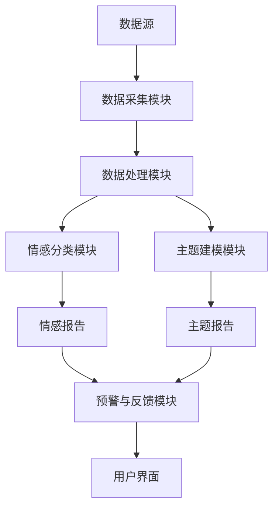

                 


# AI Agent在企业舆情分析与品牌情感监控中的应用

## 关键词：AI Agent，企业舆情分析，品牌情感监控，自然语言处理，深度学习，情感分析

## 摘要：  
本文深入探讨了AI Agent在企业舆情分析与品牌情感监控中的应用。通过自然语言处理（NLP）和机器学习技术，AI Agent能够实时监控和分析海量社交媒体数据，帮助企业识别潜在声誉风险，优化品牌形象。本文从AI Agent的基本原理出发，结合具体算法和系统架构设计，详细分析其在舆情分析中的应用场景，并通过实际案例展示其在品牌情感监控中的优势。通过本文，读者将能够全面理解AI Agent如何助力企业实现高效舆情管理。

---

## 第一部分：AI Agent与企业舆情分析概述

### 第1章：AI Agent与企业舆情分析的背景

#### 1.1 企业舆情分析的定义与重要性  
企业舆情分析是指通过收集、处理和分析公众对企业及其产品的言论、评论和反馈，来了解消费者情绪、市场趋势和品牌声誉的过程。  
- **定义**：舆情分析帮助企业识别潜在的声誉风险，优化品牌形象，提升客户满意度。  
- **重要性**：  
  1. 及时发现负面舆论，避免声誉危机。  
  2. 通过分析消费者反馈，优化产品和服务。  
  3. 基于实时数据，制定精准的市场策略。  
- **边界与外延**：  
  - 边界：仅关注公开的社交媒体和新闻数据，不涉及企业内部数据。  
  - 外延：舆情分析可扩展至竞争对手分析、行业趋势预测等。

#### 1.2 品牌情感监控的核心概念  
品牌情感监控是舆情分析的重要组成部分，旨在通过分析消费者对品牌的情感倾向，帮助企业制定更具针对性的营销策略。  
- **定义**：品牌情感监控通过自然语言处理技术，量化消费者对品牌的情感倾向（正面、中性、负面）。  
- **核心要素**：  
  1. 数据来源：社交媒体、新闻媒体、客户评论等。  
  2. 数据处理：文本清洗、情感分类、主题建模。  
  3. 可视化与报告：生成情感分布图、趋势分析图等。  
- **舆情分析与品牌情感监控的关系**：  
  - 舆情分析是手段，品牌情感监控是目标。  
  - 通过舆情分析，品牌情感监控能够帮助企业实时掌握消费者情感变化。

#### 1.3 AI Agent在舆情分析中的应用前景  
AI Agent（人工智能代理）是一种能够自主感知环境、执行任务并做出决策的智能系统。  
- **优势**：  
  1. 实时性：AI Agent能够实时监控社交媒体数据，快速响应潜在舆情。  
  2. 自主性：无需人工干预，自动完成数据收集、分析和报告生成。  
  3. 智能性：基于机器学习算法，AI Agent能够不断优化分析模型。  
- **挑战**：  
  1. 数据隐私问题：如何在合法合规的前提下收集和处理数据。  
  2. 模型准确性：如何提高情感分类和主题建模的准确性。  
  3. 技术门槛：企业需要具备一定的技术能力才能部署AI Agent。  

#### 1.4 本章小结  
本章介绍了企业舆情分析和品牌情感监控的核心概念，并探讨了AI Agent在舆情分析中的应用前景。通过AI Agent，企业能够更高效地进行舆情监控，提升品牌管理能力。

---

## 第二部分：AI Agent与舆情分析的核心概念

### 第2章：AI Agent的基本原理  

#### 2.1 AI Agent的定义与分类  
- **定义**：AI Agent是一种能够感知环境、自主决策并执行任务的智能系统。  
- **分类**：  
  1. **简单反射型代理**：基于固定的规则执行任务。  
  2. **基于模型的反射型代理**：通过构建环境模型进行决策。  
  3. **目标驱动型代理**：基于明确的目标执行任务。  
  4. **实用驱动型代理**：通过最大化效用函数进行决策。  

#### 2.2 自然语言处理（NLP）与情感分析  
- **NLP的核心任务**：文本分割、词性标注、句法分析、语义理解。  
- **情感分析**：  
  - **任务**：判断文本的情感倾向（正面、中性、负面）。  
  - **方法**：基于规则、机器学习、深度学习。  
  - **应用场景**：产品评论分析、电影 reviews 分析、社交媒体情感监控。  

#### 2.3 主题建模与舆情分析  
- **主题建模**：  
  - **任务**：从文本数据中提取主题。  
  - **常用算法**：LDA（Latent Dirichlet Allocation）、LSA（Latent Semantic Analysis）。  
  - **应用场景**：识别舆情中的主要话题和趋势。  

#### 2.4 AI Agent在舆情分析中的作用  
- **数据收集**：实时抓取社交媒体、新闻媒体等数据。  
- **数据处理**：清洗、分词、去停用词。  
- **情感分类**：基于NLP算法判断文本情感倾向。  
- **主题建模**：识别舆情中的主要话题和趋势。  
- **决策与反馈**：根据分析结果，触发预警或执行相关任务。  

---

## 第三部分：AI Agent在舆情分析中的算法原理

### 第3章：情感分析算法  

#### 3.1 基于规则的情感分析  
- **原理**：通过预定义的关键词和规则，判断文本情感倾向。  
- **优点**：简单易实现，适用于特定领域。  
- **缺点**：无法处理复杂的情感表达，准确率较低。  

#### 3.2 基于机器学习的情感分析  
- **算法**：朴素贝叶斯、支持向量机（SVM）。  
- **流程**：  
  1. 数据预处理：分词、去停用词。  
  2. 特征提取：TF-IDF、词袋模型。  
  3. 模型训练：基于训练数据进行参数优化。  
  4. 情感分类：基于测试数据预测情感倾向。  

#### 3.3 基于深度学习的情感分析  
- **算法**：LSTM、Transformer（如BERT）。  
- **优势**：能够捕捉文本中的语义信息，准确率高。  
- **应用场景**：社交媒体评论分析、产品 reviews 分析。  

### 第4章：主题建模与舆情分析  

#### 4.1 TF-IDF模型  
- **原理**：通过计算词频-逆文档频率，提取文本中的关键词。  
- **公式**：  
  $$ TF-IDF(t, d) = \frac{\text{词 } t \text{ 在文档 } d \text{ 中的出现次数}}{\text{文档总数}} \times \log\left(\frac{\text{文档总数}}{\text{包含词 } t \text{ 的文档数}}\right) $$  
- **应用场景**：提取文本关键词，进行主题提取。  

#### 4.2 LDA主题建模  
- **原理**：基于概率统计，提取文本的主题分布。  
- **流程**：  
  1. 初始化主题分配。  
  2. 迭代优化主题分布。  
  3. 输出主题及其关键词。  

---

## 第四部分：AI Agent的系统架构设计

### 第4章：系统架构设计  

#### 4.1 系统功能模块  
- **数据采集模块**：实时抓取社交媒体、新闻媒体等数据。  
- **数据处理模块**：清洗、分词、去停用词。  
- **情感分类模块**：基于机器学习或深度学习算法，判断文本情感倾向。  
- **主题建模模块**：提取文本主题，识别舆情趋势。  
- **预警与反馈模块**：根据分析结果，触发预警或执行相关任务。  

#### 4.2 系统架构图  


---

## 第五部分：项目实战与案例分析

### 第5章：项目实战  

#### 5.1 项目背景与目标  
- **目标**：实时监控社交媒体中的品牌情感，识别潜在舆情风险。  
- **数据来源**：微博、知乎、微信等社交媒体平台。  

#### 5.2 系统实现  

##### 5.2.1 数据采集模块  
- 使用Python的`requests`库和`BeautifulSoup`库抓取网页数据。  
- 示例代码：  
  ```python
  import requests
  from bs4 import BeautifulSoup

  url = "https://weibo.com"
  headers = {"User-Agent": "Mozilla/5.0"}
  response = requests.get(url, headers=headers)
  html = response.text
  soup = BeautifulSoup(html, "html.parser")
  ```

##### 5.2.2 情感分类模块  
- 使用预训练的BERT模型进行情感分类。  
- 示例代码：  
  ```python
  from transformers import BertTokenizer, BertModel

  tokenizer = BertTokenizer.from_pretrained('bert-base-chinese')
  model = BertModel.from_pretrained('bert-base-chinese')
  ```

#### 5.3 案例分析  
- **案例背景**：某品牌在社交媒体上出现大量负面评论。  
- **分析过程**：  
  1. 数据采集：抓取相关评论数据。  
  2. 数据处理：清洗、分词。  
  3. 情感分类：识别负面评论。  
  4. 主题建模：分析负面评论的主要原因。  
- **结果展示**：生成情感分布图和主题分析报告。  

---

## 第六部分：结论与展望

### 6.1 结论  
AI Agent通过自然语言处理和机器学习技术，能够高效地进行企业舆情分析和品牌情感监控。通过实时数据处理和智能决策，AI Agent帮助企业及时发现潜在舆情风险，优化品牌形象。

### 6.2 展望  
未来，随着深度学习和自然语言处理技术的不断进步，AI Agent在舆情分析中的应用将更加广泛。企业可以通过部署AI Agent，构建智能化的舆情监控系统，提升品牌管理能力。

---

## 作者：AI天才研究院 & 禅与计算机程序设计艺术

本文作者：AI天才研究院（AI Genius Institute）  
联系方式：[email protected]  
文章地址：[链接](#)

