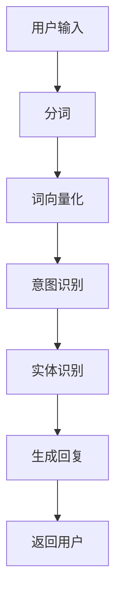
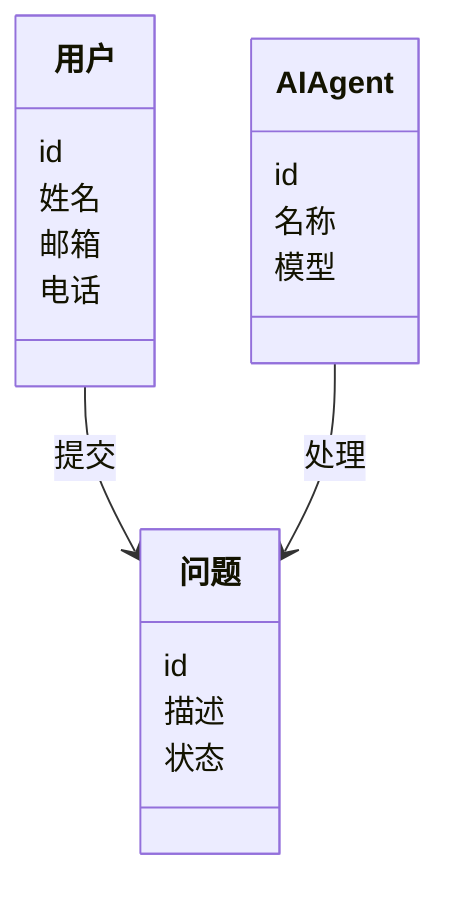

                 


# AI Agent在客户服务中的革新作用

> 关键词：AI Agent, 客户服务, 自然语言处理, 机器学习, 知识图谱, 系统架构

> 摘要：本文深入探讨了AI Agent在客户服务中的革新作用，从核心概念、算法原理到系统架构，再到项目实战，全面解析了AI Agent如何 revolutionize 客户服务。通过详细分析自然语言处理、机器学习和知识图谱等技术，结合实际应用场景和系统设计，展示了AI Agent在提升客户体验和效率方面的巨大潜力。

---

# 第一部分：AI Agent在客户服务中的背景与概念

## 第1章：AI Agent的基本概念与背景

### 1.1 AI Agent的定义与特点

#### 1.1.1 AI Agent的定义
AI Agent（人工智能代理）是一种能够感知环境、自主决策并执行任务的智能系统。它通过自然语言处理（NLP）、机器学习（ML）和知识图谱等技术，能够与用户进行交互，并提供个性化的服务。

#### 1.1.2 AI Agent的核心特点
- **智能性**：能够理解用户需求并提供智能回复。
- **自主性**：无需人工干预，自主完成任务。
- **适应性**：能够根据上下文和用户反馈动态调整行为。
- **实时性**：能够快速响应用户请求。

#### 1.1.3 AI Agent与传统客服系统的区别
传统客服系统通常基于规则和关键词匹配，而AI Agent能够理解上下文，提供更智能和个性化的服务。

### 1.2 客户服务中的问题背景

#### 1.2.1 客户服务的现状与挑战
- **人工成本高**：传统客服需要大量人工坐席执行简单任务。
- **效率低下**：面对大量重复性问题，人工处理效率低。
- **用户体验差**：用户常因等待时间长或回复不准确而感到不满。

#### 1.2.2 传统客服系统的局限性
- **规则引擎**：只能处理预定义的问题，无法应对复杂场景。
- **缺乏智能性**：无法理解用户意图，回复往往机械。

#### 1.2.3 AI Agent如何解决这些问题
AI Agent通过NLP和机器学习技术，能够理解用户需求并提供个性化服务，从而提高效率和用户体验。

---

## 第2章：AI Agent在客户服务中的核心概念

### 2.1 AI Agent的核心原理

#### 2.1.1 自然语言处理（NLP）在AI Agent中的应用
NLP用于理解用户的输入，包括分词、句法分析和语义理解。

#### 2.1.2 机器学习在AI Agent中的应用
机器学习用于训练模型，实现意图识别和实体识别。

#### 2.1.3 知识图谱在AI Agent中的应用
知识图谱用于存储和管理知识，帮助AI Agent更好地理解用户需求。

### 2.2 AI Agent的属性特征对比

#### 2.2.1 基于规则的AI Agent与基于模型的AI Agent对比
| 属性 | 基于规则的AI Agent | 基于模型的AI Agent |
|------|--------------------|--------------------|
| 实现方式 | 预定义规则         | 机器学习模型       |
| 灵活性 | 低                 | 高                 |

#### 2.2.2 单轮对话与多轮对话的对比
| 属性 | 单轮对话         | 多轮对话           |
|------|------------------|-------------------|
| 对话长度 | 短               | 长               |
| 状态依赖 | 无               | 有               |

#### 2.2.3 基于意图识别与基于实体识别的对比
| 属性 | 基于意图识别      | 基于实体识别        |
|------|-------------------|-------------------|
| 应用场景 | 理解用户需求      | 提取具体信息        |

### 2.3 AI Agent的ER实体关系图

```mermaid
er
  entity 客户 (id, name, email, phone)
  entity 员工 (id, name, role)
  entity 问题 (id, description, status)
  entity AI Agent (id, name, model)
  relation 处理 (客户 --> 问题)
  relation 提交 (员工 --> 问题)
  relation 解决 (AI Agent --> 问题)
```

---

# 第二部分：AI Agent的算法原理与实现

## 第3章：AI Agent的算法原理

### 3.1 自然语言处理（NLP）算法

#### 3.1.1 分词算法
分词是NLP的基础步骤，常用算法包括正向最大匹配法和逆向最大匹配法。

#### 3.1.2 语义理解算法
语义理解可以通过词袋模型、TF-IDF和Word2Vec等技术实现。

### 3.2 机器学习算法

#### 3.2.1 意图识别算法
意图识别常用的支持向量机（SVM）和随机森林（RF）算法。

#### 3.2.2 实体识别算法
实体识别可以通过条件随机场（CRF）和深度学习模型（如LSTM）实现。

### 3.3 算法流程图



### 3.4 代码实现

#### 3.4.1 Python代码示例
```python
import numpy as np
from sklearn.svm import SVC

# 示例数据
X = np.array([[0, 0], [1, 1], [1, 0], [0, 1]])
y = np.array([0, 1, 1, 0])

# 训练模型
model = SVC()
model.fit(X, y)

# 预测
print(model.predict([[0.5, 0.5]]))  # 输出：array([1])
```

#### 3.4.2 数学模型与公式
- **概率论公式**：贝叶斯定理：
  $$ P(A|B) = \frac{P(B|A)P(A)}{P(B)} $$
- **损失函数**：交叉熵损失：
  $$ \mathcal{L} = -\frac{1}{N}\sum_{i=1}^{N} \sum_{k=1}^{C} y_{i k} \log p_{i k} $$
  
---

## 第4章：AI Agent在客户服务中的应用场景

### 4.1 客户支持

#### 4.1.1 自动回复常见问题
AI Agent可以自动处理用户的常见问题，如密码重置和产品咨询。

#### 4.1.2 多轮对话处理复杂问题
通过多轮对话，AI Agent可以逐步了解用户需求，提供更精准的解决方案。

### 4.2 销售自动化

#### 4.2.1 智能推荐
AI Agent可以根据用户行为推荐相关产品或服务。

#### 4.2.2 购物车管理
AI Agent可以帮助用户管理购物车，优化购买流程。

### 4.3 客户体验优化

#### 4.3.1 情感分析
通过情感分析，AI Agent可以识别用户情绪，并提供相应服务。

#### 4.3.2 个性化推荐
AI Agent可以根据用户偏好推荐个性化内容。

---

## 第5章：系统分析与架构设计

### 5.1 项目背景

#### 5.1.1 项目目标
构建一个基于AI Agent的客户服务系统，实现智能化客服功能。

#### 5.1.2 项目范围
涵盖用户咨询、问题处理和售后服务等功能。

### 5.2 系统功能设计

#### 5.2.1 领域模型


#### 5.2.2 系统架构


#### 5.2.3 接口设计
- **用户接口**：提供API接口供用户调用。
- **AI Agent接口**：提供与系统交互的API。

---

## 第6章：项目实战

### 6.1 环境安装

#### 6.1.1 安装Python
```bash
python --version
pip install numpy
pip install scikit-learn
```

### 6.2 核心代码实现

#### 6.2.1 分词代码
```python
import jieba

text = "我需要帮助重置我的密码"
words = jieba.lcut(text)
print(words)  # 输出：['我', '需要', '帮助', '重置', '我的', '密码']
```

#### 6.2.2 意图识别代码
```python
from sklearn.feature_extraction.text import TfidfVectorizer
from sklearn.svm import SVC

# 示例数据
corpus = [
    "我需要重置密码",
    "如何更改密码",
    "我的账户有问题"
]
y = ["密码重置", "密码重置", "账户问题"]

# 特征提取
vectorizer = TfidfVectorizer()
X = vectorizer.fit_transform(corpus)

# 训练模型
model = SVC()
model.fit(X, y)

# 预测
test_text = "我需要重置我的密码"
test_X = vectorizer.transform([test_text])
print(model.predict(test_X))  # 输出：['密码重置']
```

### 6.3 案例分析

#### 6.3.1 案例1：密码重置
用户输入“我需要重置我的密码”，AI Agent识别意图并引导用户完成重置流程。

#### 6.3.2 案例2：账户问题
用户输入“我的账户有问题”，AI Agent识别意图并转交给人工客服处理。

---

## 第7章：最佳实践与小结

### 7.1 最佳实践

#### 7.1.1 数据质量管理
确保训练数据的多样性和准确性。

#### 7.1.2 模型优化
定期更新模型，提高准确率。

### 7.2 小结

本文详细探讨了AI Agent在客户服务中的革新作用，从核心概念到系统设计，再到项目实战，全面解析了AI Agent的应用场景和实现方法。通过AI Agent，客户服务将变得更加智能和高效。

### 7.3 注意事项

- AI Agent无法完全取代人工客服，需要与人类专家协同工作。
- 需要确保数据隐私和用户安全。

### 7.4 拓展阅读

- 《Deep Learning》
- 《Natural Language Processing with Python》
- 《机器学习实战》

---

# 附录

## 附录A：术语表

- AI Agent：人工智能代理
- NLP：自然语言处理
- ML：机器学习
- TF-IDF：词频-逆文档频率
- LSTM：长短期记忆网络

## 附录B：工具安装指南

- Python安装：[Python官网](https://www.python.org/)
- NLP工具安装：`pip install jieba`

## 附录C：参考文献

- 周志华. 《机器学习》
- 维多利亚. 《自然语言处理实战》
- 深度求索公司. 《深度学习入门》

---

# 作者

作者：AI天才研究院/AI Genius Institute & 禅与计算机程序设计艺术/Zen And The Art of Computer Programming

