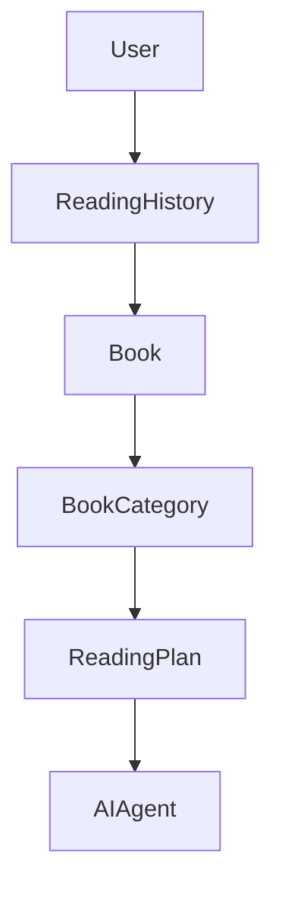
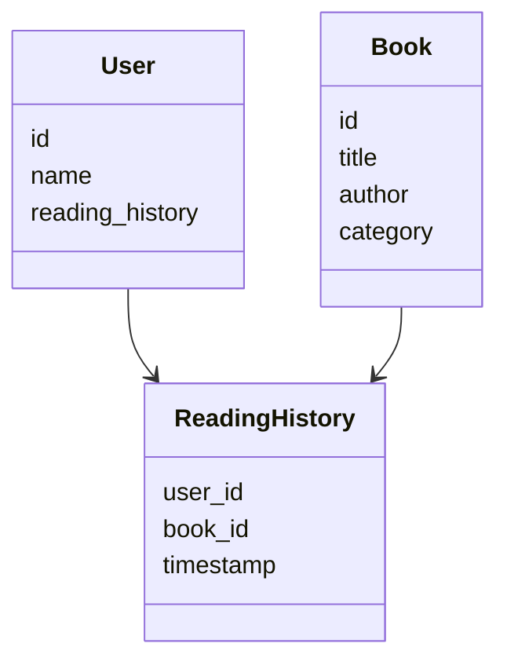
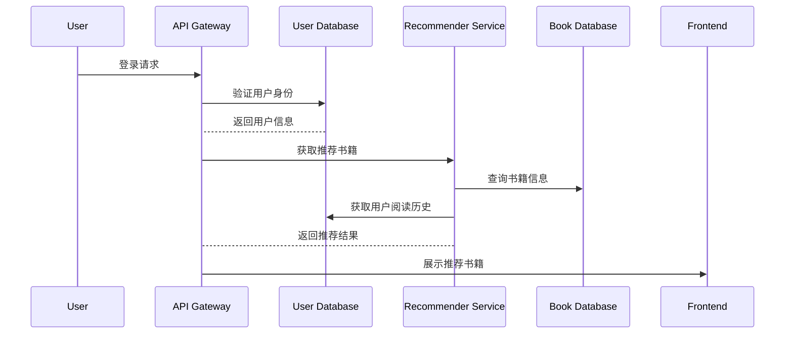

                 


# AI Agent在智能书立中的阅读习惯培养

## 关键词：AI Agent, 智能书立, 阅读习惯, 个性化推荐, 机器学习

## 摘要：
本文探讨了AI Agent在智能书立中的应用，特别是如何通过AI技术帮助用户培养良好的阅读习惯。文章从AI Agent的基本概念出发，分析其在阅读习惯培养中的作用，详细讲解推荐算法、系统架构设计及实际案例，最后总结最佳实践。

---

# 第一部分: AI Agent与智能书立的背景介绍

## 第1章: AI Agent的基本概念

### 1.1 什么是AI Agent
#### 1.1.1 AI Agent的定义
AI Agent（人工智能代理）是指能够感知环境、做出决策并执行任务的智能体。它通过数据驱动的方法，为用户提供个性化服务。

#### 1.1.2 AI Agent的核心特征
- **自主性**：能够独立完成任务。
- **反应性**：能够实时感知并做出反应。
- **学习能力**：能够通过数据优化自身行为。

#### 1.1.3 AI Agent与传统软件的区别
| 特性       | 传统软件          | AI Agent          |
|------------|-------------------|-------------------|
| 行为方式     | 预定义流程         | 自适应学习         |
| 决策机制     | 程序逻辑           | 数据驱动决策       |
| 用户交互     | 单向输入输出         | 双向互动与反馈     |

### 1.2 智能书立的定义与应用场景
#### 1.2.1 智能书立的概念
智能书立是一种结合AI技术的数字阅读平台，通过AI Agent为用户提供个性化的阅读推荐和阅读习惯培养服务。

#### 1.2.2 智能书立的主要功能
- **个性化推荐**：根据用户的阅读历史和偏好，推荐书籍。
- **阅读习惯培养**：通过数据分析和反馈机制，帮助用户形成良好的阅读习惯。
- **知识管理**：提供笔记、摘录和知识整理功能。

#### 1.2.3 智能书立的用户群体与市场定位
智能书立主要面向学生、教师、终身学习者和阅读爱好者，市场定位集中在教育科技和数字阅读领域。

---

## 第2章: AI Agent在阅读习惯培养中的作用

### 2.1 阅读习惯培养的重要性
#### 2.1.1 阅读习惯对个人成长的影响
良好的阅读习惯能够提升知识吸收效率，拓展视野，培养批判性思维。

#### 2.1.2 阅读习惯在教育中的地位
阅读是学习的基础，良好的阅读习惯有助于学生更好地掌握知识。

#### 2.1.3 阅读习惯与终身学习的关系
在信息爆炸的时代，阅读习惯是持续学习和适应变化的关键。

### 2.2 AI Agent如何辅助阅读习惯培养
#### 2.2.1 AI Agent在阅读习惯中的角色
- **数据采集**：收集用户的阅读行为数据。
- **分析与反馈**：通过数据分析优化用户的阅读习惯。
- **个性化推荐**：根据用户的兴趣和习惯推荐书籍。

#### 2.2.2 AI Agent的核心功能与服务
- **阅读计划制定**：根据用户的时间和兴趣，制定个性化的阅读计划。
- **阅读提醒**：通过推送通知提醒用户坚持阅读。
- **阅读效果评估**：分析用户的阅读进度和效果，提供反馈。

#### 2.2.3 AI Agent的优势与局限性
| 优势         | 局限性          |
|--------------|----------------|
| 高度个性化     | 数据隐私问题     |
| 自适应能力     | 算法复杂性       |
| 高效性         | 需要大量数据支持   |

---

# 第二部分: AI Agent的核心概念与联系

## 第3章: AI Agent的核心原理

### 3.1 AI Agent的感知机制
#### 3.1.1 数据采集与分析
通过用户的行为数据（如阅读时间、阅读速度、偏好等）进行分析，提取用户的阅读习惯特征。

#### 3.1.2 用户行为分析
利用自然语言处理技术分析用户的阅读内容，提取关键词和主题，帮助理解用户的阅读兴趣。

#### 3.1.3 阅读习惯的建模
通过机器学习算法，将用户的阅读数据转化为数学模型，用于预测用户的阅读偏好。

### 3.2 AI Agent的决策机制
#### 3.2.1 知识库构建与管理
构建包含书籍信息（如主题、作者、出版时间等）的知识库，并通过数据挖掘技术不断优化知识库内容。

#### 3.2.2 推荐算法与策略
常用的推荐算法包括协同过滤和基于内容的推荐：
- 协同过滤：通过用户相似性推荐书籍。
- 基于内容的推荐：根据书籍内容和用户兴趣推荐书籍。

#### 3.2.3 决策模型的优化
通过A/B测试和反馈机制不断优化推荐算法，提升推荐的准确性和用户的满意度。

### 3.3 AI Agent的执行机制
#### 3.3.1 个性化推荐实现
根据用户的阅读习惯和偏好，实时生成个性化的阅读推荐列表。

#### 3.3.2 互动反馈机制
通过用户反馈（如点赞、收藏、评论等）优化推荐算法，提升推荐效果。

#### 3.3.3 阅读习惯的动态调整
根据用户的反馈和行为变化，动态调整阅读计划和推荐策略。

---

## 第4章: AI Agent的核心概念对比

### 4.1 AI Agent与传统推荐系统对比
| 核心概念       | AI Agent             | 传统推荐系统         |
|----------------|----------------------|----------------------|
| 数据来源       | 多模态数据（文本、行为） | 单一数据源           |
| 推荐策略       | 基于深度学习           | 基于规则或统计方法   |
| 适应性         | 高度自适应             | 较低自适应             |

### 4.2 AI Agent与智能书立的实体关系图


---

# 第三部分: 算法原理与系统架构设计

## 第5章: 推荐算法实现

### 5.1 协同过滤算法
#### 5.1.1 协同过滤的实现步骤
1. 数据预处理：收集用户行为数据，构建用户-书籍矩阵。
2. 计算相似度：使用余弦相似度计算用户相似性。
3. 生成推荐：基于相似用户的偏好推荐书籍。

#### 5.1.2 余弦相似度公式
$$ \text{相似度} = \frac{\sum_{i=1}^{n} (u_i \cdot v_i)}{\sqrt{\sum_{i=1}^{n} u_i^2} \cdot \sqrt{\sum_{i=1}^{n} v_i^2}} $$

#### 5.1.3 Python实现示例
```python
import numpy as np

def cosine_similarity(u, v):
    return np.dot(u, v) / (np.linalg.norm(u) * np.linalg.norm(v))

user_history = [1, 0, 1, 1, 0]
book_profile = [1, 1, 0, 1, 0]
similarity = cosine_similarity(user_history, book_profile)
print(similarity)
```

---

## 第6章: 系统架构设计

### 6.1 问题场景介绍
- **用户登录**：用户通过账号登录智能书立。
- **书籍浏览**：用户浏览书籍列表，查看书籍详情。
- **阅读记录**：系统记录用户的阅读进度和笔记。

### 6.2 功能模块设计


### 6.3 系统架构设计


### 6.4 接口设计与交互流程


---

## 第7章: 项目实战

### 7.1 环境安装
- **Python 3.8+**
- **库的安装**：
  ```bash
  pip install numpy scikit-learn flask
  ```

### 7.2 核心代码实现
```python
from sklearn.metrics.pairwise import cosine_similarity

# 数据预处理
user_data = [...]  # 用户阅读历史数据
book_data = [...]   # 书籍信息数据

# 计算相似度矩阵
similarity_matrix = cosine_similarity(user_data)

# 推荐书籍
def recommend_books(user_id):
    user_profile = user_data[user_id]
    similarities = similarity_matrix[user_id]
    recommended_books = []
    for i in range(len(similarities)):
        if i != user_id and similarities[i] > 0.5:
            recommended_books.append(book_data[i])
    return recommended_books
```

### 7.3 案例分析与解读
假设用户A的阅读历史显示其偏好科幻小说，系统会基于协同过滤算法推荐《1984》和《海明威的老人与海》等书籍，帮助用户发现新的阅读兴趣。

---

## 第8章: 最佳实践

### 8.1 小结
本文详细探讨了AI Agent在智能书立中的应用，从算法原理到系统架构设计，再到项目实战，全面介绍了如何利用AI技术培养用户的阅读习惯。

### 8.2 注意事项
- 数据隐私保护是系统设计中的重要问题。
- 推荐算法的实时性和准确性需要平衡。

### 8.3 拓展阅读
- 《集体智慧编程》
- 《推荐系统实践》
- 《机器学习实战》

---

# 作者：AI天才研究院/AI Genius Institute & 禅与计算机程序设计艺术/Zen And The Art of Computer Programming

