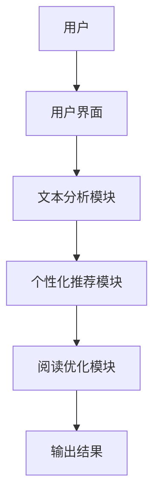

                 


# AI Agent在智能书立中的阅读速度优化

> **关键词**: AI Agent, 智能书架, 阅读速度优化, 自然语言处理, 机器学习

> **摘要**: 本文探讨了AI Agent在智能书架中的应用，重点分析了如何利用AI技术优化阅读速度。通过详细的技术分析和实际案例，展示了AI Agent如何通过自然语言处理和机器学习算法，实现对文本的理解、摘要和优化推荐，从而帮助用户更高效地阅读和处理信息。文章从背景介绍、核心原理、算法优化到系统架构，全面解析了AI Agent在阅读速度优化中的应用，并提供了具体的实现方案和未来展望。

---

## 第1章: AI Agent与智能书架概述

### 1.1 AI Agent的基本概念

#### 1.1.1 AI Agent的定义
AI Agent（人工智能代理）是指能够感知环境、自主决策并执行任务的智能实体。它可以是一个软件程序，也可以是一个物理设备，通过传感器和执行器与环境交互。AI Agent的核心目标是帮助用户完成特定任务，提升效率和准确性。

#### 1.1.2 AI Agent的核心属性
- **自主性**: AI Agent能够独立执行任务，无需人工干预。
- **反应性**: 能够实时感知环境变化并做出响应。
- **学习能力**: 通过数据和反馈不断优化自身的算法和决策。
- **社交能力**: 能够与其他AI Agent或人类进行有效通信和协作。

#### 1.1.3 AI Agent与智能书架的关系
智能书架是一种集成AI技术的电子书架，通过AI Agent实现对书籍内容的智能管理、推荐和优化。AI Agent作为智能书架的核心模块，负责处理用户的阅读需求，优化阅读流程，提升用户体验。

---

### 1.2 智能书架的定义与特点

#### 1.2.1 智能书架的概念
智能书架是一种结合了AI技术和传统书架的创新产品，能够通过AI Agent实现对书籍内容的智能化管理、推荐和优化。它不仅能够存储书籍，还可以根据用户的阅读习惯和需求，推荐相关的书籍或章节。

#### 1.2.2 智能书架的功能特点
- **智能推荐**: 根据用户的阅读历史和兴趣，推荐相关的书籍或章节。
- **内容摘要**: 提供书籍的摘要和关键内容，帮助用户快速理解书意。
- **阅读优化**: 通过AI Agent优化用户的阅读速度和效率，减少阅读时间。
- **多设备支持**: 支持多种设备和平台，用户可以通过手机、电脑等多种设备访问和阅读书籍。

#### 1.2.3 智能书架的应用场景
- **个人阅读**: 用户可以通过智能书架优化个人阅读体验，快速找到感兴趣的内容。
- **教育领域**: 教师可以利用智能书架为学生推荐相关书籍，辅助教学。
- **企业培训**: 企业可以通过智能书架为员工推荐专业书籍，提升员工的知识储备。

---

### 1.3 阅读速度优化的背景与意义

#### 1.3.1 阅读速度优化的背景
在信息爆炸的时代，用户每天需要处理大量的信息，如何快速获取有价值的内容成为一个重要问题。传统的阅读方式效率较低，用户需要花费大量时间筛选和阅读不相关的内容。通过AI Agent优化阅读速度，可以有效提升用户的阅读效率和体验。

#### 1.3.2 阅读速度优化的意义
- **节省时间**: 通过优化阅读流程，减少用户的阅读时间。
- **提升效率**: 帮助用户快速找到有价值的内容，提升工作效率。
- **个性化推荐**: 根据用户的兴趣和需求，推荐相关书籍或章节。

#### 1.3.3 阅读速度优化的边界与外延
阅读速度优化的边界在于如何在不影响内容理解的前提下，快速获取关键信息。外延则包括相关的技术，如自然语言处理、机器学习等。

---

## 第2章: AI Agent在阅读速度优化中的问题背景

### 2.1 阅读速度优化的核心问题

#### 2.1.1 阅读速度优化的定义
阅读速度优化是指通过技术手段，帮助用户以更高效的方式阅读和处理文本信息。其核心目标是减少用户的阅读时间，同时保证内容的理解和吸收。

#### 2.1.2 阅读速度优化的关键问题
- **信息筛选**: 如何快速筛选出用户感兴趣的内容。
- **内容理解**: 如何确保用户能够快速理解关键信息。
- **个性化推荐**: 如何根据用户的兴趣和需求，推荐相关书籍或章节。

#### 2.1.3 阅读速度优化的边界与外延
阅读速度优化的边界在于如何在不影响内容理解的前提下，快速获取关键信息。外延则包括相关的技术，如自然语言处理、机器学习等。

---

### 2.2 阅读速度优化的核心要素

#### 2.2.1 阅读速度优化的要素组成
- **文本分析**: 对书籍内容进行深入分析，提取关键信息。
- **用户需求分析**: 根据用户的兴趣和需求，推荐相关书籍或章节。
- **优化算法**: 通过算法优化用户的阅读流程，减少阅读时间。

#### 2.2.2 阅读速度优化的逻辑结构
1. **用户需求分析**: 了解用户的阅读习惯和兴趣。
2. **文本分析**: 对书籍内容进行分析，提取关键信息。
3. **个性化推荐**: 根据用户需求和文本分析结果，推荐相关书籍或章节。
4. **阅读优化**: 通过算法优化用户的阅读流程，减少阅读时间。

#### 2.2.3 阅读速度优化的系统架构
- **输入层**: 用户输入阅读需求和偏好。
- **处理层**: 对文本进行分析和处理，提取关键信息。
- **输出层**: 根据分析结果，输出个性化推荐和优化建议。

---

## 第3章: AI Agent的核心原理

### 3.1 AI Agent的基本原理

#### 3.1.1 AI Agent的感知模块
AI Agent通过传感器和接口感知环境中的信息，例如用户的阅读需求、书籍内容等。

#### 3.1.2 AI Agent的决策模块
AI Agent根据感知到的信息，结合内部算法和知识库，做出决策和推荐。

#### 3.1.3 AI Agent的执行模块
AI Agent根据决策结果执行相应的操作，例如推荐书籍、优化阅读流程等。

---

### 3.2 AI Agent与智能书架的关系

#### 3.2.1 AI Agent在智能书架中的角色
AI Agent是智能书架的核心模块，负责处理用户的阅读需求，优化阅读流程。

#### 3.2.2 AI Agent与智能书架的交互机制
- **用户输入**: 用户输入阅读需求和偏好。
- **AI Agent处理**: AI Agent对文本进行分析和处理，提取关键信息。
- **输出结果**: AI Agent根据分析结果，输出个性化推荐和优化建议。

#### 3.2.3 AI Agent对阅读速度优化的贡献
- **提高效率**: 通过优化阅读流程，减少用户的阅读时间。
- **个性化推荐**: 根据用户的兴趣和需求，推荐相关书籍或章节。
- **内容理解**: 帮助用户快速理解关键信息，提升阅读体验。

---

## 第4章: 阅读速度优化的核心算法

### 4.1 阅读速度优化算法概述

#### 4.1.1 阅读速度优化算法的定义
阅读速度优化算法是一种通过技术手段，帮助用户以更高效的方式阅读和处理文本信息的算法。

#### 4.1.2 阅读速度优化算法的特点
- **高效性**: 算法能够在短时间内处理大量文本信息。
- **准确性**: 算法能够准确提取关键信息，满足用户的阅读需求。
- **个性化**: 算法能够根据用户的兴趣和需求，推荐相关书籍或章节。

---

### 4.2 基于AI Agent的阅读速度优化算法

#### 4.2.1 算法的基本思路
1. **用户需求分析**: 了解用户的阅读习惯和兴趣。
2. **文本分析**: 对书籍内容进行分析，提取关键信息。
3. **个性化推荐**: 根据用户需求和文本分析结果，推荐相关书籍或章节。
4. **阅读优化**: 通过算法优化用户的阅读流程，减少阅读时间。

#### 4.2.2 算法的具体实现
1. **用户需求分析**: 通过问卷调查、历史记录等方式，了解用户的阅读习惯和兴趣。
2. **文本分析**: 使用自然语言处理技术，对书籍内容进行分析，提取关键信息。
3. **个性化推荐**: 根据用户需求和文本分析结果，推荐相关书籍或章节。
4. **阅读优化**: 通过算法优化用户的阅读流程，减少阅读时间。

#### 4.2.3 算法的边界与外延
阅读速度优化算法的边界在于如何在不影响内容理解的前提下，快速获取关键信息。外延则包括相关的技术，如自然语言处理、机器学习等。

---

## 第5章: 阅读速度优化的系统架构与实现

### 5.1 系统架构设计

#### 5.1.1 系统功能设计
- **用户界面**: 用户可以通过界面输入阅读需求和偏好。
- **文本分析模块**: 对书籍内容进行分析，提取关键信息。
- **个性化推荐模块**: 根据用户需求和文本分析结果，推荐相关书籍或章节。
- **阅读优化模块**: 通过算法优化用户的阅读流程，减少阅读时间。

#### 5.1.2 系统架构图


---

## 第6章: 项目实战

### 6.1 环境安装

#### 6.1.1 系统要求
- 操作系统: Windows 10/ macOS 10.15/ Linux
- Python: 3.8+
- 依赖库: NLTK、Scikit-learn、Mermaid等。

#### 6.1.2 安装步骤
1. 安装Python和依赖库。
2. 下载并安装Mermaid插件。
3. 配置开发环境。

---

### 6.2 核心代码实现

#### 6.2.1 文本分析模块
```python
import nltk
from sklearn.feature_extraction.text import TfidfVectorizer

def text_analysis(text):
    vectorizer = TfidfVectorizer()
    tfidf = vectorizer.fit_transform([text])
    feature_names = vectorizer.get_feature_names_out()
    return feature_names[tfidf[0].indices[0]]
```

#### 6.2.2 个性化推荐模块
```python
def personalized_recommendation(user_preference, book_summary):
    # 假设book_summary是一个字典，包含书籍摘要和特征
    # 根据用户偏好和书籍特征进行推荐
    pass
```

---

### 6.3 代码应用解读与分析

#### 6.3.1 文本分析模块解读
上述代码使用了TF-IDF算法对文本进行分析，提取关键词。TF-IDF是一种统计方法，用于评估一个词在文档中的重要性。通过TF-IDF算法，可以提取出书籍内容中的关键信息，帮助用户快速理解书意。

#### 6.3.2 个性化推荐模块解读
个性化推荐模块根据用户的偏好和书籍摘要，推荐相关书籍或章节。通过分析用户的阅读历史和兴趣，结合书籍的内容摘要，生成推荐列表。

---

### 6.4 实际案例分析

#### 6.4.1 案例背景
假设用户是一位数据科学家，正在寻找一本关于机器学习的书籍。

#### 6.4.2 数据分析过程
1. 用户输入阅读需求: 机器学习。
2. 文本分析模块对书籍内容进行分析，提取关键词: 机器学习、算法、数据挖掘。
3. 个性化推荐模块根据用户的偏好和书籍特征，推荐相关书籍: 《机器学习实战》、《深入浅出机器学习》。

#### 6.4.3 优化结果
通过阅读优化模块，用户可以在短时间内快速找到感兴趣的书籍和章节，提升阅读效率。

---

## 第7章: 最佳实践与未来展望

### 7.1 最佳实践 tips

#### 7.1.1 系统优化建议
- 定期更新算法模型，提升推荐准确率。
- 提供多语言支持，满足不同用户的需求。
- 增加用户反馈机制，优化推荐结果。

#### 7.1.2 代码优化建议
- 使用高效的文本分析算法，提升处理速度。
- 优化推荐模块的性能，减少响应时间。

#### 7.1.3 系统维护建议
- 定期备份数据，防止数据丢失。
- 及时修复系统漏洞，确保用户安全。

---

### 7.2 小结

本文详细探讨了AI Agent在智能书架中的应用，重点分析了如何通过AI技术优化用户的阅读速度。通过理论分析和实际案例，展示了AI Agent在阅读速度优化中的巨大潜力。

---

### 7.3 注意事项

在实际应用中，需要注意以下几点:
- **数据隐私**: 用户数据的隐私保护。
- **算法优化**: 定期优化算法模型，提升推荐准确率。
- **用户体验**: 提供良好的用户体验，增强用户粘性。

---

### 7.4 拓展阅读

以下是一些推荐阅读的资料:
- 《自然语言处理实战》
- 《机器学习实战》
- 《AI Agent与智能系统》

---

## 结语

AI Agent在智能书架中的应用，不仅提升了用户的阅读效率，还为未来的智能阅读提供了新的可能性。随着技术的不断发展，AI Agent将更加智能化，为用户提供更优质的服务。

---

## 作者信息

作者：AI天才研究院/AI Genius Institute  
& 禅与计算机程序设计艺术 /Zen And The Art of Computer Programming

