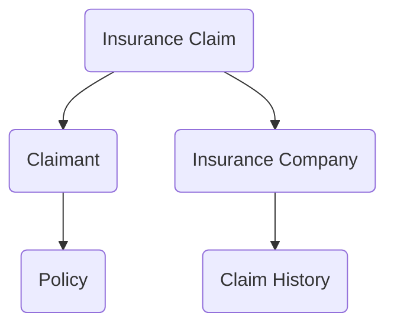
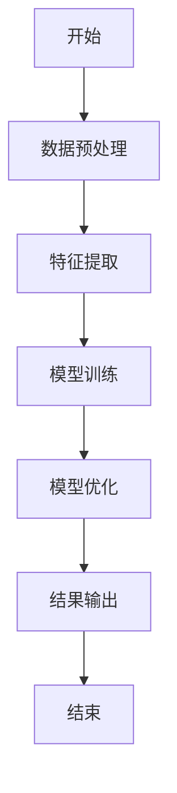
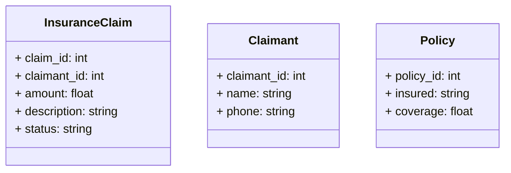
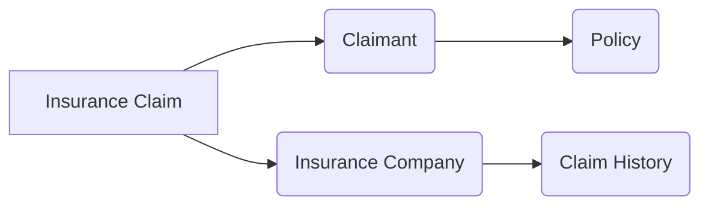

                 


# AI Agent在智能保险理赔审核中的应用

> 关键词：AI Agent, 保险理赔审核, 人工智能, 系统架构, 案例分析

> 摘要：本文深入探讨了AI Agent在智能保险理赔审核中的应用，从背景、概念、算法原理到系统架构、项目实战，结合具体案例，详细解析了AI Agent如何优化保险理赔审核流程，提升效率和准确性。文章通过Mermaid图和Python代码示例，系统性地呈现了AI Agent的技术实现与实际应用，为保险行业智能化转型提供了实践参考。

---

## 第一部分: AI Agent在保险理赔审核中的背景与概念

### 第1章: AI Agent与保险理赔审核概述

#### 1.1 AI Agent的基本概念
- 1.1.1 AI Agent的定义与特点
  - AI Agent是具有自主决策能力的智能体，能够通过感知环境、分析数据并执行任务。
  - 核心特点：自主性、反应性、目标导向、学习能力。
- 1.1.2 AI Agent的核心要素与属性
  - 感知能力：通过传感器或数据接口获取环境信息。
  - 决策能力：基于历史数据和规则进行推理和决策。
  - 学习能力：通过机器学习算法不断优化自身模型。
  - 行为能力：执行任务并输出结果。
- 1.1.3 AI Agent与传统理赔审核的区别
  - 传统理赔审核依赖人工判断，效率低且易出错。
  - AI Agent通过自动化处理，显著提高审核效率和准确性。

#### 1.2 保险理赔审核的现状与挑战
- 1.2.1 传统保险理赔审核流程
  - 理赔申请提交 → 人工初审 → 调查核实 → 定损 → 结案 → 支付。
  - 问题：流程繁琐、耗时长、人工成本高。
- 1.2.2 现有技术的局限性
  - 人工审核依赖经验，易受主观因素影响。
  - 数据孤岛问题，难以实现跨系统协同。
  - 缺乏智能化工具，导致效率低下。
- 1.2.3 AI技术在保险行业的应用前景
  - 提高理赔效率。
  - 降低运营成本。
  - 提升客户满意度。

#### 1.3 AI Agent在保险理赔审核中的应用价值
- 1.3.1 提高审核效率
  - AI Agent能够快速分析大量数据，缩短审核时间。
- 1.3.2 减少人为错误
  - 通过算法优化，降低误判率。
- 1.3.3 优化用户体验
  - 提供24/7服务，减少客户等待时间。

---

## 第2章: AI Agent的核心概念与原理

### 2.1 AI Agent的基本原理
#### 2.1.1 问题背景与目标
- 保险理赔审核中的问题：
  - 理赔申请量大，人工审核效率低。
  - 数据复杂，涉及医疗、车损等多个领域。
- AI Agent的目标：
  - 自动化处理理赔申请，提高审核效率。
  - 准确识别欺诈行为，降低赔付风险。

#### 2.1.2 问题描述与解决思路
- 问题描述：
  - 理赔申请中可能存在虚假信息或欺诈行为。
  - 数据分散，难以快速获取相关信息。
- 解决思路：
  - 利用NLP技术分析理赔申请内容。
  - 通过机器学习模型识别潜在风险。

#### 2.1.3 AI Agent的核心算法与实现
- 核心算法：
  - 使用监督学习模型（如随机森林、神经网络）进行分类。
  - 通过特征工程提取关键信息。

### 2.2 AI Agent的系统架构
#### 2.2.1 系统边界与外延
- 系统边界：
  - 输入：理赔申请数据、历史数据。
  - 输出：审核结果、风险提示。
- 外延：
  - 集成第三方数据源（如医疗数据库、车辆维修记录）。
  - 与保险系统对接，输出审核结果。

#### 2.2.2 核心要素与功能模块
- 核心要素：
  - 数据采集模块：获取理赔申请信息。
  - 数据处理模块：清洗和预处理数据。
  - 模型训练模块：训练分类模型。
  - 结果输出模块：生成审核结果。
- 功能模块：
  - 数据采集：从数据库中获取理赔申请。
  - 数据处理：清洗数据，提取特征。
  - 模型训练：训练分类模型，优化参数。
  - 结果输出：生成审核结果，输出给用户。

#### 2.2.3 实体关系图（ER图）分析
- ER图展示：


---

## 第3章: AI Agent的算法原理

### 3.1 AI Agent的核心算法
#### 3.1.1 算法流程图


#### 3.1.2 算法实现代码
```python
def preprocess_data(data):
    # 数据清洗和特征提取
    preprocessed_data = data.dropna().astype(float)
    return preprocessed_data

def train_model(X, y):
    from sklearn.ensemble import RandomForestClassifier
    model = RandomForestClassifier(n_estimators=100, random_state=42)
    model.fit(X, y)
    return model

def main():
    import pandas as pd
    data = pd.read_csv('claims.csv')
    X = preprocess_data(data.drop('fraud', axis=1))
    y = data['fraud']
    model = train_model(X, y)
    print("模型训练完成")

if __name__ == "__main__":
    main()
```

#### 3.1.3 算法的数学模型和公式
- 随机森林模型：
  - 使用决策树的集成方法，公式如下：
  $$ y = \sum_{i=1}^{n} \text{Tree}(\mathbf{x}) $$

---

## 第4章: 系统分析与架构设计方案

### 4.1 保险理赔审核系统介绍
- 系统功能：
  - 数据采集：从数据库中获取理赔申请。
  - 数据处理：清洗和预处理数据。
  - 模型训练：训练分类模型。
  - 结果输出：生成审核结果。

### 4.2 系统架构设计
#### 4.2.1 领域模型（Mermaid类图）


#### 4.2.2 系统架构图


---

## 第5章: 项目实战

### 5.1 环境安装与配置
- 安装Python和相关库：
  ```bash
  pip install numpy pandas scikit-learn
  ```

### 5.2 核心代码实现
- 数据处理代码：
```python
import pandas as pd
from sklearn.ensemble import RandomForestClassifier

def preprocess_data(data):
    # 数据清洗和特征提取
    preprocessed_data = data.dropna().astype(float)
    return preprocessed_data

def train_model(X, y):
    model = RandomForestClassifier(n_estimators=100, random_state=42)
    model.fit(X, y)
    return model

def main():
    data = pd.read_csv('claims.csv')
    X = preprocess_data(data.drop('fraud', axis=1))
    y = data['fraud']
    model = train_model(X, y)
    print("模型训练完成")

if __name__ == "__main__":
    main()
```

---

## 第6章: 最佳实践与总结

### 6.1 最佳实践
- 数据质量：确保数据清洗和预处理到位。
- 模型优化：通过调参和交叉验证提升模型性能。
- 人机协同：AI Agent与人工审核相结合，确保准确性。

### 6.2 小结
- AI Agent通过自动化处理和智能决策，显著提升了保险理赔审核的效率和准确性。
- 本文通过具体案例和代码实现，展示了AI Agent在保险行业的实际应用。

### 6.3 注意事项
- 数据隐私保护：确保数据处理符合隐私保护法规。
- 模型解释性：选择可解释性更强的算法，便于业务人员理解。

### 6.4 拓展阅读
- 推荐阅读《机器学习实战》和《人工智能：一种现代方法》。

---

作者：AI天才研究院/AI Genius Institute & 禅与计算机程序设计艺术/Zen And The Art of Computer Programming

