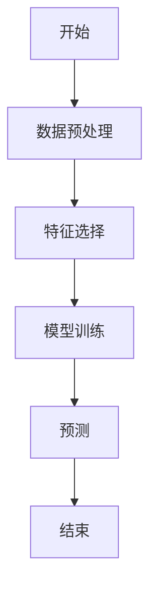
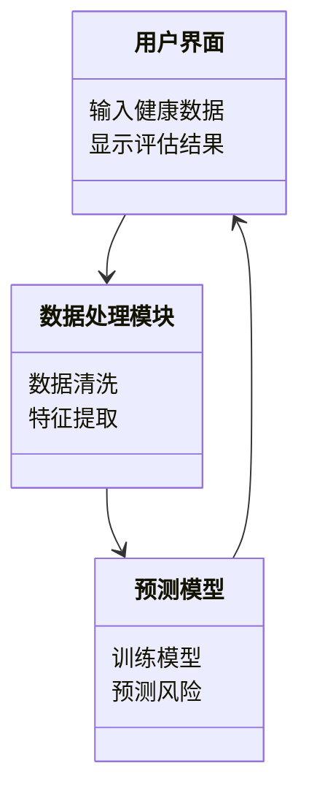

                 


# AI Agent在智能健康风险评估中的角色

> 关键词：AI Agent, 健康风险评估, 人工智能, 系统架构, 项目实战

> 摘要：本文探讨了AI Agent在智能健康风险评估中的角色，分析了其核心概念、算法原理、系统架构，并通过项目实战展示了实际应用。文章旨在帮助读者理解AI Agent如何通过数据分析和预测模型优化健康风险评估过程。

---

## 第1章：AI Agent与健康风险评估概述

### 1.1 AI Agent的基本概念

AI Agent（人工智能代理）是指能够感知环境并采取行动以实现目标的智能实体。其核心特征包括：

- **自主性**：无需外部干预，自主决策。
- **反应性**：能实时感知环境变化并做出反应。
- **目标导向**：所有行为均以实现特定目标为导向。

AI Agent在多个领域中有广泛应用，如自动驾驶、智能助手和金融投资。

### 1.2 健康风险评估的基本概念

健康风险评估是通过分析个人健康数据，预测未来可能出现的健康问题。常用方法包括问卷调查、生物指标检测和生活习惯分析。其在医疗中的作用包括早期预警和个性化健康管理。

### 1.3 AI Agent与健康风险评估的结合

AI Agent与健康风险评估的结合旨在利用AI技术提高评估的准确性和效率。通过数据分析和预测模型，AI Agent能够识别潜在风险，提供个性化建议。

---

## 第2章：AI Agent与健康风险评估的核心概念

### 2.1 AI Agent的核心原理

AI Agent的信息处理机制包括数据收集、分析和决策。其决策逻辑基于预设规则和学习模型。自适应学习能力使AI Agent能够根据反馈优化性能。

### 2.2 健康风险评估的核心原理

健康风险评估的数据分析涉及统计和机器学习方法，构建预测模型以评估个体健康风险。结果解释和建议帮助用户采取预防措施。

### 2.3 AI Agent与健康风险评估的联系

通过对比表格和Mermaid图，展示了两者在数据处理和目标实现上的联系。

```mermaid
erDiagram
    +---+       +---+       +---+       +---+
    |A  |       |R  |       |H  |       |E  |
    +---+       +---+       +---+       +---+
    A --> R      R --> H      H --> E
```

---

## 第3章：算法原理

### 3.1 算法选择与实现

AI Agent使用决策树和随机森林进行分类。Mermaid流程图展示了算法步骤，Python代码示例说明了实现过程。



### 3.2 数学模型

贝叶斯定理用于概率计算：

$$ P(A|B) = \frac{P(B|A)P(A)}{P(B)} $$

决策树的构建过程展示了如何将特征转化为分类结果。

---

## 第4章：系统分析与架构设计

### 4.1 系统应用场景

健康风险评估系统应用于医院、诊所和个人健康管理。

### 4.2 功能设计

系统功能包括数据输入、模型训练、风险评估和结果展示。



### 4.3 系统架构设计

系统架构分为前端、后端和数据库，使用微服务架构。


---

## 第5章：项目实战

### 5.1 环境安装

安装Python、Scikit-learn和Jupyter Notebook。

### 5.2 核心代码实现

实现数据预处理、模型训练和预测。

```python
from sklearn.tree import DecisionTreeClassifier
model = DecisionTreeClassifier()
model.fit(X_train, y_train)
predictions = model.predict(X_test)
```

### 5.3 案例分析

通过案例展示AI Agent如何优化健康风险评估过程。

---

## 第6章：最佳实践与小结

### 6.1 最佳实践

确保数据隐私，定期模型优化，结合多模态数据。

### 6.2 小结

AI Agent在健康风险评估中具有巨大潜力，通过数据分析和预测模型提高评估效率和准确性。

---

## 第7章：附录

### 7.1 术语表

列出文中出现的专业术语及其定义。

### 7.2 工具安装指南

详细说明如何安装和配置开发环境。

### 7.3 扩展阅读

推荐相关书籍和论文，供进一步学习参考。

---

## 作者

作者：AI天才研究院/AI Genius Institute & 禅与计算机程序设计艺术/Zen And The Art of Computer Programming

---

这篇文章系统地介绍了AI Agent在健康风险评估中的应用，从理论到实践，帮助读者全面理解其角色和价值。

