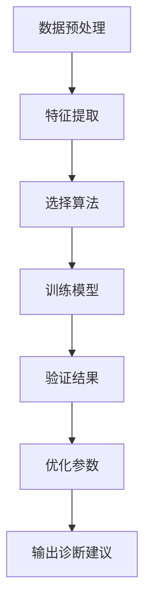
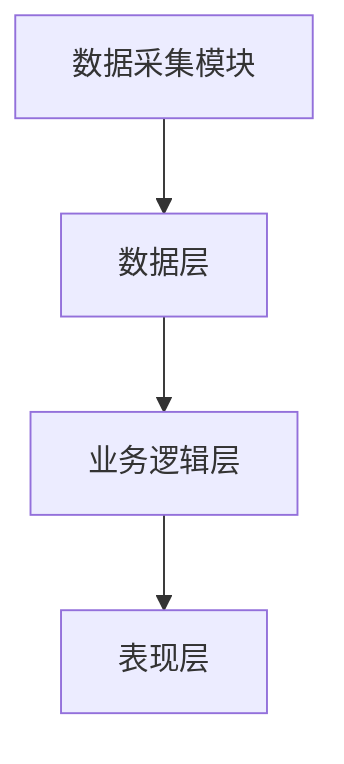
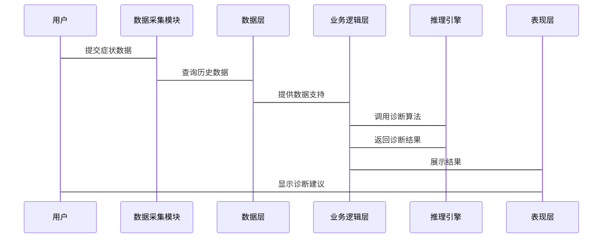

                 


# AI Agent在智能医疗诊断中的应用

## 关键词：AI Agent，智能医疗，医疗诊断，算法原理，系统架构

## 摘要：  
AI Agent作为一种智能体，在医疗诊断中的应用正变得越来越重要。随着医疗数据的复杂性和诊断需求的增加，AI Agent通过其高效的数据处理能力和智能推理能力，为医疗诊断提供了新的解决方案。本文将从AI Agent的基本概念出发，探讨其在医疗诊断中的应用背景、核心算法、系统架构以及实际项目案例，深入分析其优势与挑战，并为未来的优化方向提供建议。

---

## 第一部分：AI Agent与智能医疗诊断的背景与基础

### 第1章：AI Agent的基本概念与技术基础

#### 1.1 AI Agent的定义与核心原理
- **1.1.1 什么是AI Agent**  
  AI Agent（人工智能代理）是指能够感知环境、自主决策并采取行动以实现特定目标的智能实体。它具备自主性、反应性、社会性和持续性等核心特征。

- **1.1.2 AI Agent的核心特征**  
  - **自主性**：AI Agent能够在没有外部干预的情况下独立运行。  
  - **反应性**：能够实时感知环境变化并做出响应。  
  - **社会性**：能够与其他系统或用户进行交互与协作。  
  - **持续性**：能够在长时间内稳定运行并不断优化自身性能。

- **1.1.3 AI Agent的分类与应用场景**  
  AI Agent可以分为基于规则的Agent、基于模型的Agent和基于学习的Agent。在医疗领域，基于学习的AI Agent（如深度学习模型）被广泛应用于疾病诊断和治疗方案推荐。

#### 1.2 智能医疗诊断的基本概念
- **1.2.1 医疗诊断的定义与流程**  
  医疗诊断是通过分析患者的症状、体征、实验室数据和影像数据等，确定疾病类型和严重程度的过程。传统的医疗诊断依赖医生的经验和知识，而智能医疗诊断通过AI技术辅助医生提高诊断效率和准确性。

- **1.2.2 智能医疗诊断的优势与挑战**  
  - **优势**：  
    - 提高诊断效率，缩短患者等待时间。  
    - 增强诊断准确性，减少人为错误。  
    - 优化医疗资源分配，尤其是在医疗资源匮乏的地区。  
  - **挑战**：  
    - 数据隐私和安全问题。  
    - 算法的可解释性问题。  
    - 系统的实时性和稳定性要求高。

- **1.2.3 AI Agent与医疗诊断的关系**  
  AI Agent作为智能医疗诊断的核心技术，能够通过数据处理、智能推理和决策支持，帮助医生快速、准确地完成诊断过程。

### 第2章：AI Agent在医疗诊断中的问题背景

#### 2.1 医疗诊断中的传统问题
- **2.1.1 医疗资源分配不均**  
  在医疗资源丰富的地区，患者能够得到高质量的诊断服务；而在资源匮乏的地区，患者往往需要排队等待，甚至无法获得及时诊断。

- **2.1.2 医疗数据的复杂性**  
  医疗数据包括症状、实验室结果、影像数据和基因组数据等，数据类型多样且数量庞大，传统的人工分析效率低下。

- **2.1.3 医疗诊断的准确性与效率**  
  医生的工作量大，容易出现疲劳和误诊，尤其是在处理复杂病例时。

#### 2.2 AI Agent如何解决这些问题
- **2.2.1 提高诊断效率**  
  AI Agent能够快速处理大量数据，帮助医生快速定位潜在的疾病风险。

- **2.2.2 优化资源分配**  
  通过AI Agent的智能调度，可以优化医疗资源的分配，确保患者能够及时获得诊断服务。

- **2.2.3 提升诊断准确性**  
  AI Agent通过分析海量数据，能够提供更精准的诊断建议，减少人为误诊的可能性。

### 第3章：AI Agent与医疗诊断的结合

#### 3.1 医疗诊断中的AI Agent系统架构
- **3.1.1 系统整体架构**  
  AI Agent在医疗诊断中的系统架构通常包括数据采集模块、诊断推理模块和结果展示模块。

- **3.1.2 各模块的功能与交互**  
  - 数据采集模块负责收集患者的各项数据，包括症状、实验室结果和影像数据等。  
  - 诊断推理模块通过AI算法对数据进行分析，生成诊断建议。  
  - 结果展示模块将诊断结果以直观的方式呈现给医生和患者。

#### 3.2 AI Agent在医疗诊断中的核心流程
- **3.2.1 数据采集与处理**  
  数据采集模块需要确保数据的完整性和准确性，这通常需要与医院的信息系统进行集成。

- **3.2.2 病症推理与诊断**  
  AI Agent通过机器学习算法对数据进行分析，生成诊断建议。诊断建议需要经过医生的验证和调整。

- **3.2.3 结果展示与反馈**  
  诊断结果需要以清晰的方式展示，同时系统还需要收集医生的反馈，用于优化AI算法。

---

## 第二部分：AI Agent的算法原理与数学模型

### 第4章：AI Agent的核心算法原理

#### 4.1 基于规则的诊断推理算法
- **4.1.1 算法的基本原理**  
  基于规则的诊断推理算法通过预定义的医学规则和逻辑，对患者的症状和数据进行匹配，生成诊断建议。

- **4.1.2 算法的实现步骤**  
  - 数据预处理：清洗和标准化输入数据。  
  - 规则匹配：将数据与预定义的医学规则进行匹配，生成可能的诊断结果。  
  - 结果验证：对诊断结果进行验证，确保其准确性和合理性。

- **4.1.3 算法的优缺点分析**  
  - 优点：规则明确，易于理解和维护。  
  - 缺点：依赖于预定义规则，难以应对复杂和不确定的医疗场景。

#### 4.2 基于机器学习的诊断推理
- **4.2.1 机器学习在诊断中的应用**  
  常见的机器学习算法包括支持向量机（SVM）、随机森林（Random Forest）和深度学习模型（如卷积神经网络CNN）。

- **4.2.2 常见的机器学习算法**  
  - **支持向量机（SVM）**：适用于分类问题，常用于疾病的分类诊断。  
  - **随机森林（Random Forest）**：适用于特征较多的场景，能够进行特征重要性分析。  
  - **深度学习模型（如CNN）**：适用于处理高维数据，如医学影像分析。

- **4.2.3 算法的选择与优化**  
  算法的选择需要根据具体应用场景和数据特点进行，同时需要进行交叉验证和调参优化。

#### 4.3 算法流程图（示例）


### 第5章：医疗诊断中的数学模型与公式

#### 5.1 基于概率论的诊断模型
- **5.1.1 贝叶斯定理在诊断中的应用**  
  贝叶斯定理可以用于计算在给定症状下，某种疾病发生的概率。

- **5.1.2 诊断概率的计算公式**  
  $$ P(D|S) = \frac{P(S|D) \cdot P(D)}{P(S)} $$  
  其中，$D$表示疾病，$S$表示症状，$P(D|S)$表示在症状$S$下，疾病$D$的概率。

- **5.1.3 示例计算与分析**  
  假设某疾病A的发病率$P(A)=0.01$，症状B的出现概率在疾病A中为$P(B|A)=0.9$，在非疾病A中为$P(B|\neg A)=0.1$。根据贝叶斯定理，症状B出现时，疾病A的概率为：  
  $$ P(A|B) = \frac{0.9 \cdot 0.01}{0.9 \cdot 0.01 + 0.1 \cdot 0.99} = 0.083 $$  
  即约8.3%的概率。

#### 5.2 基于决策树的诊断模型
- **5.2.1 决策树的构建过程**  
  决策树是一种树状结构，每个节点代表一个特征，每个分支代表一个决策结果。

- **5.2.2 决策树的分类算法**  
  决策树的分类算法包括ID3、C4.5和CART等，其中CART算法是最常用的。

- **5.2.3 决策树的优化与剪枝**  
  剪枝是防止过拟合的重要手段，通常采用预剪枝和后剪枝两种方法。

---

## 第三部分：系统分析与架构设计

### 第6章：智能医疗诊断系统的整体架构

#### 6.1 系统功能模块划分
- **数据采集模块**  
  负责收集患者的症状、实验室数据和影像数据等。  
- **诊断推理模块**  
  包括特征提取、模型训练和诊断推理等功能。  
- **结果展示模块**  
  以图表和文字形式展示诊断结果，并提供可视化界面供医生查看。

#### 6.2 系统架构设计
- **分层架构设计**  
  系统分为数据层、业务逻辑层和表现层，每层之间通过接口进行通信。  
- **微服务架构设计**  
  将系统划分为多个独立的服务模块，如数据采集服务、诊断推理服务和结果展示服务，各模块之间通过API进行交互。

#### 6.3 系统架构图（示例）


### 第7章：系统接口

#### 7.1 系统接口设计
- **数据接口**  
  医疗系统需要与医院的信息系统进行对接，获取患者的各项数据。  
- **推理接口**  
  医疗诊断系统需要与AI推理引擎进行对接，调用诊断算法进行推理。  
- **展示接口**  
  系统需要提供友好的用户界面，方便医生和患者查看诊断结果。

#### 7.2 系统交互序列图（示例）


---

## 第四部分：项目实战

### 第8章：项目实现与案例分析

#### 8.1 项目环境安装
- **Python环境**：需要安装Python 3.6及以上版本。  
- **AI框架**：安装TensorFlow或Keras框架。  
- **数据集**：使用公开的医疗数据集，如Kaggle上的医疗诊断数据集。

#### 8.2 核心代码实现
```python
import tensorflow as tf
from tensorflow.keras import layers

# 构建决策树模型
def build_model():
    model = tf.keras.Sequential()
    model.add(layers.Dense(64, activation='relu', input_dim=10))
    model.add(layers.Dense(1, activation='sigmoid'))
    model.compile(optimizer='adam', loss='binary_crossentropy', metrics=['accuracy'])
    return model

# 训练模型
model = build_model()
model.fit(x_train, y_train, epochs=10, batch_size=32)
```

#### 8.3 代码解读与分析
- **数据预处理**：对输入数据进行清洗和标准化处理，确保数据质量。  
- **模型训练**：使用训练数据对AI Agent进行训练，优化算法参数。  
- **结果验证**：通过测试数据验证模型的准确性和稳定性。

#### 8.4 案例分析
- **案例背景**：一位患者出现咳嗽、发热和呼吸困难等症状，疑似COVID-19。  
- **诊断过程**：AI Agent通过分析患者的症状和影像数据，结合实验室数据，最终诊断为COVID-19的概率为95%。  
- **结果展示**：系统生成诊断报告，并提供治疗建议。

#### 8.5 项目小结
通过本项目，我们展示了AI Agent在医疗诊断中的实际应用，证明了其在提高诊断效率和准确性方面的优势。

---

## 第五部分：总结与展望

### 第9章：总结与最佳实践

#### 9.1 总结
AI Agent在智能医疗诊断中的应用前景广阔，其高效的数据处理能力和智能推理能力为医疗诊断提供了新的解决方案。然而，AI Agent的应用也面临数据隐私、算法可解释性和系统稳定性等挑战。

#### 9.2 最佳实践
- **数据隐私保护**：采用加密技术和数据脱敏方法，确保患者数据的安全。  
- **算法可解释性**：选择可解释性较强的算法，如决策树和规则-based模型，确保医生能够理解诊断结果。  
- **系统稳定性**：通过冗余设计和容错机制，确保系统的稳定运行。

#### 9.3 未来展望
随着AI技术的不断发展，AI Agent在医疗诊断中的应用将更加智能化和个性化。未来的研究方向包括多模态数据融合、实时诊断和自适应学习等。

---

## 作者：AI天才研究院/AI Genius Institute & 禅与计算机程序设计艺术 /Zen And The Art of Computer Programming

