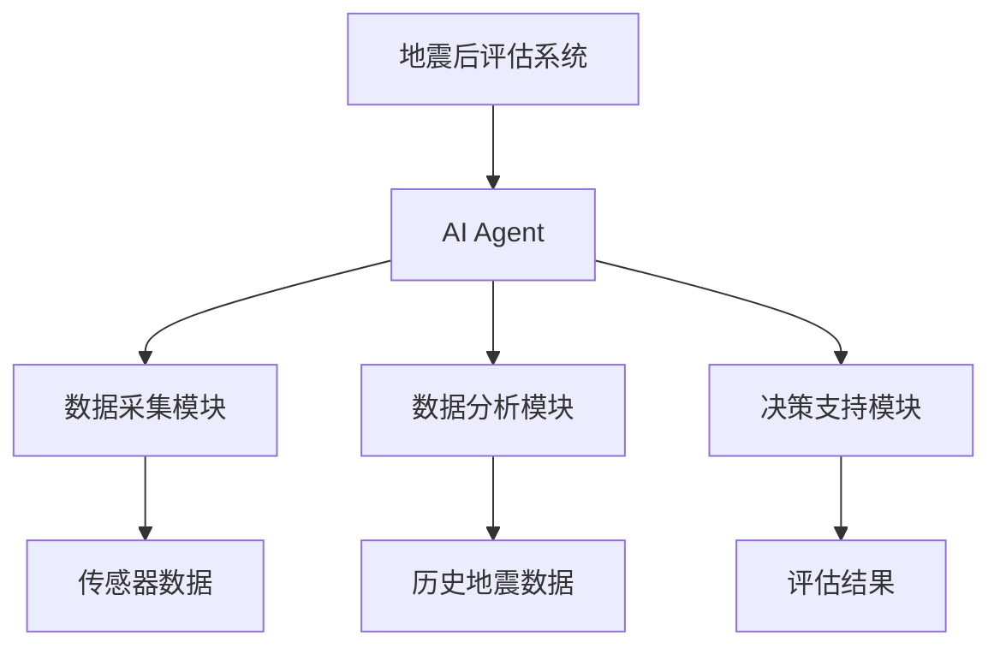
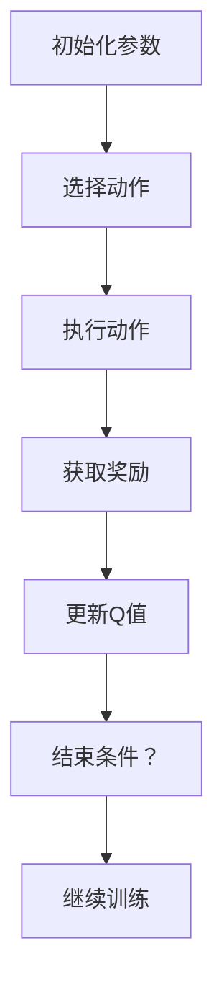
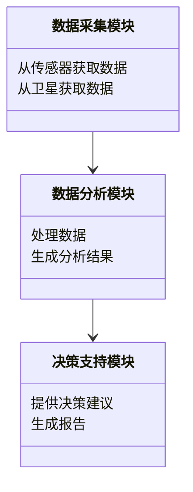
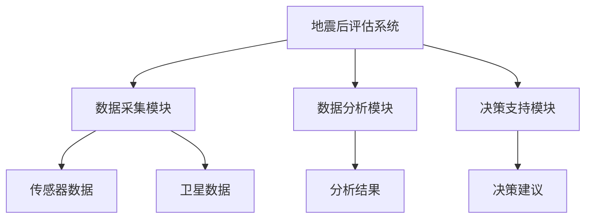
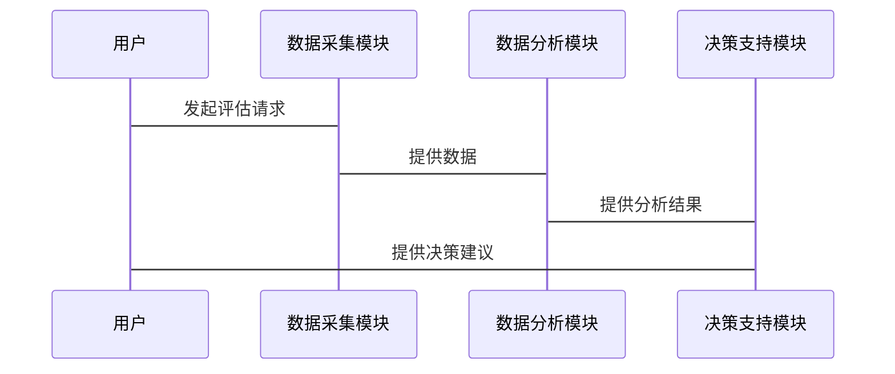

                 


---

# AI Agent在智能地震后评估系统中的实践

> 关键词：AI Agent, 地震后评估, 强化学习, 自然语言处理, 多智能体系统

> 摘要：本文深入探讨了AI Agent在智能地震后评估系统中的应用，从背景、核心概念、算法原理、系统设计到项目实战，全面分析了AI Agent如何提升地震后评估的效率和准确性。文章通过详细的技术分析和实际案例，展示了AI Agent在地震后评估中的巨大潜力和实际应用价值。

---

# 第一部分: AI Agent在智能地震后评估系统中的背景与概念

# 第1章: 地震后评估的背景与挑战

## 1.1 地震后评估的重要性

### 1.1.1 地震灾害的全球现状

地震是一种严重的自然灾害，每年给全球带来巨大的人员伤亡和财产损失。根据历史数据，地震造成的损失往往与震后评估的及时性和准确性密切相关。传统的震后评估方法依赖于人工调查和经验判断，效率低、成本高且容易受到主观因素的影响。

### 1.1.2 地震后评估的传统方法与局限性

传统地震后评估方法主要依赖以下几种方式：
- **现场调查**：需要大量的人力和时间，评估范围有限。
- **遥感技术**：受天气和地理条件限制，难以覆盖所有受灾区域。
- **经验判断**：依赖专家经验，存在主观性和不确定性。

这些方法在面对大规模地震时，往往难以满足快速、准确的评估需求。

### 1.1.3 智能化评估的必要性

随着人工智能技术的快速发展，智能化评估成为地震后评估的必然趋势。AI Agent（智能体）作为一种能够自主感知、决策和行动的智能系统，能够显著提升震后评估的效率和准确性。AI Agent可以通过整合多源数据，实时分析灾情，为救援和重建工作提供决策支持。

---

## 1.2 AI Agent的核心概念

### 1.2.1 AI Agent的基本定义

AI Agent（人工智能智能体）是一种能够感知环境、自主决策并采取行动的智能系统。在地震后评估系统中，AI Agent可以负责数据采集、分析、决策和反馈，帮助评估人员快速了解灾情。

### 1.2.2 AI Agent的类型与特点

AI Agent可以分为以下几类：
- **反应式AI Agent**：基于当前感知做出即时反应，适用于实时数据处理。
- **认知式AI Agent**：具备推理和规划能力，能够处理复杂问题。
- **协作式AI Agent**：能够与其他智能体协作，共同完成任务。

### 1.2.3 AI Agent在地震后评估中的应用潜力

AI Agent在地震后评估中的潜在应用包括：
- **数据采集与处理**：整合传感器数据、卫星图像和现场报告。
- **风险评估与预测**：基于历史数据和实时信息，预测灾后风险。
- **决策支持**：为救援行动提供最优建议。

---

## 1.3 本章小结

本章介绍了地震后评估的重要性和传统方法的局限性，重点阐述了AI Agent的核心概念及其在地震评估中的应用潜力。通过AI Agent，我们可以显著提升震后评估的效率和准确性，为灾害应对提供有力支持。

---

# 第二部分: AI Agent的核心概念与原理

# 第2章: AI Agent的核心概念与联系

## 2.1 AI Agent的核心原理

### 2.1.1 AI Agent的感知与决策机制

AI Agent通过多种传感器和数据源获取信息，利用机器学习算法进行分析和推理，最终做出决策。例如，AI Agent可以通过图像识别技术分析卫星图像，识别受灾区域的建筑物损坏情况。

### 2.1.2 多智能体系统的基本概念

多智能体系统是指多个智能体协作完成复杂任务的系统。在地震评估中，多个AI Agent可以协同工作，分别负责数据采集、分析和决策。

### 2.1.3 AI Agent的通信与协作机制

AI Agent之间通过通信协议进行信息交换和协作。例如，一个AI Agent可以向另一个AI Agent请求特定数据，或者分享自己的分析结果。

---

## 2.2 AI Agent的核心要素对比分析

### 2.2.1 不同AI Agent类型的核心要素对比

| AI Agent类型 | 感知能力 | 决策能力 | 行动能力 |
|--------------|----------|----------|----------|
| 反应式       | 强        | 弱        | 强        |
| 认知式       | 弱        | 强        | 弱        |
| 协作式       | 中        | 中        | 强        |

### 2.2.2 AI Agent与传统自动化系统的对比

| 特性         | AI Agent                  | 传统自动化系统           |
|--------------|----------------------------|--------------------------|
| 自主性       | 高                         | 低                       |
| 学习能力     | 强                         | 无                       |
| 适应性       | 强                         | 弱                       |

### 2.2.3 AI Agent与人类专家的对比

| 特性         | AI Agent                  | 人类专家                |
|--------------|----------------------------|--------------------------|
| 处理速度     | 极快                       | 较慢                    |
| 处理复杂度   | 强                        | 有限                    |
| 耐用性       | 高                         | 有限                    |

---

## 2.3 AI Agent的实体关系图

以下是AI Agent在地震后评估系统中的实体关系图：



---

## 2.4 本章小结

本章详细阐述了AI Agent的核心原理和关键要素，并通过对比分析和实体关系图，展示了AI Agent在地震后评估系统中的重要作用。

---

# 第三部分: AI Agent的算法原理与数学模型

# 第3章: AI Agent的算法原理

## 3.1 强化学习算法

### 3.1.1 强化学习的基本原理

强化学习是一种通过试错机制学习策略的方法。AI Agent通过与环境交互，不断优化自身行为，以最大化累积奖励。

### 3.1.2 Q-learning算法

Q-learning是一种经典的强化学习算法，其核心公式为：

$$ Q(s, a) = Q(s, a) + \alpha [r + \max Q(s', a') - Q(s, a)] $$

其中：
- $s$ 是当前状态
- $a$ 是当前动作
- $r$ 是奖励
- $\alpha$ 是学习率

### 3.1.3 Deep Q-Networks (DQN)算法

DQN算法通过深度神经网络近似Q值函数，实现端到端的强化学习。其核心公式为：

$$ Q(s, a) = \theta^T \phi(s, a) $$

其中：
- $\theta$ 是网络参数
- $\phi(s, a)$ 是状态-动作对的特征向量

---

## 3.2 自然语言处理算法

### 3.2.1 Transformer模型的基本原理

Transformer模型通过自注意力机制，捕捉文本中的长距离依赖关系。其核心公式为：

$$ \text{Attention}(Q, K, V) = \text{softmax}\left( \frac{QK^T}{\sqrt{d_k}} \right)V $$

其中：
- $Q$ 是查询向量
- $K$ 是键向量
- $V$ 是值向量
- $d_k$ 是向量维度

### 3.2.2 BERT模型在文本处理中的应用

BERT模型通过预训练和微调，可以实现多种自然语言处理任务。在地震评估中，BERT可以用于分析灾后新闻报道和社交媒体信息。

### 3.2.3 GPT模型在生成报告中的应用

GPT模型可以用于生成地震评估报告。通过输入初步数据，GPT可以自动生成结构化报告，显著提升工作效率。

---

## 3.3 联合学习算法

### 3.3.1 联合学习的基本概念

联合学习是一种多智能体协作学习方法，通过多个智能体共享知识，提升整体性能。其核心公式为：

$$ \theta_i^{new} = \theta_i^{old} + \sum_{j \neq i} \theta_j^{old} $$

其中：
- $\theta_i$ 是智能体i的参数
- $\theta_j$ 是其他智能体的参数

### 3.3.2 联合学习的数学模型

联合学习的数学模型如下：

$$ \theta_i^{new} = \theta_i^{old} + \frac{1}{n-1} \sum_{j \neq i} \theta_j^{old} $$

其中：
- $n$ 是智能体总数

### 3.3.3 联合学习在地震后评估中的应用

联合学习可以用于多个AI Agent协作评估灾情。例如，一个AI Agent负责分析卫星图像，另一个AI Agent负责分析社交媒体信息，通过协作，最终生成综合评估报告。

---

## 3.4 算法流程图

以下是强化学习算法的流程图：



---

## 3.5 本章小结

本章详细介绍了AI Agent的核心算法，包括强化学习、自然语言处理和联合学习。通过这些算法，AI Agent能够高效地处理地震后评估中的复杂任务。

---

# 第四部分: 系统分析与架构设计

# 第4章: 地震后评估系统的架构设计

## 4.1 系统功能设计

### 4.1.1 系统功能模块

地震后评估系统主要包括以下功能模块：
- **数据采集模块**：负责采集地震数据。
- **数据分析模块**：对数据进行处理和分析。
- **决策支持模块**：提供评估结果和决策建议。

### 4.1.2 领域模型设计

以下是系统功能模块的类图：



---

## 4.2 系统架构设计

### 4.2.1 系统架构图

以下是系统的总体架构图：



---

## 4.3 系统接口设计

### 4.3.1 系统接口描述

地震后评估系统的接口设计如下：
- **数据接口**：接收传感器数据和卫星数据。
- **分析接口**：提供数据分析结果。
- **决策接口**：输出决策建议。

---

## 4.4 系统交互设计

以下是系统的交互序列图：



---

## 4.5 本章小结

本章详细设计了地震后评估系统的架构，包括功能模块、架构图和接口设计。通过合理的系统设计，AI Agent能够高效地完成震后评估任务。

---

# 第五部分: 项目实战

# 第5章: 项目实战

## 5.1 环境安装

### 5.1.1 系统环境

- 操作系统：Linux/Windows
- Python版本：3.8+

### 5.1.2 依赖库安装

安装以下依赖库：

```bash
pip install numpy matplotlib scikit-learn transformers
```

---

## 5.2 系统核心实现

### 5.2.1 数据采集模块

```python
import requests

def fetch_sensor_data():
    response = requests.get("http://sensor_api/sensors")
    return response.json()

def fetch_satellite_data():
    response = requests.get("http://satellite_api/images")
    return response.json()
```

### 5.2.2 数据分析模块

```python
from transformers import BertTokenizer, BertModel

def analyze_data(sensor_data, satellite_data):
    tokenizer = BertTokenizer.from_pretrained('bert-base-uncased')
    model = BertModel.from_pretrained('bert-base-uncased')
    # 具体分析逻辑略
    return analysis_result
```

### 5.2.3 决策支持模块

```python
def generate_report(analysis_result):
    # 使用GPT生成报告
    report = gpt.generate(analysis_result)
    return report
```

---

## 5.3 代码应用解读与分析

### 5.3.1 数据采集模块解读

数据采集模块负责从传感器和卫星获取数据。通过API调用，我们可以实时获取地震数据。

### 5.3.2 数据分析模块解读

数据分析模块使用BERT模型进行文本分析，提取关键信息。通过自然语言处理技术，我们可以从卫星图像和现场报告中提取有用信息。

### 5.3.3 决策支持模块解读

决策支持模块使用GPT生成报告。通过输入分析结果，GPT可以自动生成结构化报告，显著提升工作效率。

---

## 5.4 实际案例分析

### 5.4.1 案例背景

假设我们有一个地震灾区，需要评估建筑物损坏情况。

### 5.4.2 数据处理与分析

通过传感器数据和卫星图像，分析模块生成建筑物损坏报告。

### 5.4.3 决策支持

基于分析结果，决策支持模块生成救援行动建议。

---

## 5.5 项目小结

本章通过实际案例展示了AI Agent在地震后评估系统中的应用。通过数据采集、分析和决策支持模块，AI Agent能够高效地完成震后评估任务。

---

# 第六部分: 总结与展望

# 第6章: 总结与展望

## 6.1 总结

本文详细探讨了AI Agent在智能地震后评估系统中的应用，从背景、核心概念、算法原理到系统设计和项目实战，全面分析了AI Agent的优势和潜力。通过AI Agent，我们可以显著提升地震后评估的效率和准确性。

## 6.2 展望

未来，随着AI技术的不断发展，AI Agent在地震后评估中的应用将更加广泛。我们可以进一步优化算法，提升系统的实时性和准确性，为灾害应对提供更有力的支持。

---

# 附录

## 附录A: 参考文献

1. Russell, S. J., & Norvig, P. (2010). Artificial Intelligence: A Modern Approach.
2. Vaswani, A., et al. (2017). Attention Is All You Need.
3. Brown, T., et al. (2020).语言模型的概况与应用.

---

## 附录B: 工具与库

- Python
- TensorFlow
- PyTorch
- Transformers

---

作者：AI天才研究院/AI Genius Institute & 禅与计算机程序设计艺术 /Zen And The Art of Computer Programming

---

