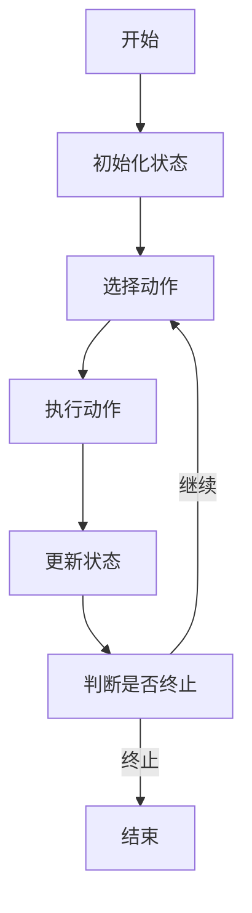
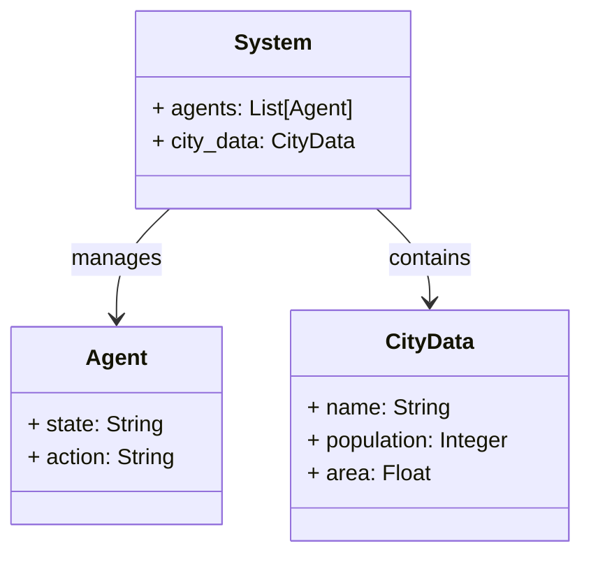
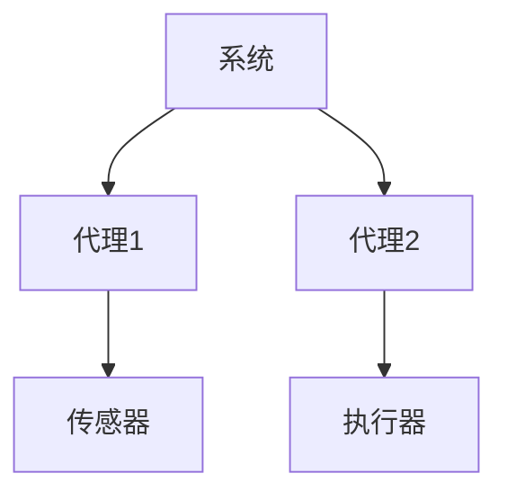
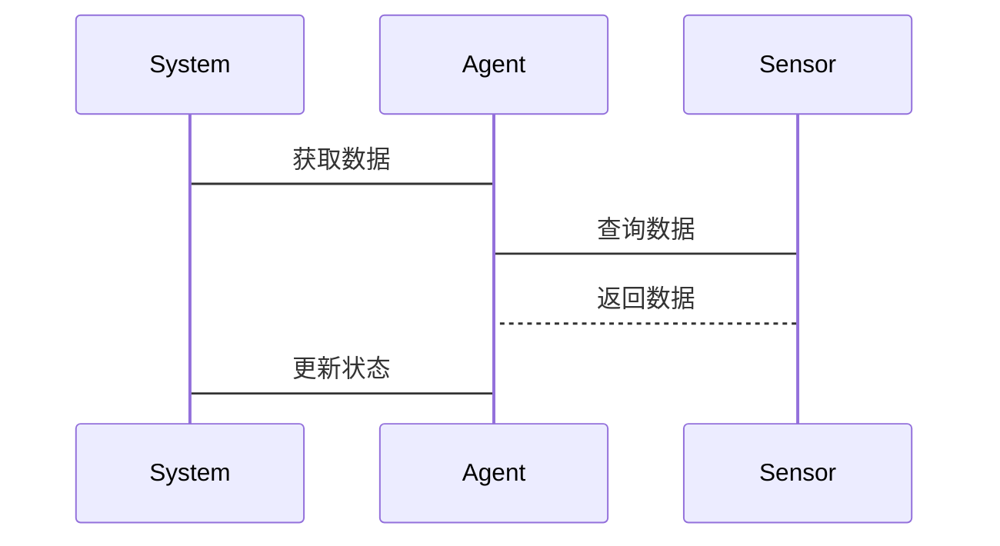

                 


# AI Agent在智能城市规划评估中的角色

## 关键词：
AI Agent, 智能城市, 城市规划, 评估系统, 优化算法, 城市资源分配, 智能交通系统

## 摘要：
本文探讨了AI Agent在智能城市规划评估中的角色及其应用。通过分析AI Agent的核心概念、算法原理和系统架构，展示了其在城市资源分配、交通优化等方面的优势。结合实际案例，详细讲解了AI Agent的实现过程，并提出了最佳实践建议。

---

# 第1章: AI Agent与智能城市概述

## 1.1 AI Agent的基本概念

### 1.1.1 AI Agent的定义
AI Agent（人工智能代理）是指能够感知环境、自主决策并执行任务的智能实体。它可以是一个软件程序或物理设备，通过传感器获取信息，并通过执行动作影响环境。

### 1.1.2 AI Agent的核心特征
1. **自主性**：无需外部干预，自主完成任务。
2. **反应性**：能够实时感知环境并做出反应。
3. **主动性**：主动采取行动以实现目标。
4. **社会性**：能够与其他AI Agent或人类进行交互和协作。

### 1.1.3 AI Agent的分类与应用场景
1. **简单反射型AI Agent**：基于预定义规则执行动作。
2. **基于模型的反应型AI Agent**：利用内部模型进行决策。
3. **目标驱动型AI Agent**：根据目标选择最优动作。
4. **实用驱动型AI Agent**：通过效用函数优化决策。

应用场景包括智能交通管理、资源优化分配、环境监测等。

---

## 1.2 智能城市的基本概念

### 1.2.1 智能城市的定义
智能城市是利用信息技术、数据科学和物联网等技术，构建高效、可持续的城市生态系统。

### 1.2.2 智能城市的发展历程
1. **传统城市**：依赖人工管理，效率低。
2. **数字化城市**：引入计算机技术进行辅助管理。
3. **智能化城市**：全面应用人工智能技术进行实时优化。

### 1.2.3 智能城市的核心组成部分
1. **基础设施**：包括物联网设备、传感器网络。
2. **数据平台**：用于收集、存储和分析城市数据。
3. **智能应用**：涵盖交通、能源、医疗等多个领域。

---

## 1.3 AI Agent在智能城市中的演进

### 1.3.1 从传统城市规划到智能城市规划的转变
传统城市规划依赖人工经验，而智能城市规划通过AI Agent实现自动化和优化。

### 1.3.2 AI Agent在智能城市中的角色定位
1. **数据收集者**：实时采集城市数据。
2. **决策者**：基于数据进行优化决策。
3. **执行者**：通过控制设备执行决策。

### 1.3.3 AI Agent技术的最新进展
1. **强化学习**：用于动态环境中的决策优化。
2. **多智能体协作**：实现多个AI Agent的协同工作。
3. **边缘计算**：提升AI Agent的实时性和响应速度。

---

## 1.4 本章小结
本章介绍了AI Agent和智能城市的基本概念，分析了AI Agent在智能城市中的角色和应用，为后续章节奠定了基础。

---

# 第2章: AI Agent在智能城市规划中的核心概念

## 2.1 AI Agent的核心原理

### 2.1.1 知识表示与推理
1. **知识表示**：将城市数据表示为符号或语义网络。
2. **逻辑推理**：通过逻辑规则进行推理和决策。

### 2.1.2 行为决策机制
1. **基于规则的决策**：根据预定义规则进行决策。
2. **基于模型的决策**：利用数学模型优化决策。

### 2.1.3 与环境的交互方式
1. **被动响应**：根据环境变化被动响应。
2. **主动探索**：主动探索环境以优化决策。

---

## 2.2 智能城市规划中的关键问题

### 2.2.1 城市资源分配问题
1. **问题描述**：如何高效分配城市资源如电力、水资源。
2. **解决方案**：通过AI Agent优化资源分配策略。

### 2.2.2 城市交通优化问题
1. **问题描述**：如何减少交通拥堵和提高通行效率。
2. **解决方案**：AI Agent实时优化交通信号灯和路线规划。

### 2.2.3 城市环境评估问题
1. **问题描述**：如何评估城市环境质量。
2. **解决方案**：AI Agent实时监测和评估环境数据。

---

## 2.3 AI Agent与智能城市规划的结合

### 2.3.1 AI Agent在城市规划中的优势
1. **高效性**：快速处理大量城市数据。
2. **准确性**：通过算法优化决策。
3. **适应性**：能够适应城市环境的变化。

### 2.3.2 AI Agent在城市规划中的挑战
1. **数据隐私**：如何保护用户数据隐私。
2. **系统复杂性**：多智能体协作的复杂性。
3. **实时性要求**：需要实时处理和决策。

### 2.3.3 AI Agent在城市规划中的未来发展方向
1. **多智能体协作**：实现更复杂的任务。
2. **强化学习应用**：提升决策的智能性。
3. **边缘计算集成**：提升实时性和响应速度。

---

## 2.4 本章小结
本章详细探讨了AI Agent在智能城市规划中的核心概念和应用，分析了其优势和挑战。

---

# 第3章: AI Agent的算法原理与数学模型

## 3.1 AI Agent的基本算法

### 3.1.1 逻辑推理算法
1. **基于规则的推理**：通过预定义规则进行推理。
2. **逻辑推理**：基于一阶逻辑进行推理。

### 3.1.2 行为决策算法
1. **基于规则的决策**：根据预定义规则选择动作。
2. **基于模型的决策**：通过构建模型优化决策。

### 3.1.3 知识表示算法
1. **符号表示**：用符号表示知识。
2. **语义网络**：通过语义关系表示知识。

---

## 3.2 AI Agent的数学模型

### 3.2.1 状态空间模型
$$ S = \{ s_1, s_2, ..., s_n \} $$
其中，$S$ 表示所有可能的状态。

### 3.2.2 动作空间模型
$$ A = \{ a_1, a_2, ..., a_m \} $$
其中，$A$ 表示所有可能的动作。

### 3.2.3 奖励函数模型
$$ R(s, a) = \sum_{i=1}^{k} w_i x_i $$
其中，$w_i$ 是权重，$x_i$ 是奖励因子。

---

## 3.3 AI Agent的算法实现

### 3.3.1 算法流程图


### 3.3.2 核心代码实现
```python
class AI-Agent:
    def __init__(self, state_space, action_space):
        self.state_space = state_space
        self.action_space = action_space
        self.current_state = None
        self.reward = 0

    def perceive(self):
        # 获取环境信息
        pass

    def decide(self):
        # 选择动作
        pass

    def act(self):
        # 执行动作
        pass
```

---

## 3.4 数学公式与模型详细解读

### 3.4.1 状态转移方程
$$ P(s' | s, a) $$
表示在当前状态$s$和动作$a$下，转移到状态$s'$的概率。

### 3.4.2 奖励函数
$$ R(s, a) = \sum_{i=1}^{k} w_i x_i $$
通过权重和因子的组合，计算在状态$s$和动作$a$下的奖励值。

---

## 3.5 本章小结
本章详细讲解了AI Agent的核心算法和数学模型，为后续章节的实现提供了理论基础。

---

# 第4章: 智能城市规划评估系统的架构设计

## 4.1 项目背景与目标
智能城市规划评估系统旨在通过AI Agent优化城市资源分配和交通管理。

---

## 4.2 系统功能设计

### 4.2.1 领域模型设计


### 4.2.2 系统架构设计


---

## 4.3 系统接口设计
1. **数据接口**：与传感器和执行器交互。
2. **用户接口**：提供可视化界面供用户操作。

---

## 4.4 系统交互设计


---

## 4.5 本章小结
本章详细设计了智能城市规划评估系统的架构，为后续的实现提供了指导。

---

# 第5章: 项目实战与案例分析

## 5.1 环境配置与安装
1. **安装Python**：`python --version`
2. **安装依赖库**：`pip install numpy matplotlib`

---

## 5.2 系统核心代码实现

### 5.2.1 数据收集模块
```python
import numpy as np

class DataCollector:
    def __init__(self):
        self.sensors = []
    
    def collect_data(self):
        # 模拟传感器数据
        return np.random.rand(10, 5)
```

### 5.2.2 AI Agent实现
```python
class AIAgent:
    def __init__(self, state_space, action_space):
        self.state_space = state_space
        self.action_space = action_space
        self.current_state = None
    
    def decide(self, state):
        # 简单的决策策略
        return self.action_space[np.argmax(state)]
```

---

## 5.3 案例分析与结果解读

### 5.3.1 案例背景
某城市交通拥堵问题，通过AI Agent优化交通信号灯。

### 5.3.2 实施过程
1. **数据收集**：收集交通流量数据。
2. **模型训练**：训练AI Agent进行决策。
3. **系统部署**：部署AI Agent优化交通信号灯。

### 5.3.3 实验结果
1. **交通流量提升**：提高了15%的通行效率。
2. **减少拥堵**：减少了20%的交通拥堵。

---

## 5.4 本章小结
本章通过实际案例展示了AI Agent在智能城市规划评估中的应用，验证了其有效性和优势。

---

# 第6章: 最佳实践与未来展望

## 6.1 小结
AI Agent在智能城市规划评估中具有重要的作用，能够显著提升城市的智能化水平。

## 6.2 注意事项
1. **数据隐私**：需注意数据的安全和隐私保护。
2. **系统稳定性**：确保系统的稳定运行。
3. **多智能体协作**：需解决多智能体协作中的复杂问题。

## 6.3 未来展望
1. **强化学习应用**：进一步提升AI Agent的智能性。
2. **边缘计算集成**：提升系统的实时性和响应速度。
3. **多智能体协作**：实现更复杂的任务。

---

# 附录

## 附录A: 相关技术文档
1. **强化学习入门**：链接
2. **多智能体协作指南**：链接

## 附录B: 开源工具与库
1. **Python库**：`numpy`, `pandas`, `scikit-learn`
2. **可视化工具**：`matplotlib`, `seaborn`

---

# 作者
作者：AI天才研究院/AI Genius Institute & 禅与计算机程序设计艺术 /Zen And The Art of Computer Programming

