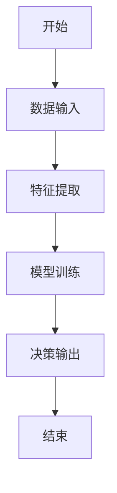
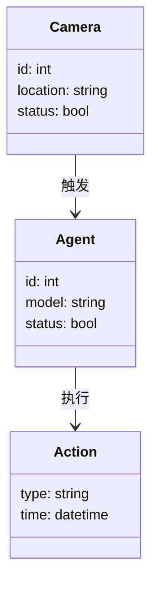
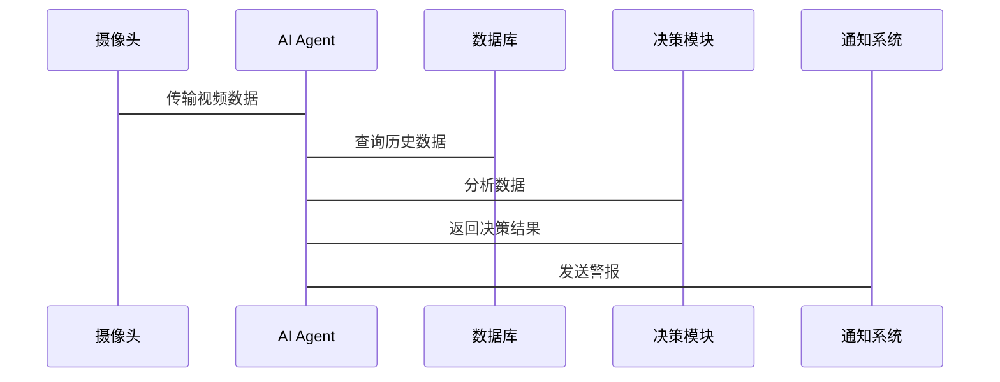

                 


# AI Agent在智能安防系统中的角色

> 关键词：AI Agent, 智能安防系统, 人工智能, 算法原理, 系统架构

> 摘要：本文深入探讨了AI Agent在智能安防系统中的角色及其重要性。通过分析其核心概念、算法原理、系统架构和实际应用，本文揭示了AI Agent如何提升智能安防系统的效率和准确性。结合具体案例和项目实战，本文为读者提供了全面的理解和实践经验。

---

## 第一部分：AI Agent在智能安防系统中的背景与概念

### 第1章：AI Agent的基本概念与背景

#### 1.1 AI Agent的定义与特点

##### 1.1.1 AI Agent的基本定义
AI Agent（人工智能代理）是一种能够感知环境、自主决策并执行任务的智能实体。它通过传感器获取数据，利用算法处理信息，并通过执行器与环境互动。AI Agent的核心目标是通过智能算法优化决策过程，提高系统的效率和准确性。

##### 1.1.2 AI Agent的核心特点
- **自主性**：AI Agent能够在没有外部干预的情况下独立运行。
- **反应性**：能够实时感知环境变化并做出反应。
- **学习能力**：通过机器学习算法不断优化自身的决策模型。
- **协作性**：能够与其他AI Agent或系统进行协作，共同完成复杂任务。

##### 1.1.3 AI Agent与传统安防系统的区别
传统安防系统依赖于固定的规则和程序，而AI Agent能够动态调整策略，适应环境变化。AI Agent能够主动识别异常情况，实时响应，而传统系统只能被动反应。

#### 1.2 智能安防系统的发展历程

##### 1.2.1 安防系统的演变
安防系统从最初的物理防护（如围墙、监控摄像头）逐步发展到智能化阶段，经历了模拟监控、数字监控、网络化监控，最终进入AI驱动的智能监控阶段。

##### 1.2.2 智能化阶段的特征
智能化阶段的安防系统具备以下特征：
- **数据驱动**：依赖大量数据进行分析和决策。
- **实时性**：能够快速处理数据并做出反应。
- **自主学习**：通过机器学习不断优化自身的识别和判断能力。

##### 1.2.3 当前智能安防系统的现状
当前，智能安防系统广泛应用于公共安全、交通管理、智能家居等领域。AI Agent在其中扮演着越来越重要的角色，特别是在异常检测、行为分析和应急响应方面表现突出。

#### 1.3 AI Agent在智能安防中的作用

##### 1.3.1 AI Agent的核心功能
- **数据采集与处理**：AI Agent通过摄像头、传感器等设备采集环境数据，并进行预处理。
- **异常检测**：利用机器学习算法识别异常行为或模式。
- **决策与执行**：根据检测结果做出决策，并通过执行器采取行动。

##### 1.3.2 AI Agent在智能安防中的应用场景
- **视频监控**：实时监控视频流，识别潜在威胁。
- **行为分析**：分析人群行为，预测可能的安全隐患。
- **应急响应**：在发生突发事件时，协调资源进行快速响应。

##### 1.3.3 AI Agent的优势与挑战
优势：
- **高效性**：能够快速处理大量数据，提高安防效率。
- **准确性**：通过机器学习模型提高识别的准确性。
- **适应性**：能够动态调整策略，适应环境变化。

挑战：
- **数据隐私**：处理大量敏感数据可能导致隐私泄露。
- **算法依赖**：依赖于算法的准确性，可能受到攻击。
- **复杂性**：多Agent协作可能导致系统复杂性增加。

### 第2章：AI Agent的核心概念与联系

#### 2.1 AI Agent的原理

##### 2.1.1 感知与理解
AI Agent通过传感器或其他数据源获取环境信息，例如摄像头捕获的图像数据、麦克风采集的声音信号等。这些数据经过预处理后，通过特征提取算法提取关键信息。

##### 2.1.2 决策与执行
AI Agent根据感知到的信息，利用决策算法制定行动方案，并通过执行器执行决策。例如，在视频监控中，AI Agent识别到异常行为后，触发报警或控制摄像头进行跟踪。

##### 2.1.3 学习与优化
AI Agent通过机器学习算法不断优化自身的识别和决策能力。例如，使用深度学习模型训练图像识别模型，提高识别准确率。

#### 2.2 AI Agent的属性特征对比

##### 2.2.1 不同类型AI Agent的对比
| 类型         | 特点                           | 应用场景                     |
|--------------|--------------------------------|------------------------------|
| 反应式Agent  | 基于当前感知做出反应             | 实时监控、应急响应           |
| 计划式Agent  | 具备规划能力，执行复杂任务       | 自动化控制、任务调度         |
| 学习式Agent  | 能够通过学习优化决策             | 预测分析、行为识别           |

##### 2.2.2 基于表格的特征对比
| 特性         | 反应式Agent | 计划式Agent | 学习式Agent |
|--------------|-------------|-------------|-------------|
| 决策方式     | 基于当前感知 | 基于规划    | 基于学习模型 |
| 复杂性       | 较低        | 较高        | 极高         |
| 适用场景     | 实时反应     | 复杂任务     | 数据分析与预测 |

##### 2.2.3 ER实体关系图
```mermaid
er
actor: AI Agent
sense_data: 感知数据
decision: 决策
execute_action: 执行动作

actor --> sense_data: 采集
actor --> decision: 制定
decision --> execute_action: 执行
```

#### 2.3 AI Agent的属性特征

##### 2.3.1 属性特征
- **感知能力**：AI Agent能够感知环境信息，例如图像、声音、温度等。
- **决策能力**：基于感知信息，AI Agent能够制定决策策略。
- **学习能力**：通过机器学习算法，AI Agent能够优化自身的识别和决策能力。
- **协作能力**：能够与其他Agent或系统进行协作，共同完成任务。

---

## 第二部分：AI Agent的算法原理

### 第3章：AI Agent的算法原理

#### 3.1 算法流程图


#### 3.2 算法实现

##### 3.2.1 数据预处理
```python
import numpy as np

# 假设input_data是一个numpy数组，表示输入的原始数据
def preprocess(input_data):
    # 归一化处理
    normalized_data = (input_data - np.mean(input_data)) / np.std(input_data)
    return normalized_data
```

##### 3.2.2 特征提取
```python
import tensorflow as tf
from tensorflow.keras.layers import Conv2D, MaxPooling2D, Flatten, Dense

model = tf.keras.Sequential([
    Conv2D(32, (3,3), activation='relu', input_shape=(64,64,3)),
    MaxPooling2D((2,2)),
    Conv2D(64, (3,3), activation='relu'),
    MaxPooling2D((2,2)),
    Flatten(),
    Dense(128, activation='relu'),
    Dense(1, activation='sigmoid')
])
```

##### 3.2.3 模型训练
```python
model.compile(optimizer='adam', loss='binary_crossentropy', metrics=['accuracy'])
model.fit(X_train, y_train, epochs=10, batch_size=32)
```

##### 3.2.4 决策输出
```python
# 预测
predictions = model.predict(X_test)
# 输出结果
for i in range(len(predictions)):
    if predictions[i] > 0.5:
        print("异常 detected")
    else:
        print("正常")
```

#### 3.3 数学模型与公式

##### 3.3.1 逻辑回归模型
$$ P(y=1|x) = \frac{1}{1 + e^{-\beta x}} $$

##### 3.3.2 支持向量机
$$ \text{最大化} \quad \frac{1}{2}\|w\|^2 $$
$$ \text{约束} \quad y_i(w \cdot x_i + b) \geq 1 $$

##### 3.3.3 神经网络模型
$$ a^{(l+1)} = \sigma(w a^{(l)} + b) $$
其中，$\sigma$ 是激活函数，如ReLU或sigmoid。

---

## 第三部分：AI Agent的系统分析与架构设计方案

### 第4章：系统分析与架构设计方案

#### 4.1 问题场景介绍
智能安防系统需要实时监控多个摄像头的视频流，识别异常行为，如非法闯入、打架斗殴等。AI Agent需要具备高效的识别能力和快速的响应能力。

#### 4.2 系统功能设计

##### 4.2.1 领域模型


##### 4.2.2 系统架构设计


##### 4.2.3 系统接口设计
- **Camera接口**：提供视频流数据。
- **Agent接口**：接收数据，处理并返回决策结果。
- **Notification接口**：发送警报信息。

##### 4.2.4 系统交互


---

## 第四部分：AI Agent的项目实战

### 第5章：项目实战

#### 5.1 环境安装

##### 5.1.1 安装Python和相关库
```bash
python --version
pip install numpy
pip install tensorflow
pip install mermaid
```

##### 5.1.2 安装OpenCV
```bash
pip install opencv-python
```

#### 5.2 系统核心实现源代码

##### 5.2.1 数据预处理
```python
import cv2
import numpy as np

def preprocess_image(image_path):
    img = cv2.imread(image_path)
    gray = cv2.cvtColor(img, cv2.COLOR_BGR2GRAY)
    return gray
```

##### 5.2.2 模型训练
```python
import tensorflow as tf
from tensorflow.keras.layers import *
from tensorflow.keras.models import Model

def create_model(input_shape):
    inputs = Input(shape=input_shape)
    x = Conv2D(32, (3,3), activation='relu')(inputs)
    x = MaxPooling2D((2,2))(x)
    x = Conv2D(64, (3,3), activation='relu')(x)
    x = MaxPooling2D((2,2))(x)
    x = Flatten()(x)
    x = Dense(128, activation='relu')(x)
    outputs = Dense(1, activation='sigmoid')(x)
    return Model(inputs=inputs, outputs=outputs)

model = create_model((64,64,3))
model.compile(optimizer='adam', loss='binary_crossentropy', metrics=['accuracy'])
```

##### 5.2.3 模型推理
```python
import numpy as np

def detect_anomaly(model, image):
    preprocessed = preprocess_image(image)
    preprocessed = np.expand_dims(preprocessed, axis=0)
    prediction = model.predict(preprocessed)
    return prediction[0][0] > 0.5
```

#### 5.3 案例分析与详细讲解

##### 5.3.1 案例分析
假设我们部署了一个AI Agent在某商场的入口，实时监控视频流。当检测到有人非法闯入时，AI Agent会触发报警，并通知保安人员。

##### 5.3.2 代码应用解读
在上述代码中，AI Agent通过摄像头获取视频数据，经过预处理后，利用训练好的模型进行异常检测。如果检测到异常行为，AI Agent会触发警报，并通过通知系统通知相关人员。

##### 5.3.3 项目小结
通过本项目，我们实现了AI Agent在智能安防系统中的应用，展示了其在实时监控和异常检测中的强大能力。

---

## 第五部分：AI Agent的最佳实践

### 第6章：最佳实践

#### 6.1 小结
AI Agent在智能安防系统中扮演着越来越重要的角色，通过机器学习算法和自主决策能力，显著提高了系统的效率和准确性。

#### 6.2 注意事项
- **数据隐私**：在处理敏感数据时，需严格遵守数据隐私法规。
- **算法依赖**：需要定期更新模型，防止被攻击或失效。
- **系统复杂性**：在多Agent协作时，需注意系统的复杂性和维护成本。

#### 6.3 拓展阅读
- 《Deep Learning》——Ian Goodfellow
- 《强化学习（深入浅出）》——李宏志
- 《计算机视觉：算法与应用》——Richard Szeliski

---

## 作者：AI天才研究院/AI Genius Institute & 禅与计算机程序设计艺术 /Zen And The Art of Computer Programming

---

通过本文的详细讲解，读者可以全面了解AI Agent在智能安防系统中的角色及其应用。从基本概念到算法原理，再到系统架构和项目实战，本文为读者提供了全面的视角和深入的知识。希望本文能够为从事智能安防系统研究和开发的读者提供有价值的参考和启发。

