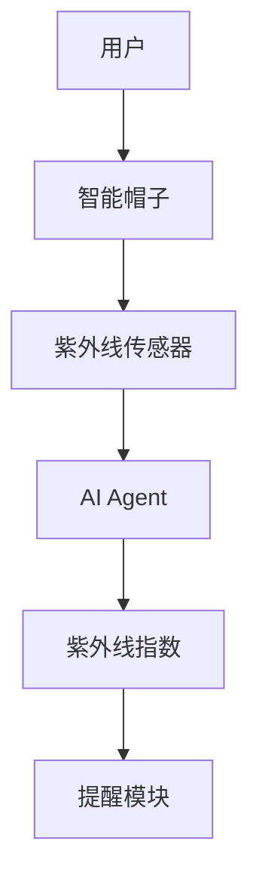
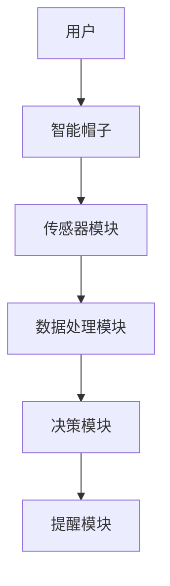

                 


# 《AI Agent在智能帽子中的紫外线防护提醒》

---

## 第一部分：背景与概念

### 第1章：紫外线防护与AI Agent概述

#### 1.1 紫外线防护的重要性
- **紫外线的危害与防护需求**：紫外线是太阳辐射中的一部分，过量的紫外线暴露可能导致皮肤癌、晒伤、眼睛损伤等问题。
- **智能设备在紫外线防护中的作用**：智能设备可以通过实时监测紫外线强度，提醒用户采取防护措施。

#### 1.2 AI Agent的基本概念
- **AI Agent**：人工智能代理（AI Agent）是一种能够感知环境、自主决策并执行任务的智能实体。
- **AI Agent的核心功能与特点**：
  - 感知环境：通过传感器或其他数据源获取信息。
  - 决策与推理：基于获取的信息进行分析和决策。
  - 自主执行：根据决策结果执行相应的操作。
- **AI Agent在智能设备中的应用**：广泛应用于自动驾驶、智能家居、医疗设备等领域。

#### 1.3 智能帽子与紫外线防护的结合
- **智能帽子的功能与应用场景**：集成传感器和AI Agent，实时监测环境参数并提供反馈。
- **紫外线防护提醒的实现方式**：通过AI Agent分析紫外线数据，向用户发出提醒。
- **AI Agent在智能帽子中的角色**：作为系统的“大脑”，负责数据处理和决策。

---

## 第二部分：核心概念与联系

### 第2章：AI Agent与紫外线监测的核心原理

#### 2.1 AI Agent的基本原理
- **AI Agent的感知与决策机制**：通过传感器获取数据，结合预设算法进行分析和决策。
- **基于传感器的数据输入**：AI Agent通过紫外线传感器获取实时数据。
- **数据处理与分析算法**：使用机器学习算法对数据进行分类和预测。

#### 2.2 紫外线监测的原理
- **紫外线辐射的基本概念**：紫外线分为UV-A、UV-B、UV-C三种，其中UV-B对人类皮肤伤害最大。
- **紫外线传感器的工作原理**：传感器通过光电效应测量紫外线强度。
- **紫外线指数的计算与分类**：根据紫外线强度计算指数，并分为不同等级。

#### 2.3 AI Agent与紫外线监测的结合
- **数据流的传递与处理**：传感器数据传输给AI Agent，经过处理后生成提醒信号。
- **AI Agent的决策逻辑**：根据紫外线指数和用户需求，决定是否发出提醒。
- **与智能帽子的交互方式**：AI Agent通过蓝牙或无线通信与智能帽子交互。

#### 2.4 核心概念对比表
| 比较项 | 紫外线监测 | 传统防护方式 |
|--------|------------|---------------|
| 数据来源 | 紫外线传感器 | 人工观测或天气预报 |
| 实时性 | 实时监测 | 延时较大 |
| 精准度 | 高精度 | 可能误差较大 |

#### 2.5 ER实体关系图（Mermaid）



---

## 第三部分：算法原理与数学模型

### 第3章：AI Agent的算法原理

#### 3.1 数据采集与预处理
- **数据采集**：紫外线传感器实时采集紫外线强度数据。
- **数据预处理**：对采集的数据进行去噪和归一化处理。

#### 3.2 紫外线指数计算
- **数学模型**：紫外线指数（UV Index）的计算公式为：
  $$ UV\ Index = \frac{UVA + UVB}{2} $$
  其中，UVA和UVB分别为UVA和UVB的辐射强度。

#### 3.3 AI Agent的决策逻辑
- **决策流程**：
  1. 获取紫外线指数。
  2. 判断指数是否超过预设阈值。
  3. 如果超过阈值，触发提醒模块。

#### 3.4 代码实现
```python
import numpy as np
from sklearn import preprocessing

# 假设传感器数据为数组形式
sensor_data = np.array([100, 80, 90, 120])

# 数据预处理：归一化
normalized_data = preprocessing.normalize(sensor_data)

# 计算紫外线指数
uv_index = np.mean(normalized_data)

# 决策逻辑
threshold = 5  # 预设阈值
if uv_index > threshold:
    print("紫外线强度过高，建议采取防护措施！")
else:
    print("紫外线强度正常，可以安全外出。")
```

---

## 第四部分：系统分析与架构设计

### 第4章：智能帽子紫外线防护系统架构

#### 4.1 系统功能设计
- **功能模块**：
  - 传感器模块：采集紫外线数据。
  - 数据处理模块：预处理和计算紫外线指数。
  - 决策模块：基于紫外线指数触发提醒。
  - 提醒模块：通过震动或声音提醒用户。

#### 4.2 系统架构设计（Mermaid架构图）



#### 4.3 接口与交互设计
- **接口设计**：传感器模块与数据处理模块通过SPI接口通信。
- **交互流程**：
  1. 用户戴上智能帽子。
  2. 传感器模块采集紫外线数据。
  3. 数据处理模块计算紫外线指数。
  4. 决策模块判断是否触发提醒。
  5. 提醒模块发出提醒信号。

---

## 第五部分：项目实战

### 第5章：智能帽子紫外线防护系统实现

#### 5.1 环境配置
- **硬件环境**：智能帽子、紫外线传感器、蓝牙模块。
- **软件环境**：Python 3.8+，相关库（如pybluez、numpy）。

#### 5.2 核心代码实现
```python
import time
import bluetooth

# 蓝牙通信模块
class BluetoothManager:
    def __init__(self):
        self.sock = None

    def connect(self, address):
        self.sock = bluetooth.BluetoothSocket(bluetooth.RFCOMM)
        self.sock.connect((address, 1))

    def send_data(self, data):
        self.sock.send(data)

# 紫外线传感器模拟模块
class UVSensor:
    def __init__(self):
        self.data = 0

    def read_uv(self):
        # 模拟传感器数据
        return np.random.randint(0, 150)

# AI Agent实现
class AIAgent:
    def __init__(self):
        self.uv_sensor = UVSensor()
        self.bluetooth = BluetoothManager()

    def process_uv_data(self):
        uv_value = self.uv_sensor.read_uv()
        normalized_uv = uv_value / 150
        if normalized_uv > 0.6:
            self.bluetooth.connect("MAC_ADDRESS")  # 替换为实际设备地址
            self.bluetooth.send_data("UV过高，请采取防护措施！")
            print("提醒已发送。")
        else:
            print("紫外线强度正常。")

# 主程序
if __name__ == "__main__":
    agent = AIAgent()
    while True:
        agent.process_uv_data()
        time.sleep(60)  # 每分钟检测一次
```

#### 5.3 案例分析
- **案例场景**：用户在户外长时间活动，系统实时监测紫外线强度。
- **系统表现**：当紫外线指数超过阈值时，系统发出提醒，用户采取防护措施。

#### 5.4 项目小结
- 通过本项目，我们实现了基于AI Agent的紫外线防护提醒系统，展示了AI技术在智能设备中的应用潜力。

---

## 第六部分：最佳实践与总结

### 第6章：总结与展望

#### 6.1 最佳实践
- **传感器选择**：选用高精度紫外线传感器。
- **数据处理**：确保数据预处理的准确性。
- **系统优化**：优化AI Agent的决策算法，提高响应速度。

#### 6.2 小结
- 本文详细介绍了AI Agent在智能帽子中的紫外线防护提醒系统的实现，从背景到算法，从设计到实战，全面展示了系统的实现过程。

#### 6.3 注意事项
- 确保传感器的校准和维护，保证数据的准确性。
- 注意系统的实时性和响应速度，确保用户体验。

#### 6.4 拓展阅读
- 《基于AI的智能设备设计》
- 《紫外线辐射与健康》

---

## 作者

作者：AI天才研究院/AI Genius Institute & 禅与计算机程序设计艺术 /Zen And The Art of Computer Programming

---

感谢您的阅读！希望这篇文章能为您提供有价值的见解和启发！

