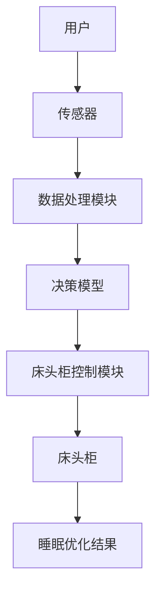
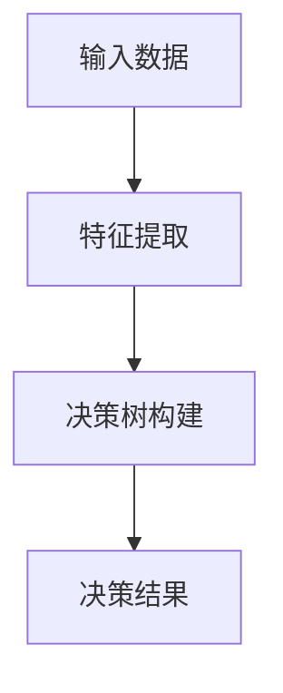
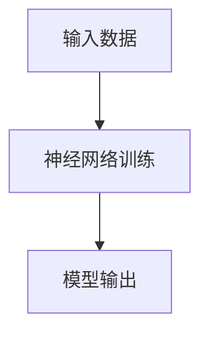
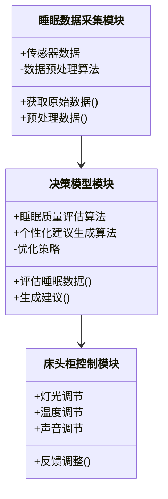
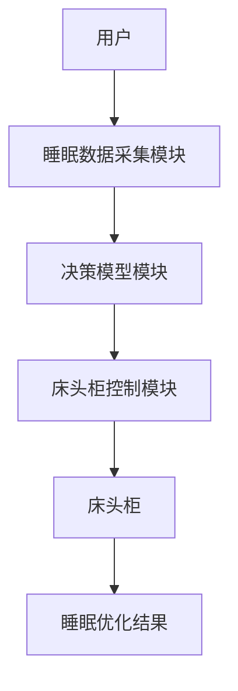

                 


# AI Agent在智能床头柜中的睡眠辅助功能

> 关键词：AI Agent, 智能床头柜, 睡眠辅助, 数据分析, 个性化建议, 智能交互

> 摘要：本文详细探讨了AI Agent在智能床头柜中的睡眠辅助功能的设计与实现。通过分析睡眠健康的重要性，介绍了AI Agent的基本概念及其在智能床头柜中的应用。深入讲解了AI Agent的核心功能，包括睡眠监测与数据分析、个性化建议的生成与实现、智能交互的设计与优化。通过实际案例分析，展示了如何通过AI技术提升睡眠质量，并提供了系统架构设计与项目实战指导，最后总结了最佳实践与未来发展方向。

---

# 第一部分: AI Agent与智能床头柜的睡眠辅助功能背景介绍

## 第1章: 睡眠健康的重要性与AI技术的结合

### 1.1 睡眠对身体和心理的影响
- 睡眠是人体生理功能的重要组成部分，直接影响身体健康、心理健康和生活质量。
- 睡眠不足会导致注意力下降、情绪不稳定、免疫力减弱等多方面的问题。
- 现代社会节奏加快，睡眠问题日益严重，尤其是在年轻人和中老年人群中。

### 1.2 AI技术在睡眠健康中的潜力
- AI技术可以通过数据分析、模式识别等手段，帮助用户更好地了解自己的睡眠状态。
- AI Agent可以实时监测睡眠数据，提供个性化建议，帮助用户改善睡眠质量。

### 1.3 智能床头柜的设计目标
- 智能床头柜是一种结合了智能家居和AI技术的创新产品，旨在为用户提供智能化的睡眠辅助功能。
- 设计目标包括：实时监测睡眠数据、提供个性化睡眠建议、优化睡眠环境等。

---

## 第2章: AI Agent在智能床头柜中的核心功能

### 2.1 睡眠监测与数据分析
- **睡眠监测的实现方式**：通过内置传感器采集用户的睡眠数据，包括心率、呼吸频率、体动次数等。
- **数据采集与处理流程**：传感器数据的采集、数据预处理（去噪、特征提取）、数据分析与睡眠质量评估。
- **睡眠质量评估模型**：基于机器学习算法，构建睡眠质量评估模型，帮助用户了解自己的睡眠状态。

### 2.2 个性化睡眠建议的生成与实现
- **个性化睡眠计划的设计**：根据用户的睡眠数据和生活习惯，生成个性化的睡眠计划，包括睡眠时间、睡眠环境优化建议等。
- **AI Agent如何提供睡眠建议**：通过分析用户的睡眠数据，AI Agent可以主动调整床头柜的灯光、温度、声音等参数，帮助用户进入深度睡眠状态。
- **用户反馈与系统优化**：用户可以通过床头柜的交互界面提供反馈，系统根据反馈不断优化睡眠建议。

### 2.3 智能床头柜的交互设计
- **用户界面设计原则**：界面简洁直观，便于用户操作。
- **多模态交互方式的实现**：支持语音交互、触控交互等多种交互方式，提升用户体验。
- **交互体验的优化策略**：根据用户的行为习惯，动态调整交互方式和界面布局，提供个性化的交互体验。

---

# 第二部分: AI Agent的核心概念与技术原理

## 第3章: AI Agent的核心概念与原理

### 3.1 AI Agent的感知层
- **传感器数据的采集与处理**：通过多种传感器（如心率传感器、加速度传感器）采集用户的睡眠数据。
- **数据融合与特征提取**：将多源传感器数据进行融合，提取有用的特征，如睡眠周期、深度睡眠时间等。
- **感知层的算法实现**：使用滤波算法（如滑动平均滤波）对传感器数据进行预处理，消除噪声。

### 3.2 AI Agent的决策层
- **决策模型的构建与训练**：基于机器学习算法（如决策树、随机森林）构建睡眠质量评估模型。
- **多目标优化算法的应用**：在生成个性化睡眠建议时，AI Agent需要同时优化多个目标（如睡眠时间、睡眠环境参数）。
- **决策层的实现流程**：数据输入 → 模型推理 → 决策结果输出。

### 3.3 AI Agent的执行层
- **执行策略的设计与实现**：根据决策层的输出，床头柜调整灯光、温度、声音等参数。
- **执行结果的反馈与调整**：床头柜通过传感器实时监测调整后的效果，并根据反馈进一步优化执行策略。
- **执行层的实现流程**：决策结果 → 执行操作 → 反馈结果。

---

## 第4章: AI Agent的核心概念与联系

### 4.1 AI Agent的核心概念对比
| 核心概念 | 特性 | 说明 |
|----------|------|------|
| 感知层   | 数据采集与处理 | 通过传感器采集用户睡眠数据 |
| 决策层   | 数据分析与决策 | 基于机器学习算法生成睡眠建议 |
| 执行层   | 参数调整与反馈 | 根据决策结果调整床头柜参数 |

### 4.2 实体关系图


---

## 第5章: 算法原理讲解

### 5.1 基于决策树的睡眠质量评估


- **决策树算法**：通过特征提取和数据分割构建决策树，实现睡眠质量的分类。
- **数学模型**：熵和信息增益公式：
  $$
  \text{熵} = -\sum_{i=1}^{n} p_i \log p_i
  $$
  $$
  \text{信息增益} = H(\text{原始数据}) - H(\text{子节点数据})
  $$

### 5.2 基于神经网络的睡眠监测


- **神经网络模型**：使用卷积神经网络（CNN）对睡眠数据进行特征提取和分类。
- **数学模型**：神经网络的前向传播公式：
  $$
  y = \sigma(wx + b)
  $$
  其中，$\sigma$ 是激活函数。

---

## 第6章: 系统分析与架构设计方案

### 6.1 问题场景介绍
- 睡眠监测与优化的场景：用户在夜间使用床头柜，AI Agent实时监测睡眠数据，并根据数据调整床头柜参数。
- 系统功能需求：睡眠监测、个性化建议生成、智能交互。

### 6.2 系统功能设计
- **领域模型类图**：


### 6.3 系统架构设计
- **系统架构图**：


---

## 第7章: 项目实战

### 7.1 环境安装
- 安装Python、TensorFlow、Scikit-learn等依赖库。

### 7.2 核心代码实现
```python
import numpy as np
from sklearn.tree import DecisionTreeClassifier

# 示例数据
X = np.array([[2, 1], [3, 2], [4, 3], [5, 4]])
y = np.array([0, 1, 2, 3])

# 决策树模型训练
model = DecisionTreeClassifier()
model.fit(X, y)

# 预测
new_data = np.array([[3, 1]])
print(model.predict(new_data))  # 输出结果
```

### 7.3 实际案例分析
- 通过实际案例分析，展示AI Agent如何根据用户的睡眠数据生成个性化建议。

---

## 第8章: 最佳实践

### 8.1 小结
- AI Agent在智能床头柜中的应用为用户提供了一种智能化的睡眠辅助方式。
- 通过实时监测和个性化建议，帮助用户改善睡眠质量。

### 8.2 注意事项
- 睡眠数据的隐私保护非常重要，需要确保数据的安全性。
- 在实际应用中，需要根据用户的反馈不断优化模型和系统。

### 8.3 拓展阅读
- 推荐阅读相关领域的书籍和论文，深入了解AI Agent和睡眠健康的研究进展。

---

# 结语

AI Agent在智能床头柜中的应用是一个充满潜力的领域，通过技术的不断进步，未来的睡眠辅助功能将更加智能化、个性化。希望本文能够为读者提供有价值的技术见解和实践指导。

---

作者：AI天才研究院/AI Genius Institute & 禅与计算机程序设计艺术/Zen And The Art of Computer Programming

