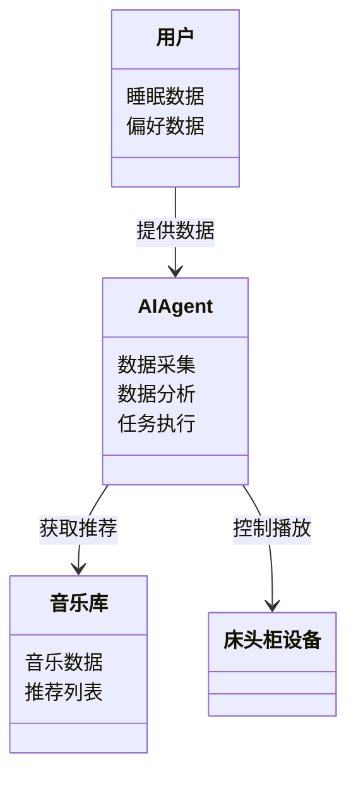
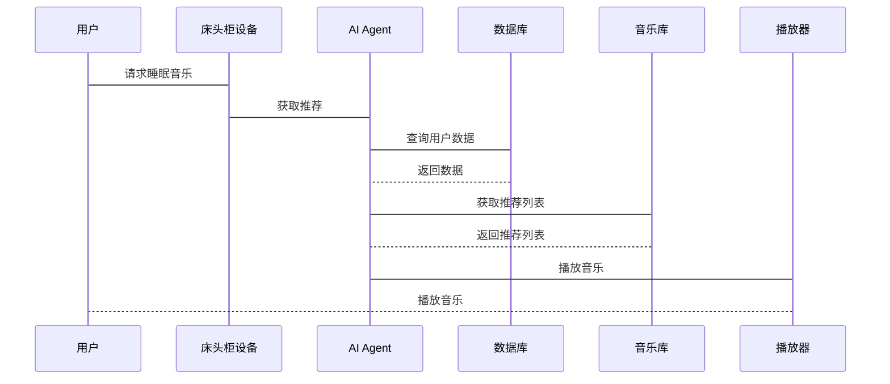

                 


# AI Agent在智能床头柜中的睡眠音乐定制

> 关键词：AI Agent, 智能床头柜, 睡眠音乐, 定制推荐, 算法实现

> 摘要：本文探讨了AI Agent在智能床头柜中的应用，特别是如何通过AI技术实现睡眠音乐的个性化定制。文章从背景介绍、核心概念、算法原理、系统架构到项目实战，详细阐述了AI Agent在睡眠音乐定制中的作用和实现过程。

---

## 第一部分：背景介绍

### 第1章：AI Agent与智能床头柜概述

#### 1.1 问题背景  
睡眠问题是一个普遍存在的健康问题，尤其是在现代生活中，由于工作压力、生活方式等因素的影响，越来越多的人面临睡眠质量下降的问题。睡眠音乐作为一种辅助工具，被广泛应用于改善睡眠质量。然而，现有的睡眠音乐解决方案存在以下问题：  
- 音乐选择单一，无法满足用户的个性化需求。  
- 音乐推荐缺乏智能化，难以根据用户的实时状态（如情绪、生理指标）动态调整。  
- 音乐与床头柜设备的联动性不足，无法实现智能化的睡眠管理。  

#### 1.2 问题描述  
智能床头柜作为一种智能家居设备，可以通过集成AI Agent（人工智能代理）来实现睡眠音乐的个性化定制。AI Agent可以通过收集用户的睡眠数据、偏好数据以及实时生理指标，动态推荐适合用户的睡眠音乐，从而帮助用户改善睡眠质量。  

#### 1.3 问题解决  
AI Agent在智能床头柜中的应用可以实现以下目标：  
- 根据用户的个性化需求推荐睡眠音乐。  
- 动态调整音乐播放策略，以适应用户的实时状态。  
- 实现床头柜设备与音乐播放器的无缝联动。  

#### 1.4 边界与外延  
- AI Agent的功能边界：主要集中在睡眠音乐推荐和床头柜设备控制，不涉及其他智能家居设备的联动。  
- 智能床头柜的适用场景：家庭环境中的睡眠辅助场景。  
- 睡眠音乐定制的潜在扩展：未来可以结合更多生理数据（如心率、体温）和环境数据（如光线、温度）进行更精准的音乐推荐。  

---

## 第二部分：核心概念与联系

### 第2章：AI Agent的核心原理

#### 2.1 AI Agent的基本原理  
AI Agent是一种能够感知环境并采取行动以实现目标的智能体。在智能床头柜中，AI Agent的核心功能包括：  
- 数据采集：通过传感器或用户输入获取睡眠相关数据（如心率、睡眠周期）。  
- 数据分析：利用机器学习算法对数据进行分析，生成个性化推荐。  
- 任务执行：根据分析结果，控制床头柜设备播放推荐的音乐。  

#### 2.2 睡眠音乐定制的原理  
睡眠音乐定制的核心是基于用户数据的个性化推荐。以下是其实现步骤：  
1. 数据采集：收集用户的睡眠数据（如睡眠周期、心率）和偏好数据（如喜欢的音乐类型）。  
2. 数据分析：利用机器学习算法（如协同过滤、深度学习）生成个性化推荐列表。  
3. 任务执行：根据推荐结果，控制音乐播放器播放推荐的音乐。  

#### 2.3 AI Agent与睡眠音乐定制的联系  
AI Agent通过以下方式实现睡眠音乐定制：  
- **数据驱动**：AI Agent依赖于用户数据进行个性化推荐。  
- **动态调整**：AI Agent可以根据用户的实时数据动态调整音乐播放策略。  
- **智能联动**：AI Agent可以控制床头柜设备与其他智能家居设备联动（如调节室温、关闭灯光）。  

---

## 第三部分：算法原理

### 第3章：睡眠音乐推荐算法

#### 3.1 协同过滤算法  
协同过滤是一种基于用户相似性推荐算法。以下是其实现步骤：  
1. 数据预处理：对用户数据进行标准化处理。  
2. 计算相似度：通过余弦相似度计算用户之间的相似度。  
3. 推荐生成：根据相似用户的偏好生成推荐列表。  

#### 3.2 基于内容的推荐算法  
基于内容的推荐算法通过分析音乐的特征（如节奏、音调）进行推荐。以下是其实现步骤：  
1. 数据预处理：提取音乐特征（如节奏、音调）。  
2. 训练模型：使用机器学习算法（如逻辑回归）训练推荐模型。  
3. 推荐生成：根据音乐特征生成推荐列表。  

#### 3.3 深度学习模型  
深度学习模型（如神经网络）可以通过学习用户和音乐的复杂关系生成推荐。以下是其实现步骤：  
1. 数据预处理：将用户数据和音乐数据输入神经网络。  
2. 训练模型：使用反向传播算法训练模型。  
3. 推荐生成：根据模型输出生成推荐列表。  

#### 3.4 算法对比与优化  
以下是传统推荐算法与深度学习模型的对比表格：  

```mermaid
table
| 参数          | 协同过滤         | 基于内容的推荐 | 深度学习模型   |
|---------------|------------------|----------------|---------------|
| 数据需求      | 高               | 低             | 高             |
| 计算复杂度     | 低               | 中             | 高             |
| 推荐精度       | 低               | 中             | 高             |
```

---

## 第四部分：系统分析与架构设计

### 第4章：智能床头柜系统架构

#### 4.1 系统功能设计  
以下是智能床头柜的领域模型：  



#### 4.2 系统架构设计  
以下是智能床头柜的系统架构图：  


#### 4.3 接口设计与交互流程  
以下是系统的交互流程图：  



---

## 第五部分：项目实战

### 第5章：AI Agent在智能床头柜中的实现

#### 5.1 环境安装  
以下是项目所需的环境安装步骤：  
```bash
pip install numpy
pip install scikit-learn
pip install tensorflow
```

#### 5.2 核心代码实现  
以下是睡眠音乐推荐算法的Python代码：  

```python
import numpy as np
from sklearn.metrics.pairwise import cosine_similarity

# 示例数据：用户睡眠数据和音乐特征
user_sleep_data = np.array([0.8, 0.6, 0.7])
music_features = np.array([
    [0.9, 0.5],
    [0.7, 0.8],
    [0.6, 0.9],
    [0.8, 0.4]
])

# 计算余弦相似度
similarity_matrix = cosine_similarity(user_sleep_data.reshape(1, -1), music_features)

# 根据相似度排序并返回推荐列表
recommendations = np.argsort(similarity_matrix, axis=1)
print(recommendations)
```

#### 5.3 实际案例分析  
假设用户A的睡眠数据为：  
- 睡眠周期：浅睡阶段  
- 心率：较低  

AI Agent会推荐以下音乐：  
- 节奏缓慢、音调柔和的音乐，帮助用户放松进入深睡阶段。  

#### 5.4 项目小结  
通过AI Agent实现睡眠音乐定制，可以显著提高睡眠质量。然而，实际应用中需要考虑数据隐私和模型调优等问题。

---

## 第六部分：最佳实践

### 第6章：睡眠音乐定制的注意事项

#### 6.1 小结  
- AI Agent在睡眠音乐定制中的作用不可忽视。  
- 算法选择和数据质量是影响推荐效果的关键因素。  

#### 6.2 注意事项  
- 数据隐私：确保用户的睡眠数据和音乐偏好数据的安全性。  
- 模型调优：根据实际使用效果不断优化推荐算法。  
- 设备联动：确保床头柜设备与其他智能家居设备的无缝联动。  

#### 6.3 拓展阅读  
- 《基于深度学习的音乐推荐系统》  
- 《AI Agent在智能家居中的应用》  

---

## 作者：AI天才研究院 & 禅与计算机程序设计艺术

---

以上是文章的完整目录大纲，您可以根据实际需要进行调整和补充。

