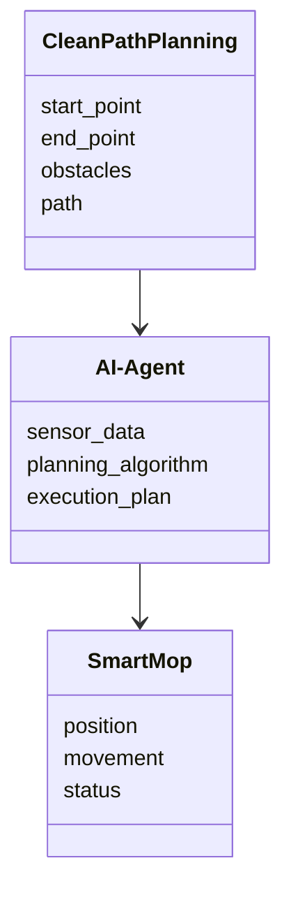
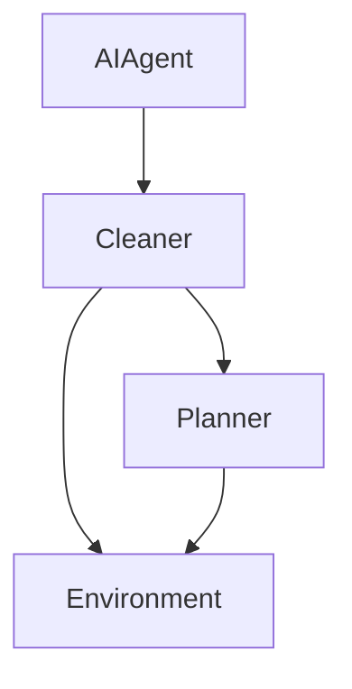
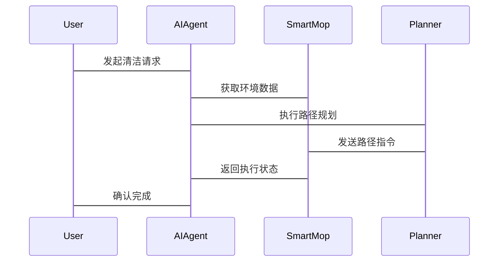

                 


# AI Agent在智能拖把中的清洁路径规划

## 关键词：AI Agent，智能拖把，清洁路径规划，路径优化，算法实现

## 摘要：本文深入探讨了AI Agent在智能拖把清洁路径规划中的应用，从背景分析到系统实现，详细讲解了路径规划算法、系统架构设计及项目实战，帮助读者全面理解AI Agent在智能拖把中的关键作用。

---

# 第一部分：AI Agent在智能拖把中的背景介绍

## 第1章：问题背景与问题描述

### 1.1 问题背景

#### 1.1.1 清洁路径规划的必要性
现代家庭清洁工具逐渐智能化，智能拖把通过AI技术优化清洁路径，减少清洁时间，提高效率。传统拖把随机清洁效率低，AI Agent引入智能路径规划算法，提升清洁效果。

#### 1.1.2 智能拖把的发展现状
目前市场上的智能拖把主要依靠随机碰撞算法或简单的路径规划算法，难以应对复杂环境，存在清洁不彻底、效率低等问题。AI Agent技术的引入为智能拖把的清洁路径优化提供了新的可能性。

#### 1.1.3 AI Agent在智能拖把中的作用
AI Agent通过实时感知环境、优化路径，使智能拖把能够高效、精准地完成清洁任务。AI Agent在路径规划中的应用显著提升了智能拖把的智能化水平。

### 1.2 问题描述

#### 1.2.1 清洁路径规划的核心问题
智能拖把需要在复杂环境中找到最短路径或最优路径，避开障碍物，覆盖所有需要清洁的区域。路径规划算法的效率和准确性直接影响清洁效果。

#### 1.2.2 智能拖把的清洁路径挑战
复杂环境下的路径规划问题，如动态障碍物处理、区域覆盖优化等，对AI Agent的算法提出了更高要求。

#### 1.2.3 AI Agent在路径规划中的应用目标
通过AI Agent实现智能拖把的自主路径规划，优化清洁路径，提高清洁效率和覆盖面积。

### 1.3 问题解决与边界

#### 1.3.1 清洁路径规划的解决方案
采用A*算法、RRT*算法等路径规划算法，结合环境感知技术，实现智能拖把的自主路径规划。

#### 1.3.2 AI Agent在路径规划中的边界条件
清洁区域的大小限制、障碍物类型和位置、拖把运动速度等，都是AI Agent在路径规划中的边界条件。

#### 1.3.3 清洁路径规划的外延与限制
路径规划算法的优化、环境动态变化的适应性、与用户交互的结合等，是清洁路径规划的外延方向。

### 1.4 概念结构与核心要素

#### 1.4.1 清洁路径规划的系统架构
清洁路径规划系统包括环境感知、路径生成、路径优化、执行控制等模块。

#### 1.4.2 AI Agent的核心要素组成
AI Agent在清洁路径规划中的核心要素包括感知能力、决策能力、规划能力、执行能力。

#### 1.4.3 清洁路径规划的实现流程
1. 环境感知与建模
2. 路径规划算法选择
3. 路径优化与调整
4. 执行与反馈

---

## 第2章：AI Agent的核心概念与联系

### 2.1 AI Agent的基本原理

#### 2.1.1 AI Agent的定义与特点
AI Agent是一种智能体，能够感知环境、自主决策、执行任务。其特点包括智能性、自主性、反应性、社交能力。

#### 2.1.2 AI Agent的核心算法
路径规划算法（如A*、RRT*）、决策算法（如Q-Learning）、环境感知算法（如SLAM）。

#### 2.1.3 AI Agent在智能拖把中的应用
AI Agent通过环境感知和路径规划算法，优化智能拖把的清洁路径。

### 2.2 核心概念的属性对比

#### 2.2.1 清洁路径规划的属性特征
| 属性 | 特征 |
|------|------|
| 输入 | 环境地图、起始点、目标点 |
| 输出 | 规划路径 |
| 约束 | 避开障碍物、路径最短 |

#### 2.2.2 AI Agent的属性特征
| 属性 | 特征 |
|------|------|
| 智能性 | 自主决策 |
| 反应性 | 实时感知环境 |
| 规划能力 | 生成最优路径 |

#### 2.2.3 清洁路径规划与AI Agent的属性对比
| 属性 | 清洁路径规划 | AI Agent |
|------|--------------|-----------|
| 输入 | 环境数据 | 用户指令 |
| 输出 | 规划路径 | 执行决策 |
| 约束 | 避开障碍物 | 适应环境变化 |

### 2.3 实体关系图

#### 2.3.1 清洁路径规划的ER实体关系图
```mermaid
erDiagram
    class CleanPathPlanning {
        id
        start_point
        end_point
        obstacles
        path
    }
    class AI-Agent {
        id
        sensor_data
        planning_algorithm
        execution_plan
    }
    class Environment {
        room
        obstacles
        start_point
        end_point
    }
    CleanPathPlanning -> Environment : uses
    AI-Agent -> CleanPathPlanning : uses
```

#### 2.3.2 AI Agent与智能拖把的实体关系图
```mermaid
erDiagram
    class AI-Agent {
        id
        sensor_data
        planning_algorithm
        execution_plan
    }
    class SmartMop {
        id
        position
        movement
        status
    }
    AI-Agent -> SmartMop : controls
    SmartMop -> AI-Agent : provides status
```

#### 2.3.3 清洁路径规划与AI Agent的关系
清洁路径规划是AI Agent在智能拖把中的核心任务之一，AI Agent通过感知环境、分析数据、优化路径，实现智能拖把的自主清洁。

---

## 第3章：算法原理

### 3.1 路径规划算法

#### 3.1.1 A*算法

##### 3.1.1.1 算法步骤
1. 初始化开放列表和关闭列表。
2. 将起点加入开放列表。
3. 取开放列表中f值最小的节点进行扩展。
4. 生成子节点并检查是否为目标点。
5. 若未找到目标点，继续扩展，直到找到目标点或遍历完所有节点。

##### 3.1.1.2 代码实现
```python
import heapq

def a_star_search(start, goal, grid, obstacles):
    open_list = []
    heapq.heappush(open_list, (0, start))
    g_score = {start: 0}
    f_score = {start: 0}

    while open_list:
        current = heapq.heappop(open_list)
        if current[1] == goal:
            return reconstruct_path(current[1], g_score)

        for neighbor in get_neighbors(current[1], grid):
            if neighbor in obstacles:
                continue
            tentative_g_score = g_score[current[1]] + distance(current[1], neighbor)
            if neighbor not in g_score or tentative_g_score < g_score[neighbor]:
                g_score[neighbor] = tentative_g_score
                f_score[neighbor] = tentative_g_score + heuristic(neighbor, goal)
                heapq.heappush(open_list, (f_score[neighbor], neighbor))

    return None

def get_neighbors(point):
    # 返回当前点的邻居点
    pass

def distance(point1, point2):
    # 返回两点之间的距离
    pass

def heuristic(point, goal):
    # 估算函数，这里使用曼哈顿距离
    return abs(point.x - goal.x) + abs(point.y - goal.y)

def reconstruct_path(current, g_score):
    # 重建路径
    pass
```

##### 3.1.1.3 数学模型与公式
- 距离公式：$distance(start, end) = \sqrt{(x2 - x1)^2 + (y2 - y1)^2}$
- 估算函数：$heuristic = |x2 - x1| + |y2 - y1|$
- 优先级函数：$f(n) = g(n) + h(n)$

#### 3.1.2 RRT*算法

##### 3.1.2.1 算法步骤
1. 初始化树的根节点为随机点。
2. 随机采样点，连接到最近的树节点。
3. 扩展新节点，避开障碍物。
4. 重复采样，直到找到目标点。

##### 3.1.2.2 代码实现
```python
import random
import numpy as np

class Node:
    def __init__(self, x, y):
        self.x = x
        self.y = y
        self.cost = 0.0
        self.parent = None

def rrt_search(start, goal, obstacles):
    tree = [start]
    start.cost = 0.0

    while True:
        if random.random() < 0.1:
            target = Node(random.uniform(0, 10), random.uniform(0, 10))
        else:
            target = random.choice(tree)
        nearest = find_nearest(target, tree)
        new_node = extend(nearest, target, obstacles)
        if new_node == goal:
            break
        tree.append(new_node)

    return tree

def find_nearest(target, tree):
    # 找到树中与目标最近的节点
    pass

def extend(nearest, target, obstacles):
    # 扩展节点，避开障碍物
    pass
```

#### 3.1.3 算法对比与选择

##### 3.1.3.1 A*与RRT*的对比
| 参数 | A* | RRT* |
|------|----|------|
| 优点 | 简单高效 | 能处理动态障碍 |
| 缺点 | 不适合复杂环境 | 计算复杂 |
| 适用场景 | 静态环境 | 动态环境 |

##### 3.1.3.2 算法选择
根据环境动态性和复杂性选择合适的算法。对于智能拖把，A*算法适用于静态环境，RRT*算法适用于动态环境。

---

## 第4章：系统分析与架构设计

### 4.1 问题场景介绍

#### 4.1.1 智能拖把的使用场景
家庭环境中的日常清洁，包括地板、地毯等。

#### 4.1.2 用户需求
清洁效率高、路径优化、操作简单。

#### 4.1.3 系统需求
实时感知环境、自主规划路径、避开障碍物、覆盖所有区域。

### 4.2 系统功能设计

#### 4.2.1 领域模型类图


#### 4.2.2 系统架构图


#### 4.2.3 系统接口设计
- AI Agent与智能拖把的交互接口：传感器数据接口、路径规划接口、执行指令接口。
- 用户与系统的交互接口：控制面板、手机App。

#### 4.2.4 系统交互流程图


---

## 第5章：项目实战

### 5.1 环境安装

#### 5.1.1 工具安装
安装Python、numpy、mermaid、matplotlib。

#### 5.1.2 依赖库安装
pip install heapq、numpy、random。

### 5.2 核心实现

#### 5.2.1 清洁路径规划实现
```python
import heapq

def a_star(start, goal, grid, obstacles):
    open_list = []
    heapq.heappush(open_list, (0, start))
    g_score = {start: 0}
    f_score = {start: 0}

    while open_list:
        current = heapq.heappop(open_list)
        if current[1] == goal:
            return reconstruct_path(current[1], g_score)
        for neighbor in get_neighbors(current[1], grid):
            if neighbor in obstacles:
                continue
            tentative_g = g_score[current[1]] + distance(current[1], neighbor)
            if neighbor not in g_score or tentative_g < g_score[neighbor]:
                g_score[neighbor] = tentative_g
                f_score[neighbor] = tentative_g + heuristic(neighbor, goal)
                heapq.heappush(open_list, (f_score[neighbor], neighbor))
    return None

def get_neighbors(point):
    neighbors = []
    for dx in [-1, 0, 1]:
        for dy in [-1, 0, 1]:
            if dx == 0 and dy == 0:
                continue
            neighbor = (point[0] + dx, point[1] + dy)
            neighbors.append(neighbor)
    return neighbors

def distance(p1, p2):
    return abs(p1[0] - p2[0]) + abs(p1[1] - p2[1])

def heuristic(p, goal):
    return abs(p[0] - goal[0]) + abs(p[1] - goal[1])

def reconstruct_path(current, g_score):
    path = []
    while current != start:
        path.append(current)
        current = g_score[current]
    path.append(start)
    return path[::-1]
```

#### 5.2.2 系统实现
实现AI Agent与智能拖把的交互，包括传感器数据处理、路径规划、指令执行。

### 5.3 实际案例分析

#### 5.3.1 案例场景
一个3x3的房间，起点在左上角，目标在右下角，中间有障碍物。

#### 5.3.2 案例分析
通过A*算法，规划出一条避开障碍物的最短路径。

#### 5.3.3 案例解读
路径规划算法在实际场景中的应用效果，路径优化带来的效率提升。

### 5.4 项目小结

#### 5.4.1 核心实现总结
详细总结路径规划算法的实现过程，包括算法选择、代码实现、测试与优化。

#### 5.4.2 项目成果
实现了一个基于A*算法的智能拖把清洁路径规划系统，能够有效避开障碍物，规划最优路径。

#### 5.4.3 项目经验
项目实施过程中遇到的问题及解决方案，如算法优化、传感器数据处理等。

---

## 第6章：最佳实践

### 6.1 小结

#### 6.1.1 核心知识点总结
AI Agent在智能拖把中的应用，路径规划算法的选择与实现，系统架构设计。

#### 6.1.2 实际应用价值
提高清洁效率，降低能耗，提升用户体验。

### 6.2 注意事项

#### 6.2.1 开发注意事项
传感器数据的准确性、算法的实时性、系统的稳定性。

#### 6.2.2 代码实现注意事项
代码的可读性、算法的可扩展性、系统的可维护性。

#### 6.2.3 系统部署注意事项
环境适应性、资源消耗、安全性。

### 6.3 拓展阅读

#### 6.3.1 相关领域
多智能体协作、动态路径规划、强化学习在路径规划中的应用。

#### 6.3.2 深入学习
推荐书籍：《算法导论》、《机器人路径规划与避障算法》。

#### 6.3.3 实践建议
参与开源项目、实践路径规划算法、优化现有算法。

---

## 作者：AI天才研究院/AI Genius Institute & 禅与计算机程序设计艺术 /Zen And The Art of Computer Programming

---

以上是《AI Agent在智能拖把中的清洁路径规划》的完整目录和内容概览，涵盖了从理论到实践的各个方面，希望对读者有所帮助！

