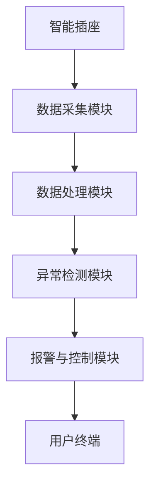
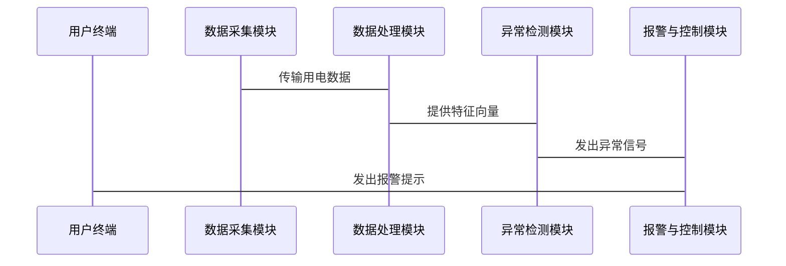

                 


# AI Agent在智能插座中的用电异常检测

> 关键词：AI Agent，智能插座，用电异常检测，算法原理，系统架构，项目实战

> 摘要：本文详细探讨了AI Agent在智能插座中的用电异常检测应用。从背景介绍、核心概念、算法原理到系统架构设计，再到项目实战和总结，系统阐述了如何利用AI技术提升用电安全和智能化水平。通过本文，读者将全面了解AI Agent在智能插座中的重要作用，并掌握相关技术和实现方法。

---

# 第1章: AI Agent与智能插座的背景介绍

## 1.1 AI Agent的基本概念

### 1.1.1 AI Agent的定义与特点

AI Agent（人工智能代理）是指能够感知环境、自主决策并执行任务的智能实体。它具备以下特点：

- **自主性**：能够在没有外部干预的情况下自主运行。
- **反应性**：能够实时感知环境变化并做出反应。
- **学习能力**：通过数据和经验不断优化自身的决策能力。
- **协作性**：能够与其他系统或用户进行交互和协作。

### 1.1.2 智能插座的基本概念

智能插座是一种结合了物联网技术的智能设备，可以通过Wi-Fi、蓝牙或 ZigBee 等通信协议与智能家居系统或其他设备进行连接。智能插座能够实时采集用电数据，并通过云端或本地计算进行数据分析和控制。

### 1.1.3 AI Agent在智能插座中的作用

AI Agent在智能插座中的作用主要体现在以下几个方面：

- **数据采集与分析**：实时采集用电数据，并通过AI算法进行分析，识别异常用电情况。
- **智能控制**：根据分析结果，自动调整用电设备的工作状态，优化能源使用效率。
- **异常报警**：当检测到用电异常时，及时发出报警信号，并通知相关系统或用户。

## 1.2 用电异常检测的背景与问题

### 1.2.1 用电异常检测的定义

用电异常检测是指通过分析用电数据，识别出与正常用电模式不符的情况，例如过载、短路、漏电等。这些异常情况可能导致设备损坏、火灾或其他安全隐患。

### 1.2.2 用电异常检测的常见问题

- **数据噪声干扰**：用电数据中可能存在噪声，影响异常检测的准确性。
- **数据稀疏性**：某些异常情况可能只在特定条件下发生，导致数据稀疏，难以通过传统方法检测。
- **动态变化**：用电模式可能随时间变化，例如负荷变化、设备启停等，增加了异常检测的复杂性。

### 1.2.3 AI Agent在用电异常检测中的优势

- **高精度**：AI Agent能够通过机器学习算法，从大量数据中提取特征，提高异常检测的准确性。
- **实时性**：AI Agent能够实时分析数据，快速识别异常情况，及时采取措施。
- **自适应性**：AI Agent能够通过在线学习不断优化模型，适应用电模式的变化。

## 1.3 本章小结

本章介绍了AI Agent的基本概念及其在智能插座中的作用，并分析了用电异常检测的背景与问题。AI Agent通过其自主性、反应性和学习能力，为智能插座提供了强大的数据处理和决策能力，能够有效解决传统用电异常检测中的难题。

---

# 第2章: 用电异常检测的核心概念与AI Agent的联系

## 2.1 用电异常检测的分类

### 2.1.1 突发异常

突发异常是指在短时间内发生的异常情况，例如短路、过载等。这类异常通常具有突发性和破坏性，需要快速检测和处理。

### 2.1.2 慢性异常

慢性异常是指逐渐发展的异常情况，例如线路老化、绝缘性能下降等。这类异常可能不会立即引发问题，但长期积累可能导致设备损坏或火灾。

### 2.1.3 周期性异常

周期性异常是指按照一定周期性出现的异常情况，例如设备周期性启停导致的负荷波动。这类异常通常可以通过分析用电数据的周期性变化来检测。

## 2.2 用电数据的特征分析

### 2.2.1 数据采集

用电数据的采集包括电流、电压、功率等参数。智能插座通常通过传感器采集这些数据，并将其传输到云端或本地计算系统。

### 2.2.2 数据预处理

数据预处理包括数据清洗、归一化和特征提取等步骤。例如，去除噪声数据，归一化处理数据分布，提取有用的特征如均值、方差、峰谷等。

### 2.2.3 数据特征提取

通过特征提取，可以将原始数据转化为能够反映用电模式的特征向量。例如，使用主成分分析（PCA）提取主要特征，或使用小波变换分析数据的时频特性。

## 2.3 AI Agent在用电异常检测中的核心作用

### 2.3.1 AI Agent的感知能力

AI Agent通过传感器和通信模块感知环境，实时采集用电数据，并通过特征提取和数据处理，识别异常情况。

### 2.3.2 AI Agent的决策能力

AI Agent基于处理后的数据，利用机器学习模型进行分类、回归或聚类分析，判断是否存在异常用电情况。

### 2.3.3 AI Agent的自适应能力

AI Agent能够通过在线学习不断优化模型参数，适应用电模式的变化，提高异常检测的准确性和鲁棒性。

## 2.4 本章小结

本章分析了用电异常检测的分类及其特征，并详细阐述了AI Agent在用电异常检测中的核心作用。通过特征分析和数据处理，AI Agent能够有效识别异常情况，为智能插座的安全运行提供保障。

---

# 第3章: AI Agent的算法原理与实现

## 3.1 监督学习算法

### 3.1.1 线性回归

线性回归是一种常用的回归算法，适用于连续型异常检测。例如，可以用于预测正常情况下的用电量，并识别偏离预测值的异常情况。

### 3.1.2 支持向量机

支持向量机（SVM）是一种强大的分类算法，适用于二分类问题。例如，可以将正常用电和异常用电分为两类，通过训练SVM模型进行分类。

### 3.1.3 决策树

决策树是一种直观的分类算法，适用于复杂的数据特征。例如，可以利用决策树对用电数据进行分类，识别异常情况。

## 3.2 无监督学习算法

### 3.2.1 K-means聚类

K-means聚类是一种常用的无监督学习算法，适用于将用电数据分成不同的簇。例如，可以将正常用电和异常用电分为不同的簇，通过簇的分布识别异常情况。

### 3.2.2 DBSCAN聚类

DBSCAN聚类是一种基于密度的聚类算法，适用于处理噪声数据。例如，可以用于识别用电数据中的异常簇。

### 3.2.3 主成分分析

主成分分析（PCA）是一种降维技术，适用于提取用电数据的主要特征。例如，可以利用PCA提取主要用电特征，降低数据维度。

## 3.3 强化学习算法

### 3.3.1 Q-learning

Q-learning是一种经典的强化学习算法，适用于动态环境下的决策问题。例如，可以用于智能插座的动态用电模式下的异常检测。

### 3.3.2 Deep Q-Networks

Deep Q-Networks（DQN）是一种基于深度学习的强化学习算法，适用于复杂环境下的决策问题。例如，可以用于智能插座的复杂用电模式下的异常检测。

### 3.3.3 策略梯度法

策略梯度法是一种基于梯度的强化学习算法，适用于优化策略的参数。例如，可以用于智能插座的异常检测策略优化。

## 3.4 算法选择与优化

### 3.4.1 算法选择的依据

- 数据类型：是否为分类、回归或聚类问题。
- 数据规模：数据量的大小和特征的维度。
- 计算资源：算法的计算复杂度和资源需求。

### 3.4.2 算法优化方法

- 参数调优：通过网格搜索或随机搜索优化模型参数。
- 模型融合：结合多种算法的结果，提高检测准确率。
- 在线学习：动态更新模型参数，适应数据分布的变化。

### 3.4.3 算法性能评估

- 准确率：检测到的异常情况中，正确识别的比例。
- 召回率：实际异常情况中，被正确检测的比例。
- F1分数：综合准确率和召回率的调和平均数。

## 3.5 本章小结

本章介绍了常用的AI算法及其在用电异常检测中的应用，分析了算法选择与优化的方法，并讨论了算法性能的评估指标。通过合理选择和优化算法，可以有效提高用电异常检测的准确性和效率。

---

# 第4章: 用电异常检测的系统架构与设计

## 4.1 系统架构设计

### 4.1.1 系统模块划分

- 数据采集模块：负责采集用电数据。
- 数据处理模块：负责数据预处理和特征提取。
- 异常检测模块：负责异常检测和分类。
- 报警与控制模块：负责发出报警信号并控制设备。

### 4.1.2 系统功能设计

- 数据采集：通过传感器采集电流、电压、功率等参数。
- 数据处理：对数据进行清洗、归一化和特征提取。
- 异常检测：利用机器学习模型进行异常分类。
- 报警与控制：根据检测结果，发出报警信号并控制设备。

### 4.1.3 系统架构图



### 4.1.4 系统接口设计

- 数据接口：与传感器和云端的数据接口。
- 报警接口：与报警系统和控制系统的接口。
- 用户接口：与用户终端的交互接口。

## 4.2 系统交互设计

### 4.2.1 系统交互流程

1. 数据采集模块采集用电数据。
2. 数据处理模块对数据进行预处理和特征提取。
3. 异常检测模块利用机器学习模型进行异常分类。
4. 报警与控制模块根据检测结果，发出报警信号并控制设备。
5. 用户终端接收报警信号并进行相应的操作。

### 4.2.2 交互序列图



## 4.3 本章小结

本章详细设计了用电异常检测系统的架构和交互流程，通过模块划分和系统架构图，展示了各模块之间的关系和功能。同时，通过序列图展示了系统的交互流程，为后续的实现提供了清晰的指导。

---

# 第5章: 项目实战——基于AI Agent的智能插座用电异常检测系统

## 5.1 项目环境搭建

### 5.1.1 硬件环境

- 智能插座：支持Wi-Fi或蓝牙连接，带有电流、电压传感器。
- 传感器：用于采集用电数据。
- 通信模块：用于数据传输，例如Wi-Fi模块。

### 5.1.2 软件环境

- 开发环境：Python、Jupyter Notebook。
- 机器学习库：scikit-learn、TensorFlow、Keras。
- 数据库：用于存储用电数据，例如MySQL或MongoDB。

## 5.2 系统核心实现

### 5.2.1 数据采集与预处理

```python
import pandas as pd
import numpy as np

# 数据采集
data = pd.read_csv('electricity_data.csv')

# 数据清洗
data.dropna(inplace=True)
data = data[~data['current'].isin([0])]  # 去除电流为0的异常值

# 数据归一化
from sklearn.preprocessing import StandardScaler
scaler = StandardScaler()
data_scaled = pd.DataFrame(scaler.fit_transform(data))
```

### 5.2.2 异常检测模型实现

```python
from sklearn.svm import OneClassSVM

# 训练模型
model = OneClassSVM(gamma='auto')
model.fit(data_scaled)

# 预测异常
y_pred = model.predict(data_scaled)
abnormal_indices = np.where(y_pred == -1)[0]
```

### 5.2.3 报警与控制逻辑

```python
import requests

# 发出报警信号
def send_alarm():
    requests.get('http://localhost:8080/alarm')

# 控制设备
def control_device(action):
    if action == 'off':
        requests.get('http://localhost:8080/device/off')
    elif action == 'on':
        requests.get('http://localhost:8080/device/on')
```

## 5.3 项目小结

本章通过实际项目案例，展示了基于AI Agent的智能插座用电异常检测系统的实现过程。从环境搭建到模型训练，再到报警与控制逻辑的实现，详细介绍了系统的实现步骤和关键代码。通过该项目，读者可以掌握AI Agent在智能插座中的实际应用。

---

# 第6章: 总结与展望

## 6.1 本章总结

本文详细探讨了AI Agent在智能插座中的用电异常检测应用，从背景介绍、核心概念、算法原理到系统架构设计，再到项目实战和总结，系统阐述了AI Agent在智能插座中的重要作用。通过本文，读者可以全面了解AI Agent在用电异常检测中的应用，并掌握相关技术和实现方法。

## 6.2 未来展望

随着人工智能技术的不断发展，AI Agent在智能插座中的应用将更加广泛和深入。未来的研究方向包括：

- 更加高效的算法研究：开发适用于智能插座的高效算法，提高异常检测的准确性和实时性。
- 多模态数据融合：结合多种数据源，如电流、电压、环境温度等，提高异常检测的准确性。
- 自适应学习：通过在线学习和自适应算法，使AI Agent能够更好地适应用电模式的变化。

## 6.3 最佳实践 tips

- 在实际应用中，建议根据具体场景选择合适的算法和模型。
- 定期更新模型参数，确保模型的准确性和鲁棒性。
- 优化系统架构，提高系统的可靠性和可扩展性。

## 6.4 本章小结

本章总结了全文的主要内容，并展望了AI Agent在智能插座中的未来发展方向。通过本文的介绍，读者可以对AI Agent在用电异常检测中的应用有更深入的理解，并为后续的研究和实践提供参考。

---

# 作者：AI天才研究院/AI Genius Institute & 禅与计算机程序设计艺术 /Zen And The Art of Computer Programming

---

以上是《AI Agent在智能插座中的用电异常检测》的完整目录和文章内容。文章详细介绍了AI Agent在智能插座中的用电异常检测应用，从背景、概念、算法到系统架构和项目实战，为读者提供了全面的指导和参考。

