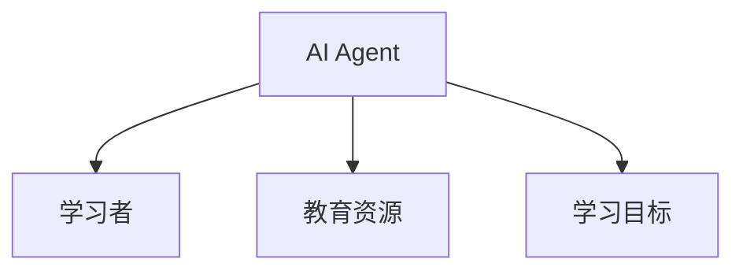
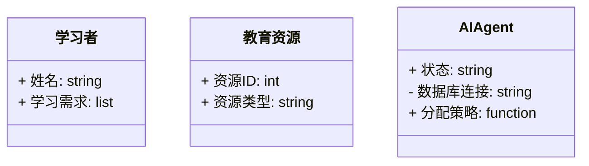
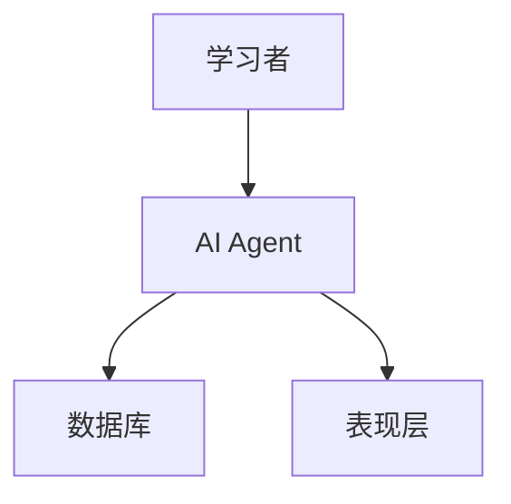
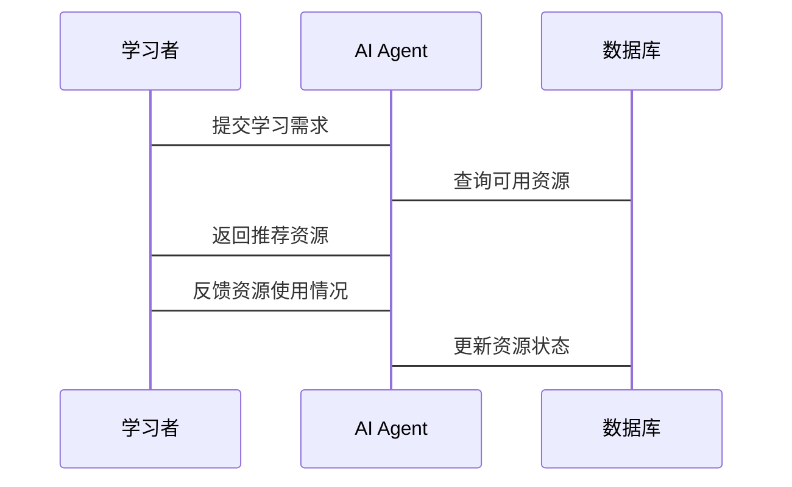

                 


```markdown
# AI Agent在智能教育资源个性化分配中的应用

## 关键词：AI Agent，智能教育，教育资源分配，个性化学习，算法原理，系统架构

## 摘要：随着人工智能技术的快速发展，AI Agent在教育领域的应用日益广泛。本文探讨了AI Agent在智能教育资源个性化分配中的应用，详细分析了其核心概念、算法原理、系统架构以及实际案例，旨在为教育领域的技术应用提供新的思路和解决方案。

---

## 第1章: AI Agent与智能教育的背景介绍

### 1.1 AI Agent的基本概念

AI Agent（智能体）是指在计算机系统中能够感知环境并采取行动以实现目标的实体。它具有自主性、反应性、目标导向性和社交能力等特征。

### 1.2 智能教育的发展现状

智能教育利用人工智能、大数据等技术，实现教学过程的智能化和个性化。其主要技术包括自然语言处理、机器学习和推荐系统。

### 1.3 教育资源分配的问题与挑战

教育资源分配面临公平性、效率性和个性化的问题。传统方式难以满足大规模个性化需求，AI Agent的应用为解决这些问题提供了新思路。

### 1.4 AI Agent在教育中的应用前景

AI Agent能够优化资源分配，提升学习效果，降低成本。其未来趋势包括更智能化、个性化和实时化的应用。

---

## 第2章: AI Agent与智能教育的核心概念与联系

### 2.1 AI Agent的核心原理

AI Agent通过感知环境、分析数据、制定策略和执行行动来实现目标。其主要技术包括状态表示、行为选择和学习优化。

### 2.2 AI Agent与智能教育的属性特征对比

| 属性 | AI Agent | 智能教育 |
|------|----------|----------|
| 目标 | 实现特定任务 | 提供个性化学习 |
| 输入 | 环境数据 | 学生数据和学习需求 |

### 2.3 AI Agent的实体关系图



---

## 第3章: AI Agent在教育资源分配中的算法原理

### 3.1 算法原理概述

采用改进的遗传算法，通过适应度函数评估资源分配方案，选择、交叉和变异操作优化解。

### 3.2 算法实现

```python
def fitness(solution):
    return sum(solution)

def selection(population, fitness_func):
    # 选择操作，保留适应度高的个体
    return population[:10]

def crossover(parent1, parent2):
    # 单点交叉
    point = len(parent1) // 2
    return parent1[:point] + parent2[point:], parent2[:point] + parent1[point:]

def mutation(solution):
    # 随机变异
    import random
    index = random.randint(0, len(solution)-1)
    solution[index] = 1 - solution[index]
    return solution
```

### 3.3 数学模型与公式

适应度函数：
$$ f(x) = \sum_{i=1}^{n} x_i $$

选择操作：
$$ P(x) = \frac{f(x)}{\sum_{y \in P} f(y)} $$

---

## 第4章: 系统分析与架构设计方案

### 4.1 问题场景介绍

教育资源分配问题涉及学习者需求、资源可用性等因素。AI Agent需要实时分析数据，动态调整分配策略。

### 4.2 系统功能设计

领域模型类图展示系统各角色及其关系。



### 4.3 系统架构设计

系统架构图展示分层结构，包括数据层、业务逻辑层和表现层。



### 4.4 系统接口设计

API接口定义了与AI Agent交互的方式，如获取资源、提交反馈等。

### 4.5 系统交互流程

序列图展示AI Agent与学习者的交互过程。



---

## 第5章: 项目实战

### 5.1 环境安装

安装Python和必要的库，如numpy和scikit-learn。

### 5.2 核心代码实现

实现AI Agent的资源分配逻辑，包括数据预处理、模型训练和结果输出。

### 5.3 代码解读与分析

详细解释代码结构和功能，展示AI Agent如何处理数据和生成分配方案。

### 5.4 实际案例分析

通过具体案例展示AI Agent如何优化资源分配，提升学习效果。

### 5.5 项目小结

总结项目成果，分析优缺点，提出改进建议。

---

## 第6章: 最佳实践与小结

### 6.1 最佳实践

建议采用模块化设计、持续优化算法、注重数据隐私保护。

### 6.2 小结

AI Agent在教育资源分配中的应用前景广阔，能够显著提升效率和公平性。

### 6.3 注意事项

注意数据隐私、算法可解释性、系统稳定性和用户接受度。

### 6.4 拓展阅读

推荐相关书籍和论文，鼓励读者深入学习。

---

## 作者：AI天才研究院 & 禅与计算机程序设计艺术

---

通过本文的详细分析和案例探讨，AI Agent在智能教育资源分配中的应用展现了巨大的潜力。希望本文能够为教育技术的发展提供有价值的参考和启示。
```

