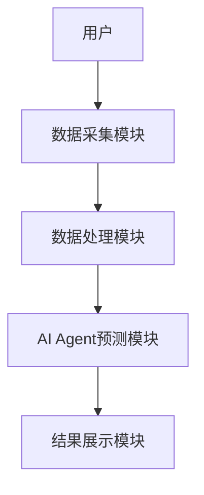
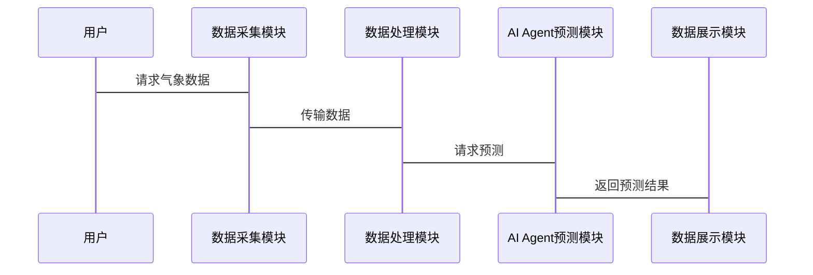

                 


# AI Agent在智能气象预报中的应用

> 关键词：AI Agent, 智能气象预报, 机器学习, 气象数据, 天气预测

> 摘要：本文探讨AI Agent在智能气象预报中的应用，分析其核心原理、算法实现、系统架构及实际案例，展示如何利用AI技术提升气象预测的准确性和实时性。

---

## 第一章: AI Agent与智能气象预报概述

### 1.1 AI Agent的基本概念

#### 1.1.1 AI Agent的定义
AI Agent（人工智能代理）是能够感知环境、自主决策并执行任务的智能实体。它通过传感器获取信息，利用算法进行推理，并通过执行器与环境交互。

#### 1.1.2 AI Agent的核心特征
- **自主性**：无需外部干预，自主完成任务。
- **反应性**：实时感知环境变化并调整行为。
- **目标导向**：基于目标驱动决策。
- **学习能力**：通过数据优化自身行为。

#### 1.1.3 AI Agent与传统气象预报的区别
传统气象预报依赖人工分析和统计模型，而AI Agent通过实时数据处理和智能决策，显著提升预测的准确性和实时性。

### 1.2 智能气象预报的背景与需求

#### 1.2.1 气象预报的重要性
气象预报在防灾减灾、农业生产、交通物流等领域具有重要意义，直接影响人们的生活和安全。

#### 1.2.2 传统气象预报的局限性
- 数据处理能力有限，难以应对海量实时数据。
- 预测模型依赖历史数据，对突发情况反应较慢。
- 人工干预较多，效率和准确性有待提升。

#### 1.2.3 AI Agent在气象预报中的应用价值
AI Agent能够实时处理多源数据，快速调整预测模型，显著提升气象预报的精准度和响应速度。

---

## 第二章: AI Agent的核心概念与气象数据处理

### 2.1 AI Agent的核心原理

#### 2.1.1 知识表示与推理
AI Agent通过知识图谱和逻辑推理，理解气象数据之间的关系，例如温度、湿度与天气变化的关联。

#### 2.1.2 行为选择与优化
基于强化学习，AI Agent在多个预测模型中选择最优方案，提升预测准确率。

#### 2.1.3 状态感知与反馈
AI Agent实时感知环境状态（如温度、气压变化），并根据反馈调整预测策略。

### 2.2 气象数据的特征与处理

#### 2.2.1 气象数据的多样性
气象数据包括温度、湿度、气压、风速等多种类型，来源多样，如卫星、气象站、传感器等。

#### 2.2.2 数据预处理与特征提取
- 数据清洗：处理缺失值和异常值。
- 特征工程：提取关键特征，如时间序列特征、空间分布特征。

#### 2.2.3 数据流的实时处理
利用流处理技术（如Flink、Spark），实时处理气象数据流，确保预测的实时性。

### 2.3 AI Agent与气象数据的关系

#### 2.3.1 实体关系分析
- 数据源（气象站、卫星）提供原始数据。
- 数据消费者（AI Agent）处理数据并生成预测结果。

#### 2.3.2 数据流的处理流程
1. 数据采集：多源数据的实时采集。
2. 数据处理：清洗、转换、特征提取。
3. 数据分析：基于AI模型进行预测。

---

## 第三章: AI Agent的算法原理与实现

### 3.1 算法原理概述

#### 3.1.1 基于强化学习的AI Agent
AI Agent通过强化学习优化预测策略，例如使用Deep Q-Network（DQN）算法。

#### 3.1.2 基于监督学习的气象预测模型
利用监督学习训练模型，输入历史数据，输出预测结果。

#### 3.1.3 混合模型的应用
结合强化学习和监督学习，提升模型的泛化能力和预测精度。

### 3.2 算法实现流程

#### 3.2.1 数据预处理与特征工程
```python
import pandas as pd
from sklearn.preprocessing import StandardScaler

# 数据加载与预处理
data = pd.read_csv('weather_data.csv')
# 删除缺失值
data = data.dropna()
# 标准化处理
scaler = StandardScaler()
data_scaled = scaler.fit_transform(data)
```

#### 3.2.2 模型训练与优化
```python
import tensorflow as tf
from tensorflow.keras import layers

# LSTM模型构建
model = tf.keras.Sequential()
model.add(layers.LSTM(64, input_shape=(timesteps, features)))
model.add(layers.Dense(1))
model.compile(optimizer='adam', loss='mse')
```

#### 3.2.3 模型部署与实时预测
```python
# 实时预测
def predict_weather():
    while True:
        # 获取最新数据
        new_data = get_realtime_data()
        # 数据预处理
        new_data_scaled = scaler.transform(new_data)
        # 预测结果
        prediction = model.predict(new_data_scaled)
        print(f'预测结果：{prediction}')
```

---

## 第四章: 智能气象预报的数学模型与公式

### 4.1 气象预测的数学模型

#### 4.1.1 时间序列分析模型
- ARIMA模型：适用于线性时间序列预测。
- LSTM模型：适用于非线性时间序列预测。

#### 4.1.2 神经网络模型
- CNN：适用于图像特征提取。
- RNN：适用于时间序列特征提取。

#### 4.1.3 集成学习模型
- 集成多种模型（如LSTM、ARIMA）提升预测准确率。

### 4.2 关键公式与推导

#### 4.2.1 LSTM模型公式
$$
f(t) = \sigma(W_f h(t-1) + U_f x(t))
$$
其中，$\sigma$是sigmoid函数，$h(t-1)$是前一时刻的状态，$x(t)$是当前输入。

#### 4.2.2 GRU模型公式
$$
z(t) = \sigma(W_z h(t-1) + U_z x(t))
$$
其中，$z(t)$是门控信号，控制信息的更新。

---

## 第五章: 系统架构与设计

### 5.1 系统功能设计

#### 5.1.1 数据采集模块
实时采集气象数据，包括温度、湿度、气压等。

#### 5.1.2 数据处理模块
对数据进行清洗、转换和特征提取。

#### 5.1.3 AI Agent预测模块
基于AI算法生成气象预测结果。

#### 5.1.4 结果展示模块
将预测结果可视化，便于用户查看。

### 5.2 系统架构设计

#### 5.2.1 分层架构图


#### 5.2.2 系统交互流程图


---

## 第六章: 项目实战

### 6.1 项目背景与目标
利用AI Agent技术，开发一个智能气象预报系统，提升预测的准确性和实时性。

### 6.2 核心实现代码

#### 6.2.1 数据预处理
```python
import pandas as pd
from sklearn.preprocessing import MinMaxScaler

# 数据加载与预处理
data = pd.read_csv('weather_data.csv')
# 数据归一化处理
scaler = MinMaxScaler()
data_scaled = scaler.fit_transform(data)
```

#### 6.2.2 模型训练
```python
import tensorflow as tf
from tensorflow.keras import layers

# LSTM模型构建
model = tf.keras.Sequential()
model.add(layers.LSTM(64, input_shape=(timesteps, features)))
model.add(layers.Dense(1))
model.compile(optimizer='adam', loss='mse')

# 训练模型
model.fit(X_train, y_train, epochs=100, batch_size=32)
```

#### 6.2.3 模型预测与展示
```python
import matplotlib.pyplot as plt

# 预测结果
y_pred = model.predict(X_test)
# 结果展示
plt.plot(y_test, label='实际值')
plt.plot(y_pred, label='预测值')
plt.legend()
plt.show()
```

---

## 第七章: 最佳实践与小结

### 7.1 最佳实践
- 数据质量是关键，需确保数据的准确性和完整性。
- 模型选择需结合实际场景，避免过度复杂。
- 系统优化要考虑实时性和可扩展性。

### 7.2 小结
本文详细介绍了AI Agent在智能气象预报中的应用，从理论到实践，展示了如何利用AI技术提升气象预测的准确性。

### 7.3 注意事项
- 数据隐私问题需重视。
- 模型的实时性需优化。
- 系统的可维护性需保障。

### 7.4 拓展阅读
推荐学习相关领域的书籍和论文，深入理解AI Agent和气象预报的结合应用。

---

## 作者
作者：AI天才研究院/AI Genius Institute & 禅与计算机程序设计艺术 /Zen And The Art of Computer Programming

