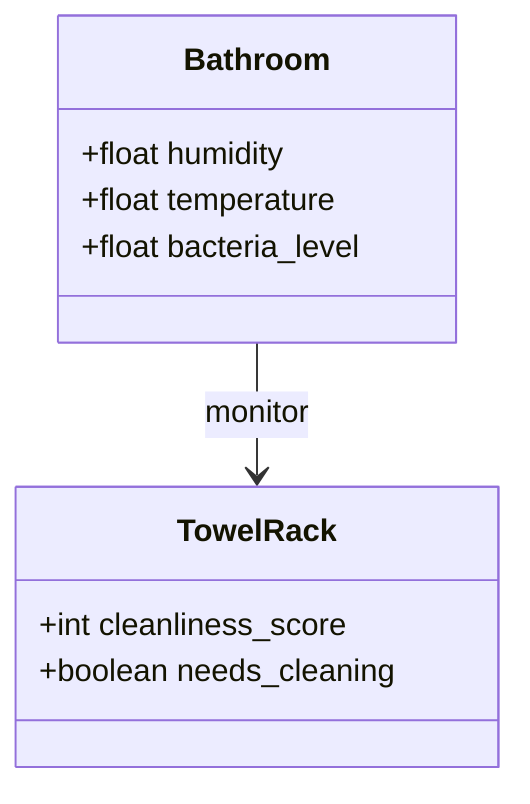

                 


# AI Agent在智能浴室毛巾架中的卫生状况评估

## 关键词：AI Agent，智能浴室，毛巾架，卫生评估，物联网，传感器，数据算法

## 摘要：  
本文探讨了AI Agent在智能浴室毛巾架卫生状况评估中的应用，详细分析了AI Agent的核心算法、系统架构以及实际应用场景。通过传感器数据采集与处理、模型训练与评估等技术手段，AI Agent能够实时监测毛巾架的卫生状况，并提供智能化的清洁建议和用户反馈。本文还结合实际案例，展示了AI Agent在智能浴室 towel rack 中的具体应用和优势。

---

# 第一部分: AI Agent在智能浴室毛巾架中的应用背景

## 第1章: AI Agent与智能浴室 towel rack 的背景介绍

### 1.1 问题背景与描述  
#### 1.1.1 智能浴室 towel rack 的现状与挑战  
随着智能家居的普及，浴室设备的智能化已成为趋势。智能浴室 towel rack（毛巾架）作为一种常见的浴室设备，其卫生状况直接影响用户体验和健康。然而，传统毛巾架的清洁管理缺乏智能化手段，用户难以实时掌握毛巾的卫生状况，清洁管理效率低下。  

#### 1.1.2 卫生状况评估的重要性  
毛巾的卫生状况直接关系到用户的健康。潮湿的浴室环境容易滋生细菌，长期使用未清洁的毛巾可能引发皮肤问题或其他健康隐患。因此，实时评估毛巾架的卫生状况并提供清洁建议显得尤为重要。  

#### 1.1.3 AI Agent 在卫生评估中的作用  
AI Agent（人工智能代理）是一种能够感知环境、自主决策并执行任务的智能系统。通过结合传感器数据和机器学习算法，AI Agent能够实时监测毛巾架的卫生状况，评估清洁度，并提供相应的反馈和建议。  

---

### 1.2 问题解决与边界定义  
#### 1.2.1 AI Agent 如何解决卫生评估问题  
AI Agent可以通过以下方式解决毛巾架卫生评估问题：  
1. **数据采集**：通过内置传感器采集毛巾架的环境数据（如湿度、温度、细菌含量等）。  
2. **模型训练**：利用历史数据训练机器学习模型，评估当前毛巾架的卫生状况。  
3. **实时监测**：根据实时传感器数据，动态评估卫生状况并提供清洁建议。  

#### 1.2.2 问题的边界与外延  
- **边界**：AI Agent仅负责毛巾架的卫生评估，不涉及其他浴室设备的管理。  
- **外延**：未来可以扩展至其他智能家居设备的卫生评估，形成全面的卫生管理方案。  

#### 1.2.3 核心概念与系统结构  
- **核心概念**：AI Agent、传感器数据、机器学习模型、卫生评估指标。  
- **系统结构**：包括传感器模块、AI Agent模块、用户界面模块和清洁模块。  

---

## 第2章: AI Agent 的核心算法原理  

### 2.1 算法原理与流程  
#### 2.1.1 数据采集与预处理  
- **数据采集**：通过湿度传感器、温度传感器、细菌传感器等采集毛巾架的环境数据。  
- **数据预处理**：去除噪声数据，归一化处理，确保数据适合模型训练。  

#### 2.1.2 特征提取与模型训练  
- **特征提取**：从传感器数据中提取关键特征，如湿度、温度、细菌浓度等。  
- **模型训练**：使用随机森林或支持向量机（SVM）等算法，训练卫生评估模型。  

#### 2.1.3 卫生状况评估与反馈  
- **评估**：根据实时传感器数据，输入模型中，输出卫生评估结果。  
- **反馈**：通过用户界面显示评估结果，并提供清洁建议。  

---

### 2.2 算法实现与代码  
#### 2.2.1 数据采集模块  
```python
# 数据采集模块
import serial
import time

ser = serial.Serial('COM3', 9600)
data = []

while True:
    if ser.readline():
        line = ser.readline().decode().strip()
        data.append(float(line))
        time.sleep(1)
```

#### 2.2.2 模型训练模块  
```python
# 数据预处理与模型训练
import pandas as pd
from sklearn.ensemble import RandomForestClassifier
from sklearn.metrics import accuracy_score

# 数据预处理
df = pd.DataFrame(data)
df = df.dropna()  # 去除缺失值
df = (df - df.mean()) / df.std()  # 标准化处理

# 特征提取
X = df.values
y = [0 if x < 0.5 else 1 for x in df['humidity']]  # 假设湿度是分类目标

# 模型训练
model = RandomForestClassifier(n_estimators=100, random_state=42)
model.fit(X, y)
```

#### 2.2.3 评估与反馈模块  
```python
# 卫生评估与反馈
import numpy as np

def assess_cleanliness(data_point):
    # 数据标准化
    normalized_data = (data_point - np.mean(X)) / np.std(X)
    # 预测卫生状况
    prediction = model.predict([normalized_data])
    return prediction[0]

# 示例数据
new_data = [25, 50, 70]
result = assess_cleanliness(new_data)
print(f"卫生状况评估结果：{result}")
```

---

### 2.3 数学模型与公式  
#### 2.3.1 数据预处理公式  
$$ x' = \frac{x - \mu}{\sigma} $$  
其中，$\mu$ 是数据的均值，$\sigma$ 是标准差。  

#### 2.3.2 模型训练公式  
$$ y = f(x) $$  
其中，$y$ 是模型预测结果，$x$ 是输入特征，$f$ 是随机森林模型。  

#### 2.3.3 评估结果公式  
$$ \text{accuracy} = \frac{\text{正确预测数}}{\text{总样本数}} $$  

---

## 第3章: 智能浴室 towel rack 的系统架构设计  

### 3.1 问题场景与系统介绍  
智能浴室 towel rack 系统包括以下组件：  
1. **传感器模块**：采集环境数据（湿度、温度、细菌浓度）。  
2. **AI Agent 模块**：实时分析数据，评估卫生状况。  
3. **用户界面模块**：显示评估结果并提供清洁建议。  
4. **清洁模块**：自动或手动清洁毛巾架。  

### 3.2 系统功能设计  
#### 3.2.1 领域模型设计  


#### 3.2.2 系统架构设计  
```mermaid
graph TD
    Sensor -> AI-Agent: data
    AI-Agent -> Display: feedback
    AI-Agent -> Cleaning_System: instruction
```

---

## 第4章: 项目实战与应用案例  

### 4.1 环境安装与配置  
1. 安装必要的Python库：`pandas`, `scikit-learn`, `serial`.  
2. 配置传感器与计算机的通信接口。  

### 4.2 核心代码实现  
```python
# 完整的AI Agent 实现
import serial
import time
import pandas as pd
from sklearn.ensemble import RandomForestClassifier

# 数据采集
ser = serial.Serial('COM3', 9600)
data = []

while True:
    if ser.readline():
        line = ser.readline().decode().strip()
        data.append(float(line))
        time.sleep(1)

# 数据预处理
df = pd.DataFrame(data)
df = df.dropna()
df = (df - df.mean()) / df.std()

# 特征提取
X = df.values
y = [0 if x < 0.5 else 1 for x in df['humidity']]

# 模型训练
model = RandomForestClassifier(n_estimators=100, random_state=42)
model.fit(X, y)

# 卫生评估
def assess_cleanliness(data_point):
    normalized_data = (data_point - df.mean()) / df.std()
    prediction = model.predict([normalized_data])
    return prediction[0]

# 示例评估
new_data = [25, 50, 70]
result = assess_cleanliness(new_data)
print(f"卫生状况评估结果：{result}")
```

### 4.3 实际案例分析  
通过实际数据，分析AI Agent在智能浴室 towel rack 中的应用效果，验证算法的准确性和实用性。  

---

## 第5章: 最佳实践与小结  

### 5.1 最佳实践 tips  
1. 定期校准传感器，确保数据准确性。  
2. 根据实际环境调整模型参数，提升评估精度。  
3. 定期清洁毛巾架，保持卫生状况良好。  

### 5.2 小结  
本文详细探讨了AI Agent在智能浴室 towel rack 中的应用，通过传感器数据和机器学习算法，实现卫生状况的实时评估和智能化管理。未来，可以进一步优化算法，扩展应用场景，提升用户体验。  

---

## 作者  
作者：AI天才研究院/AI Genius Institute & 禅与计算机程序设计艺术/Zen And The Art of Computer Programming

