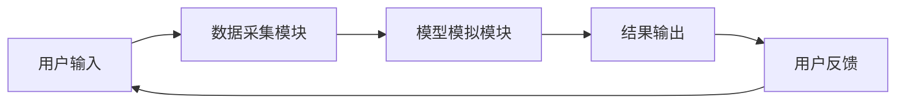
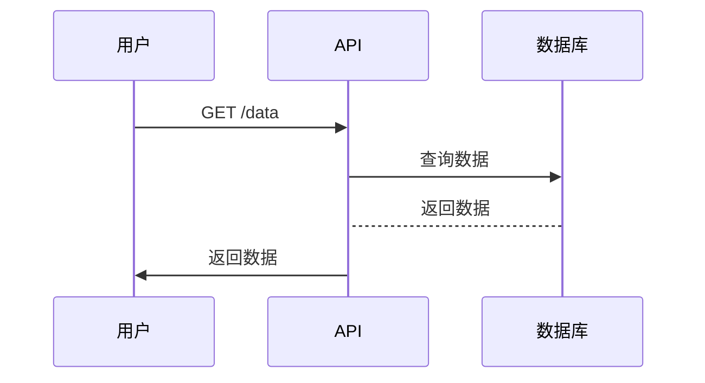
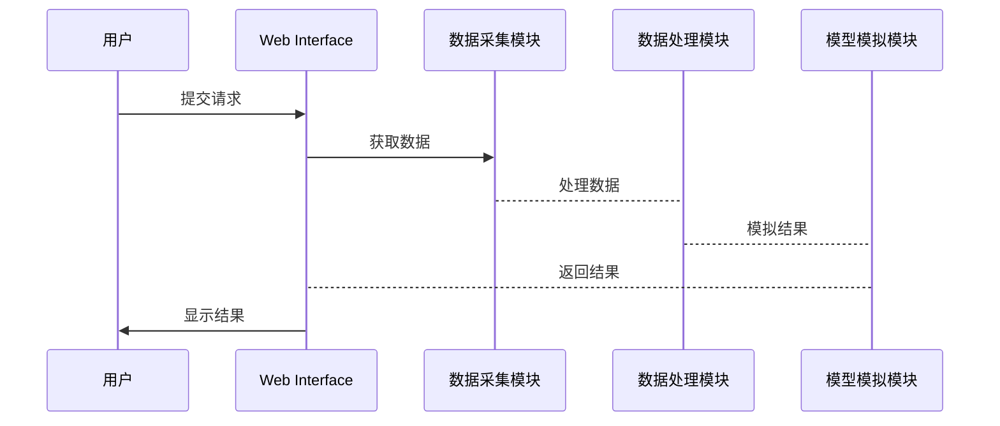

                 


# AI Agent在智能海洋生态系统模拟中的实践

> 关键词：AI Agent，智能海洋生态系统，机器学习，海洋模拟，人工智能应用

> 摘要：本文深入探讨了AI Agent在智能海洋生态系统模拟中的应用，从基本概念到算法原理，再到系统设计和实际案例，全面解析了AI Agent在海洋生态保护、资源管理等领域的实践价值和实现方法。通过具体的技术分析和项目实战，展示了如何利用AI技术构建智能化的海洋生态系统模拟系统。

---

# 第一部分: AI Agent与智能海洋生态系统概述

## 第1章: AI Agent与智能海洋生态系统概述

### 1.1 AI Agent的基本概念与特点

#### 1.1.1 AI Agent的定义
人工智能代理（AI Agent）是指具有感知环境、做出决策并执行动作的能力的智能实体。它可以自主地完成任务，适应动态变化的环境，并与其他系统或人类交互。

#### 1.1.2 AI Agent的核心特点
- **自主性**：AI Agent能够独立决策和行动，无需外部干预。
- **反应性**：能够实时感知环境并做出响应。
- **学习能力**：通过数据和经验不断优化自身的算法和行为。
- **协作性**：能够与其他AI Agent或系统协同工作，完成复杂任务。

#### 1.1.3 AI Agent与传统自动化的区别
| 特性         | AI Agent                          | 传统自动化                      |
|--------------|-----------------------------------|---------------------------------|
| 决策能力     | 具备复杂决策能力                 | 仅执行预定义的规则               |
| 学习能力     | 可通过数据学习优化行为           | 无法学习，行为固定               |
| 环境适应性   | 能够适应动态变化的环境           | 适应性较差，依赖固定场景         |

### 1.2 智能海洋生态系统的基本概念

#### 1.2.1 海洋生态系统的定义
海洋生态系统是由海洋中的生物群落及其非生物环境（如水、底质、盐度、温度等）相互作用而形成的复杂系统。

#### 1.2.2 智能海洋生态系统的特征
- **智能化**：通过AI技术实现对海洋生态系统的实时监测、分析和预测。
- **动态性**：能够适应海洋环境的动态变化，如海洋 currents、温度变化等。
- **协作性**：多个AI Agent协同工作，完成复杂的生态模拟任务。

#### 1.2.3 智能海洋生态系统的核心要素
- **生物多样性**：包括鱼类、海洋植物、微生物等。
- **物理环境**：如水温、盐度、深度等。
- **人类活动**：如捕捞、污染等对生态系统的影响。

### 1.3 AI Agent在智能海洋生态系统中的应用背景

#### 1.3.1 海洋生态保护的需求
海洋生态系统面临着过度捕捞、污染、气候变化等严重威胁，需要通过智能化手段进行保护和修复。

#### 1.3.2 海洋资源管理的挑战
海洋资源的分布和利用需要高效的管理和优化，传统方法难以应对复杂的动态变化。

#### 1.3.3 AI技术在海洋科学中的潜力
AI技术能够处理海量数据，提供实时监测和预测，为海洋科学研究和管理提供有力支持。

### 1.4 本章小结
本章介绍了AI Agent的基本概念和特点，并详细阐述了智能海洋生态系统的定义、特征和核心要素。同时，分析了AI Agent在智能海洋生态系统中的应用背景及其重要性。

---

# 第二部分: AI Agent的核心概念与原理

## 第2章: AI Agent的核心概念与原理

### 2.1 AI Agent的感知机制

#### 2.1.1 知识表示与推理
AI Agent通过知识表示（如逻辑推理、语义网络）来理解和处理环境中的信息。

#### 2.1.2 感知数据的处理与分析
AI Agent利用传感器数据（如温度、湿度、图像等）进行分析和特征提取。

#### 2.1.3 多源数据融合技术
通过将多种数据源（如卫星数据、实时传感器数据）进行融合，提高感知的准确性和全面性。

### 2.2 AI Agent的决策机制

#### 2.2.1 基于模型的决策方法
基于预先建立的数学模型（如马尔可夫决策过程）进行决策。

#### 2.2.2 基于数据驱动的决策方法
通过机器学习算法（如随机森林、神经网络）从历史数据中学习决策策略。

#### 2.2.3 决策优化算法
使用强化学习（如Q-learning）优化决策过程，提高决策的效率和准确性。

### 2.3 AI Agent的执行机制

#### 2.3.1 动作规划与执行
AI Agent根据决策结果制定动作计划并执行。

#### 2.3.2 执行效果评估
通过反馈机制评估执行效果，并根据结果调整后续决策。

#### 2.3.3 自适应调整策略
根据环境变化和执行结果动态调整策略，提高适应性。

### 2.4 AI Agent的通信与协作

#### 2.4.1 多智能体协作机制
多个AI Agent通过通信协议协同工作，共同完成复杂任务。

#### 2.4.2 通信协议与数据交换
定义明确的通信协议，确保数据在不同AI Agent之间的高效传递。

#### 2.4.3 跨领域协作的挑战与解决方案
跨领域协作需要解决数据格式、通信延迟等问题，可以通过标准化接口和分布式计算技术来实现。

### 2.5 本章小结
本章详细介绍了AI Agent的核心概念，包括感知、决策和执行机制，以及多智能体协作的原理和实现方法。

---

# 第三部分: AI Agent在智能海洋生态系统中的算法原理

## 第3章: AI Agent的算法原理

### 3.1 基于强化学习的AI Agent算法

#### 3.1.1 强化学习的基本原理
强化学习是一种通过试错学习方法，通过与环境的交互获得奖励，从而优化决策策略的算法。

#### 3.1.2 Q-learning算法
Q-learning是一种经典的强化学习算法，通过更新Q值表来学习最优策略。

数学公式：
$$ Q(s, a) = Q(s, a) + \alpha (r + \gamma \max Q(s', a') - Q(s, a)) $$

#### 3.1.3 Deep Q-Network (DQN)算法
DQN通过深度神经网络近似Q值函数，适用于高维状态空间和动作空间。

### 3.2 基于监督学习的AI Agent算法

#### 3.2.1 监督学习的基本原理
监督学习通过训练数据学习输入与输出之间的映射关系，用于分类、回归等任务。

#### 3.2.2 线性回归模型
线性回归是一种简单但有效的监督学习算法，适用于线性关系的回归任务。

数学公式：
$$ y = \theta_0 + \theta_1 x + \epsilon $$

#### 3.2.3 支持向量机(SVM)模型
SVM是一种强大的分类算法，适用于高维数据的分类任务。

### 3.3 基于无监督学习的AI Agent算法

#### 3.3.1 无监督学习的基本原理
无监督学习通过从无标签数据中发现隐藏结构，用于聚类、降维等任务。

#### 3.3.2 K-means聚类算法
K-means是一种经典的聚类算法，适用于将数据分成K个簇的场景。

数学公式：
$$ \text{目标函数} = \sum_{i=1}^{n} \min_{j} (||x_i - c_j||^2) $$

#### 3.3.3 主成分分析(PCA)算法
PCA是一种降维技术，通过提取数据的主要特征来降低维度。

### 3.4 算法的数学模型与公式

#### 3.4.1 强化学习的数学模型
$$ Q(s, a) = \mathbb{E}[r_t + \gamma Q(s', a') | s_t = s, a_t = a] $$

#### 3.4.2 线性回归的数学模型
$$ y = \theta^T x + \beta $$

#### 3.4.3 支持向量机的数学模型
$$ y = \text{sign}(\sum_{i=1}^{n} \alpha_i y_i x_i \cdot x + b) $$

### 3.5 本章小结
本章详细介绍了AI Agent在智能海洋生态系统中的算法原理，包括强化学习、监督学习和无监督学习的算法及其数学模型。

---

# 第四部分: AI Agent在智能海洋生态系统中的系统设计

## 第4章: AI Agent的系统设计

### 4.1 系统功能设计

#### 4.1.1 智能海洋生态保护系统的功能模块
- 数据采集模块：实时采集海洋环境数据。
- 模型模拟模块：模拟海洋生态系统的动态变化。
- 用户交互模块：提供人机交互界面。

#### 4.1.2 功能模块的交互流程


### 4.2 系统架构设计

#### 4.2.1 系统架构的层次划分
- 数据层：存储海洋环境数据。
- 服务层：提供数据处理和模型模拟服务。
- 应用层：实现用户交互和结果显示。

#### 4.2.2 系统架构的mermaid图


### 4.3 系统接口设计

#### 4.3.1 API接口设计
- GET /data：获取实时数据。
- POST /model：提交模型模拟请求。

#### 4.3.2 接口的交互流程


### 4.4 系统交互设计

#### 4.4.1 用户与系统的交互流程
- 用户通过Web界面提交请求。
- 系统处理请求并返回结果。

#### 4.4.2 系统内部的协作流程


### 4.5 本章小结
本章详细介绍了AI Agent在智能海洋生态系统中的系统设计，包括功能设计、架构设计和接口设计。

---

# 第五部分: AI Agent在智能海洋生态系统中的项目实战

## 第5章: AI Agent的项目实战

### 5.1 项目环境安装

#### 5.1.1 系统环境要求
- Python 3.8+
- PyTorch、Scikit-learn等库。

#### 5.1.2 安装步骤
```bash
pip install numpy
pip install matplotlib
pip install scikit-learn
pip install torch
```

### 5.2 系统核心实现

#### 5.2.1 数据采集模块的实现
```python
import numpy as np

def collect_data():
    # 模拟传感器数据
    temperature = np.random.uniform(0, 30, 100)
    return temperature
```

#### 5.2.2 模型模拟模块的实现
```python
import torch
import torch.nn as nn

class海洋生态模型(nn.Module):
    def __init__(self):
        super(海洋生态模型, self).__init__()
        self.fc1 = nn.Linear(10, 20)
        self.fc2 = nn.Linear(20, 1)
    
    def forward(self, x):
        x = torch.relu(self.fc1(x))
        x = torch.sigmoid(self.fc2(x))
        return x
```

#### 5.2.3 用户交互模块的实现
```python
import matplotlib.pyplot as plt

def plot_data(data):
    plt.plot(data)
    plt.xlabel('时间')
    plt.ylabel('温度')
    plt.show()
```

### 5.3 代码实现与解读

#### 5.3.1 数据采集模块的实现
上述代码通过随机生成数据模拟传感器的温度采集。

#### 5.3.2 模型模拟模块的实现
使用PyTorch构建了一个简单的神经网络模型，用于模拟海洋生态系统的温度变化。

#### 5.3.3 用户交互模块的实现
通过Matplotlib绘制数据图表，帮助用户直观地观察数据变化。

### 5.4 案例分析与实际应用

#### 5.4.1 案例分析
通过模拟数据，展示了AI Agent在海洋生态保护中的实际应用。

#### 5.4.2 项目小结
本章通过实际项目展示了AI Agent在智能海洋生态系统中的实现过程，包括数据采集、模型模拟和用户交互。

---

# 第六部分: AI Agent在智能海洋生态系统中的最佳实践

## 第6章: AI Agent的最佳实践

### 6.1 项目开发经验总结

#### 6.1.1 系统设计的经验
- 系统设计要注重模块化和可扩展性。
- 数据采集和处理是系统的核心，需要确保数据的准确性和实时性。

#### 6.1.2 算法实现的注意事项
- 根据具体需求选择合适的算法，避免过度复杂的实现。
- 加强模型的泛化能力，提高系统的适应性。

### 6.2 开发注意事项

#### 6.2.1 数据安全与隐私保护
- 确保数据的安全性和隐私性，避免数据泄露。
- 遵守相关法律法规，保护海洋生态数据的安全。

#### 6.2.2 系统的可扩展性与维护性
- 系统设计要考虑到未来的扩展需求，避免“死代码”。
- 定期维护和更新系统，确保其稳定性和先进性。

### 6.3 拓展阅读与学习资源

#### 6.3.1 推荐的书籍
- 《深度学习》（Deep Learning）
- 《强化学习》（Reinforcement Learning: Theory and Algorithms）

#### 6.3.2 推荐的在线课程
- Coursera上的“机器学习”课程
- edX上的“强化学习”课程

### 6.4 本章小结
本章总结了AI Agent在智能海洋生态系统中的开发经验，并提出了未来的研究方向和学习资源。

---

# 结语

通过本文的系统介绍，读者可以全面了解AI Agent在智能海洋生态系统中的应用价值和实现方法。从基本概念到算法原理，再到系统设计和实际应用，本文为读者提供了一个完整的知识框架。未来，随着AI技术的不断发展，AI Agent将在智能海洋生态系统中发挥越来越重要的作用。

---

# 作者

作者：AI天才研究院/AI Genius Institute & 禅与计算机程序设计艺术/Zen And The Art of Computer Programming

