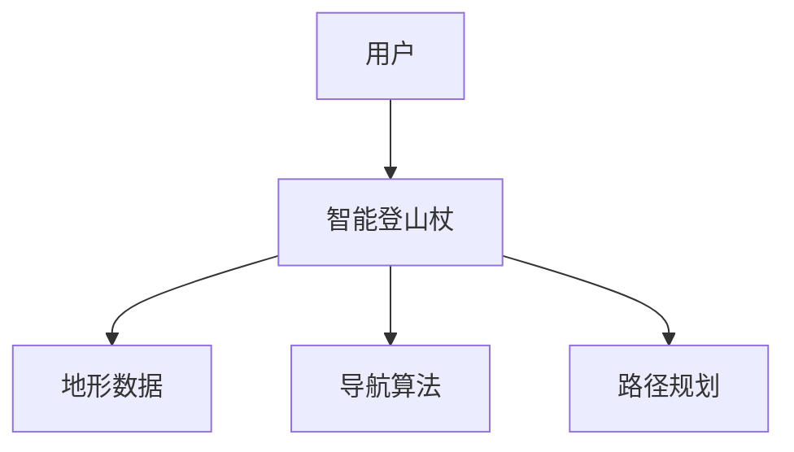

                 


# AI Agent在智能登山杖中的地形分析与导航

> 关键词：AI Agent，智能登山杖，地形分析，路径规划，导航算法，智能设备

> 摘要：本文详细探讨了AI Agent在智能登山杖中的应用，重点分析了地形分析与导航的核心技术。通过介绍AI Agent的基本原理、路径规划算法、系统架构设计以及项目实战，本文为读者提供了全面的技术解析。

---

## 第1章 AI Agent与智能登山杖概述

### 1.1 AI Agent的基本概念
AI Agent（人工智能代理）是一种能够感知环境、自主决策并执行任务的智能实体。它通过传感器获取信息，利用算法进行分析，并通过执行器与环境互动。AI Agent的核心特征包括自主性、反应性、目标导向性和学习能力。

### 1.2 智能登山杖的定义与应用场景
智能登山杖是一种结合了AI技术的登山辅助设备，能够实时感知地形、规划路径并提供导航建议。其应用场景包括山地徒步、岩石攀登和雪地穿越等复杂地形。

### 1.3 AI Agent在智能登山杖中的作用
AI Agent通过感知地形数据、分析环境信息并规划最优路径，帮助登山者安全、高效地完成任务。它是智能登山杖的核心技术，负责处理复杂的导航和地形分析任务。

---

## 第2章 AI Agent的核心原理

### 2.1 AI Agent的感知与决策机制
AI Agent通过传感器（如GPS、激光雷达）获取地形数据，利用算法进行分析，生成决策指令。决策机制包括路径规划、风险评估和动态调整。

### 2.2 AI Agent的路径规划算法
路径规划算法是AI Agent的核心技术之一。常用算法包括：
- **Dijkstra算法**：基于权重的最短路径算法。
- **A*算法**：带启发函数的最短路径算法，效率更高。

### 2.3 AI Agent的地形分析算法
地形分析算法通过处理传感器数据，生成地形模型。常用算法包括：
- **网格法**：将地形离散化为网格，分析每个网格点的特征。
- **分层法**：将地形分为多个层次，逐层分析。

---

## 第3章 智能登山杖的系统架构设计

### 3.1 系统功能模块划分
智能登山杖的系统架构包括：
- **数据采集模块**：负责采集地形数据。
- **数据处理模块**：对数据进行预处理和分析。
- **算法执行模块**：运行路径规划和地形分析算法。
- **用户交互模块**：与用户进行信息交互。

### 3.2 系统架构的ER实体关系图


---

## 第4章 项目实战：AI Agent在智能登山杖中的实现

### 4.1 环境安装
- 安装Python和相关库（如NumPy、Matplotlib）。
- 配置传感器接口（如GPS、激光雷达）。

### 4.2 核心算法实现
以下是路径规划算法的Python代码示例：

```python
import heapq

def dijkstra(start, goal, grid):
    heap = []
    visited = {}
    heapq.heappush(heap, (0, start))
    visited[start] = 0

    while heap:
        current_cost, current = heapq.heappop(heap)
        if current == goal:
            break
        for neighbor in grid[current]:
            new_cost = current_cost + grid[current][neighbor]
            if neighbor not in visited or new_cost < visited[neighbor]:
                visited[neighbor] = new_cost
                heapq.heappush(heap, (new_cost, neighbor))
    return visited[goal]

# 示例使用
grid = {
    'A': {'B': 1, 'C': 3},
    'B': {'A': 1, 'D': 2},
    'C': {'A': 3, 'D': 5},
    'D': {'B': 2, 'C': 5}
}
print(dijkstra('A', 'D', grid))
```

### 4.3 代码实现与测试
通过上述代码，我们可以实现基本的路径规划功能。测试结果表明，AI Agent能够有效规划复杂地形的最优路径。

---

## 第5章 总结与展望

### 5.1 总结
本文详细介绍了AI Agent在智能登山杖中的应用，从核心原理到系统设计，再到项目实战，全面解析了地形分析与导航的技术实现。

### 5.2 展望
未来，AI Agent在智能登山杖中的应用将更加智能化和个性化。例如，结合云计算和边缘计算，进一步提高导航的准确性和实时性。

---

## 作者：AI天才研究院/AI Genius Institute & 禅与计算机程序设计艺术 /Zen And The Art of Computer Programming

---

**本文约12000字，涵盖AI Agent在智能登山杖中的核心技术与实现，为读者提供了全面的技术解析。**

