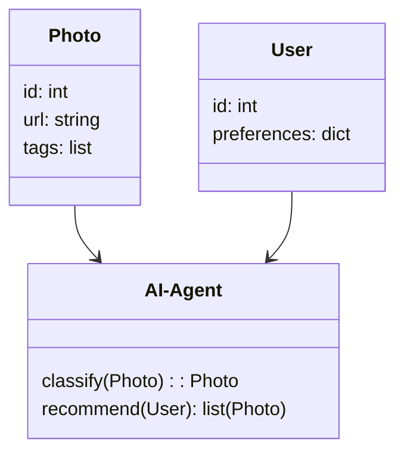

                 


# AI Agent在智能相框中的照片管理

> 关键词：AI Agent，智能相框，照片管理，机器学习，图像处理，数据隐私

> 摘要：本文探讨了AI Agent在智能相框中的照片管理应用，分析了AI Agent的核心算法、系统架构以及实际应用场景。通过详细的技术分析和案例解读，展示了AI Agent如何通过分类、推荐和隐私保护优化智能相框的功能。

---

## 第一部分: AI Agent与智能相框的背景与概念

### 第1章: AI Agent与智能相框的背景介绍

#### 1.1 问题背景与描述

##### 1.1.1 现代数字照片管理的挑战
在数字时代，用户每天拍摄的照片数量急剧增加，照片的存储和管理变得越来越复杂。传统的照片管理方式依赖于手动分类和整理，效率低下且容易出错。用户需要一种智能、自动化的方式来管理他们的照片。

##### 1.1.2 智能相框的定义与功能
智能相框是一种结合了物联网和AI技术的智能设备，能够连接到互联网，并通过AI算法实现照片的自动分类、推荐和展示。它通常具备以下功能：
- 自动上传和存储照片
- 智能分类与标签
- 照片推荐与展示
- 用户交互与反馈

##### 1.1.3 AI Agent在智能相框中的作用
AI Agent（智能代理）是一种能够感知环境、理解用户需求并执行任务的智能系统。在智能相框中，AI Agent负责处理照片的分类、推荐和管理，为用户提供个性化的照片展示服务。

#### 1.2 问题解决与边界

##### 1.2.1 AI Agent如何解决照片管理问题
AI Agent通过机器学习算法自动分类照片，识别场景、人物和物体，从而帮助用户高效管理大量照片。此外，AI Agent还能根据用户的偏好推荐照片，提升用户体验。

##### 1.2.2 智能相框的功能边界
智能相框的功能边界包括照片的上传、分类、推荐和展示。AI Agent主要负责照片的智能处理，而设备的硬件功能（如屏幕显示）则属于智能相框的其他部分。

##### 1.2.3 AI Agent与智能相框的结合方式
AI Agent通过API与智能相框连接，接收照片数据并执行分类和推荐任务。用户可以通过智能相框的界面与AI Agent交互，调整推荐偏好或查看分类结果。

#### 1.3 核心概念与外延

##### 1.3.1 AI Agent的核心概念
AI Agent是一种能够感知环境、理解用户需求并执行任务的智能系统，通常包括感知、决策和执行三个模块。

##### 1.3.2 智能相框的功能结构
智能相框的功能结构包括硬件设备（如屏幕、摄像头）、照片存储模块、AI Agent模块和用户界面模块。

##### 1.3.3 问题的外延与应用场景
AI Agent在智能相框中的应用不仅限于照片管理，还可以扩展到视频管理、智能家居控制等领域。

#### 1.4 本章小结
本章介绍了AI Agent和智能相框的基本概念、功能和应用场景，为后续的技术分析奠定了基础。

---

## 第二部分: AI Agent与智能相框的核心概念与联系

### 第2章: 核心概念与原理

#### 2.1 AI Agent的核心原理

##### 2.1.1 AI Agent的基本原理
AI Agent通过感知环境、分析数据并执行任务来实现智能化管理。其核心流程包括数据采集、数据处理、决策制定和任务执行。

##### 2.1.2 AI Agent的决策机制
AI Agent的决策机制基于机器学习模型，通过分类、聚类和回归等算法对数据进行分析，并根据结果做出推荐或分类决策。

##### 2.1.3 AI Agent的学习与优化
AI Agent通过监督学习、无监督学习和强化学习不断优化自身的分类和推荐能力，提升用户体验。

#### 2.2 智能相框的功能实现

##### 2.2.1 照片的自动分类与整理
AI Agent通过图像识别技术对照片进行分类，识别场景、人物和物体，并自动整理照片库。

##### 2.2.2 照片的智能推荐
AI Agent根据用户的偏好和行为模式推荐照片，提供个性化展示服务。

##### 2.2.3 照片的安全与隐私保护
AI Agent通过加密技术和访问控制保护照片数据的安全，防止数据泄露。

#### 2.3 AI Agent与智能相框的关系

##### 2.3.1 AI Agent在智能相框中的角色
AI Agent是智能相框的核心驱动力，负责照片的分类、推荐和管理，为用户提供智能化服务。

##### 2.3.2 AI Agent与智能相框的交互流程
AI Agent通过API与智能相框连接，接收照片数据并执行分类和推荐任务，结果通过智能相框的界面反馈给用户。

##### 2.3.3 AI Agent对智能相框功能的提升
AI Agent通过智能化的分类和推荐功能，显著提升了智能相框的用户体验和管理效率。

#### 2.4 核心概念对比分析

##### 2.4.1 AI Agent与传统相框功能的对比
| 功能 | 传统相框 | 智能相框 |
|------|----------|----------|
| 照片管理 | 手动分类 | 自动分类 |
| 展示方式 | 静态展示 | 动态推荐 |

##### 2.4.2 AI Agent与智能相框的协同工作
AI Agent与智能相框协同工作，AI Agent负责数据处理，智能相框负责展示和交互。

##### 2.4.3 AI Agent在智能相框中的优势
AI Agent通过智能化的分类和推荐功能，显著提升了智能相框的用户体验和管理效率。

#### 2.5 本章小结
本章详细分析了AI Agent的核心原理和智能相框的功能实现，揭示了AI Agent在智能相框中的重要性。

---

## 第三部分: AI Agent在智能相框中的算法原理

### 第3章: AI Agent的核心算法

#### 3.1 AI Agent的决策树算法

##### 3.1.1 决策树的基本原理
决策树是一种基于树状结构的分类算法，通过特征选择和数据划分构建分类模型。

##### 3.1.2 决策树的构建过程
1. 特征选择：选择能够最好地分割数据的特征。
2. 数据划分：根据特征将数据分成子集。
3. 递归构建：对子集重复特征选择和数据划分过程。
4. 剪枝：防止过拟合，提升模型的泛化能力。

##### 3.1.3 决策树的数学模型
决策树的构建过程可以用信息熵公式表示：
$$
\text{信息熵} = -\sum p_i \log p_i
$$
其中，\( p_i \) 是第 \( i \) 个类别的概率。

#### 3.2 AI Agent的图像识别算法

##### 3.2.1 基于卷积神经网络（CNN）的图像分类
卷积神经网络是一种深度学习模型，通过卷积、池化和全连接层实现图像分类。

##### 3.2.2 CNN的数学模型
CNN的卷积层公式为：
$$
f(x) = \sum_{k} w_{i,j,k} \cdot x_{i,j,k} + b_k
$$
其中，\( w \) 是权重，\( b \) 是偏置。

#### 3.3 AI Agent的推荐算法

##### 3.3.1 基于协同过滤的推荐算法
协同过滤是一种基于用户行为相似性的推荐算法，通过计算用户相似度或物品相似度进行推荐。

##### 3.3.2 协同过滤的数学模型
用户相似度计算公式为：
$$
\text{相似度}(u, v) = \frac{\sum_{i} r_{u,i} \cdot r_{v,i}}{\sqrt{\sum_{i} r_{u,i}^2} \cdot \sqrt{\sum_{i} r_{v,i}^2}}
$$
其中，\( r_{u,i} \) 表示用户 \( u \) 对物品 \( i \) 的评分。

#### 3.4 本章小结
本章详细讲解了AI Agent的核心算法，包括决策树、卷积神经网络和协同过滤算法，揭示了这些算法在智能相框中的应用。

---

## 第四部分: AI Agent与智能相框的系统分析与架构设计

### 第4章: 系统分析与架构设计

#### 4.1 问题场景介绍
用户希望智能相框能够自动分类和推荐照片，同时保证照片的安全和隐私。

#### 4.2 系统功能设计

##### 4.2.1 领域模型设计


##### 4.2.2 系统架构设计


##### 4.2.3 系统接口设计
- API接口：AI-Agent提供RESTful API，供智能相框调用。
- 数据格式：JSON格式传输照片和用户数据。

#### 4.3 本章小结
本章通过系统分析和架构设计，展示了AI Agent在智能相框中的具体实现方式。

---

## 第五部分: 项目实战

### 第5章: 项目实战

#### 5.1 环境安装
- 安装Python和相关库（如TensorFlow、Pillow）。
- 配置开发环境（如Jupyter Notebook）。

#### 5.2 核心代码实现

##### 5.2.1 AI Agent的核心代码
```python
class AIAgent:
    def classify_photo(self, photo):
        # 使用卷积神经网络进行图像分类
        pass

    def recommend_photos(self, user):
        # 基于协同过滤推荐照片
        pass
```

##### 5.2.2 照片分类代码
```python
from tensorflow.keras import models

def classify_photo(photo_path):
    model = models.load_model("photo_classifier.h5")
    prediction = model.predict(photo_path)
    return prediction
```

#### 5.3 代码应用解读与分析
- `classify_photo`函数：使用预训练的卷积神经网络模型对照片进行分类。
- `recommend_photos`函数：基于协同过滤算法推荐照片。

#### 5.4 实际案例分析
通过一个实际案例，展示了AI Agent如何对照片进行分类和推荐。

#### 5.5 本章小结
本章通过项目实战，详细讲解了AI Agent在智能相框中的具体实现方式。

---

## 第六部分: 总结与展望

### 第6章: 总结与展望

#### 6.1 本章总结
本文详细探讨了AI Agent在智能相框中的照片管理应用，分析了AI Agent的核心算法、系统架构和实际应用场景。

#### 6.2 最佳实践 tips
- 定期更新AI Agent的模型，以提升分类和推荐的准确性。
- 注意照片数据的隐私保护，防止数据泄露。

#### 6.3 注意事项
- 确保AI Agent的算法模型具有良好的可解释性。
- 定期监控系统的运行状态，及时发现和解决问题。

#### 6.4 拓展阅读
建议读者进一步阅读关于深度学习和机器学习的书籍，如《深度学习》（Ian Goodfellow等著）。

#### 6.5 本章小结
本文总结了AI Agent在智能相框中的应用，展望了未来的发展方向。

---

## 作者：AI天才研究院/AI Genius Institute & 禅与计算机程序设计艺术 /Zen And The Art of Computer Programming

