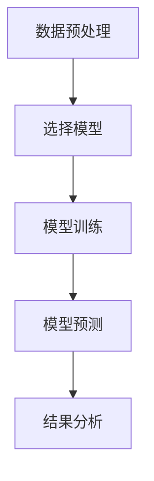
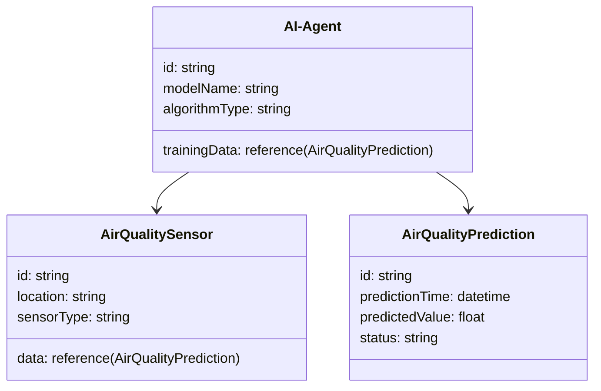
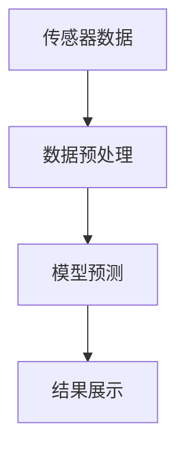
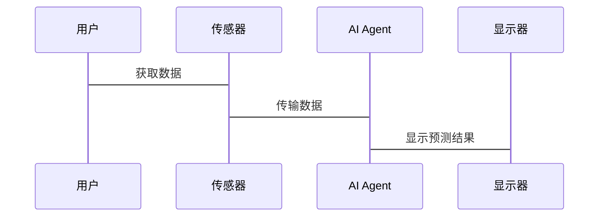

                 


# AI Agent在智能空气质量预测中的实践

## 关键词：AI Agent, 空气质量预测, 机器学习, 深度学习, 时间序列分析

## 摘要：本文探讨了AI Agent在智能空气质量预测中的应用，分析了其核心概念、算法原理、系统架构设计及项目实战。通过详细的技术分析和实例解读，揭示了AI Agent在空气质量预测中的优势及未来发展方向。

---

# 第一部分: AI Agent与智能空气质量预测的背景介绍

## 第1章: 背景介绍

### 1.1 空气质量预测的背景与意义

#### 1.1.1 空气质量问题的全球性挑战
随着工业化进程的加快，空气污染问题日益严重。空气质量预测成为环境保护的重要手段，能够帮助政府和公众提前采取措施，减少污染带来的健康和经济损失。

#### 1.1.2 智能预测在环境保护中的重要性
传统空气质量预测方法依赖于物理模型，存在计算复杂、实时性差等问题。引入AI技术后，预测模型能够快速处理海量数据，提高预测精度和实时性。

#### 1.1.3 AI Agent在空气质量预测中的应用前景
AI Agent作为一种智能实体，能够实时感知环境变化、自主决策并执行预测任务。其在空气质量预测中的应用前景广阔，能够显著提升预测系统的智能化水平。

### 1.2 AI Agent的基本概念与特点

#### 1.2.1 AI Agent的定义与核心要素
AI Agent是一种具备感知、推理、决策和执行能力的智能系统。其核心要素包括：
- **感知能力**：通过传感器或数据源获取环境信息。
- **推理能力**：基于获取的信息进行逻辑推理。
- **决策能力**：根据推理结果做出决策。
- **执行能力**：通过执行机构或接口将决策转化为具体行动。

#### 1.2.2 AI Agent与传统预测模型的区别
| 特性 | AI Agent | 传统预测模型 |
|------|----------|--------------|
| 数据需求 | 高 | 低 |
| 实时性 | 高 | 低 |
| 可解释性 | 低 | 高 |
| 自适应性 | 高 | 低 |

#### 1.2.3 AI Agent在智能系统中的优势
AI Agent能够实时响应环境变化，具备自适应性和学习能力，能够在复杂环境下保持高效预测。

### 1.3 本章小结
本章介绍了空气质量预测的背景与意义，以及AI Agent的基本概念与特点，为后续内容奠定了基础。

---

# 第二部分: AI Agent与空气质量预测的核心概念

## 第2章: 核心概念与联系

### 2.1 AI Agent与空气质量预测的关系

#### 2.1.1 AI Agent在空气质量预测中的角色
AI Agent在空气质量预测中充当智能决策者，能够根据实时数据调整预测模型，优化预测结果。

#### 2.1.2 空气质量预测的核心要素与AI Agent的结合
- **数据源**：AI Agent通过传感器获取空气质量数据。
- **预测模型**：AI Agent结合机器学习和深度学习算法构建预测模型。
- **反馈机制**：AI Agent根据预测结果优化模型参数。

#### 2.1.3 AI Agent与空气质量数据的交互机制
AI Agent通过传感器获取数据，结合历史数据进行预测，并根据预测结果调整传感器部署或触发警报。

### 2.2 空气质量预测模型的构建

#### 2.2.1 数据特征提取与分析
空气质量数据包括PM2.5、PM10、SO2、NO2等指标。通过主成分分析（PCA）提取关键特征。

#### 2.2.2 模型选择与优化
- **模型选择**：选择适合时间序列预测的模型，如ARIMA、LSTM。
- **优化方法**：使用网格搜索（Grid Search）优化模型参数。

#### 2.2.3 AI Agent在模型优化中的作用
AI Agent能够实时监控模型性能，动态调整模型参数，提升预测精度。

### 2.3 核心概念的ER实体关系图

```mermaid
er
    AirQualityPrediction {
        id: string
        predictionTime: datetime
        predictedValue: float
        status: string
    }
    AI-Agent {
        id: string
        modelName: string
        algorithmType: string
        trainingData: reference(AirQualityPrediction)
    }
    AirQualitySensor {
        id: string
        location: string
        sensorType: string
        data: reference(AirQualityPrediction)
    }
```

### 2.4 本章小结
本章探讨了AI Agent与空气质量预测的核心概念及其联系，通过ER图展示了各实体之间的关系。

---

# 第三部分: 算法原理与数学模型

## 第3章: 算法原理

### 3.1 时间序列预测算法

#### 3.1.1 ARIMA算法
ARIMA（自回归积分滑动平均模型）适用于线性时间序列预测。

- **模型公式**：
  $$ ARIMA(p, d, q) $$
  其中，$p$为自回归阶数，$d$为差分阶数，$q$为滑动平均阶数。

- **步骤**：
  1. 确定数据是否为平稳序列。
  2. 选择模型参数。
  3. 模型训练与验证。

#### 3.1.2 LSTM算法
LSTM（长短期记忆网络）适用于非线性时间序列预测。

- **模型结构**：
  $$ LSTM(input\_size, hidden\_size, output\_size) $$

- **步骤**：
  1. 数据预处理。
  2. 构建LSTM模型。
  3. 模型训练与预测。

### 3.2 算法流程图



### 3.3 本章小结
本章详细讲解了ARIMA和LSTM算法的原理及流程，为后续系统设计奠定基础。

---

## 第4章: 数学模型与公式

### 4.1 ARIMA模型公式
$$ ARIMA(p, d, q) $$
其中，$p$为自回归参数，$d$为差分参数，$q$为滑动平均参数。

### 4.2 LSTM模型公式
$$ LSTM(input\_size, hidden\_size, output\_size) $$

### 4.3 模型评估公式
- �均方误差（MSE）：
  $$ MSE = \frac{1}{n}\sum_{i=1}^{n}(y_i - \hat{y}_i)^2 $$
- R平方值（R²）：
  $$ R^2 = 1 - \frac{MSE}{SST} $$
  其中，$SST = \sum_{i=1}^{n}(y_i - \bar{y})^2 $。

### 4.4 本章小结
本章通过数学公式详细讲解了ARIMA和LSTM模型的实现细节。

---

# 第四部分: 系统分析与架构设计方案

## 第5章: 系统分析与架构设计

### 5.1 问题场景介绍
空气质量预测系统需要实时处理多源传感器数据，提供高精度预测结果。

### 5.2 项目介绍
本项目基于AI Agent构建智能空气质量预测系统，实现实时数据采集、智能预测和结果反馈。

### 5.3 系统功能设计

#### 5.3.1 领域模型（类图）


#### 5.3.2 系统架构设计（架构图）


#### 5.3.3 系统接口设计
- **数据接口**：传感器数据接口、历史数据接口。
- **预测接口**：实时预测接口、批量预测接口。

#### 5.3.4 系统交互设计（序列图）


### 5.4 本章小结
本章通过系统分析与架构设计，展示了AI Agent在空气质量预测系统中的具体应用。

---

# 第五部分: 项目实战

## 第6章: 项目实战

### 6.1 环境安装与配置

```bash
pip install numpy pandas scikit-learn tensorflow
```

### 6.2 系统核心实现源代码

#### 6.2.1 数据预处理代码
```python
import pandas as pd
import numpy as np

def preprocess_data(data):
    # 填充缺失值
    data = data.fillna(method='ffill')
    # 标准化
    data = (data - data.mean()) / data.std()
    return data
```

#### 6.2.2 AI Agent实现代码
```python
class AI-Agent:
    def __init__(self, model_name, algorithm_type):
        self.model_name = model_name
        self.algorithm_type = algorithm_type
        # 初始化模型
        if algorithm_type == 'ARIMA':
            from statsmodels.tsa.arima_model import ARIMA
            self.model = ARIMA(order=(1, 1, 1))
        elif algorithm_type == 'LSTM':
            from keras.models import Sequential
            from keras.layers import LSTM, Dense
            self.model = Sequential()
            self.model.add(LSTM(50, input_shape=(1, 1)))
            self.model.add(Dense(1))
            self.model.compile(loss='mean_squared_error', optimizer='adam')

    def train(self, data):
        self.model.fit(data, epochs=100, verbose=0)

    def predict(self, data):
        return self.model.predict(data)
```

#### 6.2.3 预测与结果展示代码
```python
def main():
    data = pd.read_csv('air_quality.csv')
    processed_data = preprocess_data(data)
    agent = AI-Agent('air_quality_model', 'LSTM')
    agent.train(processed_data)
    prediction = agent.predict(processed_data)
    print(f'Prediction: {prediction[-1][0]}')
```

### 6.3 实际案例分析
以某城市空气质量数据为例，展示AI Agent如何实时预测空气质量指数（AQI）。

### 6.4 代码应用解读与分析
- **数据预处理**：确保数据质量和标准化。
- **模型训练**：选择合适的算法并优化参数。
- **预测与展示**：实时显示预测结果。

### 6.5 本章小结
本章通过实际项目实战，展示了AI Agent在空气质量预测中的具体实现。

---

# 第六部分: 总结与展望

## 第7章: 总结与展望

### 7.1 核心内容总结
本文详细探讨了AI Agent在空气质量预测中的应用，包括核心概念、算法原理、系统架构设计及项目实战。

### 7.2 未来发展方向
- **模型优化**：引入更复杂的深度学习模型。
- **多源数据融合**：结合气象数据、交通数据等。
- **边缘计算**：实现更高效的实时预测。

### 7.3 最佳实践 tips
- 数据预处理是关键。
- 选择合适的算法并进行充分验证。
- 系统架构设计需考虑可扩展性和可维护性。

### 7.4 本章小结
本章总结了全文内容，并提出了未来的发展方向。

---

# 作者：AI天才研究院 & 禅与计算机程序设计艺术

---

以上是《AI Agent在智能空气质量预测中的实践》的文章大纲和内容概览。接下来，我会根据这个大纲，逐步展开每个章节的详细内容。

