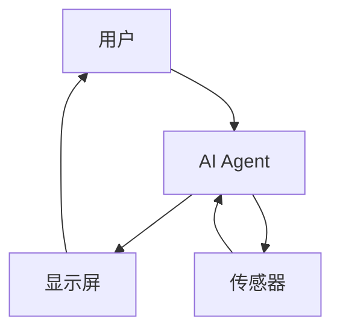

                 


# AI Agent在智能衣架中的穿搭灵感生成器

---

## 关键词：
- AI Agent
- 智能衣架
- 穿搭灵感生成器
- 生成模型
- 系统架构
- 项目实战

---

## 摘要：
本文探讨了AI Agent在智能衣架中的应用，特别是如何通过生成模型为用户提供个性化穿搭灵感。文章从背景介绍、核心概念、算法原理、系统架构到项目实战，详细阐述了AI Agent在智能衣架中的实现过程。通过理论与实践相结合的方式，本文为读者提供了从技术原理到实际应用的全面解析。

---

## 第一部分：背景介绍

### 第1章：AI Agent与智能衣架概述

#### 1.1 问题背景
现代服装搭配的复杂性与用户对个性化穿搭需求的增加，使得传统的人工穿搭建议难以满足用户需求。AI Agent的引入，通过智能化的算法，为用户提供个性化的穿搭灵感，解决了用户在穿衣搭配上的痛点。

#### 1.2 问题描述
穿搭灵感生成的核心问题在于如何根据用户的体型、肤色、喜好和场合需求，推荐合适的服装搭配方案。智能衣架作为载体，需要通过AI技术实现这一目标。

#### 1.3 问题解决
AI Agent通过学习用户的穿衣习惯和时尚趋势，生成个性化的穿搭建议。智能衣架通过传感器和AI算法，实时调整推荐方案，优化用户体验。

#### 1.4 边界与外延
智能衣架的功能边界包括体型测量、颜色识别和搭配建议生成。外延则涉及时尚数据的获取、用户喜好的分析以及与电商平台的联动。

#### 1.5 概念结构与核心要素
AI Agent的核心要素包括数据采集、算法模型和用户反馈。智能衣架的组成结构包括传感器、显示屏和AI芯片。穿搭灵感生成的逻辑流程包括数据采集、模型推理和结果展示。

---

## 第二部分：核心概念与联系

### 第2章：AI Agent的核心原理

#### 2.1 AI Agent的基本原理
AI Agent通过感知环境、分析数据并执行决策来生成穿搭灵感。其核心能力包括数据处理、模式识别和自适应学习。

#### 2.2 生成模型的原理
生成模型通过深度学习算法，从大量时尚数据中提取特征，生成符合用户需求的搭配方案。其输出机制包括概率分布和条件生成。

---

## 第三部分：算法原理

### 第3章：生成模型的数学模型

#### 3.1 概率分布
生成模型通过概率分布描述不同服装搭配的可能性。例如，$$P(y|x)$$ 表示在给定用户特征 $$x$$ 的条件下，生成搭配 $$y$$ 的概率。

#### 3.2 损失函数
生成模型的损失函数用于衡量生成结果与真实数据的差异。例如，$$L = \mathbb{E}_{x,y}[D(x,y)]$$，其中 $$D(x,y)$$ 是判别器的输出。

---

## 第四部分：系统分析与架构设计

### 第4章：系统架构设计

#### 4.1 问题场景介绍
用户通过智能衣架输入体型和喜好，AI Agent根据实时数据生成搭配建议，并通过显示屏展示结果。

#### 4.2 系统功能设计
- 用户数据采集
- 搭配方案生成
- 结果展示与反馈

#### 4.3 系统架构图


---

## 第五部分：项目实战

### 第5章：环境安装与代码实现

#### 5.1 环境安装
- Python 3.8+
- PyTorch 1.9+
- Mermaid CLI

#### 5.2 核心代码实现
```python
import torch
import torch.nn as nn

class Generator(nn.Module):
    def __init__(self, latent_dim, img_size):
        super(Generator, self).__init__()
        self.img_size = img_size
        self.latent_dim = latent_dim
        self.model = nn.Sequential(
            nn.Linear(latent_dim, 128),
            nn.ReLU(),
            nn.Linear(128, 256),
            nn.ReLU(),
            nn.Linear(256, 512),
            nn.ReLU(),
            nn.Linear(512, img_size)
        )
    
    def forward(self, z):
        return self.model(z)
```

#### 5.3 案例分析
通过用户数据训练生成模型，生成个性化搭配方案，并展示结果。

---

## 第六部分：最佳实践

### 第6章：总结与注意事项

#### 6.1 总结
AI Agent在智能衣架中的应用为用户提供个性化的穿搭灵感，结合生成模型和传感器技术，实现了智能化的服装搭配建议。

#### 6.2 注意事项
- 数据隐私保护
- 算法优化与性能提升
- 用户反馈的实时调整

---

## 附录

### 附录A：参考文献
1. 深度学习入门书籍
2. PyTorch官方文档
3. AI Agent相关论文

### 附录B：索引
- AI Agent
- 生成模型
- 智能衣架

---

## 作者：AI天才研究院/AI Genius Institute & 禅与计算机程序设计艺术 /Zen And The Art of Computer Programming

