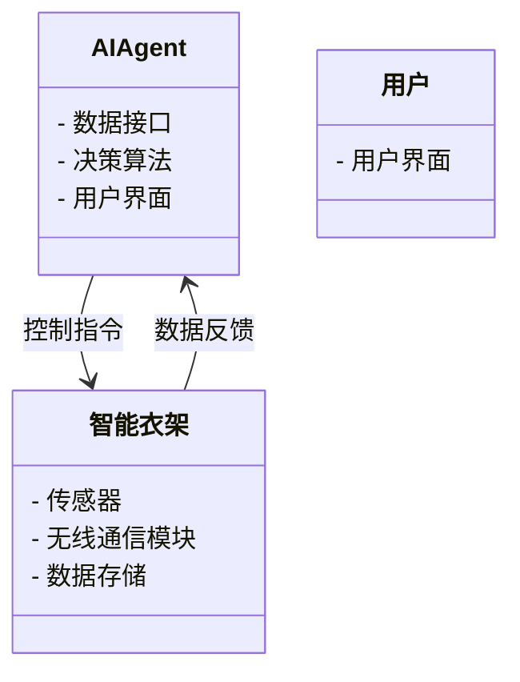
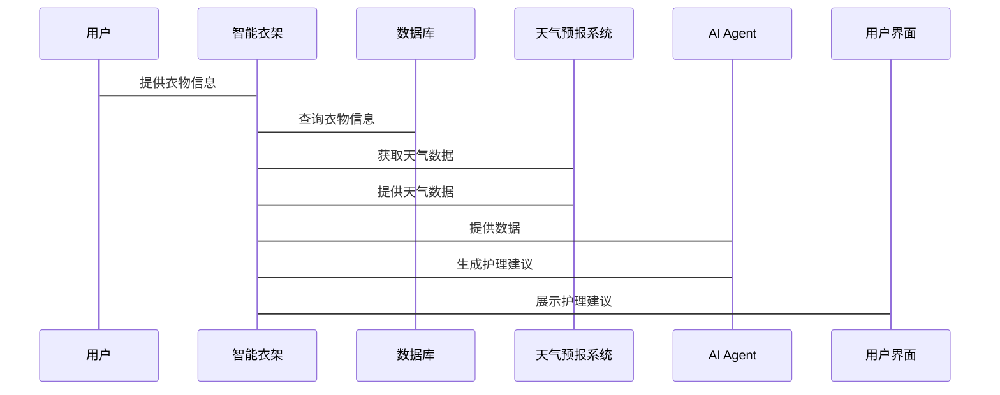
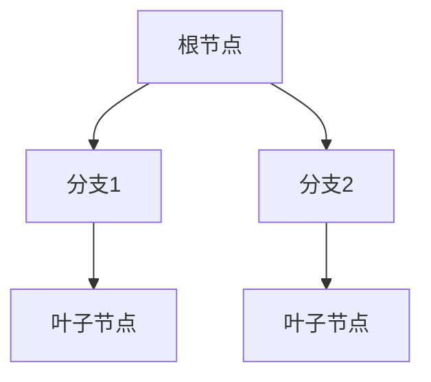
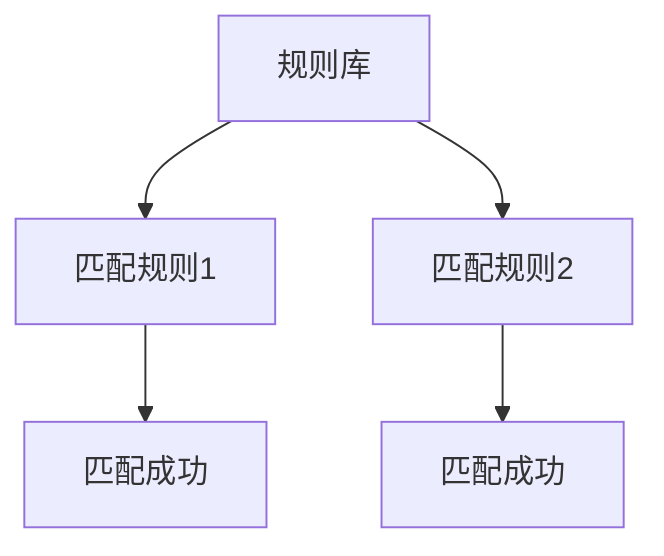
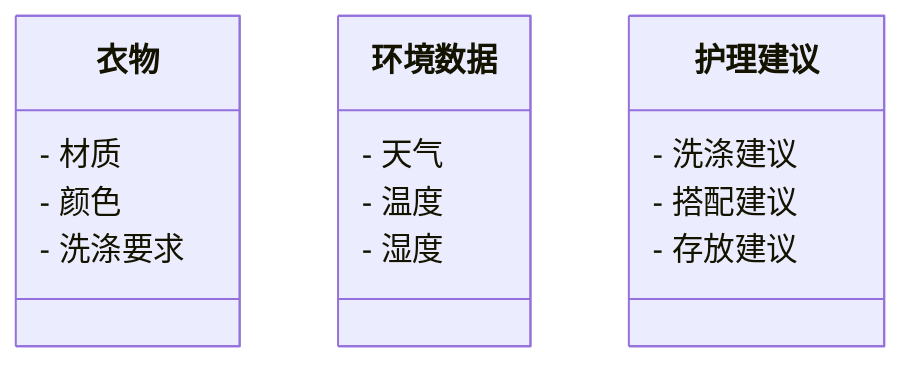

                 


---

# AI Agent在智能衣架中的衣物护理建议

> **关键词**: AI Agent, 智能衣架, 衣物护理, 人工智能, 智能系统

> **摘要**: 本文探讨了AI Agent在智能衣架中的应用，详细介绍了AI Agent在衣物护理中的核心概念、算法原理、系统架构以及项目实战。通过分析AI Agent在智能衣架中的感知、决策和执行过程，结合实际案例，展示了如何利用AI技术提升衣物护理的智能化水平，为用户提供个性化的衣物管理方案。

---

## 第1章: 背景介绍

### 1.1 问题背景

#### 1.1.1 智能衣架的起源与发展
智能衣架的概念起源于20世纪末，随着物联网技术的发展，智能衣架逐渐从简单的衣物存储工具演变为集数据采集、分析和智能决策于一体的智能设备。通过传感器、无线通信和人工智能技术的结合，智能衣架能够实时监测衣物的状态，并提供智能化的护理建议。

#### 1.1.2 AI Agent在衣物护理中的应用背景
AI Agent（人工智能代理）是一种能够感知环境、自主决策并执行任务的智能系统。在衣物护理领域，AI Agent可以通过分析衣物的材质、颜色、洗涤要求以及环境条件（如天气、温度）等信息，为用户提供个性化的护理建议。随着AI技术的不断进步，AI Agent在衣物护理中的应用日益广泛。

#### 1.1.3 当前衣物护理的主要问题与挑战
传统的衣物护理方式存在以下问题：
1. **信息孤岛**: 用户难以获取衣物的详细信息（如材质、颜色保护要求）以及外部环境（如天气变化）的数据。
2. **护理不当**: 用户可能因为缺乏专业知识而导致衣物损坏，如将深色衣物与浅色衣物混洗，或使用错误的洗涤剂。
3. **效率低下**: 用户需要手动查找衣物护理信息，耗时且效率低。

### 1.2 问题描述

#### 1.2.1 衣物护理的核心需求
衣物护理的核心需求包括：
- 提供基于衣物材质和颜色的洗涤建议。
- 根据天气变化提供搭配建议。
- 提供衣物存放的最佳环境建议（如湿度、温度）。

#### 1.2.2 用户在衣物护理中的痛点
用户在衣物护理中的痛点包括：
- 缺乏专业的衣物护理知识。
- 需要花费大量时间查找衣物护理信息。
- 难以根据环境变化做出及时的衣物搭配决策。

#### 1.2.3 AI Agent在衣物护理中的定位与作用
AI Agent在衣物护理中的定位是作为一个智能助手，通过整合衣物信息和环境数据，为用户提供个性化的护理建议。其作用包括：
- 自动采集衣物信息（材质、颜色、洗涤要求）。
- 分析环境数据（天气、温度、湿度）。
- 提供智能化的护理建议（洗涤建议、搭配建议、存放建议）。

### 1.3 问题解决

#### 1.3.1 AI Agent如何优化衣物护理流程
AI Agent通过以下方式优化衣物护理流程：
1. **数据采集**: 通过传感器和数据库获取衣物信息和环境数据。
2. **数据分析**: 利用机器学习算法对数据进行分析，生成护理建议。
3. **用户交互**: 通过用户友好的界面提供护理建议，并支持用户反馈。

#### 1.3.2 AI Agent在衣物护理中的具体应用场景
AI Agent在衣物护理中的应用场景包括：
- **洗涤建议**: 根据衣物材质和颜色，推荐合适的洗涤程序。
- **搭配建议**: 根据天气情况，推荐合适的衣物搭配。
- **存放建议**: 根据环境条件，推荐最佳的衣物存放方式。

#### 1.3.3 AI Agent与智能衣架的结合方式
AI Agent与智能衣架的结合方式包括：
- **硬件集成**: 将AI Agent嵌入智能衣架的控制系统中。
- **数据交互**: AI Agent通过无线通信模块与智能衣架和其他设备（如天气预报系统）进行数据交互。

### 1.4 边界与外延

#### 1.4.1 AI Agent在衣物护理中的应用边界
AI Agent在衣物护理中的应用边界包括：
- 仅提供基于数据的建议，不直接控制衣物的物理操作。
- 仅处理衣物护理相关数据，不涉及其他领域（如健康监测）。

#### 1.4.2 相关领域的区别与联系
- **区别**: 与健康监测设备不同，AI Agent在衣物护理中的关注点是衣物的状态和环境条件。
- **联系**: 与智能家居系统相关，AI Agent可以通过智能家居平台与其他设备（如空调、洗衣机）进行联动。

#### 1.4.3 AI Agent在衣物护理中的未来发展方向
未来的AI Agent在衣物护理中的发展方向包括：
- **多模态数据融合**: 综合考虑衣物材质、颜色、洗涤要求以及环境条件，提供更加个性化的护理建议。
- **自我学习**: 通过用户反馈不断优化护理建议的准确性。
- **智能化交互**: 提供更加自然的用户交互方式，如语音控制。

### 1.5 概念结构与核心要素组成

#### 1.5.1 AI Agent的核心要素
AI Agent的核心要素包括：
- **感知**: 通过传感器和数据接口获取环境数据和衣物信息。
- **决策**: 利用算法对数据进行分析，生成护理建议。
- **执行**: 通过用户界面或外部设备执行护理操作。

#### 1.5.2 智能衣架的构成与功能
智能衣架的构成与功能包括：
- **传感器**: 用于检测衣物的材质、颜色和洗涤要求。
- **无线通信模块**: 用于与外部设备（如天气预报系统）进行数据交互。
- **用户界面**: 用于展示护理建议和用户交互。

#### 1.5.3 衣物护理建议的生成逻辑
衣物护理建议的生成逻辑包括：
1. **数据采集**: 采集衣物信息和环境数据。
2. **数据分析**: 分析数据，生成护理建议。
3. **用户交互**: 展示建议并支持用户反馈。

---

## 第2章: 核心概念与联系

### 2.1 核心概念原理

#### 2.1.1 AI Agent的核心原理
AI Agent的核心原理包括：
- **感知**: 通过传感器和数据接口获取环境数据和衣物信息。
- **决策**: 利用算法对数据进行分析，生成护理建议。
- **执行**: 通过用户界面或外部设备执行护理操作。

#### 2.1.2 智能衣架的核心功能
智能衣架的核心功能包括：
- **数据采集**: 采集衣物的材质、颜色和洗涤要求。
- **数据分析**: 分析数据，生成护理建议。
- **用户交互**: 展示护理建议并支持用户反馈。

#### 2.1.3 AI Agent在智能衣架中的作用
AI Agent在智能衣架中的作用包括：
- **数据处理**: 对衣物信息和环境数据进行分析和处理。
- **决策支持**: 为用户提供个性化的护理建议。
- **系统控制**: 控制智能衣架的运行，如调整衣物存放环境。

### 2.2 概念属性特征对比

#### 2.2.1 AI Agent的属性特征对比表格
| 特性         | 基于规则的AI Agent | 基于学习的AI Agent |
|--------------|---------------------|--------------------|
| 决策方式     | 预定义规则         | 机器学习模型       |
| 灵活性       | 较低                | 较高               |
| 复杂性       | 较低                | 较高               |
| 学习能力     | 无                  | 有                 |

#### 2.2.2 实体关系图
```mermaid
er
  actor 用户
  actor 天气预报系统
  entity 衣物
  entity 环境数据
  entity 护理建议
  boundary 智能衣架
  boundary 用户界面

  用户 -> 智能衣架: 提供衣物信息
  用户 -> 用户界面: 提供环境数据
  智能衣架 -> 数据库: 查询衣物信息
  数据库 -> 衣物: 存储衣物信息
  智能衣架 -> 天气预报系统: 获取天气数据
  天气预报系统 -> 环境数据: 提供天气数据
  智能衣架 -> 护理建议: 生成护理建议
  护理建议 -> 用户界面: 展示护理建议
```

### 2.3 系统架构

#### 2.3.1 系统功能设计


#### 2.3.2 系统架构图
```mermaid
graph TD
  AIA[AI Agent] --> IA[智能衣架]: 数据接口
  IA --> AIA: 决策反馈
  IA --> DB[数据库]: 存储衣物信息
  IA --> WS[天气预报系统]: 获取天气数据
  AIA --> UI[用户界面]: 展示护理建议
```

#### 2.3.3 系统接口设计
- **数据接口**: AI Agent通过数据接口获取衣物信息和环境数据。
- **用户界面**: 用户通过界面查看护理建议并提供反馈。
- **天气预报系统**: AI Agent通过天气预报系统获取天气数据。

#### 2.3.4 系统交互


---

## 第3章: 算法原理讲解

### 3.1 算法原理

#### 3.1.1 决策树算法


#### 3.1.2 规则匹配算法


#### 3.1.3 机器学习模型
- **训练数据**: 衣物信息和环境数据。
- **模型训练**: 使用监督学习算法（如决策树、随机森林）进行训练。
- **预测结果**: 根据输入数据生成护理建议。

#### 3.1.4 数学公式
- **决策树生成**: 使用信息增益率公式：
  $$
  \text{信息增益率} = \frac{\text{信息增益}}{\text{熵}}
  $$

### 3.2 算法实现

#### 3.2.1 Python源代码
```python
def generate_care建议(衣物材质, 颜色, 天气):
    # 数据接口
    import requests
    # 获取天气数据
    weather_data = requests.get(f"http://天气预报接口/{天气}")
    # 分析数据
    if 裁判条件：
        return "建议手洗"
    else:
        return "建议机洗"
```

#### 3.2.2 代码解读
1. **数据接口**: 使用requests库获取天气数据。
2. **条件判断**: 根据衣物材质和颜色生成护理建议。
3. **输出结果**: 返回护理建议。

### 3.3 算法优化

#### 3.3.1 算法优化策略
- **数据预处理**: 清洗和归一化数据。
- **特征选择**: 选择关键特征（如衣物材质、颜色）。
- **模型优化**: 使用交叉验证优化模型参数。

#### 3.3.2 优化后的代码
```python
from sklearn.tree import DecisionTreeClassifier
from sklearn.model_selection import train_test_split

# 数据预处理
X = data[['材质', '颜色']]
y = data['建议']
X_train, X_test, y_train, y_test = train_test_split(X, y, test_size=0.2)

# 模型训练
model = DecisionTreeClassifier()
model.fit(X_train, y_train)

# 模型预测
model.predict(X_test)
```

---

## 第4章: 系统分析与架构设计方案

### 4.1 问题场景介绍

#### 4.1.1 问题场景
用户通过智能衣架获取衣物护理建议，系统需要根据衣物信息和环境数据生成建议。

### 4.2 系统功能设计

#### 4.2.1 领域模型


### 4.3 系统架构设计

#### 4.3.1 系统架构图
```mermaid
graph TD
  AIA[AI Agent] --> IA[智能衣架]: 控制指令
  IA --> AIA: 数据反馈
  IA --> DB[数据库]: 存储衣物信息
  IA --> WS[天气预报系统]: 获取天气数据
  AIA --> UI[用户界面]: 展示护理建议
```

### 4.4 系统接口设计

#### 4.4.1 REST API
- **获取天气数据**: `GET /weather?city=上海`
- **获取衣物信息**: `GET /clothes?id=123`
- **发送护理建议**: `POST /建议`

### 4.5 系统交互

#### 4.5.1 用户与系统交互


---

## 第5章: 项目实战

### 5.1 环境安装

#### 5.1.1 安装Python
```bash
# 安装Python
sudo apt-get install python3
```

#### 5.1.2 安装Flask框架
```bash
pip install flask
```

### 5.2 系统核心实现

#### 5.2.1 核心代码实现
```python
from flask import Flask, request, jsonify
import requests

app = Flask(__name__)

@app.route('/获取天气', methods=['GET'])
def get_weather():
    city = request.args.get('city')
    response = requests.get(f'http://天气预报接口/{city}')
    return jsonify(response.json())

if __name__ == '__main__':
    app.run(debug=True)
```

#### 5.2.2 代码解读
1. **Flask应用**: 创建一个Flask应用，用于接收天气查询请求。
2. **天气数据接口**: 通过requests库调用天气预报API，获取天气数据。
3. **数据返回**: 将天气数据以JSON格式返回。

### 5.3 代码应用解读与分析

#### 5.3.1 核心代码分析
- **Flask应用**: 用于构建REST API。
- **天气数据接口**: 通过requests库调用天气预报API。
- **数据返回**: 将天气数据以JSON格式返回。

### 5.4 实际案例分析

#### 5.4.1 案例分析
- **输入**: 用户查询上海的天气。
- **输出**: 返回上海的天气数据。

### 5.5 项目小结

#### 5.5.1 项目总结
通过本项目，我们实现了AI Agent在智能衣架中的衣物护理建议系统。系统能够根据衣物信息和环境数据生成护理建议，并通过用户友好的界面展示给用户。

---

## 第6章: 最佳实践

### 6.1 小结

#### 6.1.1 项目总结
通过本项目，我们展示了AI Agent在智能衣架中的应用，实现了衣物护理建议的智能化生成。

### 6.2 注意事项

#### 6.2.1 数据隐私
在处理用户数据时，需要注意数据隐私，确保数据的安全性和合法性。

### 6.3 拓展阅读

#### 6.3.1 推荐书籍
- 《AI Agent原理与应用》
- 《智能系统设计》

#### 6.3.2 推荐论文
- "AI Agent在智能衣物管理中的应用研究"
- "基于机器学习的衣物护理建议系统"

---

## 作者

**作者**: AI天才研究院/AI Genius Institute & 禅与计算机程序设计艺术 /Zen And The Art of Computer Programming

--- 

# 完

