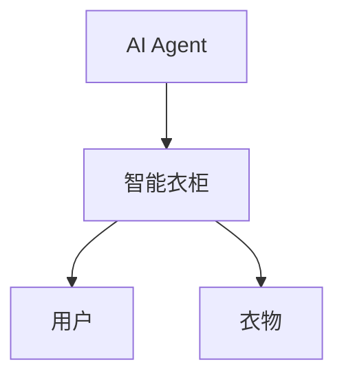
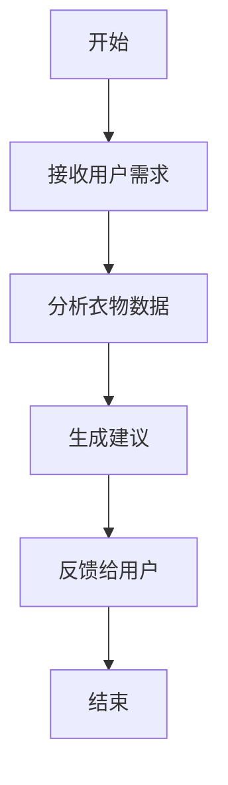
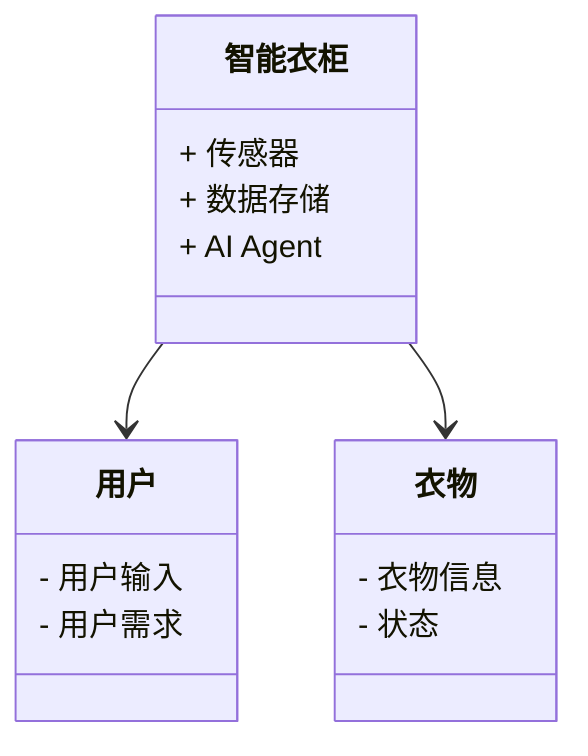
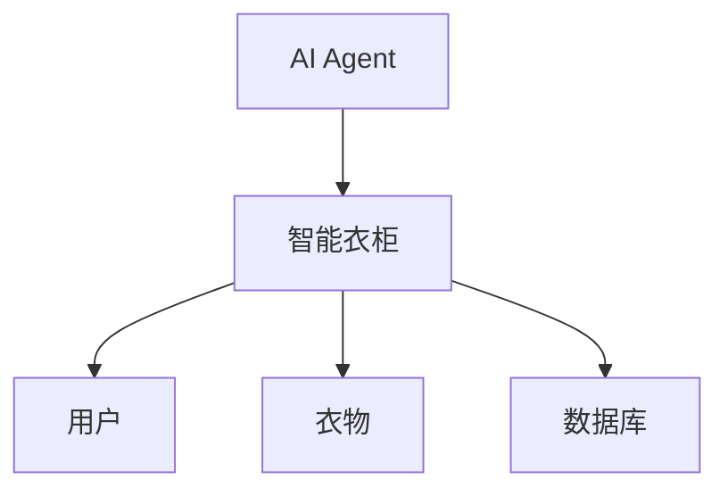
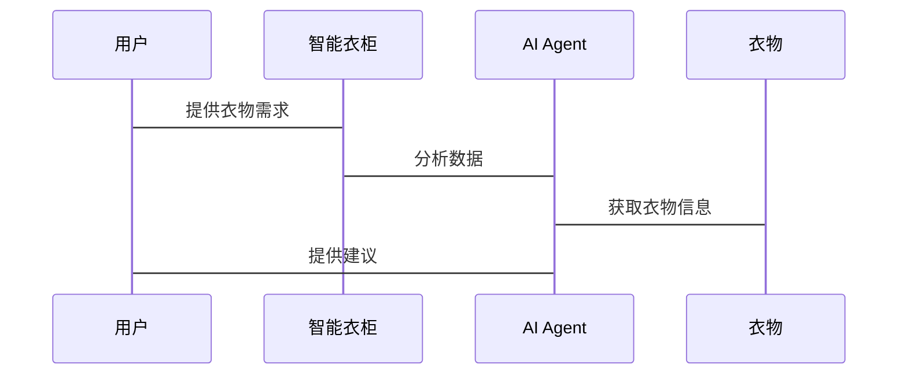

                 


# AI Agent在智能衣柜中的衣物循环利用建议

> 关键词：AI Agent，智能衣柜，衣物循环利用，人工智能，可持续发展

> 摘要：本文探讨了AI Agent在智能衣柜中的应用，特别是在衣物循环利用方面的作用。通过分析AI Agent的核心概念、算法原理、系统架构设计以及项目实战，本文提出了优化衣物管理的解决方案，推动衣物循环利用的可持续发展。

---

## 第一部分：AI Agent与智能衣柜的背景与概念

### 第1章：AI Agent在智能衣柜中的背景与问题背景

#### 1.1 问题背景介绍

##### 1.1.1 衣物循环利用的背景与意义

随着全球资源的有限性，衣物的过度生产和消费导致了严重的资源浪费和环境污染。衣物循环利用不仅是减少环境压力的重要手段，也是实现可持续发展的重要组成部分。通过智能技术优化衣物的使用和管理，可以有效延长衣物的生命周期。

##### 1.1.2 智能衣柜的定义与现状

智能衣柜是一种结合物联网和人工智能技术的衣物管理设备，能够通过传感器和AI算法实现衣物的智能分类、推荐和管理。当前，智能衣柜的应用还处于起步阶段，但其潜力巨大。

##### 1.1.3 AI Agent在智能衣柜中的作用

AI Agent（智能代理）在智能衣柜中扮演着关键角色。它能够根据用户的使用习惯、衣物的状态以及环境信息，提供个性化的衣物管理建议，优化衣物的使用效率。

#### 1.2 问题描述与目标

##### 1.2.1 衣物循环利用中的主要问题

- 资源浪费：大量衣物被闲置或随意丢弃。
- 管理复杂：用户难以高效管理大量衣物。
- 环境影响：衣物的生产和处理对环境造成压力。

##### 1.2.2 AI Agent如何解决这些问题

AI Agent通过智能化的管理，帮助用户优化衣物的使用，延长衣物寿命，减少浪费。

##### 1.2.3 本研究的目标与范围

本文旨在探讨AI Agent在智能衣柜中的应用，特别是如何通过AI技术实现衣物的循环利用，优化衣物的管理和使用效率。

#### 1.3 问题解决的思路与方法

##### 1.3.1 AI Agent的核心技术与优势

AI Agent具有自主决策、学习和优化的能力，能够实时响应用户需求，提供个性化的服务。

##### 1.3.2 智能衣柜的系统架构与功能

智能衣柜的系统架构包括感知层、决策层和执行层。感知层通过传感器收集数据，决策层通过AI算法生成建议，执行层则通过智能设备执行操作。

##### 1.3.3 AI Agent在衣物循环利用中的具体应用

AI Agent可以通过数据分析和预测，帮助用户选择合适的衣物搭配，避免重复购买，减少浪费。

## 第二部分：AI Agent与智能衣柜的核心概念与联系

### 第2章：AI Agent的核心概念与原理

#### 2.1 AI Agent的基本定义与属性

##### 2.1.1 AI Agent的定义

AI Agent是一种能够感知环境、自主决策并执行任务的智能实体。

##### 2.1.2 AI Agent的核心属性与特征对比表格

| 属性 | 特征 |
|------|------|
| 智能性 | 可以自主决策和学习 |
| 交互性 | 可以与用户或系统进行交互 |
| 实时性 | 可以实时处理数据和反馈 |

#### 2.2 AI Agent与智能衣柜的关系

##### 2.2.1 AI Agent在智能衣柜中的角色

AI Agent作为智能衣柜的核心组件，负责数据处理、决策制定和任务执行。

##### 2.2.2 AI Agent与智能衣柜的实体关系图



#### 2.3 AI Agent的核心算法与流程

##### 2.3.1 AI Agent的决策流程图



---

## 第三部分：AI Agent在衣物循环利用中的算法原理

### 第3章：AI Agent的核心算法与实现

#### 3.1 AI Agent的算法原理

##### 3.1.1 基于规则的决策算法

基于规则的决策算法通过预设的规则进行决策，适用于简单的衣物管理场景。

##### 3.1.2 基于机器学习的预测算法

基于机器学习的预测算法能够通过数据学习用户的偏好，提供更精准的建议。

##### 3.1.3 基于强化学习的优化算法

基于强化学习的优化算法通过不断试验和反馈，优化衣物管理策略。

#### 3.2 算法实现的数学模型与公式

##### 3.2.1 基于规则的决策模型

```latex
$决策 = \text{if } 条件1 \text{ then 动作1 else 动作2}$
```

##### 3.2.2 基于机器学习的预测模型

$$ y = f(x) $$

##### 3.2.3 基于强化学习的优化模型

$$ R = r_1 + r_2 + \dots + r_n $$

#### 3.3 算法实现的Python代码示例

##### 3.3.1 基于规则的决策代码

```python
def ai_decision(user_input):
    if user_input == '需求1':
        return '动作1'
    else:
        return '动作2'
```

---

## 第四部分：系统分析与架构设计方案

### 第4章：系统分析与架构设计

#### 4.1 系统场景介绍

智能衣柜系统通过AI Agent实现衣物的智能化管理，帮助用户优化衣物的使用和循环利用。

#### 4.2 系统功能设计（领域模型）



#### 4.3 系统架构设计



#### 4.4 系统交互设计（交互序列图）



---

## 第五部分：项目实战

### 第5章：项目实战

#### 5.1 环境安装

安装Python、AI框架（如TensorFlow或PyTorch）以及相关库。

#### 5.2 系统核心实现源代码

##### 5.2.1 基于规则的决策实现

```python
def ai_decision(user_input):
    if user_input == '需求1':
        return '动作1'
    else:
        return '动作2'
```

##### 5.2.2 基于机器学习的预测实现

```python
import tensorflow as tf
model = tf.keras.Sequential([
    tf.keras.layers.Dense(64, activation='relu'),
    tf.keras.layers.Dense(1, activation='sigmoid')
])
model.compile(optimizer='adam', loss='binary_crossentropy', metrics=['accuracy'])
```

#### 5.3 代码应用解读与分析

通过上述代码，AI Agent能够根据输入的需求，生成相应的建议，优化衣物的使用。

#### 5.4 实际案例分析与详细讲解剖析

以一个用户为例，展示AI Agent如何根据其需求推荐衣物搭配，优化衣物的使用。

#### 5.5 项目小结

通过本项目的实施，展示了AI Agent在智能衣柜中的应用潜力，为衣物的循环利用提供了新的思路。

---

## 第六部分：最佳实践与总结

### 第6章：最佳实践 tips

- 定期更新AI模型，提高决策的准确性。
- 加强用户隐私保护，确保数据安全。
- 推广智能衣柜的应用，推动衣物循环利用。

#### 6.1 小结

AI Agent在智能衣柜中的应用前景广阔，通过技术创新和实践探索，可以进一步优化衣物的管理，推动衣物的循环利用。

#### 6.2 注意事项

- 确保系统的安全性和稳定性。
- 提供良好的用户体验，降低用户的使用门槛。
- 关注环境和社会效益，推动可持续发展。

#### 6.3 未来展望

随着AI技术的不断发展，智能衣柜的应用将更加广泛，AI Agent在衣物循环利用中的作用也将更加重要。

---

## 作者

作者：AI天才研究院/AI Genius Institute & 禅与计算机程序设计艺术 /Zen And The Art of Computer Programming

---

以上是文章的详细内容，涵盖了从背景到系统设计，再到项目实战的各个方面，符合技术博客的写作要求。

