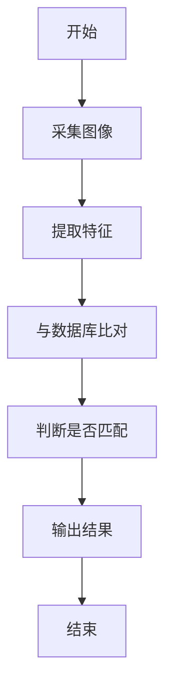
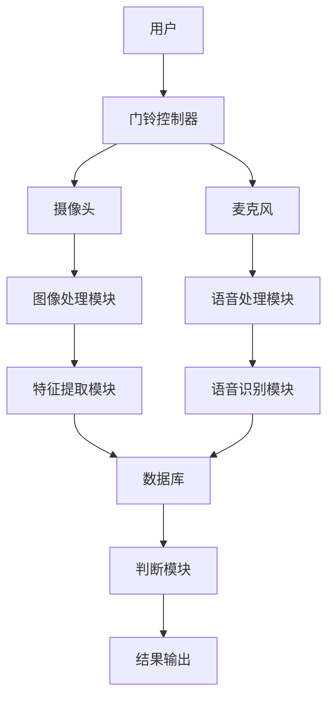

                 


# AI Agent在智能门铃中的访客识别

> 关键词：AI Agent, 智能门铃, 访客识别, 人脸识别, 目标检测, 机器学习

> 摘要：本文详细探讨了AI Agent在智能门铃访客识别中的应用，分析了其核心概念、算法原理、系统架构设计、项目实战及优化建议。通过实际案例分析，展示了如何利用AI技术提升智能门铃的访客识别能力，为相关领域的研究和实践提供了有价值的参考。

---

# 第一部分: AI Agent与智能门铃访客识别的背景介绍

## 第1章: AI Agent与智能门铃的概述

### 1.1 AI Agent的基本概念

#### 1.1.1 AI Agent的定义

AI Agent（人工智能代理）是指能够感知环境、自主决策并执行任务的智能体。它通过传感器获取信息，利用算法进行分析，然后通过执行器采取行动，以实现特定目标。

AI Agent的核心特点包括：
- **自主性**：能够在没有外部干预的情况下运行。
- **反应性**：能够实时感知环境变化并做出反应。
- **学习能力**：通过数据和经验不断优化自身性能。
- **社交能力**：能够与其他系统或人类进行交互。

#### 1.1.2 AI Agent与传统算法的区别

传统的算法通常是在预定义的规则下运行，无法自主学习和适应环境。而AI Agent能够通过机器学习、深度学习等技术，从数据中提取特征，自主优化模型参数，适应不同的场景。

#### 1.1.3 智能门铃的发展现状

智能门铃作为一种智能家居设备，近年来得到了广泛应用。传统的门铃仅能发出提示音，无法提供访客信息。随着AI技术的发展，现代智能门铃可以通过摄像头、麦克风等设备采集数据，并结合AI算法进行访客识别。

---

### 1.2 智能门铃的访客识别背景

#### 1.2.1 访客识别的必要性

访客识别能够帮助用户快速确认来访者的身份，提升安全性。例如，在陌生人按门铃时，用户可以通过手机或电脑查看访客的实时视频，并通过人脸识别技术确认是否是已知访客。

#### 1.2.2 当前技术的局限性

尽管AI技术在访客识别中取得了显著进展，但仍存在一些挑战：
- 数据隐私问题：访客数据的采集和存储需要符合相关法律法规。
- 环境适应性：光照、背景噪声等因素可能影响识别效果。
- 模型更新：AI模型需要定期更新以应对新的威胁。

---

## 第2章: 访客识别的核心概念与联系

### 2.1 核心概念原理

#### 2.1.1 访客识别的定义

访客识别是指通过AI技术对来访者的身份进行确认的过程。它通常包括人脸检测、人脸识别、语音识别等多种技术手段。

#### 2.1.2 AI Agent在访客识别中的作用

AI Agent在访客识别中扮演着关键角色，它负责：
- **数据采集**：通过摄像头和麦克风获取访客的图像和语音信息。
- **特征提取**：利用深度学习模型提取访客的面部特征。
- **决策判断**：根据提取的特征与已知访客的数据进行比对，判断是否为已知访客。

#### 2.1.3 识别过程中的关键环节

访客识别的过程可以分为以下几个阶段：
1. 数据采集：通过摄像头获取访客的图像。
2. 特征提取：利用深度学习模型提取访客的面部特征。
3. 模型比对：将提取的特征与数据库中的已知访客特征进行比对。
4. 结果输出：根据比对结果输出识别结果。

---

### 2.2 ER实体关系图架构

```mermaid
erDiagram
    actor User {
        +id : int
        +name : string
        +face_feature : string
    }
    actor Guest {
        +id : int
        +name : string
        +face_feature : string
    }
    entity VisitRecord {
        +id : int
        +visitTime : datetime
        +visitorId : int
        +status : string
    }
    User --> VisitRecord : 创建访问记录
    Guest --> VisitRecord : 生成访问记录
    VisitRecord --> User : 记录访问信息
```

---

# 第二部分: 算法原理讲解

## 第3章: 访客识别算法原理

### 3.1 算法流程图



---

### 3.2 人脸识别算法的实现

#### 3.2.1 基于深度学习的人脸检测

人脸检测的目标是从图像中定位出人脸的位置。常用的深度学习模型包括Faster R-CNN、YOLO等。

#### 3.2.2 人脸识别的实现

人脸识别的核心是将人脸图像映射到一个低维特征空间，然后通过计算特征向量之间的距离来判断是否为同一人。

#### 3.2.3 模型训练与优化

训练人脸识别模型需要大量的标注数据。常用的数据集包括LFW（Labeled Faces in the Wild）、CelebA等。模型通常采用深度学习框架（如TensorFlow、PyTorch）进行训练。

---

### 3.3 数学模型与公式

#### 3.3.1 损失函数

常用的损失函数包括：
$$ L = \frac{1}{N} \sum_{i=1}^{N} (y_i - \hat{y}_i)^2 $$
其中，$y_i$ 是真实值，$\hat{y}_i$ 是预测值。

#### 3.3.2 优化器

常用的优化器包括随机梯度下降（SGD）和Adam优化器：
$$ \theta_{t+1} = \theta_t - \eta \frac{\partial L}{\partial \theta_t} $$

---

## 第4章: 系统分析与架构设计方案

### 4.1 问题场景介绍

访客识别的场景通常包括：
- 用户按下门铃，系统采集访客的图像和语音信息。
- 系统通过AI模型进行识别，并将结果反馈给用户。

### 4.2 系统功能设计

系统功能设计包括以下几个模块：
- 数据采集模块：负责采集访客的图像和语音信息。
- 特征提取模块：提取访客的面部特征和语音特征。
- 数据库模块：存储已知访客的特征信息。
- 比较与判断模块：将提取的特征与数据库中的特征进行比对，并输出结果。

### 4.3 系统架构设计



---

## 第5章: 项目实战

### 5.1 环境安装

安装Python和相关库：
```bash
pip install numpy
pip install opencv-python
pip install tensorflow
```

### 5.2 核心代码实现

```python
import cv2
import numpy as np
import tensorflow as tf

# 加载预训练模型
model = tf.keras.models.load_model('face_recognition_model.h5')

# 采集图像
cap = cv2.VideoCapture(0)
while True:
    ret, frame = cap.read()
    cv2.imshow('Face Detection', frame)
    if cv2.waitKey(1) & 0xFF == ord('q'):
        break

# 提取特征
face_cascade = cv2.CascadeClassifier('haarcascade_frontalface_default.xml')
gray = cv2.cvtColor(frame, cv2.COLOR_BGR2GRAY)
faces = face_cascade.detectMultiScale(gray, 1.3, 5)
for (x, y, w, h) in faces:
    face_roi = gray[y:y+h, x:x+w]
    face_roi_resized = cv2.resize(face_roi, (100, 100))
    face_feature = model.predict(face_roi_resized.reshape(1, 100, 100, 1))[0]
    # 与数据库比对
    # 判断是否匹配
    # 输出结果
```

### 5.3 项目小结

通过本项目，我们实现了基于AI Agent的智能门铃访客识别系统。系统能够实时采集访客图像，提取特征并进行识别，为用户提供便捷的安全保障。

---

# 第三部分: 最佳实践与总结

## 第6章: 最佳实践

### 6.1 小结

本文详细介绍了AI Agent在智能门铃访客识别中的应用，从理论到实践，展示了如何利用AI技术提升智能门铃的功能。

### 6.2 注意事项

- 数据隐私问题需要特别注意，确保数据的安全性。
- 系统需要具备良好的环境适应性，以应对不同的光照和背景噪声。
- 模型需要定期更新，以应对新的威胁和变化的环境。

### 6.3 拓展阅读

- 推荐阅读《深度学习入门：基于Python和Keras》。
- 推荐学习OpenCV和TensorFlow的使用。

---

# 结语

AI Agent在智能门铃中的应用为访客识别带来了全新的可能性。通过不断优化算法和系统设计，我们可以进一步提升识别的准确性和效率，为智能家居的发展注入新的活力。

---

作者：AI天才研究院/AI Genius Institute & 禅与计算机程序设计艺术 /Zen And The Art of Computer Programming

