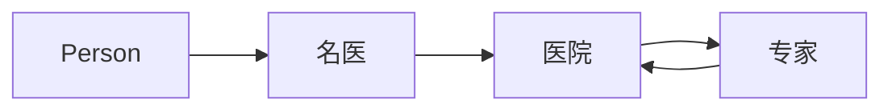

                 

---

# AI Agent在特定领域的应用：金融、医疗、法律等

> **关键词**：AI Agent, 人工智能, 金融, 医疗, 法律  
> **摘要**：本文系统介绍了AI Agent在金融、医疗和法律等领域的应用，分析了其技术基础、核心算法、应用场景及其面临的挑战。通过详细的技术分析和实际案例，探讨了AI Agent如何在这些领域中提升效率、优化决策并创造价值。

---

## 第一部分：AI Agent的基本概念与技术基础

### 1.1 AI Agent的定义与核心特征

AI Agent（人工智能代理）是一种能够感知环境、自主决策并执行任务的智能实体。其核心特征包括：

- **自主性**：能够在没有外部干预的情况下独立运行。
- **反应性**：能够实时感知环境并做出响应。
- **目标导向性**：基于明确的目标进行决策和行动。
- **学习能力**：通过数据和经验不断优化自身的性能。

### 1.2 AI Agent的技术架构

AI Agent的技术架构通常包括以下几个关键模块：

#### 1.2.1 知识表示与推理

知识表示是AI Agent理解和处理信息的基础。常见的知识表示方法包括：

- **符号表示**：使用符号逻辑表示知识（例如，规则引擎）。
- **语义网络**：通过节点和边表示概念及其关系。
- **知识图谱**：将实体及其关系以图结构表示（如图1所示）。

**图1：知识图谱示意图**

#### 1.2.2 自然语言处理

NLP技术使AI Agent能够理解和生成人类语言。关键任务包括：

- **文本分类**：将文本归类到预定义的类别（如情感分析）。
- **信息抽取**：从文本中提取结构化信息（如实体识别）。
- **对话生成**：生成自然的对话回复。

#### 1.2.3 决策与规划

基于强化学习的决策算法是AI Agent的核心技术之一。例如，Q-learning算法通过状态-动作-奖励机制优化决策策略：

$$ Q(s, a) = Q(s, a) + \alpha (r + \max Q(s', a') - Q(s, a)) $$

其中，$\alpha$是学习率，$r$是奖励，$s'$是下一个状态。

### 1.3 AI Agent的应用场景

AI Agent的应用场景广泛，包括：

- **金融领域**：投资决策、风险评估。
- **医疗领域**：疾病诊断、治疗方案优化。
- **法律领域**：法律咨询、案例分析。

---

## 第二部分：AI Agent在金融领域的应用

### 2.1 金融领域的核心问题

金融领域的核心问题包括：

- **投资决策**：如何在复杂的市场中选择最优的投资组合。
- **风险评估**：如何准确评估投资风险。
- **交易策略**：如何制定高效的交易策略。

### 2.2 AI Agent在金融中的技术实现

#### 2.2.1 基于NLP的金融数据分析

NLP技术在金融数据中的应用包括：

- **文本挖掘**：从新闻、报告中提取关键词。
- **情感分析**：分析市场情绪对股价的影响。

#### 2.2.2 基于强化学习的投资策略

强化学习算法（如Deep Q-Network）可以用于自动交易策略：

$$ a = \arg\max_a Q(s, a) $$

其中，$s$是当前市场状态，$a$是动作（如买入或卖出）。

#### 2.2.3 基于知识图谱的金融知识推理

知识图谱帮助AI Agent理解复杂的金融关系。例如，构建公司-行业的知识图谱用于投资决策。

### 2.3 金融领域中的典型应用

#### 2.3.1 自动化投资顾问

AI Agent可以根据用户的风险偏好提供个性化的投资建议。

#### 2.3.2 风险评估系统

通过分析历史数据和市场动态，AI Agent可以实时评估投资风险。

#### 2.3.3 智能交易机器人

智能交易机器人可以在毫秒级别完成交易决策，显著提升交易效率。

---

## 第三部分：AI Agent在医疗领域的应用

### 3.1 医疗领域的核心问题

医疗领域的核心问题包括：

- **疾病诊断**：如何提高诊断的准确性和效率。
- **治疗方案推荐**：如何制定个性化的治疗方案。
- **医疗数据分析**：如何从大量医疗数据中提取有价值的信息。

### 3.2 AI Agent在医疗中的技术实现

#### 3.2.1 基于深度学习的医学影像分析

深度学习模型（如卷积神经网络）在医学影像分析中表现出色。例如，用于肺癌筛查的CNN模型：

$$ y = \sigma(w x + b) $$

其中，$x$是输入图像，$y$是输出结果。

#### 3.2.2 基于知识图谱的医疗知识推理

知识图谱帮助AI Agent理解医疗知识之间的关联关系。例如，构建疾病-症状的知识图谱用于辅助诊断。

#### 3.2.3 基于强化学习的治疗方案优化

强化学习可以用于优化治疗方案。例如，通过模拟不同治疗方案的效果，选择最优方案。

### 3.3 医疗领域中的典型应用

#### 3.3.1 智能诊断辅助系统

AI Agent可以根据患者的症状和病史提供诊断建议。

#### 3.3.2 个性化治疗方案推荐

基于患者的基因信息和病史，AI Agent可以推荐个性化的治疗方案。

#### 3.3.3 医疗数据智能分析

AI Agent可以分析大量的医疗数据，发现潜在的治疗靶点或药物副作用。

---

## 第四部分：AI Agent在法律领域的应用

### 4.1 法律领域的核心问题

法律领域的核心问题包括：

- **法律文书分析**：如何快速理解复杂的法律文档。
- **法律案例推理**：如何从大量案例中找到相似案例。
- **法律咨询与建议**：如何为用户提供个性化的法律建议。

### 4.2 AI Agent在法律中的技术实现

#### 4.2.1 基于NLP的法律文本分析

NLP技术可以用于法律文本的自动分类和信息抽取。例如，自动分类合同类型。

#### 4.2.2 基于知识图谱的法律案例推理

知识图谱可以帮助AI Agent理解法律案例之间的关系。例如，构建案例-法律条文的知识图谱用于案例推理。

#### 4.2.3 基于对话系统的法律咨询

对话系统使AI Agent能够与用户进行自然的对话，提供法律咨询服务。

### 4.3 法律领域中的典型应用

#### 4.3.1 法律文书自动分类

AI Agent可以根据内容自动分类法律文书，提高处理效率。

#### 4.3.2 法律案例智能检索

通过分析案例的关键词和上下文，AI Agent可以快速检索相关案例。

#### 4.3.3 智能法律咨询系统

用户可以通过与AI Agent对话，获得个性化的法律建议。

---

## 第五部分：AI Agent的跨领域综合应用

### 5.1 跨领域应用的挑战与机遇

#### 5.1.1 跨领域数据整合的难点

数据格式和术语差异是跨领域数据整合的主要挑战。

#### 5.1.2 跨领域知识共享的机制

构建跨领域的知识图谱是实现知识共享的关键。

#### 5.1.3 跨领域应用的潜在价值

跨领域应用可以提高资源利用率，降低成本。

### 5.2 跨领域综合应用的典型案例

#### 5.2.1 金融与医疗的综合应用

例如，通过分析患者的医疗数据和市场动态，制定个性化的健康管理方案。

#### 5.2.2 医疗与法律的综合应用

例如，通过分析医疗案例和相关法律条文，优化医疗合同的制定。

#### 5.2.3 金融与法律的综合应用

例如，通过分析金融市场的动态和相关法律条文，制定风险控制策略。

---

## 第六部分：AI Agent在特定领域的应用挑战与未来展望

### 6.1 当前技术挑战

- **数据隐私**：如何在保证数据隐私的前提下进行分析。
- **模型解释性**：如何提高AI Agent的决策透明度。
- **跨领域通用性**：如何构建通用的AI Agent。

### 6.2 未来展望

- **通用AI Agent的开发**：研究如何构建适用于多个领域的AI Agent。
- **人机协作模式的优化**：探索人与AI Agent的最佳协作方式。
- **伦理与法律问题**：制定相关政策和法规，确保AI Agent的合规使用。

---

## 附录：AI Agent开发工具与资源

### 1. 开发工具

- **Python框架**：TensorFlow、PyTorch。
- **NLP库**：spaCy、NLTK。
- **知识图谱工具**：Neo4j、Ubergraph。

### 2. 参考文献

- LeCun, Y., Bengio, Y., & Hinton, G. (2015). Deep learning. Nature, 521(7552), 436-444.
- Russell, S., & Norvig, P. (2010). Artificial Intelligence: A Modern Approach. Pearson.

---

**作者：AI天才研究院 & 禅与计算机程序设计艺术**

---

以上是《AI Agent在特定领域的应用：金融、医疗、法律等》的技术博客大纲和部分内容。希望这篇文章能为您提供有价值的见解和启发！

