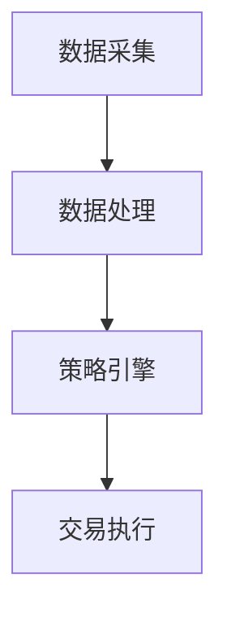

                 


# AI Agent在股票交易中的自动化策略

> 关键词：AI Agent, 股票交易, 自动化策略, 机器学习, 强化学习, 系统架构, 技术实现

> 摘要：本文详细探讨了AI Agent在股票交易中的应用，从基础概念到高级技术，系统性地分析了如何利用AI技术构建自动化交易策略。文章从AI Agent的核心原理出发，结合股票市场数据的处理、策略模型的构建、系统架构的设计以及实际项目实现等多个方面展开，深入剖析了AI Agent在股票交易中的优势与挑战。通过理论与实践相结合的方式，本文为读者提供了一套完整的AI Agent自动化交易解决方案，帮助读者理解并掌握这一前沿技术。

---

# 第1章: AI Agent与股票交易概述

## 1.1 AI Agent的基本概念

### 1.1.1 AI Agent的定义与特点

AI Agent（人工智能代理）是一种能够感知环境、做出决策并执行操作的智能体。在股票交易中，AI Agent可以通过分析市场数据、预测价格走势、制定交易策略并执行交易指令，从而实现自动化交易。

**AI Agent的特点：**

1. **自主性**：AI Agent能够在没有人工干预的情况下独立运行。
2. **反应性**：能够实时感知市场变化并做出快速反应。
3. **学习能力**：通过机器学习算法不断优化自身的交易策略。
4. **决策能力**：基于复杂的数据分析做出最优决策。

### 1.1.2 AI Agent的核心要素

1. **感知层**：通过数据采集和分析，获取市场信息。
2. **决策层**：基于感知数据，制定交易策略。
3. **执行层**：根据决策结果，执行具体的交易操作。

### 1.1.3 股票交易的基本原理

股票交易是通过买入和卖出股票来实现收益的过程。传统交易依赖人工分析和技术指标，而AI Agent通过机器学习和大数据分析，能够更高效地捕捉市场机会。

---

## 1.2 AI Agent在股票交易中的应用背景

### 1.2.1 传统股票交易的局限性

1. **人工决策的主观性**：依赖个人经验和判断，容易受到情绪影响。
2. **效率低下**：手动分析市场数据耗时耗力，难以应对高频交易的需求。
3. **数据处理能力有限**：传统方法难以处理海量数据，无法捕捉复杂市场信号。

### 1.2.2 AI技术在金融领域的优势

1. **高效的数据处理能力**：AI能够快速分析大量数据，发现隐藏的市场规律。
2. **自动化决策**：通过算法优化交易策略，减少人为干扰。
3. **实时性**：AI Agent能够实时监控市场动态，快速做出反应。

### 1.2.3 自动化交易的兴起与挑战

随着计算机技术的发展，自动化交易逐渐成为主流。然而，AI Agent在股票交易中的应用也面临一些挑战，例如数据噪声、市场不确定性以及算法优化的复杂性。

---

## 1.3 本章小结

本章介绍了AI Agent的基本概念及其在股票交易中的应用背景。通过对比传统交易与AI Agent的优势，我们看到了AI技术在金融领域的巨大潜力。接下来，我们将深入探讨AI Agent的核心原理与技术。

---

# 第2章: AI Agent的核心原理与技术

## 2.1 AI Agent的基本原理

### 2.1.1 感知层：数据采集与处理

AI Agent通过多种渠道获取市场数据，包括历史数据、实时数据以及新闻、社交媒体等非结构化数据。

#### 数据分类：

1. **历史数据**：K线图、技术指标（如MA、MACD）。
2. **实时数据**：订单簿、市场深度、盘口数据。
3. **非结构化数据**：新闻、社交媒体情绪、行业报告。

### 2.1.2 决策层：策略制定与优化

AI Agent通过机器学习和强化学习算法，基于感知数据制定交易策略并不断优化。

#### 常见算法：

1. **机器学习**：监督学习（如回归、分类）、无监督学习（如聚类）。
2. **强化学习**：通过试错优化策略，典型算法包括Q-Learning、Deep Q-Network（DQN）。

### 2.1.3 执行层：交易指令的生成与执行

AI Agent根据决策结果生成具体的交易指令（如买入、卖出、止损等），并通过交易接口发送到交易所执行。

---

## 2.2 AI Agent的关键技术

### 2.2.1 机器学习在交易策略中的应用

#### 1. 机器学习模型：

- **线性回归**：预测股票价格趋势。
- **随机森林**：分类市场状态（如上涨、下跌、震荡）。
- **LSTM**：处理时间序列数据，捕捉长期依赖关系。

#### 2. 示例代码：

```python
import pandas as pd
from sklearn.ensemble import RandomForestClassifier

# 数据准备
data = pd.read_csv('stock_data.csv')
features = data[['open', 'high', 'low', 'close', 'volume']]
labels = data['label']

# 模型训练
model = RandomForestClassifier()
model.fit(features, labels)
```

---

### 2.2.2 强化学习在复杂决策中的应用

强化学习通过试错优化交易策略，尤其适用于高频交易和复杂市场环境。

#### 示例代码：

```python
import numpy as np
import gym

# 定义交易环境
class TradingEnv(gym.Env):
    def __init__(self):
        super(TradingEnv, self).__init__()
        self.observation_space = ...  # 定义状态空间
        self.action_space = ...       # 定义动作空间（如买入、卖出、持有）

# 强化学习算法实现
class Agent:
    def __init__(self, state_space, action_space):
        self.state_space = state_space
        self.action_space = action_space
        # 初始化策略网络

    def act(self, state):
        # 根据状态选择动作
        return action

    def update_policy(self, state, action, reward, next_state):
        # 更新策略参数
        pass
```

---

### 2.2.3 自然语言处理在市场情绪分析中的应用

通过自然语言处理技术，AI Agent可以分析新闻、社交媒体等非结构化数据，量化市场情绪。

#### 示例代码：

```python
from transformers import pipeline

# 情感分析模型
sentiment_analyzer = pipeline('sentiment-analysis')
text = "The company announced great earnings!"
result = sentiment_analyzer(text)
print(result)  # 输出情感极性（如正面、负面）
```

---

## 2.3 AI Agent与传统交易系统的对比

### 2.3.1 传统交易系统的局限性

- **低效性**：依赖人工分析，效率低下。
- **主观性**：受情绪影响，决策不稳定。
- **适应性差**：难以快速适应市场变化。

### 2.3.2 AI Agent的优势与创新

- **高效性**：快速处理大量数据，优化交易策略。
- **客观性**：基于数据驱动决策，减少情绪干扰。
- **自适应性**：通过学习不断优化策略，适应市场变化。

### 2.3.3 两者的结合与互补

AI Agent可以作为传统交易系统的一部分，两者结合可以充分发挥各自的优势，实现更高效的交易。

---

## 2.4 本章小结

本章详细讲解了AI Agent的核心原理与技术，包括感知、决策和执行三个层面。通过对比传统交易系统，我们看到了AI Agent在股票交易中的巨大优势。接下来，我们将深入探讨股票市场数据的获取与处理方法。

---

# 第3章: 股票市场数据的获取与处理

## 3.1 股票市场数据的分类

### 3.1.1 历史数据

- **K线图**：展示价格变化趋势。
- **技术指标**：如MA、MACD、RSI等。

### 3.1.2 实时数据

- **订单簿**：显示当前买卖订单的状态。
- **市场深度**：反映市场参与者的行为。

### 3.1.3 额外数据

- **新闻数据**：影响市场情绪的关键信息。
- **社交媒体数据**：实时捕捉市场参与者的看法。

---

## 3.2 数据清洗与预处理

### 3.2.1 数据清洗方法

- **去除缺失值**：填补或删除缺失数据。
- **标准化处理**：对数据进行归一化处理。
- **异常值处理**：识别并处理异常数据点。

#### 示例代码：

```python
import pandas as pd

data = pd.read_csv('stock_data.csv')
# 去除缺失值
data = data.dropna()
# 标准化处理
from sklearn.preprocessing import StandardScaler
scaler = StandardScaler()
scaled_data = scaler.fit_transform(data[['open', 'high', 'low', 'close']])
```

---

## 3.3 数据特征提取

### 3.3.1 技术指标的计算与应用

- **移动平均线（MA）**：计算一定周期内的平均价格。
- **相对强弱指数（RSI）**：衡量价格变动的强度。

#### 示例代码：

```python
import pandas as pd

data = pd.read_csv('stock_data.csv')
# 计算MA
data['MA5'] = data['close'].rolling(5).mean()
# 计算RSI
delta = data['close'].diff()
data['RSI'] = (delta[delta > 0].count() / delta.count()) * 100
```

---

## 3.4 本章小结

本章介绍了股票市场数据的分类、清洗与特征提取方法。通过合理的数据处理，AI Agent可以更好地捕捉市场信号，优化交易策略。接下来，我们将探讨AI Agent的策略模型构建方法。

---

# 第4章: AI Agent的策略模型构建

## 4.1 策略模型的分类

### 4.1.1 基于机器学习的策略

- **监督学习**：预测价格走势，制定买卖决策。
- **无监督学习**：发现市场规律，识别交易机会。

### 4.1.2 基于强化学习的策略

- **高频交易**：通过算法优化，实现快速决策。
- **复杂市场环境**：通过强化学习，适应多变的市场条件。

### 4.1.3 基于规则的策略

- **技术指标策略**：基于K线图和技术指标制定交易规则。
- **情绪策略**：根据市场情绪变化调整交易策略。

---

## 4.2 策略模型的构建过程

### 4.2.1 数据驱动的策略设计

- **特征选择**：选择对交易结果影响较大的特征。
- **模型训练**：基于选定的特征训练交易模型。
- **策略回测**：验证策略的有效性。

#### 示例代码：

```python
from sklearn.linear_model import LinearRegression

# 数据准备
features = data[['open', 'high', 'low', 'volume']]
labels = data['close']

# 模型训练
model = LinearRegression()
model.fit(features, labels)
```

---

## 4.3 策略模型的评估与优化

### 4.3.1 策略性能的评估指标

- **收益与风险比**：衡量策略的盈利能力。
- **最大回撤**：衡量策略的风险程度。
- **胜率**：策略的交易成功概率。

### 4.3.2 策略的回测与优化

- **回测**：在历史数据上验证策略的有效性。
- **优化**：调整策略参数，提升性能。

#### 示例代码：

```python
from backtrader import Strategy, Broker

class MyStrategy(Strategy):
    def __init__(self):
        self.broker = Broker()

    def next(self):
        # 根据策略逻辑生成买卖信号
        pass

# 初始化回测环境
from backtrader import cerebro
cerebro = cerebro.Cerebro()
cerebro.addstrategy(MyStrategy)
cerebro.run()
```

---

## 4.4 本章小结

本章详细介绍了AI Agent的策略模型构建过程，包括策略分类、构建与优化方法。通过实际案例分析，我们展示了如何利用机器学习和强化学习算法构建有效的交易策略。接下来，我们将探讨AI Agent的系统架构与实现。

---

# 第5章: AI Agent的系统架构与实现

## 5.1 系统架构设计

### 5.1.1 系统整体架构

- **数据采集模块**：负责获取市场数据。
- **数据处理模块**：对数据进行清洗与特征提取。
- **策略引擎模块**：负责策略的制定与优化。
- **交易执行模块**：根据策略生成交易指令并执行。

#### 系统架构图：



---

## 5.2 系统功能设计

### 5.2.1 数据采集

- **接口设计**：与数据源（如交易所API）对接。
- **数据格式**：支持多种数据格式（如CSV、JSON）。

#### 示例代码：

```python
import requests

# 从API获取数据
url = 'https://api.example.com/stock_data'
response = requests.get(url)
data = response.json()
```

---

## 5.3 本章小结

本章详细描述了AI Agent的系统架构与实现方法，从数据采集到交易执行，系统各模块的功能与交互关系清晰明确。通过实际代码实现，我们展示了如何将理论应用于实践。

---

# 结语

AI Agent在股票交易中的应用前景广阔，通过机器学习、强化学习等技术，我们可以构建高效的自动化交易策略。然而，AI Agent的应用也面临诸多挑战，如数据噪声、市场不确定性等。未来，随着技术的不断发展，AI Agent将在股票交易中发挥更大的作用。

---

# 作者：AI天才研究院 & 禅与计算机程序设计艺术

