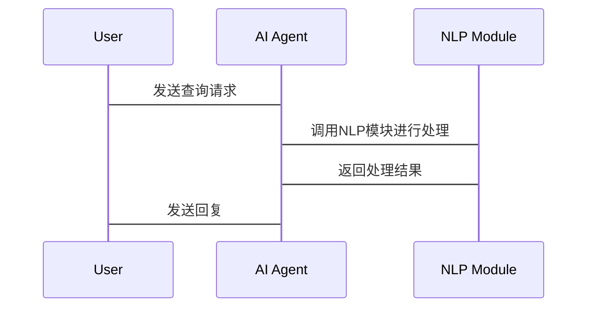

                 


# AI Agent在自然语言处理中的最新进展与应用

## 关键词：AI Agent, 自然语言处理, NLP, 智能对话系统, 机器翻译, 情感分析

## 摘要：本文详细探讨了AI Agent在自然语言处理中的最新进展与应用，从基本概念到技术原理，再到实际案例，全面解析了AI Agent如何推动NLP技术的发展，并在智能对话系统、机器翻译、情感分析等领域展现了广泛的应用前景。文章结合理论与实践，深入分析了AI Agent在NLP中的算法原理、系统架构及优化策略，为读者提供了全面的技术解读。

---

## 第1章: AI Agent的基本概念与自然语言处理的结合

### 1.1 AI Agent的定义与特点

AI Agent（人工智能代理）是指在计算机系统中，能够感知环境并采取行动以实现目标的实体。AI Agent具备以下特点：
- **自主性**：能够在没有外部干预的情况下自主决策。
- **反应性**：能够实时感知环境并做出响应。
- **目标导向**：所有行动均以实现特定目标为导向。
- **学习能力**：能够通过经验改进自身的性能。

AI Agent与传统AI的区别主要体现在其自主性和适应性上。AI Agent不仅能够执行预设的任务，还能根据环境的变化动态调整其行为。

### 1.2 自然语言处理的发展历程

自然语言处理（NLP）是计算机科学领域的重要分支，旨在使计算机能够理解、生成和处理人类语言。NLP经历了以下几个主要阶段：
1. **基于规则的NLP（20世纪50年代-70年代）**：通过编写大量语法规则来实现语言处理任务，如语法分析和词性标注。
2. **统计学习方法（20世纪80年代-90年代）**：利用统计模型（如隐马尔可夫模型）进行语言建模和处理。
3. **深度学习驱动的NLP（21世纪初至今）**：引入深度学习技术（如神经网络）显著提升了NLP的性能。

### 1.3 AI Agent在自然语言处理中的作用

AI Agent在NLP中的作用主要体现在以下几个方面：
- **语言理解**：通过自然语言理解技术，AI Agent能够解析用户的输入，理解其意图。
- **语言生成**：基于自然语言生成技术，AI Agent能够生成符合语法规则且符合上下文的回复。
- **上下文管理**：AI Agent能够维护对话的上下文，确保对话的连贯性。

### 1.4 当前研究热点与应用案例

当前，AI Agent在NLP领域的研究热点主要集中在以下几个方面：
- **对话系统优化**：如何提高对话系统的自然性和流畅性。
- **多模态交互**：结合视觉、听觉等多种模态信息，提升AI Agent的交互能力。
- **个性化服务**：根据用户的个性化需求，提供定制化的NLP服务。

典型的应用案例包括智能客服、虚拟助手、智能音箱等。

---

## 第2章: AI Agent在自然语言处理中的核心任务

### 2.1 AI Agent的核心任务

AI Agent在自然语言处理中的核心任务包括：
- **语言理解**：包括文本分类、实体识别、情感分析等任务。
- **语言生成**：包括机器翻译、文本摘要、对话生成等任务。
- **语言推理**：包括逻辑推理、问答系统等任务。

### 2.2 AI Agent的NLP技术栈

AI Agent的NLP技术栈主要由以下几个部分组成：
- **分词与词性标注**：将文本分割成词语，并标注每个词语的词性。
- **句法分析**：分析句子的语法结构。
- **语义理解**：理解文本的语义含义。
- **对话管理**：管理对话的流程和状态。

### 2.3 AI Agent的NLP实现流程

AI Agent的NLP实现流程通常包括以下几个步骤：
1. **数据预处理**：包括文本清洗、分词、词性标注等。
2. **模型训练**：基于预处理后的数据，训练NLP模型。
3. **模型部署**：将训练好的模型部署到实际应用中。

---

## 第3章: AI Agent在自然语言处理中的技术原理

### 3.1 基于概率论的NLP算法

概率论是NLP的重要基础，广泛应用于文本分类、机器翻译等任务。例如，在文本分类任务中，可以通过计算每个类别的概率来确定文本的类别。

#### 3.1.1 条件概率与贝叶斯定理

条件概率公式：
$$P(A|B) = \frac{P(B|A) \cdot P(A)}{P(B)}$$

贝叶斯定理在文本分类中的应用：
- **垃圾邮件分类**：通过计算邮件属于垃圾邮件的概率，来判断其是否为垃圾邮件。
- **情感分析**：通过计算文本属于正面情感的概率，来判断其情感倾向。

### 3.2 基于统计学习的NLP算法

统计学习方法通过统计词语出现的频率来建立语言模型。例如，n-gram模型是一种常用的统计学习方法，用于预测下一个词的出现概率。

#### 3.2.1 n-gram模型

n-gram模型公式：
$$P(w_{n} | w_{1}, w_{2}, ..., w_{n-1})$$

n-gram模型的应用：
- **自动完成功能**：根据用户输入的历史词语，预测下一个可能的词语。
- **语音识别**：根据语音信号，生成对应的文本。

### 3.3 基于深度学习的NLP算法

深度学习通过构建人工神经网络，模拟人类大脑的神经网络结构，从而实现对语言的理解和生成。目前，主流的深度学习模型包括循环神经网络（RNN）、长短期记忆网络（LSTM）、Transformer等。

#### 3.3.1 Transformer模型

Transformer模型结构：
- **编码器**：将输入的文本序列转换为一组向量表示。
- **解码器**：基于编码器的输出，生成目标文本序列。

Transformer模型的应用：
- **机器翻译**：通过编码器和解码器的协同工作，实现高质量的机器翻译。
- **文本生成**：通过解码器生成符合上下文的回复。

---

## 第4章: AI Agent在自然语言处理中的系统设计与优化

### 4.1 AI Agent的系统架构

AI Agent的系统架构通常包括以下几个模块：
- **输入处理模块**：接收用户的输入，并进行预处理。
- **语言理解模块**：对用户的输入进行语义理解。
- **决策模块**：根据理解的结果，做出相应的决策。
- **输出生成模块**：根据决策的结果，生成输出。

#### 4.1.1 系统架构设计

系统架构设计图如下：

```mermaid
graph TD
    Input --> Preprocessing
    Preprocessing --> NLP Module
    NLP Module --> Decision Module
    Decision Module --> Output Generation
    Output Generation --> Output
```

---

## 第5章: AI Agent在自然语言处理中的实际应用

### 5.1 智能对话系统

智能对话系统是AI Agent在自然语言处理中的典型应用之一。通过自然语言理解技术，系统能够理解用户的输入，并通过自然语言生成技术生成回复。

#### 5.1.1 对话系统实现

对话系统实现流程如下：



---

## 第6章: 总结与展望

### 6.1 总结

本文详细探讨了AI Agent在自然语言处理中的最新进展与应用，从基本概念到技术原理，再到实际案例，全面解析了AI Agent如何推动NLP技术的发展。通过本文的分析，我们可以看到，AI Agent在NLP中的应用前景广阔，涵盖了智能对话系统、机器翻译、情感分析等多个领域。

### 6.2 未来展望

未来，AI Agent在NLP中的应用将更加广泛和深入。随着深度学习技术的不断发展，AI Agent的性能将不断提升，应用领域也将不断扩展。例如，结合多模态信息的AI Agent将具备更强的交互能力，能够更好地满足用户的需求。

---

## 作者：AI天才研究院/AI Genius Institute & 禅与计算机程序设计艺术 /Zen And The Art of Computer Programming

