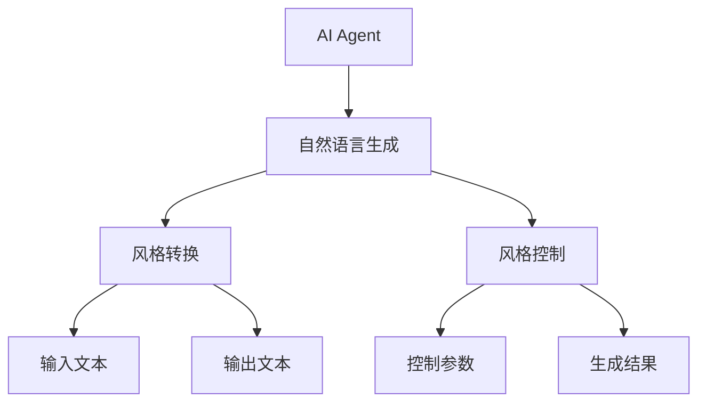

                 


# AI Agent在自然语言生成中的风格转换与控制

## 关键词：AI Agent，自然语言生成，风格转换，风格控制，机器学习，深度学习

## 摘要：本文将详细探讨AI Agent在自然语言生成中的风格转换与控制技术，涵盖核心概念、算法原理、系统架构、项目实战等多方面内容，深入剖析其原理、实现与应用场景。

---

# 第一部分: AI Agent与自然语言生成的背景介绍

## 第1章: AI Agent与自然语言生成概述

### 1.1 AI Agent的基本概念

#### 1.1.1 AI Agent的定义与特点
AI Agent（人工智能代理）是指能够感知环境、自主决策并执行任务的智能实体。它具有以下特点：
- **自主性**：能够在没有外部干预的情况下自主运作。
- **反应性**：能够根据环境的变化实时调整行为。
- **目标导向性**：具有明确的目标，并通过行动实现目标。
- **学习能力**：能够通过数据和经验不断优化自身的性能。

#### 1.1.2 AI Agent的核心要素
AI Agent的核心要素包括：
- **感知机制**：通过传感器或接口获取环境信息。
- **决策机制**：基于感知信息进行分析和决策。
- **行动机制**：根据决策结果执行相应的动作。
- **学习机制**：通过学习算法优化自身性能。

#### 1.1.3 AI Agent与传统程序的区别
与传统程序相比，AI Agent具有以下显著区别：
- **自主性**：AI Agent能够自主决策，而传统程序通常需要明确的指令。
- **适应性**：AI Agent能够适应环境变化，而传统程序通常不具备这种能力。
- **学习能力**：AI Agent能够通过学习优化自身性能，而传统程序无法做到。

### 1.2 自然语言生成的基本概念

#### 1.2.1 自然语言生成的定义与特点
自然语言生成（Natural Language Generation, NLG）是指将结构化数据转换为自然语言文本的过程。其特点包括：
- **数据驱动**：通常基于大量语料库进行训练。
- **多样性**：生成的文本可以具有不同的风格和语气。
- **实时性**：能够快速生成符合要求的文本。

#### 1.2.2 自然语言生成的应用场景
自然语言生成技术广泛应用于多个领域，常见的应用场景包括：
- **机器翻译**：将一种语言翻译成另一种语言。
- **文本摘要**：将长篇文本压缩成简洁的摘要。
- **对话系统**：生成自然流畅的对话内容。
- **内容生成**：自动生成新闻、广告等文本内容。

#### 1.2.3 自然语言生成的技术挑战
自然语言生成面临以下技术挑战：
- **语义理解**：如何准确理解输入数据的含义。
- **风格控制**：如何生成符合特定风格和语气的文本。
- **上下文理解**：如何处理复杂的情境和上下文信息。

### 1.3 AI Agent在自然语言生成中的作用

#### 1.3.1 AI Agent在自然语言生成中的优势
AI Agent在自然语言生成中具有以下优势：
- **自主性**：能够独立完成生成任务。
- **适应性**：能够根据环境变化调整生成策略。
- **学习能力**：能够通过学习优化生成效果。

#### 1.3.2 AI Agent在风格转换中的应用
AI Agent可以通过学习不同风格的文本，实现文本的风格转换。例如：
- **正式与非正式风格转换**：将正式的商务信函转换为非正式的口语表达。
- **专业与通俗风格转换**：将专业术语丰富的文本转换为通俗易懂的语言。

#### 1.3.3 AI Agent在生成内容控制中的价值
AI Agent能够通过设置不同的控制参数，实现对生成内容的精准控制。例如：
- **情感倾向控制**：生成积极、中性或消极的情感内容。
- **语气风格控制**：生成正式、亲切或幽默的语气风格。

---

## 第2章: 风格转换与控制的背景与挑战

### 2.1 风格转换的定义与分类

#### 2.1.1 风格转换的定义
风格转换是指将一种风格的文本转换为另一种风格的文本的过程。例如，将复杂的技术术语转换为通俗易懂的语言。

#### 2.1.2 风格转换的主要分类
风格转换主要分为以下几类：
- **词汇风格转换**：通过替换词汇实现风格转换。
- **句法风格转换**：通过调整句子结构实现风格转换。
- **语义风格转换**：通过改变文本的语义内容实现风格转换。

#### 2.1.3 不同风格转换方法的对比
不同的风格转换方法具有以下特点：
- **基于规则的方法**：通过预定义的规则进行风格转换，适用于简单的风格转换任务。
- **基于统计的方法**：通过统计语言模型进行风格转换，能够处理较复杂的风格转换任务。
- **基于深度学习的方法**：通过神经网络模型进行风格转换，能够实现高质量的风格转换。

### 2.2 风格控制的定义与实现

#### 2.2.1 风格控制的定义
风格控制是指通过设置特定的控制参数，指导生成文本的风格和语气。例如，通过设置参数控制生成文本的情感倾向。

#### 2.2.2 风格控制的主要实现方式
风格控制的主要实现方式包括：
- **基于规则的风格控制**：通过预定义的规则实现风格控制。
- **基于机器学习的风格控制**：通过训练模型实现风格控制。

#### 2.2.3 风格控制与风格转换的区别
风格控制与风格转换的主要区别在于：
- **风格转换**：改变文本的风格，生成新的文本内容。
- **风格控制**：通过控制参数指导生成文本的风格，而不改变文本内容。

### 2.3 AI Agent在风格转换与控制中的应用背景

#### 2.3.1 当前自然语言生成技术的发展现状
自然语言生成技术近年来取得了显著进展，但仍然面临以下挑战：
- **生成质量**：生成文本的质量仍需进一步提高。
- **风格多样性**：如何生成多种风格的文本是当前研究的热点。

#### 2.3.2 AI Agent在风格转换与控制中的独特优势
AI Agent在风格转换与控制中具有以下独特优势：
- **自主学习**：能够通过大量数据自主学习风格转换和控制的技术。
- **实时调整**：能够根据反馈实时调整生成策略。

#### 2.3.3 风格转换与控制的实际应用场景
风格转换与控制技术在以下场景中具有广泛应用：
- **内容生成**：生成不同风格的新闻、广告等文本内容。
- **对话系统**：根据用户需求生成不同风格的对话内容。
- **教育领域**：将复杂的内容转换为适合不同学习水平的风格。

---

## 第3章: 风格转换与控制的核心概念与联系

### 3.1 核心概念原理

#### 3.1.1 AI Agent的基本原理
AI Agent通过感知环境、分析信息、制定决策并执行行动来实现其功能。其核心原理包括：
- **感知**：通过传感器或接口获取环境信息。
- **分析**：对获取的信息进行分析和处理。
- **决策**：基于分析结果制定决策。
- **执行**：根据决策结果执行相应的动作。

#### 3.1.2 自然语言生成的原理
自然语言生成的原理主要包括：
- **数据输入**：接收结构化或非结构化的输入数据。
- **内容生成**：基于输入数据生成自然语言文本。
- **风格调整**：对生成的文本进行风格和语气的调整。

#### 3.1.3 风格转换与控制的原理
风格转换与控制的原理主要包括：
- **风格识别**：识别输入文本的风格特征。
- **风格转换**：根据需求将文本转换为指定的风格。
- **风格控制**：通过设置参数控制生成文本的风格和语气。

### 3.2 核心概念属性特征对比

| **核心概念** | **定义** | **主要特征** |
|--------------|----------|--------------|
| AI Agent     | 智能代理 | 自主性、反应性、目标导向性、学习能力 |
| 自然语言生成 | 文本生成 | 数据驱动、多样性、实时性 |
| 风格转换    | 风格转换 | 基于规则、基于统计、基于深度学习 |
| 风格控制    | 风格控制 | 基于规则、基于机器学习 |

### 3.3 ER实体关系图



---

## 第4章: 风格转换的算法原理

### 4.1 风格转换的主流算法

#### 4.1.1 基于规则的风格转换
基于规则的风格转换方法通过预定义的规则实现风格转换。例如：
- 将“正式”风格的文本转换为“非正式”风格的文本。

#### 4.1.2 基于统计的风格转换
基于统计的风格转换方法通过统计语言模型实现风格转换。例如：
- 使用n-gram模型进行风格转换。

#### 4.1.3 基于深度学习的风格转换
基于深度学习的风格转换方法通过神经网络模型实现风格转换。例如：
- 使用变换器（Transformer）模型进行风格转换。

---

## 第5章: 风格控制的算法实现

### 5.1 风格控制的数学模型

#### 5.1.1 风格控制的基本模型
风格控制的基本模型可以表示为：
$$
P(y|x) = \text{exp}(\theta \cdot x) / Z
$$
其中，$x$ 是输入，$y$ 是输出，$\theta$ 是控制参数，$Z$ 是归一化常数。

#### 5.1.2 基于机器学习的风格控制
基于机器学习的风格控制模型可以通过训练数据学习风格控制的参数。例如：
- 使用循环神经网络（RNN）或变换器模型进行风格控制。

---

## 第6章: AI Agent在自然语言生成中的系统架构

### 6.1 系统功能设计

#### 6.1.1 系统功能模块
- **输入模块**：接收输入数据和控制参数。
- **处理模块**：对输入数据进行处理和分析。
- **生成模块**：根据分析结果生成自然语言文本。
- **输出模块**：输出生成的文本内容。

#### 6.1.2 系统功能流程
1. 接收输入数据和控制参数。
2. 对输入数据进行预处理。
3. 根据控制参数生成自然语言文本。
4. 输出生成的文本内容。

---

## 第7章: 项目实战与案例分析

### 7.1 项目实战

#### 7.1.1 环境安装
- 安装Python和相关库（如TensorFlow、Keras等）。

#### 7.1.2 代码实现
```python
import tensorflow as tf
from tensorflow.keras import layers

# 定义风格控制模型
class StyleController(tf.keras.Model):
    def __init__(self, vocab_size, embedding_dim, style_dim):
        super(StyleController, self).__init__()
        self.embedding = layers.Embedding(vocab_size, embedding_dim)
        self.style_dense = layers.Dense(style_dim, activation='relu')
        self.dropout = layers.Dropout(0.5)
        self.output_dense = layers.Dense(vocab_size, activation='softmax')

    def call(self, inputs, style_vector=None):
        if style_vector is not None:
            inputs = tf.concat([inputs, style_vector], axis=-1)
        embedded = self.embedding(inputs)
        output = self.style_dense(embedded)
        output = self.dropout(output)
        output = self.output_dense(output)
        return output
```

#### 7.1.3 案例分析
以生成营销文案为例，通过设置不同的风格参数，生成不同风格的营销文案。

---

## 第8章: 最佳实践与总结

### 8.1 最佳实践

#### 8.1.1 参数调优
- 根据具体任务调整模型的参数，例如学习率、批量大小等。

#### 8.1.2 数据预处理
- 对输入数据进行清洗和预处理，确保数据质量。

#### 8.1.3 模型评估
- 使用合适的评估指标对生成结果进行评估，例如 BLEU、ROUGE 等。

### 8.2 总结

AI Agent在自然语言生成中的风格转换与控制是一项具有挑战性的技术，但其应用前景广阔。通过不断优化算法和系统架构，我们可以实现更高质量的自然语言生成，满足多样化的应用场景需求。

---

## 作者：AI天才研究院/AI Genius Institute & 禅与计算机程序设计艺术 /Zen And The Art of Computer Programming

