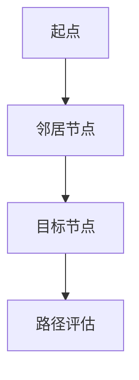
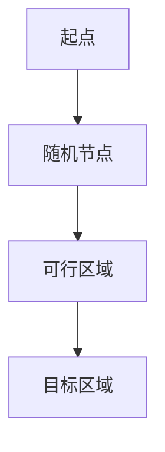

                 


# AI Agent在虚拟现实中的交互设计

> 关键词：AI Agent，虚拟现实，交互设计，路径规划，系统架构，项目实战

> 摘要：本文详细探讨了AI Agent在虚拟现实中的交互设计，从核心概念到算法原理，再到系统架构和项目实战，全面解析了AI Agent如何在虚拟环境中实现智能化交互。通过具体案例分析和代码实现，展示了AI Agent在虚拟现实中的应用潜力和设计挑战。

---

# 第一部分：AI Agent与虚拟现实交互设计的背景

# 第1章：AI Agent与虚拟现实交互设计概述

## 1.1 AI Agent的基本概念

### 1.1.1 AI Agent的定义与特点

AI Agent（人工智能代理）是指在计算机系统中，能够感知环境并采取行动以实现目标的实体。其特点包括自主性、反应性、目标导向和社会能力。

$$\text{AI Agent的定义：能感知环境并采取行动的实体}$$

### 1.1.2 虚拟现实技术的基本原理

虚拟现实（VR）通过计算机生成的三维环境，为用户提供沉浸式的体验。其基本原理包括环境建模、用户交互和实时渲染。

### 1.1.3 AI Agent在虚拟现实中的作用

AI Agent在VR中的作用是通过智能化的交互设计，提升用户体验，实现更自然的人机交互。

---

## 1.2 虚拟现实中的交互设计

### 1.2.1 交互设计的基本概念

交互设计是指通过设计用户与系统之间的互动方式，提升用户体验。在VR中，交互设计至关重要，因为它直接影响用户的沉浸感和操作体验。

### 1.2.2 虚拟现实中的交互方式

常见的VR交互方式包括手势交互、语音交互和注视点交互。

### 1.2.3 AI Agent在交互设计中的应用

AI Agent可以通过自然语言处理和计算机视觉技术，实现更智能的交互方式，如智能助手和虚拟导游。

---

## 1.3 本章小结

本章介绍了AI Agent和虚拟现实的基本概念，并探讨了AI Agent在VR交互设计中的作用和应用。

---

# 第二部分：AI Agent与虚拟现实交互设计的核心概念

# 第2章：AI Agent的行为模型与虚拟现实环境

## 2.1 AI Agent的行为模型

### 2.1.1 基于状态的行为模型

基于状态的行为模型通过状态机来描述Agent的行为。例如，当用户进入一个新区域时，Agent的状态从“静止”变为“探索”。

### 2.1.2 基于规则的行为模型

基于规则的行为模型通过预定义的规则来指导Agent的行为。例如，当用户靠近物体时，Agent会提供相关信息。

### 2.1.3 基于目标的行为模型

基于目标的行为模型通过目标驱动来指导Agent的行为。例如，Agent的目标是帮助用户完成任务。

---

## 2.2 虚拟现实环境中的空间关系

### 2.2.1 虚拟空间的构建

虚拟空间的构建涉及三维建模和场景设计，确保用户在虚拟环境中能够自由移动和交互。

### 2.2.2 用户在虚拟空间中的位置与动作

用户的动作，如移动、旋转和点击，需要被AI Agent感知并响应。

### 2.2.3 环境与用户的互动关系

环境与用户的互动关系是通过物理引擎和碰撞检测实现的，确保用户的动作在虚拟环境中产生预期效果。

---

## 2.3 AI Agent与用户的交互模式

### 2.3.1 基于视觉的交互

基于视觉的交互通过AR/VR界面实现，例如，Agent可以通过视觉符号提示用户操作。

### 2.3.2 基于语音的交互

基于语音的交互通过自然语言处理技术实现，例如，用户可以通过语音命令控制Agent。

### 2.3.3 基于手势的交互

基于手势的交互通过计算机视觉技术实现，例如，用户可以通过手势与Agent互动。

---

## 2.4 本章小结

本章详细探讨了AI Agent的行为模型和虚拟现实环境中的空间关系，并介绍了几种主要的交互模式。

---

# 第三部分：AI Agent在虚拟现实交互设计中的算法原理

# 第3章：AI Agent的路径规划算法

## 3.1 路径规划的基本概念

### 3.1.1 路径规划的定义与目标

路径规划是指在复杂的环境中，找到从起点到目标点的最优路径。其目标是确保路径安全、高效。

### 3.1.2 路径规划的约束条件

路径规划需要考虑障碍物、动态目标和环境限制等因素。

### 3.1.3 路径规划的算法分类

路径规划算法主要分为基于栅格的方法和基于采样的方法。

---

## 3.2 常见的路径规划算法

### 3.2.1 A*算法

A*算法是一种常见的路径规划算法，结合了最佳优先搜索和启发式评估函数。

**A*算法流程图（Mermaid）：**



### 3.2.2 RRT算法

RRT（Rapidly-exploring Random Tree）算法适用于高维空间的路径规划，通过随机采样和树状结构扩展。

**RRT算法流程图（Mermaid）：**



### 3.2.3 Dijkstra算法

Dijkstra算法是一种基于优先队列的最短路径算法，适用于静态环境。

---

## 3.3 算法实现与优化

### 3.3.1 A*算法的实现

```python
def a_star(start, goal, grid):
    open_set = {start}
    came_from = {}
    g_score = {start: 0}
    f_score = {start: heuristic(start, goal)}
    
    while open_set:
        current = min(open_set, key=lambda x: f_score[x])
        if current == goal:
            break
        open_set.remove(current)
        for neighbor in grid.get_neighbors(current):
            tentative_g_score = g_score.get(current, float('inf')) + cost(current, neighbor)
            if neighbor not in g_score or tentative_g_score < g_score[neighbor]:
                came_from[neighbor] = current
                g_score[neighbor] = tentative_g_score
                f_score[neighbor] = g_score[neighbor] + heuristic(neighbor, goal)
                if neighbor not in open_set:
                    open_set.add(neighbor)
    return came_from, g_score
```

### 3.3.2 RRT算法的优化

RRT算法可以通过优化采样策略和树结构，提高路径规划效率。

### 3.3.3 算法的性能评估

算法的性能评估主要通过路径长度、计算时间和成功率等指标进行衡量。

---

## 3.4 本章小结

本章详细讲解了A*、RRT和Dijkstra三种路径规划算法，并通过代码示例展示了算法的实现过程。

---

# 第四部分：系统架构与交互设计

# 第4章：虚拟现实交互设计的系统架构

## 4.1 系统功能设计

### 4.1.1 用户界面设计

用户界面设计需要考虑沉浸感和易用性，确保用户能够方便地与系统互动。

### 4.1.2 AI Agent的功能模块

AI Agent的功能模块包括感知、决策和执行三个部分。

### 4.1.3 交互设计的关键要素

交互设计的关键要素包括用户反馈、响应时间和一致性原则。

---

## 4.2 系统架构设计

### 4.2.1 系统架构的层次结构

系统架构通常包括数据层、逻辑层和界面层。

### 4.2.2 系统架构的实现

系统架构的实现需要考虑模块化设计和组件之间的交互关系。

---

## 4.3 系统接口设计

### 4.3.1 API设计

API设计需要考虑功能调用、参数传递和返回结果。

### 4.3.2 数据格式与协议

数据格式和协议的选择影响系统的兼容性和性能。

---

## 4.4 本章小结

本章探讨了虚拟现实交互设计的系统架构，包括功能设计、架构设计和接口设计。

---

# 第五部分：项目实战

# 第5章：AI Agent在虚拟现实中的项目实战

## 5.1 环境安装与配置

### 5.1.1 开发工具安装

开发工具包括Unity、Unreal Engine和Python开发环境。

### 5.1.2 依赖库安装

依赖库包括OpenCV、PyTorch和ROS。

---

## 5.2 系统核心实现

### 5.2.1 AI Agent的核心代码

```python
def main():
    import rospy
    from geometry_msgs.msg import PoseStamped
    
    rospy.init_node('path_planner')
    publisher = rospy.Publisher('/agent/goal', PoseStamped, queue_size=10)
    
    while not rospy.is_shutdown():
        goal = PoseStamped()
        goal.header.stamp = rospy.Time.now()
        goal.pose.position.x = 1.0
        goal.pose.position.y = 0.0
        publisher.publish(goal)
        rospy.sleep(1)
```

### 5.2.2 交互设计的代码实现

```python
def handle_user_input():
    import speech_recognition as sr
    r = sr.Recognizer()
    with sr.Microphone() as source:
        print("请开始发言...")
        audio = r.listen(source)
        try:
            print("你刚才说：")
            print(r.recognize_google(audio))
        except sr.UnknownValueError:
            print("无法识别，请重复...")
```

---

## 5.3 案例分析与总结

### 5.3.1 案例分析

通过具体案例分析，展示了AI Agent在虚拟现实中的应用潜力。

### 5.3.2 项目总结

项目总结包括实现效果、遇到的问题和解决方案。

---

## 5.4 本章小结

本章通过项目实战，展示了AI Agent在虚拟现实中的具体应用和实现过程。

---

# 第六部分：最佳实践与总结

# 第6章：AI Agent在虚拟现实交互设计中的最佳实践

## 6.1 小结

AI Agent在虚拟现实中的交互设计需要结合算法、系统架构和用户需求，实现智能化和沉浸式的交互体验。

## 6.2 注意事项

注意事项包括算法选择、系统性能优化和用户体验测试。

## 6.3 拓展阅读

推荐读者阅读相关领域的书籍和论文，深入了解AI Agent和虚拟现实的最新研究成果。

---

# 作者

作者：AI天才研究院/AI Genius Institute & 禅与计算机程序设计艺术 /Zen And The Art of Computer Programming

---

通过以上思考过程，我整理出了一个详细的目录大纲，涵盖了从背景介绍到项目实战的各个方面。每个章节都详细阐述了核心概念、算法原理和系统架构，同时结合代码示例和图表，帮助读者更好地理解和应用相关知识。

