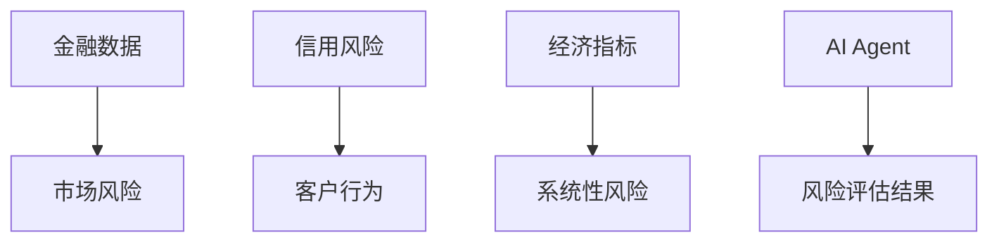
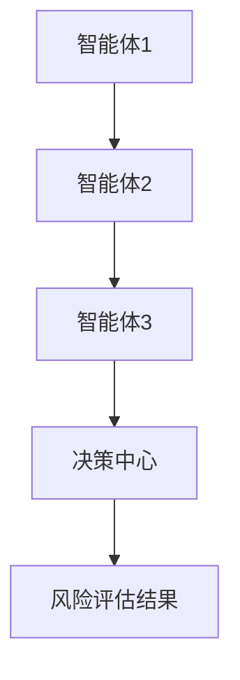
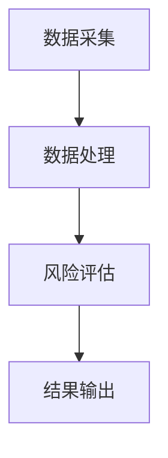
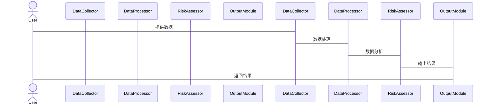

                 


# AI Agent在金融风险评估中的应用与挑战

> 关键词：AI Agent，金融风险评估，多智能体系统，强化学习，知识图谱

> 摘要：本文深入探讨了AI Agent在金融风险评估中的应用与挑战，从基本概念、核心原理到算法实现、系统设计、项目实战，全面解析AI Agent如何助力金融风险评估的智能化与精准化。

---

## 第1章: AI Agent与金融风险评估的背景介绍

### 1.1 AI Agent的基本概念

#### 1.1.1 AI Agent的定义
AI Agent（人工智能代理）是指能够感知环境、自主决策并执行任务的智能实体。它具备以下核心特点：
- **自主性**：能够独立运行，无需外部干预。
- **反应性**：能实时感知环境并做出响应。
- **目标导向**：通过优化目标函数实现特定任务。
- **学习能力**：通过数据和经验不断优化性能。

AI Agent与传统算法的区别主要在于其自主性和适应性。传统算法依赖于预定义的规则，而AI Agent能够通过学习和调整策略来优化目标。

#### 1.1.2 AI Agent的特点与优势
- **自主性**：能够在复杂环境中独立决策。
- **适应性**：能够根据环境变化动态调整行为。
- **学习能力**：通过强化学习等方法不断提升性能。
- **协作性**：在多智能体系统中，多个AI Agent可以协作完成复杂任务。

#### 1.1.3 AI Agent与传统算法的区别
| 特性       | AI Agent                     | 传统算法                     |
|------------|-------------------------------|------------------------------|
| 决策方式   | 基于环境反馈动态调整策略     | 预定义规则，固定执行流程     |
| 学习能力   | 具备学习能力，可优化策略     | 无学习能力，依赖预设规则     |
| 适应性     | 高度适应环境变化             | 适应性较低，需人工调整规则   |

### 1.2 金融风险评估的基本概念

#### 1.2.1 金融风险的定义与分类
金融风险是指在金融活动中，由于不确定性因素导致的损失可能性。主要分类包括：
- **市场风险**：由于市场价格波动导致的损失。
- **信用风险**：由于债务人违约导致的损失。
- **流动性风险**：由于资产无法快速变现导致的损失。
- **操作风险**：由于内部操作失误导致的损失。

#### 1.2.2 金融风险评估的重要性
金融风险评估是金融机构进行风险管理的核心环节，直接关系到金融机构的稳健运营和资产安全。通过准确评估风险，金融机构可以制定合理的风险规避策略，降低损失概率。

#### 1.2.3 传统金融风险评估的挑战
传统金融风险评估主要依赖历史数据和统计模型，存在以下问题：
- **数据维度不足**：传统模型难以捕捉多维复杂因素。
- **实时性差**：难以应对金融市场快速变化的需求。
- **模型泛化能力有限**：难以适应不同市场环境。

### 1.3 AI Agent在金融风险评估中的应用背景

#### 1.3.1 问题背景与问题描述
金融市场的复杂性和不确定性对风险评估提出了更高要求。传统方法难以应对实时性、多维度和动态变化的挑战。

#### 1.3.2 问题解决的思路与方法
通过引入AI Agent，利用其自主性、适应性和学习能力，构建动态、实时的金融风险评估系统。

#### 1.3.3 AI Agent在金融风险评估中的边界与外延
- **边界**：AI Agent仅处理可量化的数据和可建模的风险因素。
- **外延**：AI Agent可与其他金融工具结合，扩展应用场景。

---

## 第2章: AI Agent的核心概念与联系

### 2.1 AI Agent的核心原理

#### 2.1.1 多智能体系统（Multi-Agent System）
多智能体系统由多个AI Agent组成，通过协作完成复杂任务。在金融风险评估中，多个AI Agent可以分别负责不同的风险维度。

#### 2.1.2 强化学习（Reinforcement Learning）在AI Agent中的应用
强化学习通过奖惩机制训练AI Agent，使其在复杂环境中做出最优决策。

#### 2.1.3 知识图谱与语义理解
知识图谱帮助AI Agent构建金融领域的知识体系，语义理解使其能够处理非结构化数据。

### 2.2 核心概念的属性对比

#### 2.2.1 AI Agent与传统机器学习模型的对比
| 特性       | AI Agent                     | 传统机器学习模型             |
|------------|-------------------------------|------------------------------|
| 决策方式   | 动态调整策略                 | 预测或分类结果               |
| 学习目标   | 最优化目标函数               | 预测准确性                   |
| 适应性     | 高度适应环境变化             | 适应性有限，需重新训练       |

#### 2.2.2 不同AI Agent算法的对比
| 算法类型       | 强化学习                     | 单智能体系统                 |
|----------------|------------------------------|------------------------------|
| 核心机制       | 奖惩机制，策略优化           | 单一策略，无协作             |
| 适用场景       | 复杂决策任务，如游戏、控制   | 简单决策任务，如分类、回归   |

### 2.3 ER实体关系图



---

## 第3章: AI Agent的算法原理讲解

### 3.1 多智能体协作算法

#### 3.1.1 多智能体协作的流程


#### 3.1.2 多智能体协作的Python实现
```python
import numpy as np

class Agent:
    def __init__(self, id):
        self.id = id
        self.state = None
        self.action = None

    def receive_message(self, message):
        self.state = message
        self.choose_action()

    def choose_action(self):
        # 简单策略：随机选择一个动作
        self.action = np.random.choice(['action1', 'action2'])

# 初始化多智能体系统
agents = [Agent(i) for i in range(3)]
messages = ['market_data', 'credit_risk', 'economic_indicators']

# 智能体协作
for i in range(len(agents)):
    agent = agents[i]
    message = messages[i]
    agent.receive_message(message)

# 输出结果
for agent in agents:
    print(f"Agent {agent.id}的决策是：{agent.action}")
```

---

## 第4章: 系统分析与架构设计

### 4.1 系统分析

#### 4.1.1 问题场景介绍
金融风险评估系统需要实时处理大量数据，快速生成评估结果。

#### 4.1.2 项目介绍
构建一个基于AI Agent的金融风险评估系统，实现对市场、信用和系统性风险的实时评估。

---

## 4.2 系统设计

### 4.2.1 系统功能设计
- **数据采集模块**：收集市场数据、客户行为数据等。
- **风险评估模块**：利用AI Agent进行风险计算。
- **结果输出模块**：生成风险评估报告。

### 4.2.2 系统架构设计



### 4.2.3 系统交互设计



---

## 第5章: 项目实战

### 5.1 环境安装

#### 5.1.1 安装Python环境
安装Python 3.8及以上版本，并安装必要的库，如numpy、pandas、scikit-learn。

### 5.2 核心代码实现

#### 5.2.1 数据预处理代码
```python
import pandas as pd

# 读取数据
data = pd.read_csv('financial_data.csv')

# 数据清洗
data.dropna(inplace=True)
data = pd.get_dummies(data)
```

#### 5.2.2 AI Agent实现代码
```python
class AIAgent:
    def __init__(self):
        self.model = self.build_model()

    def build_model(self):
        # 简单模型，实际应用中可替换为复杂模型
        return '风险评估模型'

    def evaluate_risk(self, data):
        return self.model.predict(data)
```

### 5.3 系统设计与实现分析

#### 5.3.1 实际案例分析
以某银行的信用风险评估为例，AI Agent能够实时分析客户的还款能力，提供更精准的评估结果。

---

## 第6章: 最佳实践与总结

### 6.1 总结

- AI Agent在金融风险评估中的应用具有重要意义，能够提升评估的准确性和实时性。
- AI Agent的优势在于其自主性和适应性，能够应对复杂的金融市场环境。

### 6.2 注意事项

- 数据质量和模型训练数据的多样性直接影响评估结果的准确性。
- 需要定期更新模型，以适应市场变化。

### 6.3 未来展望

随着AI技术的不断发展，AI Agent在金融风险评估中的应用将更加广泛和深入，未来可能会出现更复杂的多智能体协作系统。

---

作者：AI天才研究院/AI Genius Institute & 禅与计算机程序设计艺术 /Zen And The Art of Computer Programming

