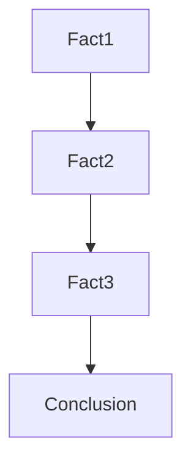
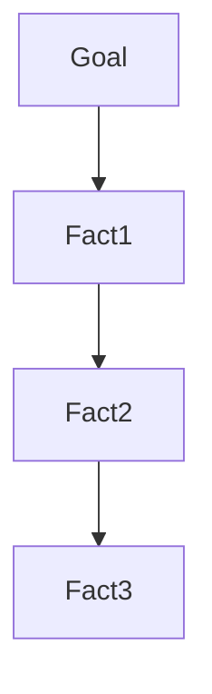
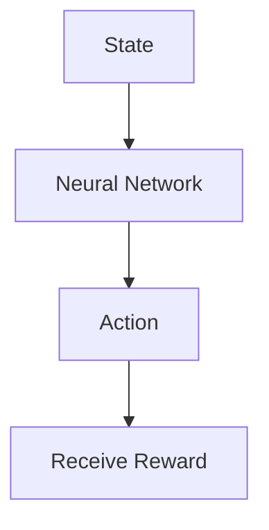
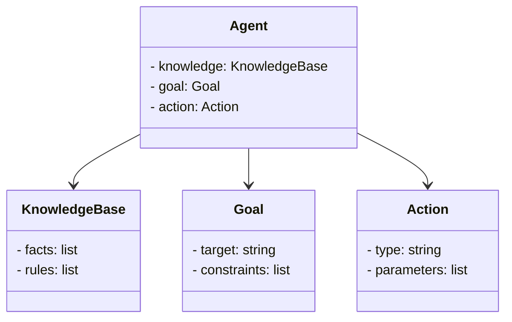
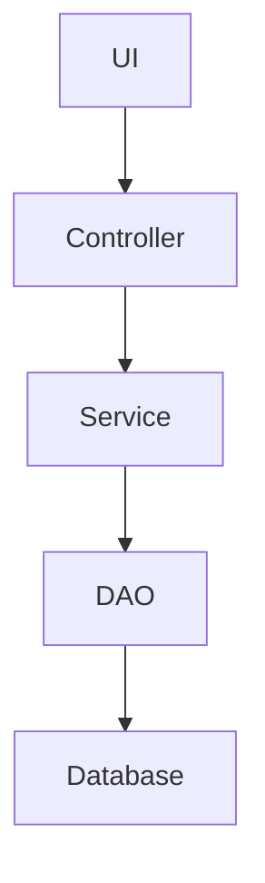
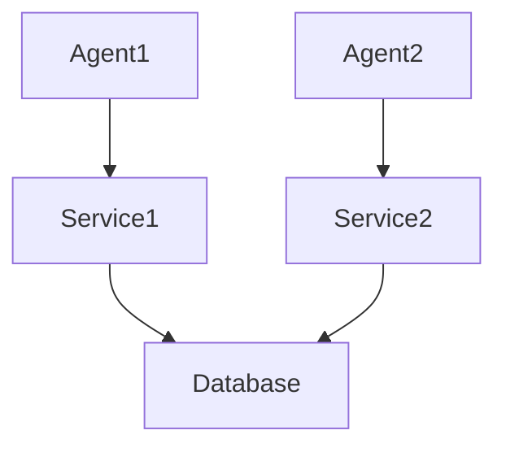
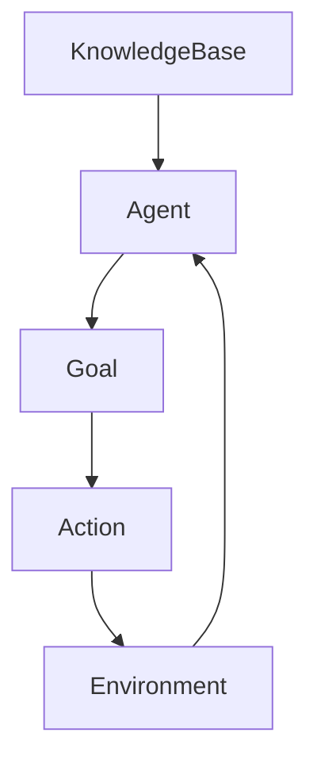
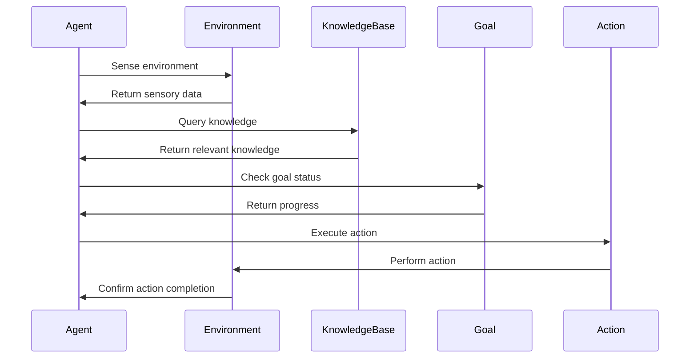

                 


# AI Agent架构设计：从概念到实现

## 关键词：
AI Agent、架构设计、人工智能、逻辑推理、强化学习、系统实现

## 摘要：
本文系统地介绍了AI Agent从概念到实现的全过程，涵盖了AI Agent的核心概念、算法原理、系统架构设计和项目实战。通过详细的理论分析和实际案例，帮助读者理解如何设计和实现一个高效的AI Agent系统。

---

## 第1章: AI Agent概述

### 1.1 AI Agent的基本概念

#### 1.1.1 什么是AI Agent
AI Agent（人工智能代理）是一种能够感知环境并采取行动以实现目标的智能实体。它可以是一个软件程序、机器人或其他智能系统，通过与环境交互来完成特定任务。

#### 1.1.2 AI Agent的类型
AI Agent可以根据智能水平、行为方式和应用场景分为以下几类：
- **反应式Agent**：基于当前感知做出反应，不依赖历史信息。
- **认知式Agent**：具有复杂推理和规划能力，能够处理复杂任务。
- **协作式Agent**：与其他Agent或人类协作完成任务。
- **学习式Agent**：能够通过经验改进性能。

#### 1.1.3 AI Agent的核心特征
- **自主性**：能够在没有外部干预的情况下运行。
- **反应性**：能够感知环境并实时做出反应。
- **目标导向**：所有行为都围绕实现目标展开。
- **适应性**：能够根据环境变化调整策略。

### 1.2 AI Agent的应用场景

#### 1.2.1 智能助手
- 例如：智能音箱、智能手机助手，能够理解用户指令并执行任务。

#### 1.2.2 自动交易系统
- 例如：股票交易机器人，能够根据市场数据自动做出买卖决策。

#### 1.2.3 游戏AI
- 例如：自动驾驶汽车中的路径规划和决策系统。

#### 1.2.4 智慧城市中的应用
- 例如：智能交通管理系统，优化交通流量。

### 1.3 AI Agent的设计原则

#### 1.3.1 目标驱动性
- 设计Agent时，明确其目标，并确保所有行为都围绕目标展开。

#### 1.3.2 环境适应性
- 能够感知和适应动态变化的环境，做出相应调整。

#### 1.3.3 可扩展性
- 系统设计应具备良好的扩展性，能够轻松添加新功能或适应新的应用场景。

#### 1.3.4 可解释性
- Agent的行为应能够被人类理解和解释，避免“黑箱”问题。

### 1.4 本章小结
本章介绍了AI Agent的基本概念、类型、核心特征及其应用场景，并提出了设计原则，为后续章节的深入分析奠定了基础。

---

## 第2章: AI Agent的核心概念与联系

### 2.1 知识表征

#### 2.1.1 知识表示方法
- **符号表示**：使用符号逻辑表示知识，例如用谓词逻辑表达事实和规则。
- **语义网络**：通过节点和边表示概念及其关系。
- **向量表示**：将知识表示为高维向量，例如Word2Vec、 GloVe。

#### 2.1.2 知识图谱
- 知识图谱是一种结构化知识表示方法，由节点（实体）和边（关系）组成，例如Google的Knowledge Graph。

#### 2.1.3 表征学习
- 通过机器学习方法将知识映射到低维空间，例如Word2Vec、BERT。

### 2.2 逻辑推理

#### 2.2.1 命题逻辑
- 用命题和逻辑连接词（如与、或、非）构建推理规则。

#### 2.2.2 一阶逻辑
- 在命题逻辑基础上引入量词（存在量词和全称量词），能够表达更复杂的知识。

#### 2.2.3 推理算法
- **前向 chaining**：从已知事实出发，逐步推导出新结论。
- **后向 chaining**：从目标出发，反向寻找支持结论的事实。
- **归结原理**：将问题转化为逻辑表达式，通过消解法简化表达式。

### 2.3 行为规划

#### 2.3.1 状态空间搜索
- **广度优先搜索（BFS）**：逐层扩展状态，找到最优路径。
- **深度优先搜索（DFS）**：深入探索某一路径，可能更快找到目标。
- **A*算法**：带启发式搜索的优化算法，能够快速找到最优路径。

#### 2.3.2 动作规划
- 规划Agent在环境中的动作序列，以达到目标状态。

#### 2.3.3 多阶段决策
- 在复杂环境中，Agent需要分阶段做出决策，例如路径规划和任务分解。

### 2.4 通信协作

#### 2.4.1 通信协议
- Agent之间通过特定协议交换信息，例如HTTP、WebSocket。

#### 2.4.2 协作策略
- 使用分布式算法（如分布式一致性算法）来协调多个Agent的行为。

#### 2.4.3 任务分配
- 通过协商机制分配任务，例如基于角色的分配策略。

### 2.5 本章小结
本章详细讲解了AI Agent的核心概念，包括知识表征、逻辑推理、行为规划和通信协作，并通过对比表格和ER图展示了概念之间的关系。

---

## 第3章: AI Agent的算法原理

### 3.1 逻辑推理算法

#### 3.1.1 前向 chaining

- 从已知事实出发，逐步推导出结论。

#### 3.1.2 后向 chaining

- 从目标出发，寻找支持目标的事实。

#### 3.1.3 消解法
- 将逻辑表达式消解为基本事实，例如将蕴含式转换为合取范式。

### 3.2 强化学习算法

#### 3.2.1 Q-learning
- 使用Q值表记录状态-动作对的期望奖励，通过经验更新Q值。

#### 3.2.2 Deep Q-Network

- 使用深度神经网络近似Q值函数，解决高维状态空间问题。

#### 3.2.3 Policy Gradient
- 直接优化策略，通过梯度上升方法最大化奖励。

### 3.3 联合学习算法

#### 3.3.1 联合推理与学习
- 在推理过程中同时进行学习，例如使用神经符号集成方法。

#### 3.3.2 知识增强的强化学习
- 利用外部知识库增强强化学习，例如使用知识图谱进行状态表示。

### 3.4 本章小结
本章详细介绍了AI Agent的核心算法，包括逻辑推理算法（如前向 chaining 和后向 chaining）和强化学习算法（如Q-learning 和 Deep Q-Network），并通过流程图展示了算法的执行过程。

---

## 第4章: AI Agent的系统分析与架构设计

### 4.1 系统分析

#### 4.1.1 问题场景介绍
- 以一个智能助手为例，描述其应用场景和目标。

#### 4.1.2 项目介绍
- 简要介绍项目目标、范围和主要功能。

#### 4.1.3 系统功能设计
- 包括知识获取、逻辑推理、行为规划和通信协作模块。

#### 4.1.4 领域模型设计


### 4.2 系统架构设计

#### 4.2.1 分层架构


#### 4.2.2 微服务架构


#### 4.2.3 组件交互设计


### 4.3 系统接口设计

#### 4.3.1 API设计
- RESTful API接口，例如：
  - POST /api/knowledge/update
  - GET /api/goal/status

#### 4.3.2 接口交互协议
- 使用JSON格式传递数据，通过HTTP协议进行通信。

### 4.4 系统交互设计

#### 4.4.1 序列图设计


### 4.5 本章小结
本章通过系统分析和架构设计，详细描述了AI Agent的系统结构和交互流程，为后续的项目实现奠定了基础。

---

## 第5章: AI Agent的项目实战

### 5.1 环境安装

#### 5.1.1 安装Python环境
- 使用Anaconda或virtualenv创建独立的Python环境。

#### 5.1.2 安装必要的库
- 安装numpy、pandas、scikit-learn、tensorflow等库。

### 5.2 系统核心实现

#### 5.2.1 知识表征实现
- 使用符号逻辑表示知识，例如：
  ```python
  knowledge_base = {
      "facts": ["下雨", "路滑"],
      "rules": ["如果下雨，那么路滑"]
  }
  ```

#### 5.2.2 逻辑推理实现
- 实现前向 chaining 算法：
  ```python
  def forward_chaining(facts, rules):
      inferred = set()
      while True:
          for rule in rules:
              antecedent, consequent = rule
              if all(fact in facts for fact in antecedent):
                  inferred.add(consequent)
          if not inferred:
              break
          facts.update(inferred)
          inferred = set()
      return facts
  ```

#### 5.2.3 行为规划实现
- 实现A*算法：
  ```python
  def a_star(start, goal, heuristic):
      open_set = {start}
      came_from = {}
      g_score = {start: 0}
      f_score = {start: heuristic(start, goal)}
      while open_set:
          current = min(open_set, key=lambda x: f_score[x])
          if current == goal:
              return reconstruct_path(came_from, current)
          open_set.remove(current)
          for neighbor in neighbors(current):
              tentative_g_score = g_score[current] + cost(current, neighbor)
              if neighbor not in g_score or tentative_g_score < g_score[neighbor]:
                  came_from[neighbor] = current
                  g_score[neighbor] = tentative_g_score
                  f_score[neighbor] = g_score[neighbor] + heuristic(neighbor, goal)
                  open_set.add(neighbor)
      return None
  ```

### 5.3 代码应用解读与分析

#### 5.3.1 核心算法代码
- 逻辑推理代码：
  ```python
  def forward_chaining(facts, rules):
      # 实现前向 chaining 算法
      pass
  ```

#### 5.3.2 系统架构代码
- 分层架构示例：
  ```python
  class KnowledgeBase:
      def __init__(self):
          self.facts = []
  
      def add_fact(self, fact):
          self.facts.append(fact)
  
  class Agent:
      def __init__(self, knowledge_base):
          self.knowledge_base = knowledge_base
  
      def sense(self, environment):
          # 从环境中获取感知
          pass
  ```

#### 5.3.3 接口实现代码
- RESTful API示例：
  ```python
  from flask import Flask, request, jsonify
  
  app = Flask(__name__)
  
  @app.route('/api/knowledge/update', methods=['POST'])
  def update_knowledge():
      data = request.json
      # 更新知识库
      return jsonify({'status': 'success'})
  
  if __name__ == '__main__':
      app.run()
  ```

### 5.4 实际案例分析

#### 5.4.1 案例背景介绍
- 以一个智能助手为例，描述其应用场景和目标。

#### 5.4.2 系统实现过程
- 实现知识获取、逻辑推理、行为规划和通信协作模块。

#### 5.4.3 案例结果分析
- 通过实际运行代码，验证系统的功能和性能。

### 5.5 本章小结
本章通过项目实战，详细讲解了AI Agent的实现过程，包括环境搭建、核心算法实现、系统架构设计和接口实现，帮助读者将理论应用于实践。

---

## 第6章: 最佳实践与注意事项

### 6.1 最佳实践 tips

#### 6.1.1 知识表征的可扩展性
- 使用模块化设计，方便后续扩展和维护。

#### 6.1.2 算法选择
- 根据具体应用场景选择合适的算法，例如复杂环境选择强化学习，简单推理选择逻辑推理。

#### 6.1.3 系统架构设计
- 采用分层架构或微服务架构，提高系统的可扩展性和可维护性。

### 6.2 注意事项

#### 6.2.1 性能优化
- 注意算法的复杂度和计算效率，避免在复杂环境中使用低效算法。

#### 6.2.2 数据安全
- 确保系统的数据安全，防止敏感信息泄露。

#### 6.2.3 可解释性
- 确保系统行为的可解释性，避免“黑箱”问题。

### 6.3 拓展阅读

#### 6.3.1 推荐书籍
- 《人工智能：一种现代方法》（Russell & Norvig）
- 《机器学习实战》（Sutton & Barto）

#### 6.3.2 推荐论文
- 《Deep Learning for Reasoning》（Rocktäusch et al., 2020）
- 《A Survey of Reinforcement Learning》（Sutton & Barto, 1998）

### 6.4 本章小结
本章总结了AI Agent设计与实现的最佳实践，提出了注意事项，并推荐了一些拓展阅读的资源。

---

## 作者：AI天才研究院/AI Genius Institute & 禅与计算机程序设计艺术 /Zen And The Art of Computer Programming

---

**全文完**

