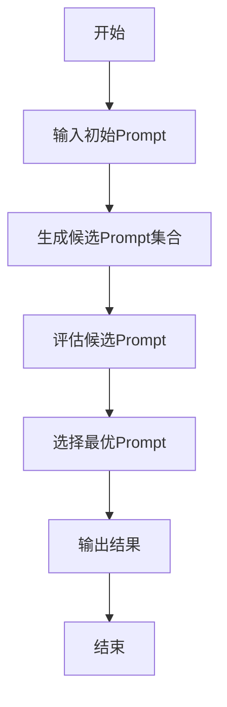

                 


# AI Agent的Prompt工程：优化输入以获得更好的输出

> 关键词：AI Agent，Prompt工程，自然语言处理，优化输入，生成模型

> 摘要：本文详细探讨了AI Agent的Prompt工程，从基本概念到优化策略，再到算法原理和系统设计，全面解析了如何通过优化输入来提升AI Agent的输出质量。通过实际案例分析和代码实现，为读者提供了从理论到实践的完整指南。

---

## 第一部分: AI Agent的Prompt工程基础

### 第1章: AI Agent与Prompt工程的背景介绍

#### 1.1 AI Agent的基本概念
- **1.1.1 什么是AI Agent**
  AI Agent（人工智能代理）是指能够感知环境并采取行动以实现目标的智能实体。它可以是一个软件程序、一个机器人，甚至是嵌入在其他系统中的算法。AI Agent的核心目标是通过自主决策和交互，帮助用户完成特定任务或提供信息服务。

- **1.1.2 AI Agent的类型与特点**
  AI Agent可以分为多种类型，包括基于规则的Agent、基于模型的Agent、强化学习Agent和基于知识的Agent。每种类型都有其独特的特点和应用场景。例如，基于规则的Agent通常用于简单任务，而基于知识的Agent则适用于复杂问题。

- **1.1.3 AI Agent的应用场景**
  AI Agent广泛应用于自然语言处理、推荐系统、智能客服、自动驾驶等领域。例如，在自然语言处理中，AI Agent可以通过理解和生成自然语言来与用户交互。

#### 1.2 Prompt工程的定义与背景
- **1.2.1 什么是Prompt工程**
  Prompt工程是指通过设计和优化输入提示（Prompt）来提升AI模型输出质量的过程。它是AI Agent与用户交互的核心技术之一，通过优化Prompt，可以使得AI模型生成更准确、更符合用户意图的结果。

- **1.2.2 Prompt工程的发展历程**
  Prompt工程起源于自然语言处理领域的研究，随着大语言模型的崛起，Prompt工程逐渐成为优化模型输出的重要手段。早期的研究主要集中在简单的Prompt设计，而现代Prompt工程则更加注重Prompt的结构优化和参数调优。

- **1.2.3 Prompt工程在AI Agent中的作用**
  在AI Agent中，Prompt工程是连接用户意图与模型输出的桥梁。通过优化Prompt，AI Agent能够更好地理解用户需求，并生成更符合预期的响应。

#### 1.3 问题背景与问题描述
- **1.3.1 AI Agent输出质量的问题**
  尽管AI Agent在许多场景中表现出色，但其输出质量仍然存在波动。这主要归因于输入Prompt的设计不合理或不完整，导致模型无法准确捕捉用户意图。

- **1.3.2 Prompt工程如何优化输入**
  Prompt工程通过分析用户需求，设计更精准的Prompt，从而优化输入，提升AI Agent的输出质量。例如，通过调整Prompt的长度、复杂性和多样性，可以显著改善生成结果的质量。

- **1.3.3 问题解决的边界与外延**
  Prompt工程的优化范围通常包括Prompt的设计、生成和评估。然而，它也与模型的训练和微调密切相关。因此，Prompt工程的优化需要结合模型本身的特性进行综合考虑。

#### 1.4 核心概念结构与组成要素
- **1.4.1 Prompt工程的核心要素**
  Prompt工程的核心要素包括Prompt的设计、Prompt的优化算法、Prompt的评估指标以及Prompt的应用场景。这些要素相互作用，共同决定了Prompt工程的效果。

- **1.4.2 AI Agent与Prompt工程的关系**
  AI Agent是Prompt工程的应用载体，而Prompt工程则是优化AI Agent输出的关键技术。两者相辅相成，共同推动AI Agent的智能化和实用性。

- **1.4.3 Prompt工程的实现流程**
  Prompt工程的实现流程通常包括需求分析、Prompt设计、Prompt优化、效果评估和持续改进。每个阶段都需要紧密配合，确保最终输出达到预期效果。

---

### 第2章: Prompt工程的核心概念与联系

#### 2.1 Prompt工程的核心原理
- **2.1.1 Prompt的语义分析**
  Prompt的语义分析是Prompt工程的关键步骤。通过对Prompt的语义进行深入分析，可以提取出用户的意图和需求，从而设计更精准的Prompt。

- **2.1.2 Prompt的结构优化**
  Prompt的结构优化是指通过调整Prompt的语法、句式和逻辑结构，使得模型更容易理解和生成预期的结果。例如，使用更简洁的句式或明确的指示词。

- **2.1.3 Prompt的参数调优**
  Prompt的参数调优是指通过调整Prompt中的关键词、语气和其他参数，使得模型生成的结果更符合用户期望。例如，调整温度参数可以控制生成结果的创新性和保守性。

#### 2.2 核心概念的属性特征对比
- **2.2.1 Prompt长度与输出质量的关系**
  较长的Prompt通常可以提供更多的上下文信息，有助于模型生成更准确的结果。然而，过长的Prompt可能导致信息冗余，降低生成效率。

- **2.2.2 Prompt的复杂性与生成效率的对比**
  复杂的Prompt可能包含多个条件和要求，虽然可以提升生成结果的多样性，但可能会增加模型的计算负担，降低生成效率。

- **2.2.3 Prompt的多样性与输出创新性的联系**
  多样化的Prompt可以激发模型的创新性，生成更多样化的结果。然而，过多的多样性可能导致生成结果偏离用户意图。

#### 2.3 ER实体关系图架构
- **2.3.1 实体关系图的构建**
  通过构建实体关系图，可以清晰地展示Prompt工程中的各个要素及其相互关系。例如，用户需求、Prompt设计、模型输出等。

- **2.3.2 实体间的关系分析**
  实体间的关系分析可以帮助我们更好地理解Prompt工程的内在逻辑。例如，用户需求直接影响Prompt设计，而Prompt设计又影响模型输出的质量。

- **2.3.3 实体关系图的应用**
  实体关系图的应用可以帮助我们进行系统设计和优化。例如，通过分析实体关系，可以识别出系统中的瓶颈，并进行针对性的改进。

---

### 第3章: Prompt工程的算法原理

#### 3.1 算法原理概述
- **3.1.1 Prompt优化的基本流程**
  Prompt优化的基本流程包括需求分析、Prompt设计、Prompt生成、效果评估和持续优化。每个阶段都需要紧密配合，确保最终输出达到预期效果。

- **3.1.2 基于概率的Prompt生成算法**
  基于概率的Prompt生成算法通过计算不同Prompt的可能性，选择最有可能生成高质量结果的Prompt。例如，可以使用贝叶斯概率模型来计算不同Prompt的生成概率。

- **3.1.3 基于强化学习的Prompt优化方法**
  基于强化学习的Prompt优化方法通过定义奖励函数，对生成的Prompt进行优化。例如，可以使用策略梯度算法来优化Prompt的生成过程。

#### 3.2 算法流程图


#### 3.3 算法实现代码
- **3.3.1 基于概率的Prompt生成算法**
```python
import random

def generate_prompt(topic):
    prompts = [
        f"请详细描述{topic}的定义和特点。",
        f"你能解释{topic}的核心原理吗？",
        f"{topic}在实际应用中有哪些挑战？"
    ]
    return random.choice(prompts)
```

---

### 第4章: 系统分析与架构设计

#### 4.1 系统功能设计
- **4.1.1 领域模型设计**
  领域模型设计是系统功能设计的核心，通过构建领域模型，可以明确系统的功能模块和交互流程。例如，可以使用Mermaid类图来展示系统的功能模块。

- **4.1.2 系统架构设计**
  系统架构设计是指通过定义系统的整体结构和组件之间的关系，确保系统的高效运行和可扩展性。例如，可以使用Mermaid架构图来展示系统的整体架构。

- **4.1.3 系统接口设计**
  系统接口设计是指定义系统与其他组件之间的接口，确保系统的可集成性和灵活性。例如，可以使用Mermaid序列图来展示系统接口的设计。

- **4.1.4 系统交互流程**
  系统交互流程是指用户与系统之间的交互流程，确保系统的用户友好性和易用性。例如，可以使用Mermaid流程图来展示系统的交互流程。

#### 4.2 系统架构图


---

### 第5章: 项目实战

#### 5.1 环境安装
- **5.1.1 环境搭建**
  在开始项目实战之前，需要确保安装了必要的开发环境和工具。例如，需要安装Python、Jupyter Notebook、Hugging Face库等。

- **5.1.2 工具配置**
  配置开发环境，确保所有必要的库和工具已经安装并运行正常。例如，可以使用pip安装所需的Python库。

#### 5.2 系统核心实现源代码
- **5.2.1 基于Prompt优化的代码实现**
```python
from transformers import AutoTokenizer, AutoModelForCausalLM
import torch

tokenizer = AutoTokenizer.from_pretrained('gpt2')
model = AutoModelForCausalLM.from_pretrained('gpt2')

def optimize_prompt(input_text):
    inputs = tokenizer.encode(input_text, return_tensors='pt')
    outputs = model.generate(inputs, max_length=50, temperature=0.7)
    return tokenizer.decode(outputs[0], skip_special_tokens=True)
```

#### 5.3 代码应用解读与分析
- **5.3.1 代码功能解读**
  该代码实现了一个简单的Prompt优化功能。通过使用GPT-2模型，生成优化后的Prompt，从而提升生成结果的质量。

- **5.3.2 代码实现分析**
  代码首先加载预训练的GPT-2模型和分词器，然后定义了一个优化Prompt的函数。该函数将输入文本编码为模型可以处理的格式，生成优化后的Prompt，并将其解码为可读的文本。

---

### 第6章: 小结与扩展阅读

#### 6.1 小结
- **6.1.1 核心观点总结**
  本文详细探讨了AI Agent的Prompt工程，从基本概念到优化策略，再到算法原理和系统设计，全面解析了如何通过优化输入来提升AI Agent的输出质量。

- **6.1.2 本文的主要贡献**
  本文通过理论与实践相结合的方式，为读者提供了一套完整的Prompt工程优化方法，帮助读者更好地理解和应用Prompt工程技术。

#### 6.2 注意事项
- **6.2.1 实践中的注意事项**
  在实际应用中，需要注意Prompt的设计和优化需要结合具体场景和用户需求，避免过于复杂的Prompt设计。

- **6.2.2 技术实现中的注意事项**
  在技术实现中，需要注意模型的训练和微调，确保模型能够适应不同的Prompt输入。

#### 6.3 拓展阅读
- **6.3.1 相关领域的最新研究**
  可以进一步阅读关于Prompt工程的最新研究，例如《Prompt Engineering: A Comprehensive Survey》。

- **6.3.2 未来研究方向**
  未来的研究方向可以包括Prompt工程的自动化优化、Prompt工程与多模态模型的结合等。

---

## 作者信息

作者：AI天才研究院/AI Genius Institute & 禅与计算机程序设计艺术 /Zen And The Art of Computer Programming

---

这篇文章从理论到实践，全面解析了AI Agent的Prompt工程，帮助读者系统地理解并掌握如何优化输入以获得更好的输出。希望对您在AI Agent和Prompt工程领域的工作有所帮助！

