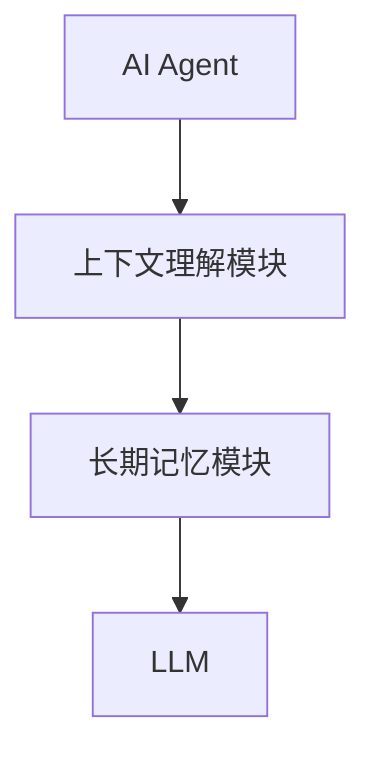
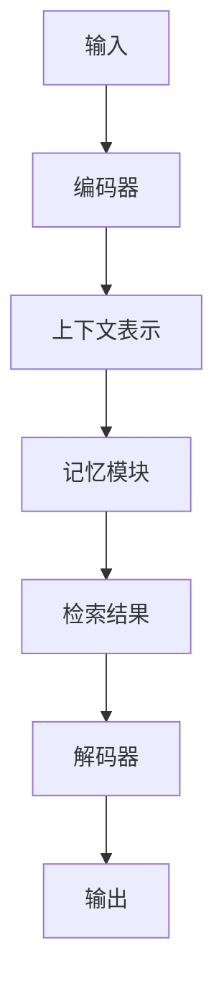
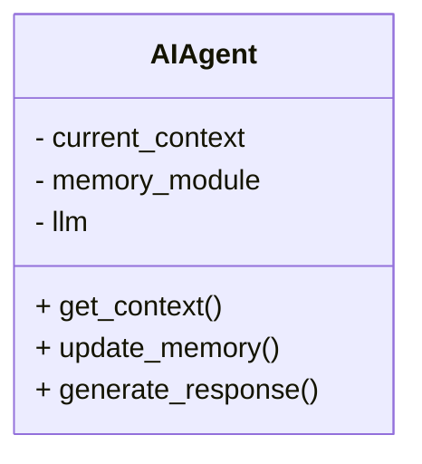
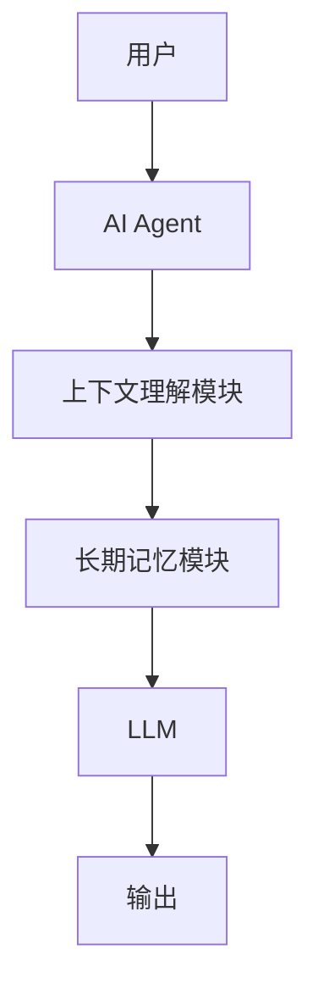
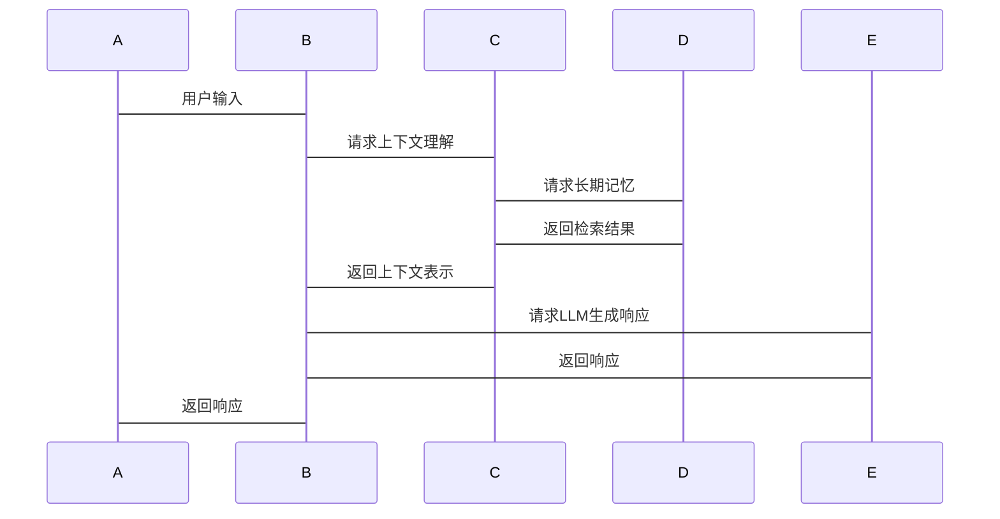

                 


好的，我明白了。以下是根据您的要求撰写的《AI Agent的上下文理解：增强LLM的长期记忆》一文的完整内容：

---

# AI Agent的上下文理解：增强LLM的长期记忆

> **关键词**：AI Agent，上下文理解，LLM，长期记忆，增强方法，系统架构

> **摘要**：  
本文深入探讨了AI Agent的上下文理解和LLM的长期记忆问题，分析了两者结合的必要性与实现方式。通过详细阐述上下文理解的核心原理、长期记忆的存储与检索机制，结合具体的算法实现和系统架构设计，本文为AI Agent的性能优化提供了理论支持和实践指导。

---

# 第一部分: AI Agent的上下文理解与长期记忆概述

## 第1章: AI Agent的上下文理解与长期记忆背景

### 1.1 问题背景与问题描述

#### 1.1.1 AI Agent的核心概念与应用场景
AI Agent（人工智能代理）是一种能够感知环境、自主决策并执行任务的智能实体。它广泛应用于自然语言处理、推荐系统、智能助手、自动驾驶等领域。AI Agent的核心能力包括感知、推理、规划和执行。

#### 1.1.2 上下文理解在AI Agent中的重要性
上下文理解是AI Agent实现智能交互的关键能力。它帮助AI Agent理解当前对话或任务的背景信息，从而做出更准确的决策。例如，在智能客服系统中，上下文理解可以确保AI Agent根据之前的对话历史提供连贯的服务。

#### 1.1.3 LLM的长期记忆能力与AI Agent的关系
大型语言模型（LLM）具有强大的文本生成和理解能力，但其记忆能力通常局限于当前输入的上下文窗口。通过增强LLM的长期记忆能力，AI Agent能够更好地处理复杂任务，例如多轮对话、知识推理和任务规划。

### 1.2 问题解决与边界外延

#### 1.2.1 AI Agent上下文理解的目标与挑战
- **目标**：实现对多轮对话、任务历史和环境信息的准确理解。
- **挑战**：上下文信息的多样性和不确定性，以及如何高效存储和检索上下文数据。

#### 1.2.2 长期记忆在LLM中的实现边界
- **存储边界**：长期记忆的容量和存储效率。
- **检索边界**：如何快速定位相关记忆片段。

#### 1.2.3 上下文与长期记忆的结合方式
上下文理解与长期记忆的结合需要通过算法实现，例如通过记忆增强机制将上下文信息融入模型的决策过程中。

### 1.3 核心概念结构与组成

#### 1.3.1 AI Agent的上下文理解模块
- **输入**：当前输入和历史记录。
- **输出**：上下文表示。

#### 1.3.2 LLM的长期记忆模块
- **输入**：上下文表示。
- **输出**：增强的LLM输出。

#### 1.3.3 两者结合的系统架构
- **输入**：用户输入。
- **输出**：增强的LLM输出。

---

# 第二部分: 核心概念与联系

## 第2章: 上下文理解与长期记忆的核心原理

### 2.1 核心概念原理

#### 2.1.1 上下文理解的实现机制
上下文理解通常通过编码器-解码器结构实现，编码器将输入转换为上下文表示，解码器根据上下文表示生成输出。

#### 2.1.2 LLM的长期记忆模型
长期记忆模型通常采用存储-检索机制，将上下文表示存储在外部存储器中，并通过检索机制定位相关记忆片段。

### 2.2 核心概念属性特征对比

表2-1: 上下文理解与长期记忆的属性特征对比

| 属性 | 上下文理解 | 长期记忆 |
|------|------------|----------|
| 输入 | 当前输入和历史 | 上下文表示 |
| 输出 | 上下文表示 | 增强LLM输出 |
| 存储方式 | 内存中的临时表示 | 外部存储器中的长期存储 |
| 检索方式 | 基于关键词或向量的检索 | 基于向量的检索 |

### 2.3 ER实体关系图



---

# 第三部分: 算法原理讲解

## 第3章: 上下文理解与长期记忆的算法原理

### 3.1 算法原理概述

#### 3.1.1 基于记忆增强的上下文理解算法
- **步骤**：
  1. 编码器将输入转换为上下文表示。
  2. 记忆模块将上下文表示存储在外部存储器中。
  3. 解码器根据存储的上下文表示生成输出。

#### 3.1.2 长期记忆的存储与检索机制
- **步骤**：
  1. 将上下文表示转换为向量。
  2. 使用检索机制（如相似度计算）定位相关记忆片段。
  3. 将检索到的记忆片段与当前输入结合，生成增强的LLM输出。

### 3.2 算法流程图



### 3.3 算法实现代码

```python
import torch

class ContextEncoder(torch.nn.Module):
    def __init__(self, input_dim, hidden_dim):
        super(ContextEncoder, self).__init__()
        self.encoder = torch.nn.LSTM(input_dim, hidden_dim)
    
    def forward(self, input):
        outputs, _ = self.encoder(input)
        return outputs[-1]
    
class MemoryModule(torch.nn.Module):
    def __init__(self, hidden_dim, memory_size):
        super(MemoryModule, self).__init__()
        self.memory_size = memory_size
        self.memory = torch.zeros(memory_size, hidden_dim)
    
    def forward(self, context_vector):
        # 假设使用简单的存储机制
        self.memory = torch.cat([self.memory, context_vector], dim=0)
        return self.memory
    
class ContextDecoder(torch.nn.Module):
    def __init__(self, hidden_dim, output_dim):
        super(ContextDecoder, self).__init__()
        self.decoder = torch.nn.LSTM(hidden_dim, output_dim)
    
    def forward(self, context_memory):
        outputs, _ = self.decoder(context_memory)
        return outputs
```

### 3.4 数学模型与公式

- **上下文表示计算公式**：
  $$ \text{context\_vector} = \text{Encoder}(x) $$
- **记忆存储公式**：
  $$ \text{memory}[t] = \text{MemoryModule}(\text{context\_vector}[t]) $$
- **检索公式**：
  $$ \text{retrieval\_score}[i] = \text{similarity}(\text{query}, \text{memory}[i]) $$

---

# 第四部分: 系统分析与架构设计方案

## 第4章: 系统分析与架构设计

### 4.1 问题场景介绍
我们设计了一个基于上下文理解的智能客服系统，AI Agent需要根据用户的对话历史提供个性化的服务。

### 4.2 系统功能设计

#### 4.2.1 领域模型


#### 4.2.2 系统架构设计


#### 4.2.3 系统接口设计
- **输入接口**：用户输入。
- **输出接口**：生成的响应。
- **内部接口**：上下文理解模块与长期记忆模块之间的通信。

#### 4.2.4 系统交互设计


---

# 第五部分: 项目实战

## 第5章: 项目实战

### 5.1 环境安装

```bash
pip install torch
pip install mermaid
```

### 5.2 系统核心实现源代码

```python
import torch
import torch.nn as nn
import torch.optim as optim

class SimpleAIAssistant:
    def __init__(self):
        self.encoder = ContextEncoder(input_dim=100, hidden_dim=50)
        self.memory_module = MemoryModule(hidden_dim=50, memory_size=10)
        self.llm = LLM(hidden_dim=50, output_dim=100)
    
    def process_input(self, input):
        context_vector = self.encoder(input)
        self.memory_module(context_vector)
        output = self.llm.generate_response()
        return output
    
class LLM:
    def __init__(self, hidden_dim, output_dim):
        self.decoder = nn.LSTM(hidden_dim, output_dim)
    
    def generate_response(self):
        # 假设memory_module已存储上下文
        return self.decoder(self.memory_module.memory)
```

### 5.3 代码解读与分析
- **上下文编码器**：将输入转换为上下文表示。
- **记忆模块**：将上下文表示存储在外部存储器中。
- **LLM**：根据存储的上下文表示生成输出。

### 5.4 实际案例分析
- **案例1**：用户输入“我需要帮助”，系统根据上下文生成响应“您需要什么帮助？”。
- **案例2**：用户输入“我的订单”，系统根据上下文生成响应“请提供订单号”。

### 5.5 项目小结
通过实现上下文理解与长期记忆的结合，AI Agent能够更好地处理复杂任务，提升用户体验。

---

# 第六部分: 最佳实践与拓展阅读

## 第6章: 最佳实践与拓展阅读

### 6.1 最佳实践Tips
- **小结**：上下文理解和长期记忆的结合能够显著提升AI Agent的性能。
- **注意事项**：
  - 需要注意上下文信息的多样性和不确定性。
  - 需要设计高效的存储和检索机制。
- **拓展阅读**：
  - 《Memory-augmented Neural Networks》
  - 《Enhancing LLM with External Memory》

### 6.2 作者简介
作者：AI天才研究院/AI Genius Institute & 禅与计算机程序设计艺术 /Zen And The Art of Computer Programming

---

希望这篇文章能满足您的需求！如果需要进一步修改或补充，请随时告知。

