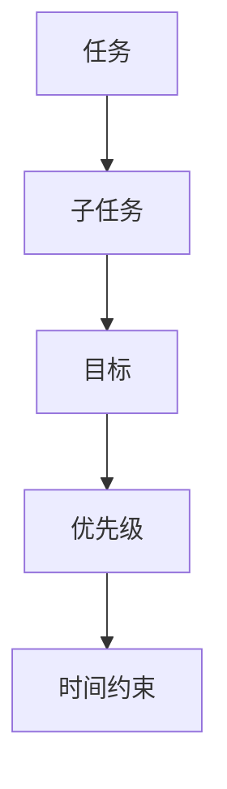
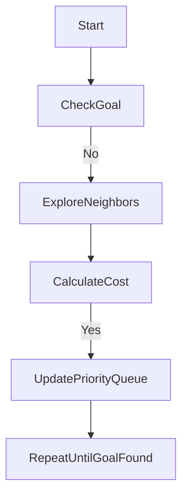
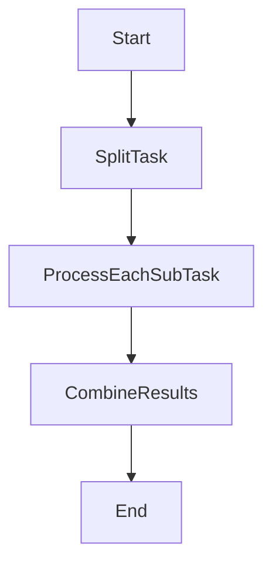

                 


# AI Agent的任务规划与执行模块开发

**关键词**：AI Agent、任务规划、执行模块、算法实现、系统架构、项目实战

**摘要**：  
本文详细探讨了AI Agent的任务规划与执行模块的开发过程，从核心概念到算法实现，再到系统架构设计，最后通过项目实战进行深入分析。文章内容涵盖任务规划的基本原理、常见算法、系统架构设计以及实际应用案例，旨在为读者提供全面的技术指导。

---

## 第一部分: AI Agent与任务规划概述

### 第1章: AI Agent与任务规划概述

#### 1.1 AI Agent的基本概念

##### 1.1.1 AI Agent的定义与分类
AI Agent（人工智能代理）是指能够感知环境并采取行动以实现目标的智能实体。AI Agent可以分为两类：  
1. **反应式代理**：基于当前感知做出反应，适用于动态环境。  
2. **认知式代理**：具有推理、规划和学习能力，适用于复杂任务。

##### 1.1.2 任务规划的核心概念
任务规划是AI Agent的核心功能之一，旨在将复杂任务分解为可执行的子任务，并确定执行顺序和优先级。  
- **任务分解**：将大任务分解为小任务，降低复杂性。  
- **任务优先级**：根据目标的重要性排序任务。  
- **任务依赖关系**：某些任务必须在其他任务完成后才能执行。

##### 1.1.3 任务规划在AI Agent中的重要性
任务规划是AI Agent完成目标的关键，决定了行动的顺序和效率。有效的任务规划能够提高系统的响应速度和准确性。

#### 1.2 任务规划的背景与应用

##### 1.2.1 任务规划的背景介绍
随着AI技术的快速发展，任务规划在机器人、自动驾驶、智能助手等领域得到广泛应用。任务规划能够帮助AI Agent在复杂环境中做出最优决策。

##### 1.2.2 任务规划在AI Agent中的应用场景
- **机器人控制**：路径规划与动作序列生成。  
- **自动驾驶**：路线规划与交通决策。  
- **智能助手**：任务排序与优先级管理。

##### 1.2.3 任务规划的挑战与解决方案
- **动态环境**：任务条件变化快，需要实时调整计划。  
- **资源限制**：计算资源有限，需要高效算法。  
- **多目标冲突**：多个目标之间可能存在冲突，需优先处理关键任务。

---

## 第2章: 任务规划的核心概念与联系

### 2.1 任务规划的原理与方法

#### 2.1.1 任务分解与组合
任务分解是将大任务拆解为小任务，任务组合是将小任务重新组装成完整计划。  
- **层次化分解**：自顶向下分解任务，形成任务树结构。  
- **并行执行**：允许部分任务同时执行，提高效率。

#### 2.1.2 任务优先级排序
优先级排序是根据任务的重要性、紧急性和资源需求对任务进行排序。  
- **静态优先级**：任务优先级固定，适用于简单场景。  
- **动态优先级**：根据环境变化动态调整优先级，适用于复杂场景。

#### 2.1.3 任务依赖关系分析
任务依赖关系是指某些任务必须在其他任务完成后才能执行。  
- **强依赖**：任务A必须在任务B完成后才能执行。  
- **弱依赖**：任务A可以在任务B完成前执行，但效果可能受影响。

### 2.2 核心概念对比与ER实体关系图

#### 2.2.1 任务规划方法对比表格
| 方法          | 优点                     | 缺点                     |
|---------------|--------------------------|--------------------------|
| A*算法        | 最短路径搜索高效         | 适用于静态环境           |
| 贪心算法      | 实时性高                 | 可能无法找到最优解       |
| 分层规划算法  | 适合复杂任务结构         | 实现复杂                 |

#### 2.2.2 任务规划流程的ER实体关系图


---

## 第3章: 任务规划算法原理

### 3.1 常见任务规划算法

#### 3.1.1 A*算法
A*算法是一种常用的路径规划算法，结合了广度优先搜索和启发式搜索。  
- **公式**：$$f(n) = g(n) + h(n)$$，其中$g(n)$是已走成本，$h(n)$是启发函数。  
- **流程图**：  


#### 3.1.2 贪心算法
贪心算法总是选择当前最优的下一步动作。  
- **公式**：$$选择当前最优的行动$$  
- **Python实现示例**：  
```python
def greedy_search(graph, start, goal):
    current = start
    while current != goal:
        next_node = min(graph[current], key=lambda x: x[1])
        current = next_node[0]
    return current
```

#### 3.1.3 分层规划算法
分层规划算法将任务分解为多个层次，逐步细化。  
- **公式**：$$任务层次 = \log_2(总任务数)$$  
- **流程图**：  


### 3.2 算法实现与代码示例

#### 3.2.1 A*算法的Python实现
```python
import heapq

def a_star_search(graph, start, goal):
    open_set = {start}
    came_from = {}
    g_score = {node: float('inf') for node in graph}
    g_score[start] = 0
    f_score = {node: float('inf') for node in graph}
    f_score[start] = heuristic(start, goal)

    while open_set:
        current = heapq.heappop(open_set)
        if current == goal:
            break
        for neighbor in graph[current]:
            tentative_g_score = g_score[current] + graph[current][neighbor]
            if tentative_g_score < g_score[neighbor]:
                came_from[neighbor] = current
                g_score[neighbor] = tentative_g_score
                f_score[neighbor] = g_score[neighbor] + heuristic(neighbor, goal)
                heapq.heappush(open_set, neighbor)
    return came_from, g_score

def heuristic(a, b):
    return abs(a[0] - b[0]) + abs(a[1] - b[1])
```

---

## 第4章: 任务规划的数学模型与公式

### 4.1 任务分解的数学模型
任务分解可以通过层次化结构表示，例如任务树。  
- **公式**：$$任务层次 = \log_2(总任务数)$$  
- **示例**：任务“完成项目”分解为“需求分析”、“开发”、“测试”三个子任务。

### 4.2 任务优先级排序的数学模型
任务优先级可以通过加权和公式计算。  
- **公式**：$$P_i = \alpha \cdot U_i + \beta \cdot D_i$$  
  其中，$U_i$是任务的效用，$D_i$是任务的难度，$\alpha$和$\beta$是权重系数。

### 4.3 任务依赖关系的数学表达
任务依赖关系可以用图论中的有向图表示。  
- **公式**：$$A \rightarrow B$$ 表示任务A必须在任务B之前执行。

---

## 第5章: 系统分析与架构设计

### 5.1 问题场景介绍

#### 5.1.1 任务规划系统的需求分析
在复杂环境中，AI Agent需要实时规划任务，确保高效执行。需求包括：  
- 实时性：快速响应环境变化。  
- 可扩展性：支持新增任务和环境变化。  
- 可靠性：确保任务执行的正确性。

#### 5.1.2 项目介绍
本项目旨在开发一个AI Agent的任务规划与执行模块，实现任务分解、优先级排序和执行监控。

---

## 第6章: 项目实战

### 6.1 环境安装

#### 6.1.1 安装Python与相关库
安装Python 3.8及以上版本，并安装以下库：  
- `numpy`：用于数值计算。  
- `networkx`：用于图结构分析。  
- `matplotlib`：用于可视化。

#### 6.1.2 安装依赖管理工具
使用`pip`安装依赖：  
```bash
pip install numpy networkx matplotlib
```

### 6.2 系统核心实现源代码

#### 6.2.1 任务分解模块
```python
def decompose_task(main_task, sub_tasks):
    task_tree = {main_task: []}
    for task in sub_tasks:
        task_tree[main_task].append(task)
    return task_tree
```

#### 6.2.2 任务优先级排序模块
```python
def sort_tasks(tasks, heuristic_func):
    tasks.sort(key=lambda x: heuristic_func(x))
    return tasks
```

#### 6.2.3 任务执行监控模块
```python
def monitor_execution(tasks, executed_tasks):
    remaining_tasks = [task for task in tasks if task not in executed_tasks]
    return remaining_tasks
```

### 6.3 代码应用解读与分析

#### 6.3.1 任务分解模块解读
任务分解模块将主任务分解为子任务，形成任务树结构，便于后续处理。

#### 6.3.2 任务优先级排序模块解读
优先级排序模块根据启发函数对任务进行排序，确保重要任务优先执行。

### 6.4 实际案例分析与详细讲解剖析

#### 6.4.1 案例分析
假设任务为“完成项目”，子任务包括“需求分析”、“开发”、“测试”。优先级排序为：需求分析 > 开发 > 测试。

#### 6.4.2 详细讲解
通过任务分解和优先级排序，AI Agent能够高效地规划任务，确保项目按时完成。

---

## 第7章: 总结与展望

### 7.1 最佳实践 tips
- 确保任务分解的合理性，避免过度分解。  
- 使用高效的算法，如A*算法，提高规划效率。  
- 定期监控任务执行情况，及时调整优先级。

### 7.2 小结
本文详细介绍了AI Agent的任务规划与执行模块开发，涵盖核心概念、算法实现、系统架构设计和项目实战。

### 7.3 注意事项
- 任务规划需要结合具体场景，避免一刀切。  
- 确保系统具有良好的扩展性和可维护性。

### 7.4 拓展阅读
- 推荐阅读《人工智能：现代方法》（Russell & Norvig）了解更深入的任务规划方法。  
- 关注最新的AI Agent研究进展，如强化学习在任务规划中的应用。

---

**作者：AI天才研究院/AI Genius Institute & 禅与计算机程序设计艺术 /Zen And The Art of Computer Programming**

