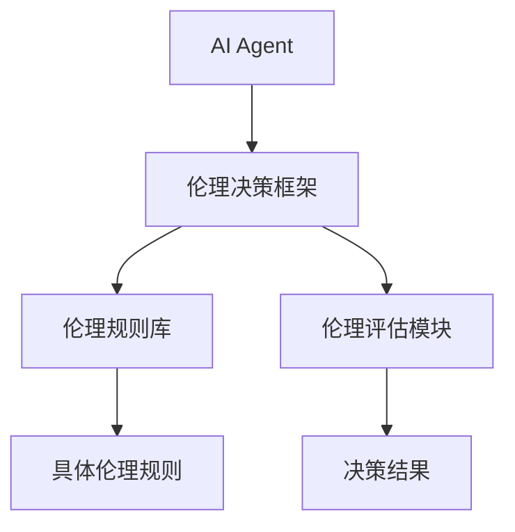
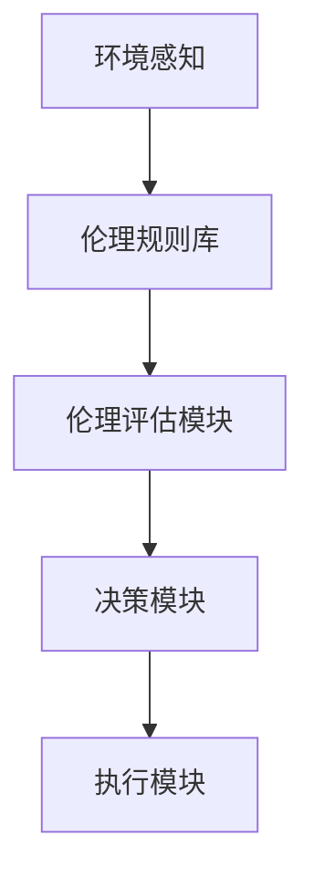
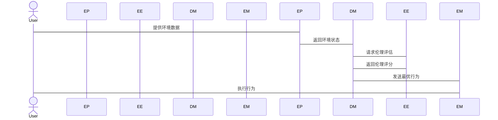

                 


# AI Agent的伦理决策框架：在智能中植入道德考量

## 关键词：AI Agent, 伦理决策, 道德考量, 智能系统, 人工伦理智能, 决策框架

## 摘要：  
随着AI技术的快速发展，AI Agent（智能体）在各个领域的应用日益广泛，如何在智能系统中植入道德考量，使其在决策过程中遵循伦理规范，成为当前技术与学术界的热点问题。本文将从伦理决策框架的核心概念出发，详细分析其算法原理、系统架构，并通过实际案例展示如何在AI Agent中实现伦理决策。本文旨在为AI开发者、伦理学家和相关领域的研究者提供一份系统性、实用性的参考指南。

---

# 第一部分：AI Agent与伦理决策的背景介绍

## 第1章：AI Agent的基本概念

### 1.1 AI Agent的定义  
AI Agent（智能体）是指具有感知环境、做出决策并采取行动以实现目标的智能系统。它可以是一个软件程序、机器人或其他任何形式的智能实体，能够自主或半自主地完成任务。  

### 1.2 AI Agent的核心特征  
- **自主性**：能够在没有外部干预的情况下独立运作。  
- **反应性**：能够根据环境变化实时调整行为。  
- **目标导向**：基于预设目标或学习目标进行决策。  
- **社交能力**：能够与其他AI Agent或人类进行交互。  

### 1.3 AI Agent的应用场景  
AI Agent广泛应用于自动驾驶、智能助手（如Siri、Alexa）、医疗诊断辅助、金融投资等领域。例如，在自动驾驶中，AI Agent需要在复杂交通环境中做出快速且符合伦理的决策，以确保乘客和行人的安全。

---

## 第2章：伦理决策的重要性

### 2.1 伦理决策的定义  
伦理决策是指在决策过程中，基于伦理规范和价值观，选择最优的行为方案。AI Agent的伦理决策不仅需要考虑技术可行性，还需兼顾社会道德和法律规范。  

### 2.2 伦理决策在AI Agent中的作用  
- **避免伦理风险**：确保AI Agent的行为不会引发伦理争议或法律责任。  
- **提升社会接受度**：通过符合伦理的决策，增强人类对AI的信任。  
- **实现人机协作**：在与人类交互的过程中，AI Agent需要遵循伦理规范，以实现更高效的协作。  

### 2.3 伦理决策的挑战与机遇  
- **挑战**：伦理规范因文化、社会、法律环境而异，如何在多变的环境中动态调整伦理决策策略是技术难点。  
- **机遇**：通过伦理决策框架，可以为AI Agent赋予更高的社会价值，推动人机协作的深度发展。

---

# 第二部分：伦理决策框架的核心概念与联系

## 第3章：伦理决策框架的原理

### 3.1 基于规则的伦理决策  
- **规则驱动**：通过预设的伦理规则（如法律条文、社会规范）指导决策。  
- **优点**：简单易懂，可解释性强。  
- **缺点**：规则的覆盖范围有限，难以应对复杂的伦理情境。  

### 3.2 基于案例的伦理决策  
- **案例学习**：通过分析类似案例的决策结果，推导出当前问题的解决方案。  
- **优点**：能够处理复杂情境，具有灵活性。  
- **缺点**：需要大量高质量的案例数据，且可能存在“类比偏差”。  

### 3.3 基于效用的伦理决策  
- **效用计算**：通过计算不同行为的预期效用，选择效用最大的行为方案。  
- **优点**：能够量化决策结果，便于优化。  
- **缺点**：效用函数的设计可能引入主观性，且在实际应用中难以完全量化。  

---

## 第4章：核心概念属性对比与实体关系图

### 4.1 核心概念属性对比  
下表对比了三种伦理决策方法的核心属性：  

| 属性 | 基于规则 | 基于案例 | 基于效用 |  
|------|----------|----------|----------|  
| 决策依据 | 预设规则 | 类似案例 | 效用计算 |  
| 适用场景 | 简单情境 | 复杂情境 | 可量化的场景 |  
| 可解释性 | 高 | 中 | 低 |  

### 4.2 实体关系图  
下图展示了伦理决策框架的主要实体及其关系：  



---

# 第三部分：伦理决策框架的算法原理

## 第5章：伦理评分算法的设计与实现

### 5.1 伦理评分算法概述  
伦理评分算法是一种基于效用的伦理决策方法，通过量化行为的伦理影响，选择最优的行为方案。  

### 5.2 算法流程  
1. **输入**：当前环境状态、可选行为集合。  
2. **计算**：对每个行为的伦理影响进行评分，评分基于预设的伦理规则和效用函数。  
3. **选择**：根据评分结果，选择评分最高的行为方案。  
4. **输出**：最优行为方案。  

### 5.3 算法实现  
以下是伦理评分算法的Python实现示例：  

```python
def calculate_ethical_score(action, rules):
    score = 0
    for rule in rules:
        if rule['condition'](action):
            score += rule['weight']
    return score

def ethical_decision_agent(environment, actions, rules):
    scores = []
    for action in actions:
        score = calculate_ethical_score(action, rules)
        scores.append(score)
    # 选择评分最高的行为
    best_action = actions[scores.index(max(scores))]
    return best_action
```

### 5.4 数学模型  
伦理评分算法的数学模型可以表示为：  

$$ \text{score}(a) = \sum_{i=1}^{n} w_i \cdot f_i(a) $$  

其中，$a$ 是行为，$w_i$ 是规则 $i$ 的权重，$f_i(a)$ 是规则 $i$ 对行为 $a$ 的评估函数。  

---

## 第6章：伦理决策算法的优化与扩展

### 6.1 动态伦理规则库的构建  
为了应对复杂环境的变化，伦理决策框架需要动态调整伦理规则。动态规则库可以通过以下方式实现：  

1. **规则学习**：通过机器学习算法，从历史数据中提取新的伦理规则。  
2. **规则更新**：根据新的伦理规范或用户反馈，实时更新规则库。  

### 6.2 基于强化学习的伦理决策  
强化学习（Reinforcement Learning）是一种有效的伦理决策优化方法。通过与环境的交互，AI Agent可以学习到最优的伦理决策策略。  

---

# 第四部分：系统分析与架构设计

## 第7章：伦理决策框架的系统架构

### 7.1 问题场景介绍  
以自动驾驶为例，AI Agent需要在复杂交通环境中做出符合伦理的决策。例如，在不可避免的碰撞中，如何优先保护行人或驾驶员的安全。  

### 7.2 系统功能设计  
- **伦理规则库**：存储预设的伦理规则和动态规则。  
- **伦理评估模块**：对候选行为进行伦理评分。  
- **决策模块**：根据评分结果选择最优行为。  

### 7.3 系统架构图  
下图展示了伦理决策框架的系统架构：  



### 7.4 接口设计  
- **输入接口**：接收环境感知数据和可选行为。  
- **输出接口**：输出最优行为方案。  

---

## 第8章：系统交互设计

### 8.1 交互流程  
1. **感知环境**：AI Agent通过传感器或数据接口获取环境信息。  
2. **生成候选行为**：基于当前环境，生成可选的行为方案。  
3. **伦理评估**：对每个候选行为进行伦理评分。  
4. **选择最优行为**：根据评分结果，选择最优行为方案。  
5. **执行行为**：将决策结果传递给执行模块。  

### 8.2 序列图  
下图展示了系统的交互流程：  



---

# 第五部分：项目实战

## 第9章：伦理决策框架的实际应用

### 9.1 项目介绍  
本项目旨在开发一个基于伦理决策框架的AI Agent，能够在医疗诊断辅助系统中做出符合伦理的决策。  

### 9.2 环境安装  
- **Python 3.8+**  
- **依赖库**：numpy, matplotlib, scikit-learn  

### 9.3 核心代码实现  
以下是伦理决策模块的核心代码：  

```python
class EthicalDecisionFramework:
    def __init__(self, rules):
        self.rules = rules

    def evaluate_action(self, action):
        score = 0
        for rule in self.rules:
            if rule['condition'](action):
                score += rule['weight']
        return score

    def decide(self, actions):
        scores = [self.evaluate_action(action) for action in actions]
        best_index = scores.index(max(scores))
        return actions[best_index]
```

### 9.4 案例分析  
以医疗诊断为例，假设患者有三种治疗方案：A、B、C。每种方案的伦理评分如下：  

- A：评分 85  
- B：评分 90  
- C：评分 88  

决策框架会选择评分最高的方案 B。  

---

## 第10章：项目总结与优化

### 10.1 项目总结  
通过本项目，我们验证了伦理决策框架在实际应用中的可行性和有效性。  

### 10.2 优化建议  
- **动态规则更新**：根据新的伦理规范，实时更新规则库。  
- **多模态输入**：结合图像、文本等多种数据源，提高决策的准确性。  

---

# 第六部分：总结与展望

## 第11章：伦理决策框架的核心要点

### 11.1 伦理决策框架的总结  
伦理决策框架为AI Agent提供了系统化的伦理决策方法，能够有效降低伦理风险，提升系统的社会价值。  

### 11.2 未来展望  
随着技术的发展，伦理决策框架将更加智能化和动态化，能够更好地应对复杂多变的伦理挑战。  

---

## 第12章：最佳实践与注意事项

### 12.1 最佳实践  
- **明确伦理目标**：在设计伦理决策框架时，首先要明确系统的伦理目标和约束条件。  
- **动态调整规则**：根据环境变化和用户反馈，动态更新伦理规则库。  
- **注重可解释性**：确保决策过程可追溯，便于分析和优化。  

### 12.2 注意事项  
- **避免过度简化**：伦理问题往往复杂多样，不能用简单的规则或模型一概而论。  
- **关注文化差异**：在跨文化场景中，需要考虑不同地区的伦理规范差异。  

---

## 作者信息  

作者：AI天才研究院/AI Genius Institute & 禅与计算机程序设计艺术/Zen And The Art of Computer Programming  

--- 

**注意**：由于篇幅限制，上述内容为文章的目录和部分章节内容的示例。完整的文章需要根据上述目录进一步扩展，确保每个章节的内容详细且符合专业要求。

