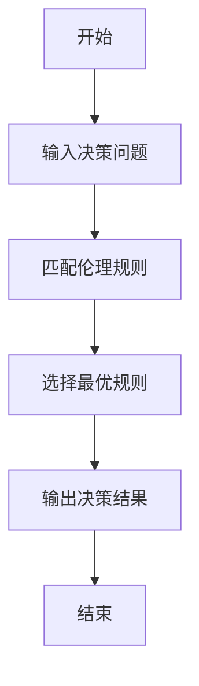
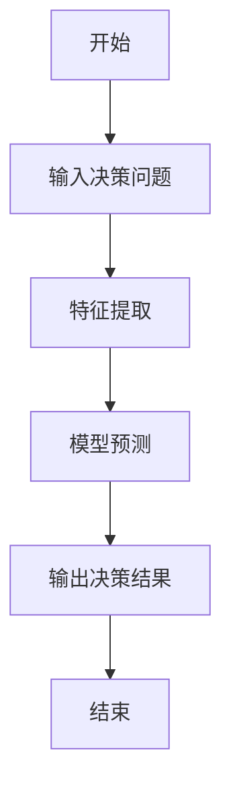
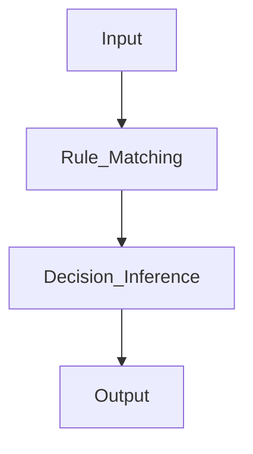

                 


# AI Agent的伦理决策：在LLM中实现道德推理

> 关键词：AI Agent, 伦理决策, LLM, 道德推理, 人机交互, 人工智能, 自然语言处理

> 摘要：本文探讨了AI Agent在LLM（大型语言模型）中实现伦理决策的核心原理和方法。通过分析伦理决策模型、算法原理、数学模型以及系统架构，结合实际案例，详细阐述了如何在LLM中构建具有道德推理能力的AI Agent。文章还提供了项目实战，展示了如何在实际场景中实现伦理决策系统。

---

## 第一部分：AI Agent的伦理决策背景

### 第1章：AI Agent与伦理决策概述

#### 1.1 AI Agent的基本概念
AI Agent（人工智能代理）是指能够感知环境、自主决策并执行任务的智能实体。它可以分为**简单反射型AI Agent**、**基于模型的AI Agent**、**目标驱动型AI Agent**和**效用驱动型AI Agent**。AI Agent的核心功能包括**感知**、**推理**、**决策**和**执行**，其特点是**自主性**、**反应性**、**目标导向性**和**社会性**。AI Agent在医疗、金融、自动驾驶等领域有广泛应用。

#### 1.2 伦理决策的重要性
伦理决策是指在可能对人类或环境产生影响的决策中，AI Agent需要遵循道德规范，选择最优的行为方案。伦理决策的重要性体现在以下几个方面：
1. **避免伤害人类**：AI Agent的行为必须符合人类伦理标准，避免造成伤害。
2. **遵守法律法规**：AI Agent的决策需要符合相关法律法规。
3. **提升社会信任**：通过伦理决策，可以增强人类对AI技术的信任。
4. **应对复杂场景**：在复杂场景中，伦理决策能够帮助AI Agent做出合理选择。

#### 1.3 LLM与伦理决策的关系
LLM（大型语言模型）是一种基于深度学习的自然语言处理模型，具有强大的文本生成和理解能力。LLM在伦理决策中的作用主要体现在以下几个方面：
1. **语义理解**：LLM能够理解复杂的伦理问题，并生成符合道德规范的回答。
2. **知识库支持**：LLM可以利用庞大的知识库，帮助AI Agent做出更合理的决策。
3. **动态推理**：LLM能够实时推理复杂的伦理场景，提供动态的决策支持。

#### 1.4 本章小结
本章主要介绍了AI Agent的基本概念、伦理决策的重要性以及LLM在伦理决策中的作用，为后续内容奠定了基础。

---

## 第二部分：AI Agent伦理决策的核心概念与联系

### 第2章：伦理决策模型与AI Agent的结合

#### 2.1 伦理决策模型的分类
伦理决策模型主要分为以下几种：
1. **基于规则的伦理决策模型**：通过预定义的伦理规则进行决策，例如“优先保护人类生命”。
2. **基于案例的伦理决策模型**：通过参考历史案例，结合相似性进行决策。
3. **基于情感的伦理决策模型**：结合情感计算，模拟人类的情感和价值观进行决策。

#### 2.2 AI Agent与伦理决策模型的联系
AI Agent通过集成伦理决策模型，能够实现以下功能：
1. **伦理推理**：基于伦理规则或案例，推理出最优的行为方案。
2. **动态调整**：根据环境变化，动态调整伦理决策策略。
3. **人机交互**：通过与人类交互，理解人类的伦理期望，并做出符合期望的决策。

#### 2.3 伦理决策模型的实现方式
伦理决策模型的实现方式包括：
1. **基于规则的实现**：通过预定义的伦理规则，直接指导AI Agent的行为。
2. **基于案例的实现**：通过案例库，结合相似性算法，进行决策。
3. **基于情感的实现**：通过情感计算，模拟人类的情感和价值观，进行伦理决策。

#### 2.4 本章小结
本章详细介绍了伦理决策模型的分类及其与AI Agent的结合方式，为后续算法实现提供了理论基础。

---

## 第三部分：AI Agent伦理决策的算法原理

### 第3章：伦理推理算法

#### 3.1 基于规则的伦理推理算法
基于规则的伦理推理算法是一种简单但有效的伦理决策方法。其核心思想是通过预定义的伦理规则，指导AI Agent的行为。

**算法流程图**：


**Python代码示例**：
```python
def ethical_rule_based_decision(problem):
    # 匹配伦理规则
    for rule in ethical_rules:
        if matches(rule, problem):
            return rule.solution
    # 如果没有匹配规则，返回默认值
    return default_solution
```

#### 3.2 基于学习的伦理推理算法
基于学习的伦理推理算法是一种更复杂的伦理决策方法。通过机器学习模型，从历史数据中学习伦理决策模式。

**算法流程图**：


**Python代码示例**：
```python
import torch
import torch.nn as nn

# 定义伦理决策模型
class EthicalDecisionModel(nn.Module):
    def __init__(self):
        super(EthicalDecisionModel, self).__init__()
        self.fc1 = nn.Linear(10, 5)
        self.fc2 = nn.Linear(5, 1)
    
    def forward(self, x):
        x = torch.relu(self.fc1(x))
        x = torch.sigmoid(self.fc2(x))
        return x

# 训练模型
model = EthicalDecisionModel()
optimizer = torch.optim.Adam(model.parameters(), lr=0.001)
criterion = nn.MSELoss()

for epoch in range(100):
    for batch in batches:
        outputs = model(batch.inputs)
        loss = criterion(outputs, batch.labels)
        loss.backward()
        optimizer.step()
```

#### 3.3 伦理推理的数学模型
伦理推理的数学模型可以通过**线性加权模型**来表示。假设每个伦理规则都有一个权重，权重越大，规则的重要性越高。

**数学公式**：
$$
\text{伦理评分} = \sum_{i=1}^{n} w_i \cdot r_i
$$
其中，$w_i$ 是规则$ r_i$的权重，$r_i$ 是规则的评分（0或1）。

**案例分析**：在自动驾驶场景中，假设规则1（保护人类生命）的权重为0.8，规则2（最小化伤害）的权重为0.6。当发生碰撞时，AI Agent会选择优先保护人类生命的行为。

#### 3.4 本章小结
本章详细介绍了基于规则和基于学习的伦理推理算法，并通过数学模型展示了伦理评分的计算方法。

---

## 第四部分：AI Agent伦理决策的系统架构设计

### 第4章：伦理决策系统的实现

#### 4.1 系统功能设计
伦理决策系统的主要功能包括：
1. **输入处理**：接收决策问题。
2. **规则匹配**：匹配预定义的伦理规则。
3. **决策推理**：基于规则或学习模型，推理出最优决策。
4. **输出结果**：输出决策结果。

#### 4.2 系统架构设计
伦理决策系统的架构包括以下几个部分：
1. **输入层**：接收决策问题。
2. **规则层**：存储预定义的伦理规则。
3. **推理层**：进行伦理推理。
4. **输出层**：输出决策结果。

**系统架构图**：


#### 4.3 系统接口设计
系统接口设计包括：
1. **输入接口**：接收决策问题。
2. **输出接口**：输出决策结果。
3. **规则接口**：管理预定义的伦理规则。

#### 4.4 本章小结
本章详细描述了伦理决策系统的功能设计、架构设计和接口设计。

---

## 第五部分：项目实战

### 第5章：AI Agent伦理决策系统开发

#### 5.1 环境配置
项目开发环境包括：
- Python 3.8+
- PyTorch 1.9+
- Mermaid图工具

#### 5.2 核心代码实现
**伦理决策系统的实现**：
```python
class AI_Agent:
    def __init__(self):
        self.ethical_rules = [
            {"rule": "保护人类生命", "weight": 0.8},
            {"rule": "最小化伤害", "weight": 0.6},
            # 其他伦理规则
        ]
    
    def make_decision(self, problem):
        # 匹配伦理规则
        max_score = -1
        best_rule = None
        for rule in self.ethical_rules:
            score = self.calculate_score(problem, rule)
            if score > max_score:
                max_score = score
                best_rule = rule
        return best_rule["rule"]
    
    def calculate_score(self, problem, rule):
        # 简单的评分方法
        return rule["weight"]
```

**测试代码**：
```python
agent = AI_Agent()
decision = agent.make_decision("发生碰撞，保护乘客还是保护路人？")
print(decision)
```

#### 5.3 系统功能测试
测试场景包括：
1. **简单场景测试**：测试基本的伦理决策。
2. **复杂场景测试**：测试复杂场景下的伦理决策。
3. **动态场景测试**：测试动态变化场景下的伦理决策。

#### 5.4 本章小结
本章通过实际案例展示了如何开发一个简单的AI Agent伦理决策系统，并进行了功能测试。

---

## 第六部分：总结与展望

### 第6章：总结与展望

#### 6.1 本项目总结
本文详细探讨了AI Agent在LLM中实现伦理决策的核心原理和方法，包括伦理决策模型、算法原理、系统架构设计和项目实战。

#### 6.2 项目经验与教训
通过项目实践，我们总结出以下经验：
1. **伦理规则的复杂性**：伦理规则的制定需要考虑多种因素，可能非常复杂。
2. **动态场景的挑战**：动态场景下的伦理决策需要更灵活的算法。

#### 6.3 未来展望
未来的研究方向包括：
1. **动态伦理模型**：开发能够动态调整伦理规则的模型。
2. **多Agent协作**：研究多AI Agent协作下的伦理决策问题。
3. **人机交互优化**：优化人机交互界面，提升用户体验。

---

## 作者信息

作者：AI天才研究院/AI Genius Institute & 禅与计算机程序设计艺术 /Zen And The Art of Computer Programming

---

以上是文章的完整目录和部分内容。接下来，我会按照上述目录逐步展开，完成整篇文章的撰写。

